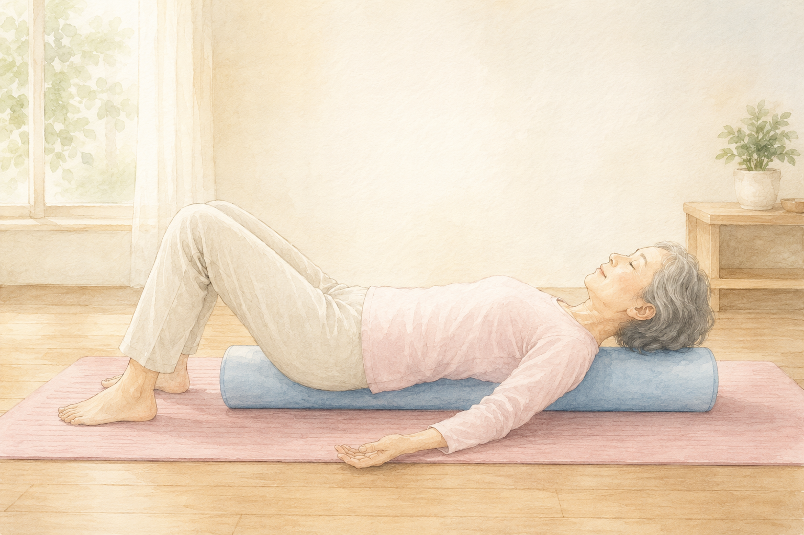
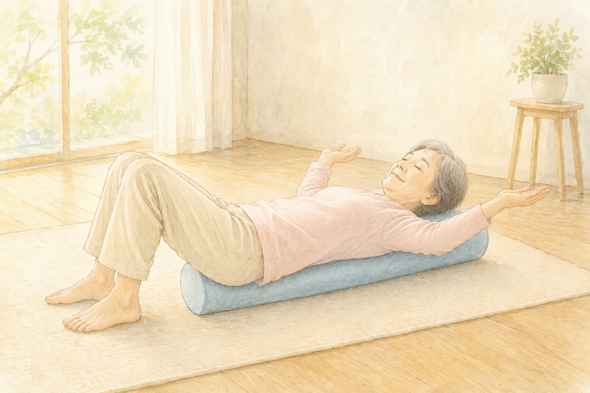
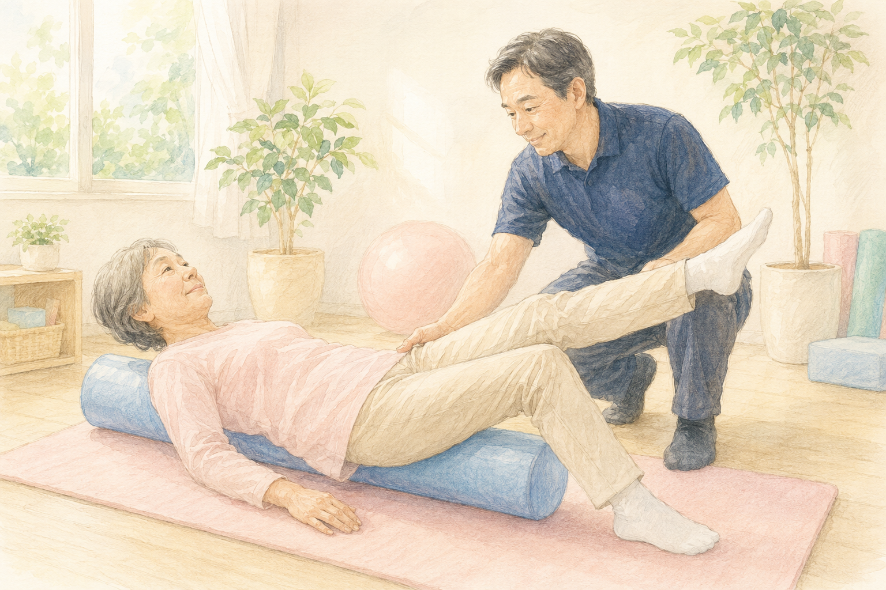
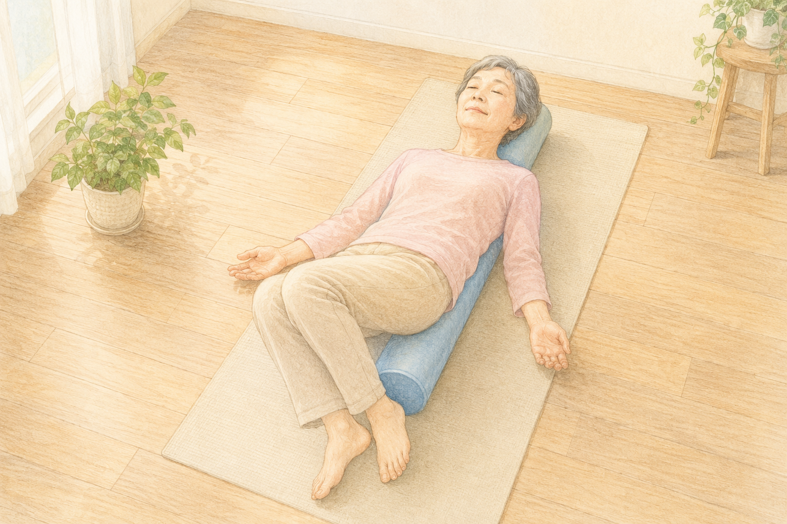
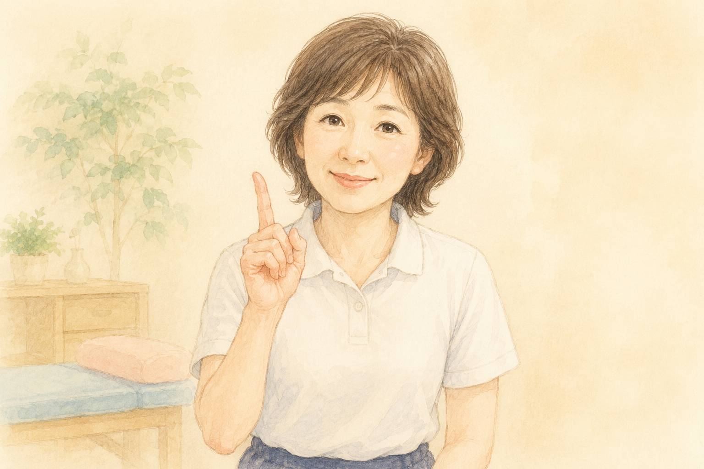

「最近、肩がガチガチで…」  
「鏡で見ると、前より姿勢が悪くなった気がする…」  
そんなお悩みはありませんか？

私は理学療法士として、約30年医療・介護の現場で働いてきました。デスクワークやスマホで長時間同じ姿勢を続ける方が増えていて、**肩こりや猫背**で困っている方は本当に多いです。

そんな現場でリハビリの道具としてよく使ってきたのが、今日ご紹介する **「ストレッチポール」** です。

> ## この記事のポイント
>
> ✅ ストレッチポールは「ゆるめる」と「整える」を両立できる運動補助具  
> ✅ 体幹を意識した運動になり、バランス感覚も鍛えることが期待できる  
> ✅ 自宅で寝るだけで始められるので、続けやすい

## ストレッチポールってどんなもの？

ストレッチポールは、**直径約15cm × 長さ約98cmの円柱形の運動補助具**です。仰向けに寝て、背中の中心にポールを通すように乗ると、自分の体重で自然と胸が開き、背骨や肩甲骨まわりがゆっくりとゆるんでいきます。

開発したのは株式会社LPN（エルピーエヌ）。1998年、医療現場の声から生まれた商品で、もともと**プロアスリートや医療機関向け**に作られたものでした。今では家庭用としても広く知られていますが、**根っこは医療現場の道具**だということが、私が信頼を置いている理由のひとつです。

## ストレッチポールが選ばれる 3つの理由

私が現場でストレッチポールをよく使ってきた理由を、3つに整理してお伝えします。

### 理由①：「ゆるめる」と「整える」を両立できる

仰向けでポールに乗ると、自分の体重がほどよい刺激になり、ガチガチになった胸や肩、背中の動きを引き出すサポートになります。さらに、丸い面に背骨を沿わせることで、**自然と背筋が伸びた姿勢に近づいていく**のが特徴です。

「ゆるめる」だけでも、「整える」だけでもなく、**両方をいっぺんに体験できる**ところが、他の道具にはあまりない特長だと感じています。

### 理由②：体幹を意識した運動になり、バランス感覚も鍛えられる

ポールは丸いので、その上に乗ると体は左右にゆらゆらします。このわずかな不安定さが、**体幹（おなかや背中の深いところにある筋肉）にスイッチを入れてくれる**のです。

私が現場でシニアの方の運動指導をするときも、**転倒予防の運動**としてストレッチポールを取り入れることがあります。「最近、立ち姿勢が安定してきた」「歩きやすくなった気がする」とおっしゃる方もいて、続けることで**バランス感覚を鍛えることが期待できる**運動と言えます。

### 理由③：自宅で寝るだけで始められる手軽さ

ストレッチポールの一番の良さは、なんと言っても **「仰向けに寝るだけで始められる」** こと。難しい動きを覚える必要も、特別な体力も要りません。

リハビリの現場では「**運動が苦手な方ほど続けてもらえる道具**」として、よく選ばれてきました。

## 自宅で安全にできる基本の動き 3つ

ここからは、私が現場でよくお伝えしている **基本の動き3つ** をご紹介します。最初はどれも **5〜10分程度** で十分です。

### ① ベーシックポジション（5分横になる）

ポールの上に **頭からおしりまで** がしっかり乗るように仰向けに寝ます。両手は手のひらを上に向けて、軽く床に置きます。膝は軽く曲げ、足は肩幅に開きます。

この姿勢で、**ゆっくり呼吸をしながら5分**ほど横になります。体が温まると、肩や背中が自然と床のほうにゆるんでいくのを感じられると思います。

### ② 腕を上下にゆっくり動かす

ベーシックポジションのまま、両腕を**ゆっくり**頭の上まで持ち上げて、また下ろします。痛みのない範囲で、10回ほど繰り返します。

肩甲骨まわりが動くきっかけになり、**腕が上がりにくい方にもおすすめ**の動きです。

### ③ 膝をゆっくり左右に倒す

膝を立てたまま、両ひざを揃えて **左右にゆっくり倒します**。腰がねじれ、背中もやわらかく動きます。痛みのない範囲で、左右5回ずつ。

## 使う前に知っておきたいこと（注意点）

ストレッチポールは便利な道具ですが、**誰にでも合うとは限りません**。次の点には注意してください。

- **急に痛くなった腰痛、術後すぐの方**は、自己判断で使わない
- ポールは丸いので **転がります**。最初は床（カーペットや畳の上）で、ベッドの上では使わない
- 使い始めは、**ご家族など誰かにそばにいてもらう**と安心
- 持病があったり、腰や首に強い症状がある方は、**かかりつけの医師に相談**してから

「ちょっと不安だな…」と思う時は、**理学療法士や医師に一度見てもらってから**始めるのが一番安全です。

## こんな方に向きます／こんな方は慎重に

実際にどんな方に向いているのか、私の現場経験から整理します。

**向いている方**

- デスクワークで肩・首がつらい方
- 鏡で見て猫背が気になる方
- 「運動はしたいけど、激しいのは苦手」という方

**慎重に使ったほうがいい方**

- 急性の腰痛、術後すぐの方 → 落ち着いてから
- ご高齢で「丸いものに乗るのは少し不安」という方 → **ハーフカット版**を検討
- バランスを崩しやすい方 → ご家族と一緒に

特にシニアの方は、**ハーフカット版**（半円形で転がりにくい）から始めるのがおすすめです。

## 実際に使うならこのモデル

最後に、私が「現場で使ってきて、家庭にも勧めやすい」と感じる2つのモデルをご紹介します。





どちらも **株式会社LPNの正規品**です。Amazonや楽天には類似品もありますが、メーカー名「**LPN**」を確認してから選んでください。長く使うものなので、信頼できる作りのものを選ぶことをおすすめします。

## 最後にひとつ、大事なこと

ストレッチポールは、あくまで **「自分でできるセルフケア」の道具** です。

- 痛みが続く
- しびれが出てきた
- 動きにくさが日に日に強くなる

このような場合は、**必ずかかりつけの医師か理学療法士にご相談ください**。道具は便利ですが、専門家の見立てを置き換えるものではありません。

私自身、現場では「**自分の体は、自分で守れる**」という方を一人でも増やしたくて、こうした道具をお勧めしてきました。ストレッチポールも、その入口の一つになれば嬉しいです。

> ## まとめ：チェックリスト
>
> ✅ ストレッチポールは「ゆるめる」と「整える」を両立できる道具  
> ✅ 体幹・バランスを鍛える運動としても期待できる  
> ✅ 仰向けに5分寝るところから始められる  
> ✅ シニアの方は **ハーフカット版** が転がりにくくて安全  
> ✅ 痛みやしびれが続くときは、必ず専門家へ相談

「最近、肩がつらいな…」と感じている方は、まずは仰向けに5分横になることから、試してみてはいかがでしょうか。

---

**参考**

- 株式会社LPN 公式サイト：https://stretchpole.com/
