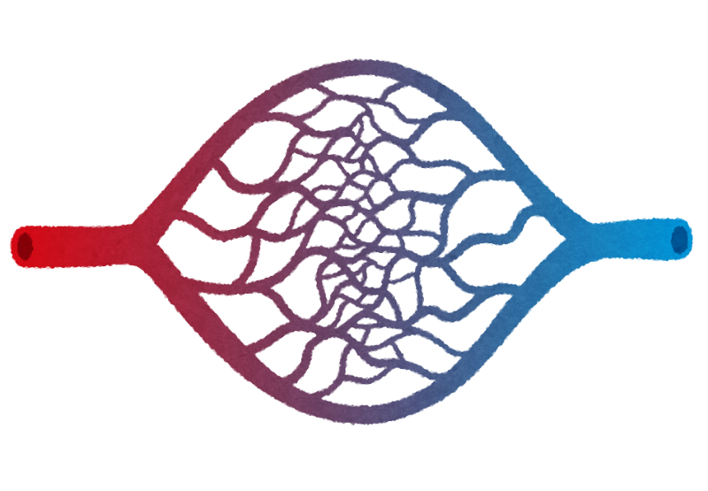
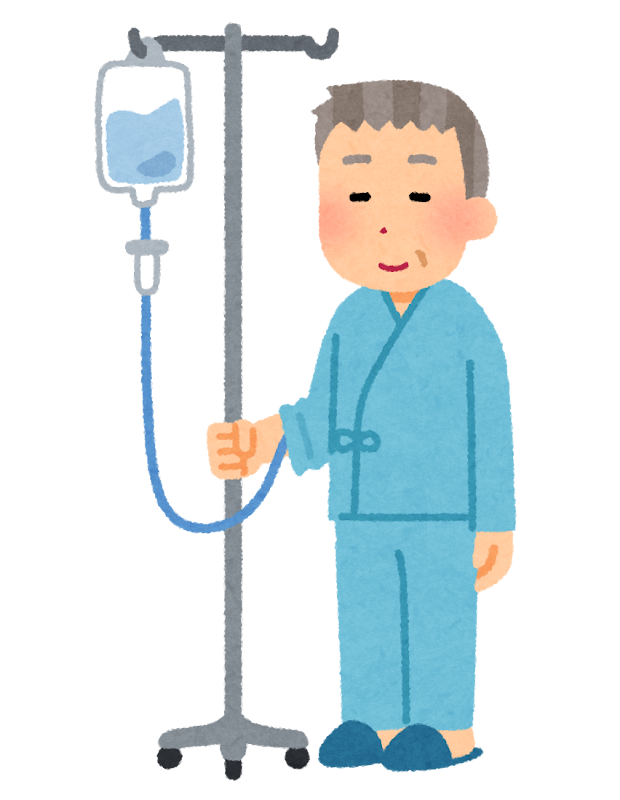

以前、[認知症の薬、いま何が変わったのか](/posts/dementia-drug-therapy/)という記事で、進行を遅らせる新しい薬（レカネマブ、ドナネマブ）をご紹介しました。

あの記事を書いたあと、読者の方からこんなご質問をいただくことがありました。

**「せっかく効く薬ができたのに、どうして『少し遅らせる』程度なのですか？」**

もっともなご質問だと思います。今回は、その答えのひとつになりそうな話をお届けします。

結論から申し上げると、こういうことでした。

> **投与した薬の大部分は、そもそも脳に入っていなかった。**

脳には、外から入ってくるものを厳しく選り分ける **「関所」** があります。薬は、その関所でほとんど止められていたのです。

そしていま、この関所をどう越えるかという研究が、静かに、しかし確実に進んでいます。

> ✅ 脳を守る **血液脳関門（けつえきのうかんもん）** という関所があり、抗体の薬はここをほとんど通れません
>
> ✅ 突破する方法が2つ試されています。**超音波で門を一時的に開ける** 方法と、**通行証を持った「乗り物」に載せる** 方法です
>
> ✅ ただし、どちらも **まだ数人〜数十人規模** の段階です。期待しすぎず、しかし目は離さずに

---

## 目次

1. [脳には「関所」がある](#脳には関所がある)
2. [薬は、関所で止められていた](#薬は関所で止められていた)
3. [方法①　超音波で門を開ける](#方法超音波で門を開ける)
4. [方法②　通行証つきの乗り物に載せる](#方法通行証つきの乗り物に載せる)
5. [ここは正直に ― まだ数人の話です](#ここは正直に--まだ数人の話です)
6. [それでも、意味があると思う理由](#それでも意味があると思う理由)
7. [いま、私たちにできること](#いま私たちにできること)
8. [おわりに](#おわりに)
9. [参考にした情報](#参考にした情報)

---

## 脳には「関所」がある

脳は、体のなかでも特別に守られている臓器です。

その守りの中心が、**血液脳関門（けつえきのうかんもん）** と呼ばれるしくみです。英語の頭文字をとって「BBB」と呼ばれることもあります。

脳のなかを走る血管は、**壁の細胞どうしがすき間なくぴったりくっついて** います。体のほかの場所の血管は、もう少しゆるく、栄養や水分がしみ出せるようになっているのですが、脳だけは違います。

おかげで、細菌や有害な物質は脳に入れません。**とてもありがたいしくみ** です。

ただ、この関所には困ったところがあります。**通してほしい薬まで、まとめて止めてしまう** のです。


体を守るための関所が、治療の邪魔もしてしまうということですか。




そのとおりなんです。**関所は「よい薬」と「悪い物質」を見分けてくれません。** 大きな分子は通さない、という単純な基準で門を閉じています。そして、いま使われている認知症の新薬は——まさにその「大きな分子」なのです。


---

## 薬は、関所で止められていた

レカネマブやドナネマブは、**抗体（こうたい）** という種類の薬です。

抗体は、体が細菌やウイルスと戦うためにつくるたんぱく質で、**とても大きな分子** です。脳のなかにたまったアミロイドβという物質にくっついて、掃除を助けるはたらきをします。

問題は、その大きさでした。

**大きい分子ほど、関所を通れません。** 抗体の薬を点滴で入れても、**脳に届くのは、投与した量のごくわずか（1%にも満たないとされます）**。残りは、体のほかの場所をめぐって終わります。

ここで、少し見え方が変わってこないでしょうか。

いまの薬が「進行を少し遅らせる」程度にとどまっているのは、**薬の力が弱いから、とはかぎらない** のです。**そもそも、現場にほとんど到着していなかった。**

だとすれば、やるべきことは薬を強くすることではありません。**どうやって現場まで届けるか。** いま研究者たちが取り組んでいるのは、そこです。

---

## 方法①　超音波で門を開ける

ひとつめは、いかにも力技に聞こえる方法です。

**超音波を使って、関所の門を一時的に開ける。**

やり方はこうです。まず、ごく小さな泡（マイクロバブル）を血液に流します。そこへ、狙った場所に集めた超音波を当てます。すると泡が細かく震え、**血管の壁の細胞をそっと押し広げる** のです。

開いた状態は、**長くても48時間ほどで元に戻る** とされています。その間に薬を届ける、という発想です。

### 実際の結果

アメリカのウェストバージニア大学で行われた試験では、**3人の患者さん** にこの方法が試されました。結果は——

**アミロイドの塊が減る速さが、32%上がった。**

現在は、レカネマブと組み合わせた試験が **5人** を対象に予定されています。


血管の壁を押し広げてしまって、危なくないのでしょうか。




そこは研究者の方々も心配されているところです。**繰り返し使ううちに、関所そのものが傷んでしまう可能性** が指摘されています。関所は本来、脳を守るための大事なしくみですから。**開けっぱなしにしていいものではない** のです。


---

## 方法②　通行証つきの乗り物に載せる

もうひとつは、もっと賢いやり方です。

門を無理に開けるのではなく、**もともと門を通れるものに、薬を載せてもらう。**

実は、関所にもいくつか「通用口」があります。脳が必要とする栄養や物質を運び込むための入口で、そこには **受け取り役（受容体）** が待ち構えています。鉄を運ぶための入口などが、よく知られています。

そこで研究者は考えました。**薬に「通行証」をつけて、その通用口から入れてしまえばいい。**

製薬会社ロシュが開発している **「ブレインシャトル」** という技術が、これにあたります。名前のとおり、**脳行きの送迎バス** というわけです。デナリ・セラピューティクスという会社も、似た考え方の技術を進めています。

### 実際の結果

ロシュが、ガンテネルマブという抗体薬をこの「送迎バス」に載せて試したところ——

**44人の参加者のうち、いちばん多い量を使ったグループでは、4人中3人でアミロイドの塊が完全に消えた。**

「減った」ではなく「**消えた**」です。数字だけを見れば、目をみはる結果です。

---

## ここは正直に ― まだ数人の話です

さて、ここからが大事なところです。

上に書いた数字を、もう一度並べてみます。

| 方法 | 対象人数 | 結果 |
|---|---|---|
| 超音波で門を開ける | **3人** | 塊の減る速さが32%上昇 |
| 通行証つきの乗り物 | 44人中、最高用量は **4人** | うち3人で塊が消失 |

**3人。4人。**

これは、医学の世界では **「確かめた」とは言えない人数** です。研究者自身も「**今の予備的な研究は、規模が小さすぎて効き目を確認したことにはならない**」と述べています。

さらに、はっきりしていないことが3つあります。

**① アミロイドが消えれば、症状もよくなるのか**
これは、まだ分かりません。アミロイドを減らす薬が、そのまま「記憶が戻る薬」になるわけではないことは、これまでの経験からも明らかです。

**② 長く続けて安全なのか**
とくに超音波の方法は、繰り返すと関所が傷む可能性が指摘されています。

**③ どの方法がいちばん良いのか**
複数の方法が同時に走っており、**どれが最も安全で効果的なのかは、まだ誰にも分かりません**。

ある研究者は、慎重にこう述べるにとどめています。

> **「今後数年のうちに、いずれかの方法が承認されるだろう」**


「数年のうち」だと、いま困っている家族には間に合いませんね……。




正直に申し上げれば、そのとおりです。**この記事は「もうすぐ治ります」というお話ではありません。** ただ、行き詰まっていた場所に道が見えてきた、ということは、知っておいてよいと思うのです。


---

## それでも、意味があると思う理由

期待を煽るつもりはありません。それでも、この研究には意味があると思っています。理由は2つです。

**ひとつめ。「効かない」のではなく「届いていない」と分かったこと。**

これは、大きな違いです。効かないのなら、薬を一から作り直さなければなりません。でも届いていないだけなら、**届け方を工夫すればいい**。すでにある薬が、そのまま活きる可能性が出てきます。

**ふたつめ。この技術は、アルツハイマー病だけの話ではないこと。**

関所に阻まれて困っているのは、認知症の薬だけではありません。パーキンソン病も、脳腫瘍も、同じ壁の前で足踏みしています。**関所を越える方法がひとつ確立すれば、その先はいろいろな病気に応用できます。**

道が一本通ると、そのあとは早い。医学の歴史では、そういうことが何度も起きてきました。

---

## いま、私たちにできること

こうした研究の話を読んだあと、私がいつもお伝えしていることは同じです。

**待っているあいだにも、できることがあります。**

- ☑ **気になる変化があれば、早めに相談する**。新しい薬ほど、早い段階でないと使えません
- ☑ 血圧・コレステロール・血糖の **数字を把握しておく**。認知症のリスクとつながっています
- ☑ **耳の聞こえ** を軽く見ない（[補聴器の記事はこちら](/posts/hearing-aid-when-to-start/)）
- ☑ **体を動かす**。研究がどう進んでも、これが土台であることは変わりません
- ☑ 新しい治療の情報は、**製薬会社の発表そのものではなく、医師や公的機関の解説** で確かめる
- ☑ 「治る」とうたう自費診療やサプリには、**いったん立ち止まる**

とくに最初の項目です。進行を遅らせる薬は、**症状がごく軽い段階でなければ使えません**。「様子を見よう」と待っているあいだに、使える時期を過ぎてしまうことがあります。

> 認知症のごく初期のサインについては、こちらにまとめています。
> 👉 [認知症の種類とMCIをやさしく解説](/posts/dementia-types-mci/)

---

## おわりに

薬が効かないのではなく、届いていなかった。

この事実を知ったとき、私はなぜか少し救われたような気持ちになりました。**行き止まりだと思っていた道が、実は曲がり角だった** ——そんな感じでしょうか。

もちろん、まだ3人や4人の話です。ここから先、うまくいかないことのほうが多いかもしれません。医学の世界では、期待された技術が消えていくこともよくあります。

それでも、**脳という閉ざされた場所に、どうやって手を届かせるか**。その問いに、世界中の研究者が本気で取り組んでいる。そのことは、覚えておいてよいと思うのです。

私がもっと早く、母の病気に気づいていれば——。

もし戻れるなら、母の症状が出はじめたころに戻って、母と父に伝えたいです。**いま、認知症のすごい治療に取り組んでいる方たちがいるんだよ**、と。

今日も、無理のない範囲で。

---

## 参考にした情報

- MIT Technology Review「アルツハイマー治療薬、血液脳関門を突破するイノベーション」。集束超音波（インサイテック社）、ロシュの「ブレインシャトル」、デナリ・セラピューティクスの技術、ウェストバージニア大学およびロシュの試験結果について
- 前提となる薬の話は、当ブログの[認知症の薬、いま何が変わったのか](/posts/dementia-drug-therapy/)にまとめています

---

※この記事は一般的な情報提供を目的としたものです。紹介した技術は、いずれも研究・治験の段階にあり、日本で治療として受けられるものではありません。効果や安全性が確認されたものでもありません。治療については、**必ず主治医にご相談ください。** 未承認の治療をうたう自由診療については、慎重にご検討ください。
</content>
