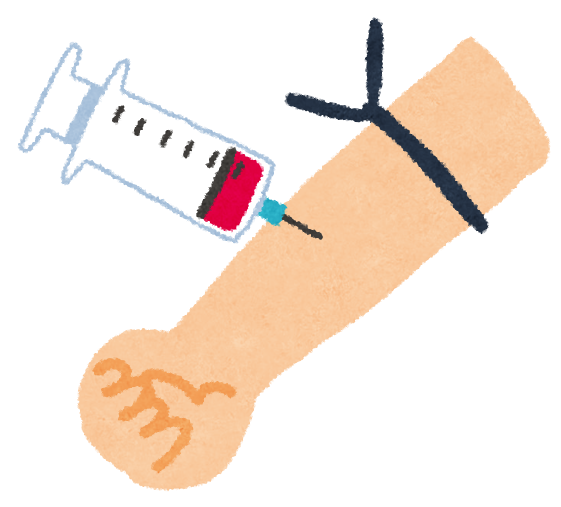
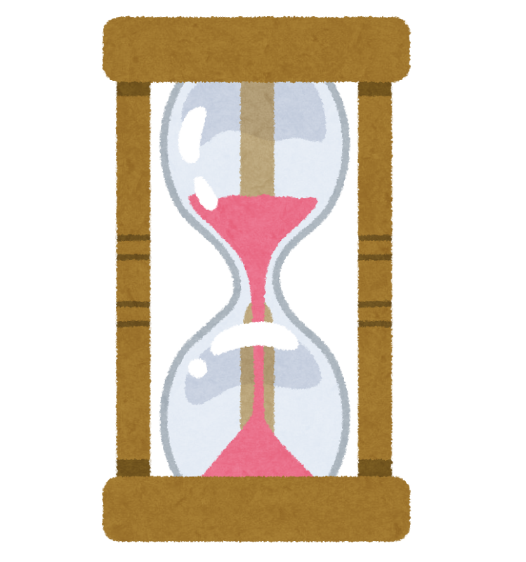

「まだ、どこも悪くないんですけどね」

そう言いながら、健康診断の紙をながめる。多くの方にとって、検査とはそういうものだと思います。**いま**、体に何が起きているかを調べるもの。

ところが2026年7月、その常識が少しだけ動くような報告が出ました。血液を1本とるだけで、「**まだ何の症状もない人の10年後**」が、ある程度見通せるかもしれない、というのです。

発表したのはアメリカのハーバード大学などのチーム。医学誌『JAMA』に載り、同じ日に開かれた国際学会でも報告されました。

> ✅ 症状のない約2,700人（平均70歳）を追いかけたところ、血液中の**p-tau217という物質がとても高かった人**は、10年のあいだに78%が物忘れの段階へ進んでいました
>
> ✅ ただしこれは「そうなりやすい」という**見通し**であって、決まった未来ではありません。研究者自身が「この数値だけで一人ひとりの将来は決められない」と述べています
>
> ✅ そしてこの検査、**日本の健康保険ではまだ受けられません。** 気になる症状があるときの入り口は、いまも「かかりつけ医に相談する」ことです

> この検査そのものについては、前回くわしく書きました。あわせてどうぞ。
> 👉 [血液一滴で、アルツハイマー病の"きざし"がわかる時代へ](/posts/alzheimer-ptau217-blood-test/)

---

## 目次

1. [まず、前回のおさらいを少しだけ](#まず前回のおさらいを少しだけ)
2. [今回の新しさは「まだ何ともない人」を追いかけたこと](#今回の新しさはまだ何ともない人を追いかけたこと)
3. [出てきた数字を見てみましょう](#出てきた数字を見てみましょう)
4. [ただし、決まった未来ではありません](#ただし決まった未来ではありません)
5. [もうひとつの動き かかりつけ医でも分かるように](#もうひとつの動き-かかりつけ医でも分かるように)
6. [ただし、日本ではまだ受けられません](#ただし日本ではまだ受けられません)
7. [分かったところで、打てる手はあるのでしょうか](#分かったところで打てる手はあるのでしょうか)
8. [理学療法士として、現場で思うこと](#理学療法士として現場で思うこと)
9. [いま私たちにできること](#いま私たちにできること)
10. [おわりに](#おわりに)
11. [参考にした情報](#参考にした情報)

---

## まず、前回のおさらいを少しだけ

アルツハイマー病では、発症するずっと前から、脳のなかで少しずつ変化が始まっています。その変化を映すものとして注目されてきたのが、**p-tau217**（ピー・タウ・ニーイチナナ）という物質です。

名前は難しいのですが、中身は単純です。脳の神経細胞のなかにある「タウ」というたんぱく質が、アルツハイマー病では形を変えて溜まっていきます。その変化したタウのかけらが、ごくわずかに血液へ流れ出てくる。それを測っているわけですね。

2025年5月には、アメリカの規制当局が、アルツハイマー病の診断に使える初めての血液検査として、この測定方法を正式に認めました。ここまでが前回のお話です。


前回で、もう十分すごい話だと思ったのですが……。




そうなんです。ただ、前回までは **「いま症状がある人の、その原因を突きとめる」** ための検査でした。今回はそこから一歩進んで、**まだ何ともない人の先ゆき**を調べています。使う場面が、まるきり変わるんですね。


---

## 今回の新しさは「まだ何ともない人」を追いかけたこと

今回の研究が調べたのは、**認知機能に問題のない人たち**でした。

- 対象は約2,700人。平均年齢70歳
- 6つの研究グループ・臨床試験のデータをまとめたもの
- 血液をとった時点では、全員が認知機能の検査で「正常」
- そこから**平均およそ5年**、長い人では**10年以上**追いかけた

そして「その後、物忘れの段階（軽度認知障害＝MCI、または認知症）へ進んだかどうか」を数えています。

つまり、**血液の数値が高かった人は、本当にその後そうなったのか**を、実際に何年もかけて確かめたわけです。ここが今回のいちばん大事なところだと思います。

---

## 出てきた数字を見てみましょう

血液中のp-tau217の値によって、その後の進み方には、はっきりした差がありました。

| p-tau217の値 | 5年のあいだに物忘れの段階へ進んだ割合 | 10年では |
|---|---|---|
| **とても高い**（平均の2倍を超える） | 約38%（3人に1人ほど） | **78%** |
| **やや高い** | 15% | 45% |

ここで「とても高い」「やや高い」と書いたのは、**平均からどれだけ離れているか**でグループを分けたものです。とても高い、は平均の2倍を超えた人たち。やや高い、はその手前で、平均より少し上にいる人たちです。

なお、この表に**平均くらいの人や、平均より低かった人は出てきません。** 発表で示されたのは、高いほうの2つのグループだけです。

> 💡 **「◯◯以上なら、やや高い」という一律の数値は示されていません。**
>
> 血液の検査は、使う機械や試薬によって出てくる数字の目盛りが変わります。同じ人を測っても、検査の種類が違えば数値が違ってくるのです。そのため研究では、ばらつきをそろえたうえで比べています。
>
> ですから、この検査は「◯◯以上だから危ない」と**一本の線で決めるもの**ではなく、**平均からどのくらい離れているか**で見るもの、と思っていただくのがよさそうです。

10年で78%。かなり大きな数字です。

けれども、ここで慌てないでいただきたいのです。この78%は、**「平均の2倍を超えるほど高かった人」だけ**の数字です。ほとんどの方は、この列には当てはまりません。


78%と言われると、やっぱりドキッとします……。




そう感じるのが自然だと思います。ただ、この数字は **「とても高い」という限られたグループの話**です。そして残りの22%の方は、10年たっても進んでいません。**高い＝必ずそうなる、ではない**ということも、同じくらい大事な結果なんですね。


---

## ただし、決まった未来ではありません

研究チーム自身も、こう釘を刺しています。

> p-tau217の値だけで、その人の将来を完全に予測することはできない。この数値からわかることはあるが、すべてがわかるわけではない。

さらに、**もっといろいろな人種・地域の人を含めた研究と、もっと長い追跡が必要**だとも述べています。今回参加したのは研究に協力した方々で、街を歩いている人すべてを代表しているわけではありません。ここは正直に押さえておきたいところです。

---

## もうひとつの動き かかりつけ医でも分かるように

同じ学会では、もうひとつ、生活に近い報告がありました。スウェーデンのルンド大学からのものです。

患者さん1,310人と、医師165人が参加しました。医師が診察をして「アルツハイマー病かどうか」を判断し、そのあとで血液検査の結果を見せて、判断がどう変わるかを比べています。

結果はこうでした。

| | 血液検査を見る前 | 見たあと |
|---|---|---|
| **かかりつけ医（一般の開業医）** | 65% | **93%** |
| **専門医** | 74% | 89% |

正しく診断できた割合です。**近所のかかりつけの先生でも、血液検査の結果があれば、専門医とほとんど変わらない精度になった**ということになります。

これは、地方にお住まいの方や、大きな病院まで通うのが大変な方にとって、意味の大きい話だと思います。物忘れの相談が、**遠くの専門外来まで行かなくても始められる**かもしれないのですから。

> ⚠ この研究は、いまのところ**学会で発表された段階**です。論文としてはまだ確認できていません。今後の報告を待つ必要があります。

---

## ただし、日本ではまだ受けられません

ここは、いちばん誤解が生まれやすいところなので、はっきり書いておきます。

**この血液検査は、日本の健康保険では受けられません。** 「近所の病院で、健診のついでにお願いします」という段階ではないのです。

アメリカで認められたからといって、そのまま日本の病院で使えるようになるわけではありません。日本で使うには、あらためて国の審査を受ける必要があり、それには時間がかかります。前回の記事でも同じことをお伝えしましたが、この1年ほどで状況が大きく動いた、というわけではありません。

ですから、**気になる症状があるときの入り口は、いまも変わりません。** かかりつけの先生、あるいは「もの忘れ外来」に相談する。そこが第一歩です。

---

## 分かったところで、打てる手はあるのでしょうか

これは、私自身がずっと引っかかっていた問いでもあります。

「10年後こうなりますよ」と言われて、何もできないのなら、知らないほうが幸せかもしれない。そう思う方がいても、まったく不思議ではありません。

正直に書きます。**いまの医療で、アルツハイマー病を止めてしまえる方法はまだありません。** そこは、期待を大きくしすぎないでいただきたいところです。

そのうえで、それでも「早く分かること」には意味があると、私は考えています。

### ・治療の選択肢が、早い段階ほど広い

近年、脳に溜まるアミロイドβに働きかける新しいお薬（レカネマブ、ドナネマブなど）が使えるようになってきました。こうしたお薬は、**早い段階ほど検討の余地が広がる**とされています。進んでしまってからでは、選べる手が減っていきます。

※お薬については、必ずかかりつけの先生にご相談ください。

### ・生活を立て直す時間がある

運動、食事、睡眠、耳の聞こえ、人とのつながり。認知症のリスクを下げるとされる生活の要素は、どれも**すぐには効きません。** 数年かけて積み上げるものです。だからこそ、早く動き出せることに価値があります。

### ・家族で話しておける

これは医療の話ではありませんが、現場で見ていて、いちばん差が出るところだと感じています。

お金のこと、住まいのこと、これからどう暮らしたいか。**ご本人の言葉で希望を聞けるうちに聞いておけた**ご家族と、そうでないご家族とでは、その後の何年かの重さがずいぶん違います。


元気なうちに、そんな話をするのは気が重いです……。




よくわかります。でも、**元気なうちだからこそ、軽く話せる**という面もあるんですよ。「もしものときはどうしたい？」と一度聞いておくだけで、いざというときに家族が迷わずにすみます。深刻な会議にしなくていいんです。お茶を飲みながら、ひとことで十分です。


---

## 理学療法士として、現場で思うこと

私は理学療法士として、認知症の方のリハビリに関わってきました。そこで何度も思ってきたのは、「**もう少し早く出会えていたら**」ということです。

歩くことも、話すことも、進んでからでは取り戻すのに時間がかかります。けれど、まだ余力のあるうちに始められた方は、驚くほど長く、その人らしい暮らしを保たれます。

私の母も、アルツハイマー型認知症です。前回の記事で少し書きましたが、いま振り返ると、気づけたはずのサインは何年も前からありました。

だから今回の研究を読んで、私が感じたのは「怖い」ではなく、「**もっと早く手を打てる人が増えるかもしれない**」という思いのほうでした。

---

## いま私たちにできること

検査を待つあいだにも、できることはあります。むしろ、こちらのほうが確かです。

- ☑ **気になる物忘れが続くときは、かかりつけ医か「もの忘れ外来」に相談する**。血液検査を待つ必要はありません
- ☑ **耳の聞こえ・目の見え方を放っておかない**。聞こえにくさは、認知症の危険因子のひとつです
- ☑ **歩く習慣を絶やさない**。ゆっくりでも、毎日のほうが効きます
- ☑ **血圧・血糖・コレステロールを整える**。脳の健康は、血管の健康と地続きです
- ☑ **人と話す機会をつくる**。会話は、いちばん手軽な脳の運動です
- ☑ **家族と一度だけ話しておく**。「もしものときはどうしたい？」を、軽い調子で

> 生活習慣のくわしい中身は、こちらの記事にまとめています。
> 👉 [認知症を防ぐ「血管と代謝」の整え方](/posts/dementia-14-factors-body/)
> 👉 [脳を守る「刺激とつながり」](/posts/dementia-14-factors-brain/)

※持病のある方は、運動や食事の変更を始める前に、必ずかかりつけの先生にご相談ください。

---

## おわりに

10年先が見える、と聞くと、少し身構えてしまいます。私もそうでした。

けれど、この研究が本当に示したのは「あなたの未来はこうです」ということではありません。「**まだ何ともない時期に、手を打てる人を見つけられるかもしれない**」ということだと思います。

医療は、病気になった人を治すところから、**病気になる前の人を支えるところへ**、少しずつ移ろうとしています。今回の報告は、その途中経過の一枚です。

日本で誰もが検査を受けられるようになるには、まだ時間がかかります。それまでのあいだ、私たちにできることは、変わらず地味なことばかりです。歩く。よく眠る。人と話す。気になったら相談する。

でもその地味な積み重ねこそが、10年後のいちばん確かな備えなのだと、現場にいて思います。

---

## 参考にした情報

- Alzheimer's Association International Conference (AAIC) 2026 プレスリリース「Blood Test Predicts Alzheimer's Risk」（2026年7月15日）／原著は医学誌『JAMA』同日掲載。マサチューセッツ総合ブリガム神経科学研究所・ハーバード大学医学部（Rachel F. Buckley 博士ほか）
- Alzheimer's Association International Conference (AAIC) 2026 プレスリリース「Blood Test Improves Accuracy of Alzheimer's Diagnosis」（2026年7月14日）／スウェーデン・ルンド大学（Sebastian Palmqvist 医師ほか）※学会発表段階の報告です
- 前回の記事：[血液一滴で、アルツハイマー病の"きざし"がわかる時代へ](/posts/alzheimer-ptau217-blood-test/)

※この記事は、公表された研究報告をもとに、一般の方向けにやさしく言い換えたものです。診断・治療については、必ずかかりつけの医師にご相談ください。
