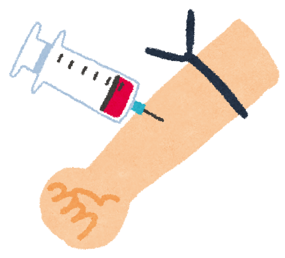

「最近、親の物忘れが増えた気がする」  
「自分も、ふと言葉が出てこないことがある」――  
そんな小さな不安を、心のどこかに抱えていませんか？

認知症、とくにアルツハイマー病は、「気づいたときにはかなり進んでいた」ということが少なくありません。だからこそ、**もっと早く、体に負担をかけずに気づける方法**が、長いあいだ望まれてきました。

2025年5月、その願いに一歩近づくニュースが、海の向こうから届きました。**血液の検査で、アルツハイマー病の手がかりを調べる方法**が、初めて公式に認められたのです。

今日は、この「p-tau217（ピー・タウ・ニーイチナナ）」という新しい血液検査について、できるだけやさしくお話しします。そして最後に、私自身の家族のことにも、少しだけ触れさせてください。

> ✅ **この記事の要点**  
> 
> ✅ 2025年5月、米国で「血液検査」によるアルツハイマー病の手がかり調べが、初めて公式に承認されました  
> 
> ✅ これまでの検査（脳の画像検査や背中からの検査）より、**体への負担がぐっと少ない**のが特徴です  
> 
> ✅ 早く気づけるほど、**生活習慣の見直しや治療を早く始められる**——そこに大きな希望があります

## もくじ

1. [そもそも「アルツハイマー病」と「認知症」は同じ？](#そもそもアルツハイマー病と認知症は同じ)
2. [脳に溜まる“2つのゴミ”――アミロイドβとタウ](#脳に溜まる2つのゴミアミロイドβとタウ)
3. [これまでの診断は、体への負担が大きかった](#これまでの診断は体への負担が大きかった)
4. [p-tau217――血液でわかる「手がかり」](#p-tau217血液でわかる手がかり)
5. [早く分かることが、なぜ希望になるのか](#早く分かることがなぜ希望になるのか)
6. [いま私たちにできること](#いま私たちにできること)
7. [おわりに――母のこと、そして未来へ](#おわりに母のことそして未来へ)

## そもそも「アルツハイマー病」と「認知症」は同じ？

よくある誤解のひとつに、「アルツハイマー病＝認知症」というものがあります。じつはこれは正確ではありません。

**認知症**は、いろいろな原因で記憶や判断の力がゆっくり低下していく「状態」をまとめた呼び名です。その**原因のひとつ**として最も多いのが、**アルツハイマー病**という脳の病気です。

アルツハイマー病では、**もの忘れ（記憶の障害）が少しずつ進んでいく**のが特徴です。そして脳の中では、目には見えない変化が、症状が出るよりもずっと前から始まっているとされています。

## 脳に溜まる“2つのゴミ”――アミロイドβとタウ

アルツハイマー病の脳には、大きく分けて**2種類の“ゴミ”**が溜まっていくことが分かっています。

- **アミロイドβ（ベータ）**……神経細胞の**外側**に溜まるタンパク質。比較的早い段階から溜まり始めます。
- **リン酸化タウ**……神経細胞の**内側**に溜まるタンパク質。こちらが溜まってくると、神経細胞が傷んで、もの忘れなどの症状につながっていきます。

大切なのは、**まずアミロイドβが溜まり、それを追いかけるようにタウが溜まっていく**という順番です。

つまり、**タウの変化を捉えられれば、その前段階であるアミロイドβの蓄積も起きている**と考えられる――この点が、今回の血液検査のカギになります。

## これまでの診断は、体への負担が大きかった

長いあいだ、生きている方の脳で、この“2つのゴミ”がどれくらい溜まっているかを確かめる方法はありませんでした。

近年になって、ようやく次のような方法で調べられるようになりました。

- **アミロイドPET／タウPET**……特殊な画像検査で、脳の中の蓄積を見る方法
- **脳脊髄液（のうせきずいえき）の検査**……背中に針を刺して、脳のまわりの液を採って調べる方法

どちらも精度は高いのですが、**費用が高い・体への負担が大きい・受けられる施設が限られる**といった難しさがありました。とくに背中から液を採る検査は、想像するだけで身構えてしまう方も多いと思います。

そこで、**もっと手軽な「血液検査」でわからないか**と、20年以上にわたって研究が重ねられてきました。

## p-tau217――血液でわかる「手がかり」

研究の積み重ねのなかで、とくに有望とされたのが、血液中の**p-tau217**（リン酸化タウの一種）です。

p-tau217は、**脳の画像検査で異常が見える前の早い段階から、血液の中でわずかに増えてくる**ことが分かってきました。そして2025年5月、米国の食品医薬品局（FDA）が、**アルツハイマー病の診断に使える初めての血液検査**として、この測定方法を正式に認めました。

報告されている精度の一例を挙げると、

- アルツハイマー病と診断された方で、この血液検査が**陽性なら、脳にアミロイドβの変化がある可能性がとても高い**（年齢にかかわらず、おおむね95〜97％台）
- アルツハイマー病**以外**のタイプの認知症と診断された方で、検査が**陰性なら、アミロイドβの変化はない可能性がとても高い**（おおむね91〜99％）

とされています。**体への負担が少ない血液検査で、ここまで手がかりがつかめる**ようになったことは、医療にとって大きな前進です。

> **⚠ ここはとても大切です**  
> 今回の承認は、あくまで**米国（アメリカ）での話**です。**日本で今すぐ、どこの病院でも受けられる検査というわけではありません。** また、検査だけで「アルツハイマー病です」と決まるものでもなく、症状や経過と合わせて、医師が総合的に判断するものです。気になる症状があるときは、まずは**かかりつけ医や「もの忘れ外来」に相談する**のが第一歩です。

## 早く分かることが、なぜ希望になるのか

「早く分かっても、どうしようもないのでは？」と感じる方もいるかもしれません。でも、私はそうは思いません。**早く気づけることには、たしかな意味があります。**

- **生活習慣を早めに見直せる**……運動・食事・睡眠・人とのつながりなど、脳の健康を支える習慣に、より早く取り組めます
- **新しい治療を検討できる**……近年は、アミロイドβに働きかける新しいお薬（レカネマブ、ドナネマブなど）も登場しています。こうした治療は、**早い段階ほど検討の余地が広がる**とされています
- **これからの暮らしに備えられる**……ご本人もご家族も、心の準備や生活の工夫を、あわてずに進められます

認知症を完全に防ぐ魔法はまだありません。けれども、**進み方をゆるやかにし、その人らしい時間を少しでも長く保つ**ことは、決して夢物語ではなくなってきています。早期発見は、その入り口なのです。

> 脳の健康を支える生活習慣について、くわしくは過去の記事もあわせてどうぞ。  
> 👉 [認知症を防ぐ「血管と代謝」の整え方](/posts/dementia-14-factors-body/)  
> 👉 [脳を守る「刺激とつながり」](/posts/dementia-14-factors-brain/)

## いま私たちにできること

新しい検査の登場を待つあいだにも、**今日から始められること**はたくさんあります。チェックリストにしてみました。

- ☑ 気になる物忘れが続くときは、ひとりで抱えず**もの忘れ外来などに相談**してみる
- ☑ ウォーキングなど、**無理のない運動**を生活に取り入れる
- ☑ 野菜・魚・大豆などをバランスよく、**腹八分目**を心がける
- ☑ **しっかり眠る**（睡眠は脳のお掃除の時間です）
- ☑ 人と話す、出かける、笑う――**つながりと刺激**を大切にする
- ☑ 聞こえや見え方が気になったら、**早めにケアする**

どれも特別なことではありません。けれど、**こうした積み重ねが、脳をやさしく守ってくれる**のです。

> ※運動・食事・お薬などについては、持病のある方は必ず**かかりつけ医に相談**してから始めてください。

## おわりに――母のこと、そして未来へ

最後に、少しだけ私自身のことを書かせてください。

私の母は、15年ほど前から、同じ話を繰り返したり、探し物が増えたりといった変化が、少しずつ目立つようになりました。今では言葉もなかなか出にくく、家族のことを分かってくれているのかどうか、私にも判断しづらいときがあります。

息子として、そして理学療法士として、**「もっと早く気づいて、早く手を打てていたら」**という思いは、正直なところ、今も心のどこかに残っています。

だからこそ、私は今回のニュースに希望を感じました。血液検査で早いうちに気づける時代が来れば、生活習慣の見直しや治療に、もっと早くから取りかかれるかもしれない。**より軽い状態を長く保ち、当たり前の家族の時間を、少しでも長く守れるかもしれない**――そう思うのです。

同じように、ご家族のことやご自身のことを心配されている方へ。完璧でなくて大丈夫です。**気づいたその日が、いちばん早い日**です。どうか、ひとりで抱え込まずに。この記事が、その小さな一歩のきっかけになれば、これほど嬉しいことはありません。

## 参考にした情報

- ケアネット 連載「外来で役立つ！認知症Topics」第30回『アルツハイマー病の超早期診断が実現「p-tau217血液検査」』（2025年）※閲覧には会員登録が必要です
- 米国FDA プレスリリース「FDA Clears First Blood Test Used in Diagnosing Alzheimer's Disease」（2025年5月）
- Therriault J, et al. Diagnosis of Alzheimer's disease using plasma biomarkers adjusted to clinical probability. Nat Aging. 2024;4:1529-1537.

*この記事は一般的な情報提供を目的としたもので、診断や治療に代わるものではありません。気になる症状があるときは、必ず医療機関にご相談ください。*
