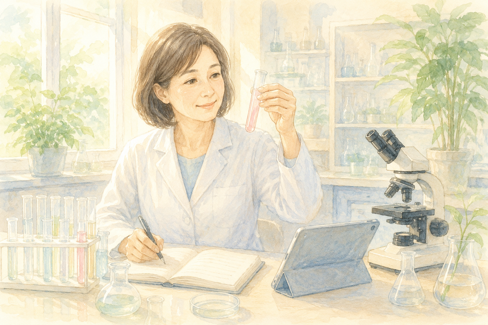

「認知症の薬や治療は、これからどうなっていくの？」  
ご家族のことを思って、そんなふうに気になっている方も多いと思います。

今回は、アルツハイマー病の研究の最前線から、ひとつ明るいニュースが届きました。

> **アルツハイマー病の脳で「炎症を止まらなくするスイッチ」になっているタンパク質が見つかった**

ただし、これは **まだ研究の段階** の話です。期待しすぎず、でも前向きに――そんな気持ちで読んでいただければと思います。

> ✅ アルツハイマー病の脳では「STING（スティング）」というタンパク質が、**炎症をいつまでも続けさせるスイッチ** になっていた
>
> ✅ マウスの実験で、このスイッチが入るのを防いだところ、**脳の炎症がやわらいだ**
>
> ✅ ただし **動物実験の段階** で、すぐに使える薬ではない。「新しい治療の的（まと）が見つかった」というニュースです

---

## 目次

1. [そもそも「脳の炎症」って？](#そもそも脳の炎症って)
2. [見つかった「炎症スイッチ」の話](#見つかった炎症スイッチの話)
3. [いま私たちにできること](#いま私たちにできること)
4. [おわりに](#おわりに)

---

## そもそも「脳の炎症」って？

私たちの体には、ばい菌やケガから身を守る「免疫（めんえき）」のしくみがあります。脳にも、同じように見張り役の細胞がいて、異常があると **炎症** を起こして対応します。

ところが、この炎症が **必要もないのにずっと続いてしまう** と、今度は脳そのものを傷つけてしまいます。アルツハイマー病では、この「**消えない炎症**」が、神経のつながりを弱らせる一因と考えられてきました。

---

## 見つかった「炎症スイッチ」の話

アメリカのスクリプス研究所のチームが、この「消えない炎症」の犯人をつきとめました。

カギになっていたのは、免疫の見張り役として働く「**STING（スティング）**」というタンパク質です。アルツハイマー病の脳では、このSTINGが **化学的に変化** してしまい、炎症のスイッチが入りっぱなしになっていたのです。

そこで研究チームが、マウスの実験で **この変化が起きないように** したところ――脳の炎症がやわらいだことが確認されました。研究を率いた神経内科医のスチュアート・リプトン博士は、これを「**アルツハイマー病の新しい、重要な治療の的（まと）になる**」と話しています。

> ※ この研究は2026年、医学誌『Cell Chemical Biology』に発表されたものです。**マウスでの段階** であり、人に使える薬ができたわけではありません。

---

## いま私たちにできること

「新しい薬を待つ」だけでなく、**今日からできること** もあります。脳の余計な炎症を抑えるには、こんな生活習慣が役立つと考えられています。

> ✅ **適度な運動** を続ける（歩く・体操など）
>
> ✅ **しっかり眠る**（睡眠中に脳の掃除が進みます）
>
> ✅ **野菜・魚を中心としたバランスのよい食事**
>
> ✅ 歯みがき・歯科受診など **口の中を清潔に保つ**（歯周病の炎症も関係するといわれます）

特別なことではなく、いつもの暮らしの延長です。

> 運動と脳の関係は、こちらの記事もどうぞ。  
> 👉 [認知症を遠ざける運動のヒント](/posts/dementia-prevention-exercise/)

---

## おわりに

炎症という「脳の中の火」を、どこで消せばいいのか――その **スイッチの場所** が見えてきた。これは、これからの認知症研究にとって大きな一歩です。

すぐに治療が変わるわけではありませんが、世界中の研究者が一歩ずつ前に進んでいます。私たちは過度に不安にならず、**今できる生活習慣を大切にしながら**、こうした明るいニュースを待ちたいですね。

---

### 📚 あわせて読みたい一冊

{{< affiliate
    title="アルツハイマー病 真実と終焉"
    image="https://m.media-amazon.com/images/P/4802611404.09._SCLZZZZZZZ_.jpg"
    amazon="https://af.moshimo.com/af/c/click?a_id=5534074&p_id=170&pc_id=185&pl_id=4062&url=https%3A%2F%2Fwww.amazon.co.jp%2Fdp%2F4802611404"
    rakuten="https://af.moshimo.com/af/c/click?a_id=5533903&p_id=54&pc_id=54&pl_id=27059&url=https%3A%2F%2Fbooks.rakuten.co.jp%2Frb%2F15289586%2F"
    description="アルツハイマー病を「炎症・栄養・毒素」など複数の原因から見直す、世界的に話題になった一冊（白澤卓二先生監修）。今回の炎症の話とも通じる、生活習慣からのアプローチがやさしく整理されています。" >}}

---

### 参考にした情報

- スクリプス研究所（米国）の研究／責任著者：スチュアート・リプトン博士
- 医学誌『Cell Chemical Biology』2026年発表の論文（STINGタンパク質と脳の炎症）

※ 本記事は、上記の信頼できる研究・大学発表をもとに、一般読者向けにわかりやすくまとめ直したものです。紹介した内容は研究段階のものであり、治療効果を保証するものではありません。治療やお薬については、必ず主治医・かかりつけ医にご相談ください。

