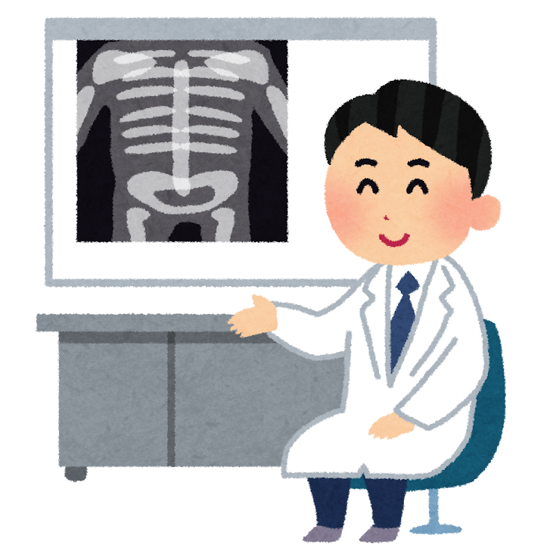
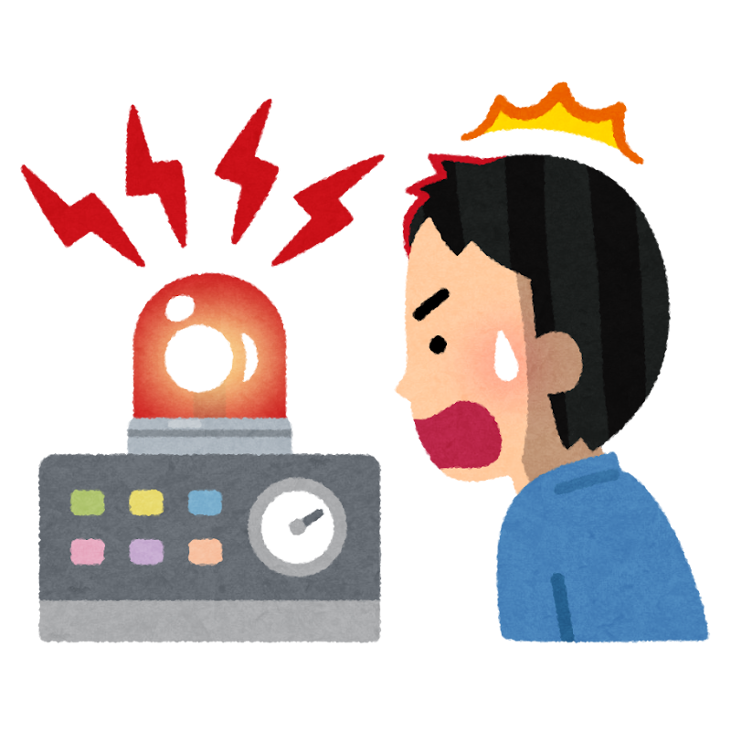
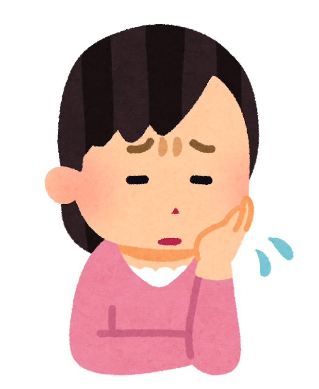
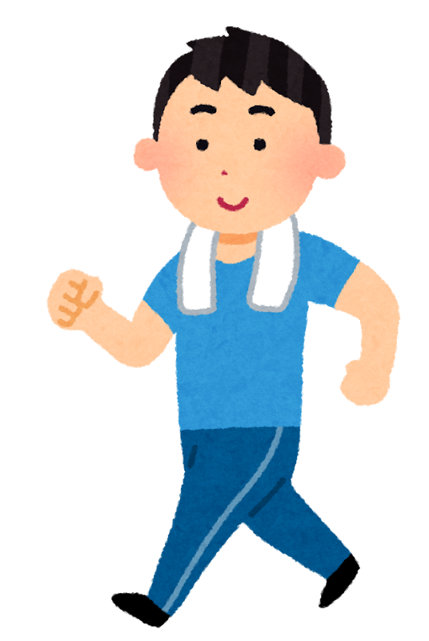

「画像を撮っても、骨に異常はないと言われた。でも、腰は痛いまま」——。
そんな経験は、ありませんか？

じつはこれ、とても多いお悩みです。そして最近の「痛みの研究」では、その理由がだんだんと分かってきました。

キーワードは、**「脳」** です。腰の痛みなのに脳？と思われるかもしれませんが、**慢性的な腰痛ほど、脳とのつながりが深い** ことが分かってきているのです。今回はそのしくみを、できるだけやさしく解説します。

> ✅ 痛みは「ケガの大きさ」そのものではなく、脳が出す **“警報”** のようなもの
>
> ✅ 痛みが長く続くと、神経や脳が **過敏（かびん）** になり、傷が治っても痛みが残りやすくなる
>
> ✅ 焦らず、安全な範囲で **少しずつ動く** ことが、回復への近道になる

---

## 目次

1. [痛みは「ケガの大きさ」を測る目盛りではない](#痛みはケガの大きさを測る目盛りではない)
2. [痛みが長引くと、脳と神経が“過敏”になる](#痛みが長引くと脳と神経が過敏になる)
3. [不安や「動くのが怖い」が、痛みをさらに強める](#不安や動くのが怖いが痛みをさらに強める)
4. [だからこそ、「動くこと」が回復のカギ](#だからこそ動くことが回復のカギ)
5. [理学療法士として、現場で感じること](#理学療法士として現場で感じること)
6. [まとめ](#まとめ)
7. [参考（すこし専門的な補足）](#参考すこし専門的な補足)

---

## 痛みは「ケガの大きさ」を測る目盛りではない


検査では「異常なし」って言われたのに、こんなに痛いんです。気のせいなんでしょうか……。



気のせいなんかじゃないですよ。痛みは、**ケガの大きさをそのまま数字で表しているわけではない** んです。まずはそこからお話ししますね。


多くの人は「痛み＝体が壊れているサイン」だと思っています。もちろん、ぎっくり腰のような急な痛みは、実際に組織へのダメージが原因です。

ただ、痛みの正体はもう少し複雑です。痛みは、**脳が「これは危険かも」と判断したときに鳴らす“警報”** のようなもの。ケガの大きさを、そのまま目盛りで示しているわけではありません。

だから、こんなことが起こります。

- 大きなケガでも、夢中になっていると痛みを感じない
- 小さな変化でも、不安な状況だと強く痛む

痛みは「体の状態」だけでなく、**「脳がどう受け取ったか」** で大きく変わるのです。

---

## 痛みが長引くと、脳と神経が“過敏”になる

やっかいなのは、痛みが **3か月以上** 続くと、体の傷が治った後も痛みが残りやすいことです。

これは、痛みを伝える神経のシステム自体が敏感になってしまうために起こります。専門的には **「中枢性感作（ちゅうすうせいかんさ）」** と呼びます。


中枢性感作……。むずかしそうな言葉ですね。



イメージは、**鳴りっぱなしの車の防犯アラーム** なんです。もう泥棒はいないのに、警報だけが鳴り続けている——そんな状態が、体の中で起きているんですよ。


危険はもう去ったのに、痛みのスイッチだけがオンのまま。これが、慢性腰痛でよく起きていることです。

さらに、痛みが長引くと、脳の中で **痛み・感情・注意** をあつかう部分の働きにも変化が現れることが報告されています。痛みが「ただの感覚」ではなく、気分や集中力とも結びついてしまうのですね。

---

## 不安や「動くのが怖い」が、痛みをさらに強める

ここで大切なのが、**心の状態も痛みに直結している** という点です。

- 「また痛くなったらどうしよう」という不安
- 「これ以上ひどくなるかも」という考え
- 「動いたら悪化しそう」という、動くことへの恐怖

こうした気持ちがあると、人は自然と体を動かさなくなります。ところが、動かさないでいると筋力や柔軟性が落ち、神経はますます過敏に。結果として、**痛みがさらに長引く悪循環** に入ってしまいます。

つまり腰痛は、「腰そのものの問題」だけでなく、**体・心・生活環境が絡み合った問題** として捉える必要があるのです（これを「生物心理社会モデル」と言います）。

---

## だからこそ、「動くこと」が回復のカギ


でも、痛いのに動いていいんですか？ かえって悪くなりそうで怖くて……。



その不安、よく分かります。でもここが大事なところで、**適切な運動は、こわばった神経を落ち着かせる“薬”のような役割** を果たすんです。もちろん、無理は禁物ですよ。


少しずつ活動を取り戻していくことが、痛みの軽減と回復につながることが分かっています。

ポイントは、「怖いから避ける」ではなく、**「安全な範囲で、少しずつ慣らす」** こと。痛みのしくみを正しく知り、「痛み＝損傷ではない」と理解するだけでも、脳の痛みの受け取り方は変わっていきます。

### 「少しずつ」って、たとえばこんなこと

「少しずつ動く」といっても、はじめから頑張る必要はありません。**「昨日より、ほんの少しだけ」** を合言葉に、こんな一歩から始めてみてください。

- ✅ **まずは家の中を歩く回数を1回増やす**（トイレやお茶の往復も、りっぱな運動です）
- ✅ **散歩を「5分だけ」から**。慣れてきたら、少しずつ時間をのばす
- ✅ **休んでいた家事を、軽いものからひとつ再開する**（洗濯物をたたむ、食器を片づける、など）
- ✅ **痛みが強くない範囲で、ゆっくり体を動かす**（あお向けで両ひざをかかえる、いすに座って背すじをのばす、など軽いストレッチ）
- ✅ **長く同じ姿勢でいたら、こまめに立ち上がる**（30〜60分に一度が目安）

大切なのは、**「翌日に痛みが強く残らない範囲」で続けること**。少し痛くても、次の日にひどくならなければ、体は前に進んでいます。反対に、一日だけ頑張りすぎて数日寝込む——という「山あり谷あり」より、**小さくても毎日** のほうが、回復への近道です。


どれくらいまでやっていいのか、いつも迷ってしまって。



目安は **「痛みが10点満点で3〜4点までなら、そのまま続けてOK」**。それ以上つらいときは、少し量を減らしましょう。迷ったら、**かかりつけの先生や理学療法士に、自分に合った動き方を相談する** のがいちばん安心ですよ。


---

## 理学療法士として、現場で感じること

リハビリの現場でも、「レントゲンは大丈夫って言われたのに、ずっと痛くてね」という声は、本当によく聞きます。

そして長く現場にいて感じるのは、**痛みのしくみを知って、少しずつ体を動かし始めた方ほど、表情がやわらかくなっていく** ということです。「動いても大丈夫なんだ」と思えた瞬間に、こわばっていた体と気持ちが、ふっとゆるむ——そんな場面に、何度も出会ってきました。

痛みと向き合う第一歩は、**「正しく知ること」** なのかもしれません。

---

## まとめ

- 痛みは「ケガの大きさ」そのものではなく、**脳が出す“警報”**
- 痛みが長引くと、神経や脳が過敏になり、痛みが残りやすくなる（中枢性感作）
- 不安・恐怖・避ける行動が、痛みをさらに強めてしまう
- 焦らず、**少しずつ動くこと** が回復への近道

腰痛でお悩みの方は、「体が壊れているから痛い」と決めつけず、まずは **痛みのしくみを知ること** から始めてみてください。それだけで、痛みとの向き合い方が、ぐっとラクになるはずです。

> 脳と体のつながりについては、こちらの記事もどうぞ。
> 👉 [脳は、いくつになっても変われる 〜リハビリでわかった『脳の可塑性』のお話〜](/posts/brain-plasticity-rehabilitation-2026/)

---

## 参考（すこし専門的な補足）

根拠を知りたい方へ、少しだけ専門的な補足を添えます。

- **急性痛と慢性痛の違い**：急性痛は末梢組織の侵害刺激が主因だが、慢性痛（3か月以上）では、末梢の損傷よりも中枢神経系の変化が痛みの維持に関与するとされる。
- **中枢性感作（central sensitization）**：脊髄後角や上位中枢の興奮性が亢進し、通常は痛みを起こさない刺激でも痛みとして増幅される現象。
- **脳の可塑的（かそてき）変化**：慢性腰痛の患者では、前頭前野・島皮質・前帯状回などの活動変化や、灰白質量の減少が報告されている。ただし、これらは痛みの改善にともなって **可逆的に回復しうる** とされる。
- **心理社会的要因**：破局的思考（pain catastrophizing）や運動恐怖（kinesiophobia）は、痛みの慢性化・遷延化の予測因子とされる。
- **介入**：疼痛神経科学教育（PNE）と、段階的な運動療法（グレーデッド・エクスポージャー／グレーデッド・アクティビティ）の併用が、機能改善と痛みの軽減に有効とされている。

※ 本記事は一般的な情報提供を目的としたものであり、個別の診断・治療に代わるものではありません。痛みが強い場合や長引く場合、また足のしびれや力の入りにくさ・排尿の異常などをともなう場合は、自己判断せず医療機関にご相談ください。

