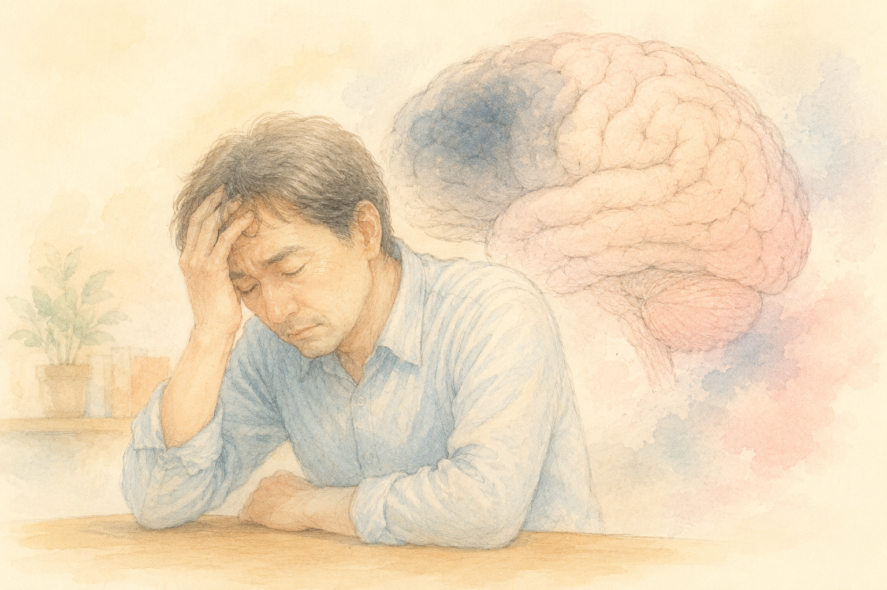

「年をとると、もの覚えが悪くなるのは仕方ない」  
そう思ってあきらめている方も、多いかもしれません。

ところが最近、**「脳の老化には、ある“原因物質”がかかわっていて、それを減らすと記憶が戻った」** という、おどろきの研究が報告されました。

今回は、その発見――脳にたまる **「FTL1（エフティーエルワン）」** というタンパク質の話を、やさしくご紹介します。ただし、これは **まだ研究の段階** の話です。期待しすぎず、でも前向きに、そんな気持ちで読んでいただければと思います。

> ✅ 老化した脳には **「FTL1」という鉄に関わるタンパク質**がたまり、細胞の“発電所”ミトコンドリアを弱らせて、記憶力を下げていた
>
> ✅ 年老いたマウスでこの **FTL1を減らしたところ、記憶のテストの成績が改善**。脳の働きが“若返る”可能性が示されました
>
> ✅ ただし、これは **マウスの遺伝子を操作した実験**の段階。人にそのまま使えるわけではなく、これからの研究が必要です

---

## 目次

1. [そもそも「FTL1」と「ミトコンドリア」って？](#そもそもftl1とミトコンドリアって)
2. [見つかった「脳の老化のしくみ」](#見つかった脳の老化のしくみ)
3. [FTL1を減らしたら、記憶が戻った](#ftl1を減らしたら記憶が戻った)
4. [人に使えるの？ 見通しと、いまの限界](#人に使えるの-見通しといまの限界)
5. [いま私たちにできること](#いま私たちにできること)
6. [おわりに](#おわりに)

---

## そもそも「FTL1」と「ミトコンドリア」って？

私たちの体は、小さな **「細胞（さいぼう）」** がたくさん集まってできています。その細胞の一つひとつの中に、**エネルギーをつくる小さな工場**があります。これが **「ミトコンドリア」** です。家でいえば、電気をつくる発電所のような存在です。

脳の神経細胞は、とてもたくさんのエネルギーを使います。ですから、この発電所が元気でないと、脳もうまくはたらけません。

一方の **「FTL1」** は、もともと **脳の中の“鉄”をしまっておく**役割を持つタンパク質です。鉄は体に必要なものですが、**多すぎても少なすぎてもいけない**、デリケートな存在。FTL1は、その鉄のバランスを保つ係をしています。

---

## 見つかった「脳の老化のしくみ」

研究チームが、**若いマウスと年老いたマウスの脳（記憶をつかさどる海馬）**を比べたところ、おどろくことがわかりました。**年をとるにつれて、神経細胞の中にFTL1が異常にたまっていく**のです。

FTL1が増えすぎると、脳の中の鉄のバランスが乱れます。すると――

- **発電所（ミトコンドリア）の働きが悪くなる**
- → 体に必要なエネルギー（ATP）がうまくつくれなくなる
- → 神経細胞どうしのつなぎ目（シナプス）の働きが弱る
- → **記憶力や、考える力が低下する**

つまり、**「年をとると、FTL1が増える → 脳がエネルギー不足になり、神経のつながりが弱る」** という流れが、もの覚えの低下の一因になっていた、というわけです。

ここで大事なのは、この研究が **「神経細胞が死んでしまうことだけが、脳の老化の原因ではない」** と示した点です。**つながりの“働き”が弱っているだけ**なら、もう一度元気にできる余地がある――。そんな希望につながる発見でもあります。

> 脳の“発電所”をめぐる話は、こちらの記事もどうぞ。  
> 👉 [アルツハイマー病に「もうひとつの引き金」？](/posts/alzheimer-grk2-mitochondria-2026/)

---

## FTL1を減らしたら、記憶が戻った

研究チームは、次に **「では、増えすぎたFTL1を減らしたらどうなるか」** を確かめました。年老いたマウスの脳で、**FTL1を減らす操作**を行ったのです。

すると、その結果は劇的でした。

- **物を見分ける記憶**：ふつうの年老いたマウスは、新しい物と古い物を見分けられず、テストの成績はほぼゼロ。ところが **FTL1を減らしたマウスは、はっきりと成績が改善**し、新しい物を見分けられるようになりました
- **道を覚える記憶（空間記憶）**：以前通った道と新しい道を区別するテストでも、ふつうの年老いたマウスはできなかったのに、**FTL1を減らしたマウスでは、はっきり改善**が見られました

脳の中を調べると、**乱れていた鉄のバランスが整い、弱っていたミトコンドリアの働きとエネルギー産生も回復**していました。加齢で減っていた、つなぎ目（シナプス）に必要なタンパク質も、再び増えていたといいます。

さらに研究チームは、**エネルギーづくりを助ける「NADH」という成分**を与えることでも、記憶の低下を防げることを確認しました。**FTL1という“原因”だけでなく、エネルギー不足という“結果”の側からも手を打てる**可能性が見えてきたのです。

---

## 人に使えるの？ 見通しと、いまの限界

ここまで読むと、「すぐにでも人の治療に使えそう」と期待してしまいます。でも、**そこは慎重に**受け止める必要があります。

**【見通し】** この研究は、加齢による記憶力の低下が「神経細胞が死ぬこと」よりも「**つながりの働きが衰えること**」にある、と示しました。だからこそ、FTL1を的にした治療や、NADHのような成分の活用が、**将来、人の脳の“若返り”や記憶の回復につながる可能性**が期待されています。

**【いまの限界】** 一方で、今回マウスで使われたのは **遺伝子を操作する方法**で、**人にそのまま使えるものではありません**。あくまで「**老化を巻き戻すしくみ**」を一つ突き止めた段階です。人に使える安全で効果的な薬として確立するには、**これから多くの検証**が必要です。

> ※「これを飲めば記憶が戻る」というサプリや薬は、まだ存在しません。気になる症状があるときは、まず**かかりつけの医師**にご相談ください。

---

## いま私たちにできること

新しい薬を待つあいだにも、**今日からできること**はあります。今回の話のカギは「**脳のエネルギーを守ること**」。それは、毎日の暮らしの工夫とも、しっかりつながっています。

- ✅ **体を動かす**：運動は、脳の血のめぐりとエネルギーづくりを助けます
- ✅ **よく眠る**：睡眠は、脳が老廃物をそうじし、回復する大切な時間です
- ✅ **バランスのよい食事**：脳の発電所の材料になります。鉄分も、過不足なくが基本です
- ✅ **頭と心を使う**：会話や趣味、新しい挑戦が、神経のつながりを保ちます

派手な特効薬がなくても、こうした積み重ねが、**脳の発電所を長く元気に保つ“いちばんの土台”**になります。

### 📚 もっと知りたい方へ

{{< affiliate
    title="LIFESPAN（ライフスパン） 老いなき世界"
    image="https://m.media-amazon.com/images/P/4492046747.09._SCLZZZZZZZ_.jpg"
    amazon="https://af.moshimo.com/af/c/click?a_id=5534074&p_id=170&pc_id=185&pl_id=4062&url=https%3A%2F%2Fwww.amazon.co.jp%2Fdp%2F4492046747"
    rakuten="https://af.moshimo.com/af/c/click?a_id=5533903&p_id=54&pc_id=54&pl_id=27059&url=https%3A%2F%2Fbooks.rakuten.co.jp%2Frb%2F16405480%2F"
    description="「老化のしくみ」を、ミトコンドリアや細胞の元気という視点から読み解いた世界的ベストセラー。今回の“脳の発電所”の話と通じる、希望のある一冊です。ハーバード大学の老化研究者による著作。" >}}

{{< affiliate
    title="生涯健康脳 こんなカンタンなことで脳は一生、健康でいられる！"
    image="https://m.media-amazon.com/images/P/4990521293.09._SCLZZZZZZZ_.jpg"
    amazon="https://af.moshimo.com/af/c/click?a_id=5534074&p_id=170&pc_id=185&pl_id=4062&url=https%3A%2F%2Fwww.amazon.co.jp%2Fdp%2F4990521293"
    rakuten="https://af.moshimo.com/af/c/click?a_id=5533903&p_id=54&pc_id=54&pl_id=27059&url=https%3A%2F%2Fbooks.rakuten.co.jp%2Frb%2F13289342%2F"
    description="16万人もの脳画像を診てきた東北大学の脳科学者が、「脳を一生元気に保つコツ」をやさしくまとめた一冊。むずかしい話ではなく、毎日の暮らしでできることが中心です。" >}}

---

## おわりに

「年だから、もの覚えが悪くなるのは仕方ない」  
長いあいだ、そう考えられてきました。

でも今回の研究は、**脳の老化が“一方通行”ではないかもしれない**ことを、私たちに教えてくれます。原因のひとつが見つかり、それを減らすと記憶が戻った――。これは、未来への小さな、でも確かな希望です。

もちろん、人に使える治療になるには、まだ時間がかかります。  
それでも、研究の世界では、**脳の老化と向き合う新しい道**が、一つずつ切りひらかれています。

私たちにできるのは、その日を楽しみに待ちながら、**今日の暮らしで脳を大切にしておくこと**。  
それが、いちばん確かな“備え”になると思います。

---

### 参考にした情報

- ITmedia NEWS 連載「Innovative Tech」：脳の老化に関わるタンパク質「FTL1」の研究紹介
- 元になった研究：米カリフォルニア大学サンフランシスコ校（UCSF）などの研究チーム／2025年8月、学術誌『Nature Aging』に掲載（"Targeting iron-associated protein Ftl1 in the brain of old mice improves age-related cognitive impairment"）
- ※本記事は研究段階の内容です。診断や治療については、必ず**かかりつけの医師**にご相談ください。
