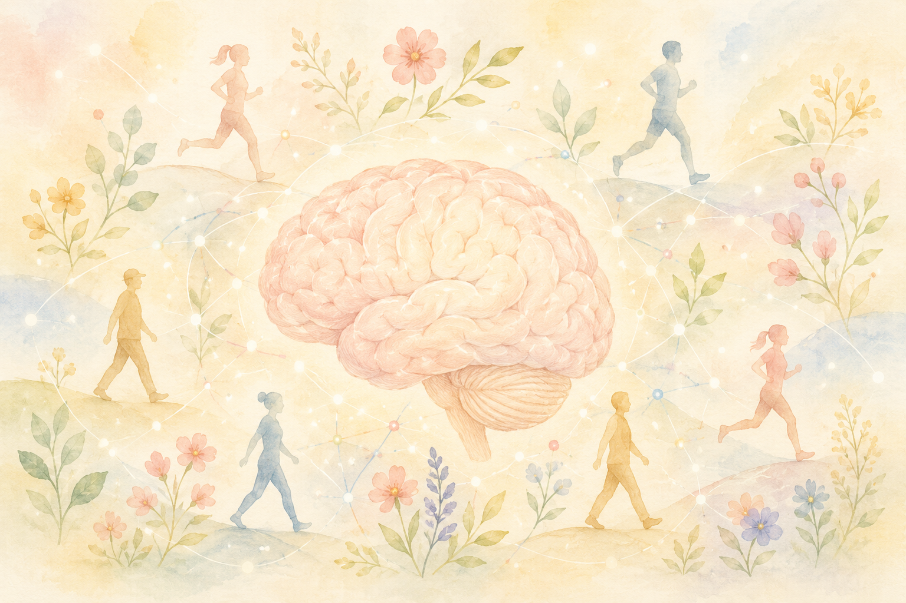
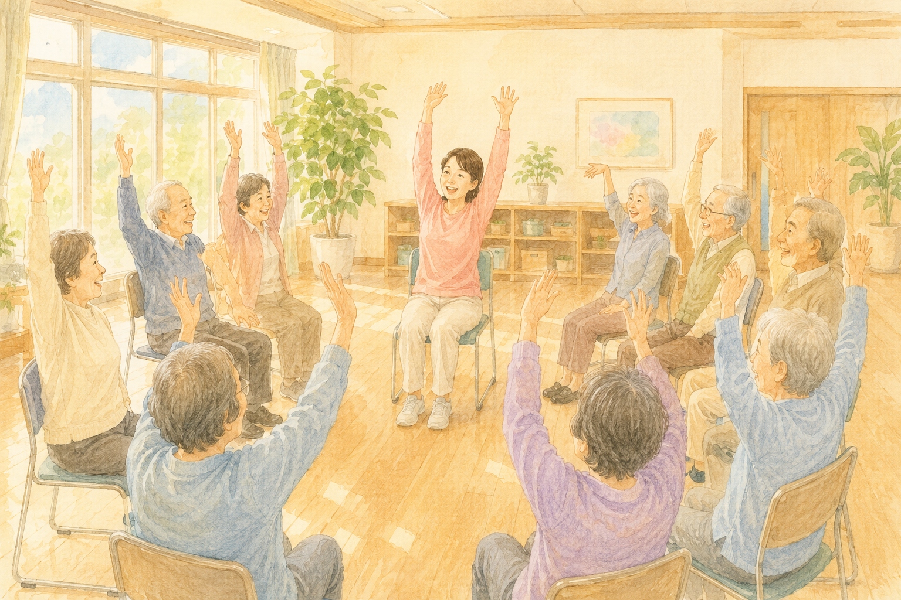
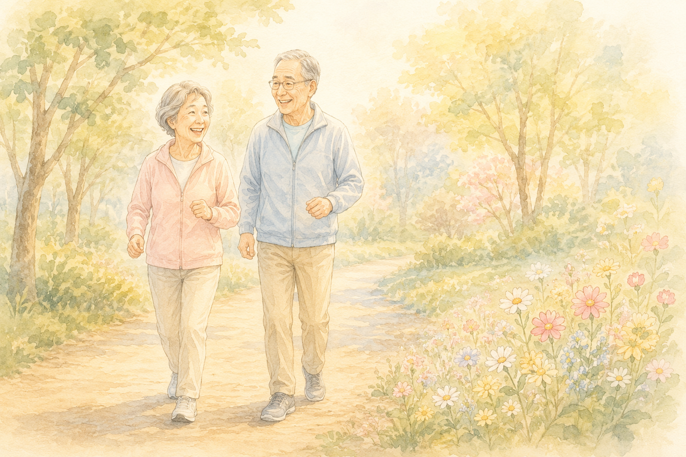
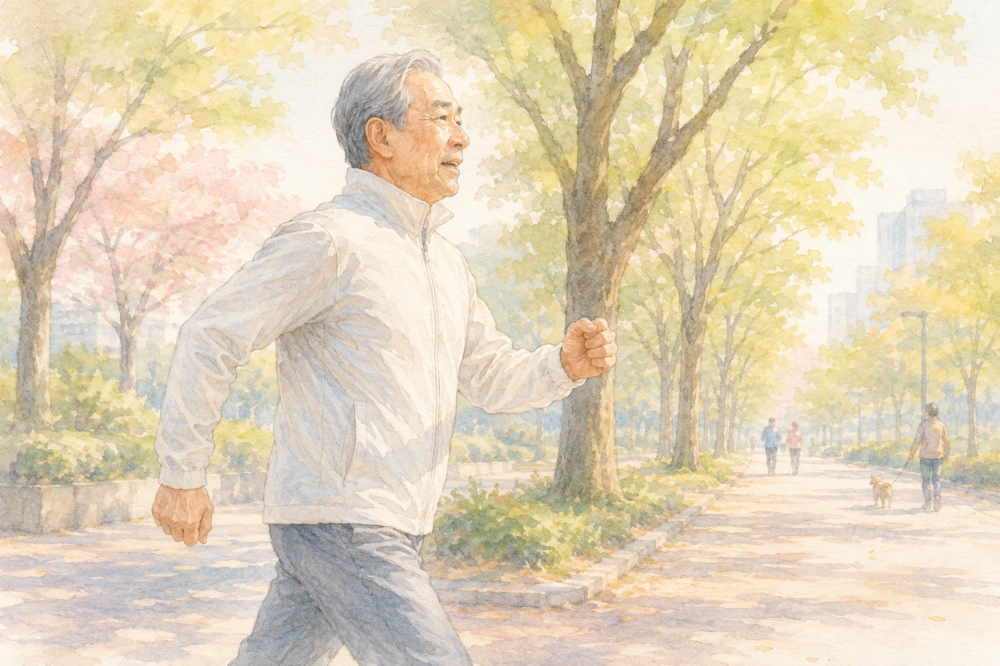

「このごろ、ペットボトルのフタが開けにくくなった」  
「握手した手に、昔ほど力が入らない気がする」

そんなふうに、**手の力（握力）の衰え**を感じたことはありませんか？  
「年のせいだから、しかたない」と思ってしまいがちですが、実はいま、**この“にぎる力”と、脳の元気との関係**に、世界中の研究者が注目しています。

理学療法士として現場に立っていると、「体の力」と「頭の元気」は、思っている以上に深くつながっていると感じます。今回は、**筋肉と脳の、新しい関係**について、やさしくお話しします。

> ✅ **握力は「体全体の筋力の鏡」**。大規模な研究で、握力が強い人ほど、将来アルツハイマー病になりにくい傾向が報告されています
>
> ✅ アメリカの有名な研究所が、**2026年を「脳の健康の年」**と位置づけました。運動が、脳を元気にする物質 **「BDNF」** を増やすことがわかっています
>
> ✅ カギは、**中年期からの筋力づくり**。歩くなどの有酸素運動だけでなく、**「筋トレ（筋力を保つこと）」も脳を守る**、という新しい視点が広がっています

---

## 目次

1. [そもそも、握力と脳って関係あるの？](#そもそも握力と脳って関係あるの)
2. [世界が注目「2026年は、脳の健康の年」](#世界が注目2026年は脳の健康の年)
3. [握力は「体全体の筋力の鏡」](#握力は体全体の筋力の鏡)
4. [なぜ、筋肉が脳を守るの？](#なぜ筋肉が脳を守るの)
5. [現場で感じていること](#現場で感じていること)
6. [いま私たちにできること](#いま私たちにできること)
7. [おわりに](#おわりに)

---

## そもそも、握力と脳って関係あるの？


手の力と、脳の元気……。まったく別のもののように思えるのですが。



そう感じますよね。でも、**握力は「体ぜんたいの筋力」をうつす鏡**のようなもの。手の力が保てている方は、体全体の筋肉も元気なことが多いんです。そして、その体の元気が、脳の元気ともつながっている——そんなことが、少しずつわかってきたんですよ。


握力とは、文字どおり「手でにぎる力」のことです。健康診断で測ったことがある方もいらっしゃるかもしれません。

この握力、じつは **「体全体の筋力の目安」** として、医療の現場でよく使われています。手の力だけを特別にはかっているのではなく、**握力が保てている人は、全身の筋肉も元気なことが多い**からです。

そして近年、この握力と、**脳の健康・認知症のリスク**との関係を調べる研究が、世界中で相次いで報告されるようになりました。順番に見ていきましょう。

---

## 世界が注目「2026年は、脳の健康の年」

アメリカに、**ソーク研究所（Salk Institute）** という、脳科学で世界的に知られる研究所があります。この研究所が、**2026年を「脳の健康の年（Year of Brain Health）」** と位置づけ、脳を守るしくみの解明に力を入れると発表しました。

その中で、大きなテーマの一つとされているのが **「運動」** です。

運動をすると、脳の中で **「BDNF（ビーディーエヌエフ）」** という物質が増えることがわかっています。これは **「脳を元気にする栄養」** のようなもので、神経細胞が生き延びるのを助け、**学びや記憶を後押しし、新しい神経細胞が育つのを支える**はたらきがあると考えられています。


運動が、脳の栄養を増やしてくれるんですね。ちょっと意外です。



そうなんです。しかも研究所は、**「有酸素運動」だけでなく「筋力（筋トレ）」も、脳を守るのではないか**と考えて、くわしく調べはじめています。歩くことに加えて、**筋肉を保つこと**も大事、というわけですね。


これまで「運動といえば、ウォーキングなどの有酸素運動」というイメージが強かったかもしれません。でもいま注目されているのは、**筋力そのもの**。**筋肉が強い人ほど、脳が守られやすいのではないか**という、新しい視点です。

> 運動でつくられる“脳の若返り物質”の話は、こちらの記事もあわせてどうぞ。  
> 👉 [運動でつくられる“脳の若返り物質”の話](/posts/irisin-exercise-brain-2026/)

---

## 握力は「体全体の筋力の鏡」

「筋力が脳を守る」という話を、より具体的に示したのが、**握力を使った大規模な研究**です。

ある研究では、**約8万6千人**という、とても多くの人を長い期間にわたって追いかけました。その結果、**握力が強い人ほど、将来アルツハイマー病になるリスクが低い**、という関係が、段階的にみられたと報告されています。握力が強いほどリスクが下がっていく——そんなゆるやかな傾向です。

また、2025年に発表された別の大規模な追跡研究でも、**筋力が弱い人は、将来認知症になるリスクがやや高い**という結果が示されました。握力や全身の筋力の低下が、**将来の脳の健康を映すサイン**の一つになりうる、というわけです。


握力が弱いと、もう手おくれ……ということでしょうか。



いいえ、そうではありません。これらはあくまで「傾向」であって、握力が弱いから必ずそうなる、という話ではないんです。むしろ大切なのは、**筋力は、いくつからでも育てられる**ということ。とくに **40〜60代の中年期から筋力を保つこと**が、将来の脳を守る土台になると考えられているんですよ。


ここで大事なのは、**「握力の数字におびえること」ではありません**。握力は、あくまで体の状態を知る手がかりの一つです。数字そのものより、**「これから、体の筋力をどう保っていくか」**のほうが、ずっと大切です。

---

## なぜ、筋肉が脳を守るの？

では、どうして筋肉が、脳を守ってくれるのでしょうか。そのしくみは、まだ研究の途中で、すべてが解明されたわけではありません。ただ、いくつかの道すじが考えられています。

- **運動が「脳の栄養（BDNF）」を増やす**……体を動かすことで、神経を元気に保つ物質が増えると考えられています
- **筋肉そのものが、脳によい物質を出す**……近年、筋肉は「動くための器官」であるだけでなく、**体じゅうに“よい信号”を送り出す器官**でもあることがわかってきました
- **血のめぐりがよくなる**……運動や筋力の維持は、脳へ届く血の流れを助けます
- **生活習慣が整う**……体を動かす習慣は、睡眠・血圧・血糖など、脳に関わる多くのことを、よい方向へ導きます

ソーク研究所も、**「筋肉を育てるしくみ」が、年をとった脳を守る手がかりになるのではないか**、と考えて研究を進めています。つまり、**筋肉を保つことは、脳への“うれしい贈りもの”を増やすこと**でもあるのです。

大切なのは、**有酸素運動（歩くなど）と、筋トレ（筋力を保つこと）の両方**をバランスよく、ということ。どちらか一方ではなく、**組み合わせる**ことが、脳にとってよいと考えられています。

---

## 現場で感じていること

理学療法士として現場に立っていると、「筋力」と「頭の元気」がつながっていると感じる場面が、たしかにあります。

足腰の筋力が保てている方は、外に出て歩き、人と会い、いろいろな刺激を受け取っています。**体が動くから、世界とのつながりが保たれる**——そのことが、脳の元気にもつながっているのだと感じます。逆に、体を動かす機会が減ると、生活の張りまで少しずつしぼんでしまうことも、少なくありません。

派手な特効薬があるわけではありません。でも、**「今日も少し体を動かす」という積み重ね**が、体と脳の両方を、静かに支えてくれる——現場で、そう教えられています。

---

## いま私たちにできること


筋力を保つといっても、ジムでの激しい運動は、ちょっと自信がありません……。



ご安心ください。特別な器具も、きつい運動も要らないんです。**イスからの立ち座り、かかとの上げ下げ、歩くこと**——毎日の暮らしの中でできることばかり。無理のない範囲で、ひとつずつ始めてみましょう。


筋力づくりは、アスリートのためのものではありません。**毎日の暮らしの中で、だれもが少しずつ育てていけるもの**です。

- ✅ **イスから立ち座りをする**：太ももやお尻の、大きな筋肉を使えます。テレビを見ながらでも
- ✅ **かかとの上げ下げをする**：ふくらはぎは「第二の心臓」。血のめぐりも助けます
- ✅ **歩く習慣をもつ**：散歩でも、買い物のついででも。体と脳の両方によい運動です
- ✅ **手や指を使う**：ペットボトルを開ける、雑巾をしぼる、料理をする。握る動きも大切に
- ✅ **たんぱく質をとる**：筋肉の材料です。肉・魚・卵・大豆などを、毎食少しずつ
- ✅ **こつこつ続ける**：効果は一日では出ません。“ゆっくり長く”が、いちばんの近道です

無理は禁物です。痛みがあるときや、持病のある方は、**必ずかかりつけの医師や、リハビリの専門職に相談してから**始めてください。

### 🏋️ 体を動かす習慣をつけたい方へ

「一人ではなかなか続かない」「自分のペースで通いたい」という方は、ジムを利用するのもひとつの方法です。

PR

フィットネスジム FIT24

24時間いつでも通える、フィットネスジム。早朝でも夜でも、自分の生活リズムに合わせて体を動かせます。「決まった時間に通うのはむずかしい」という方の、運動を続けるきっかけに。

### 📚 あわせて読みたい一冊

{{< affiliate
    title="運動脳（新版）"
    image="https://thumbnail.image.rakuten.co.jp/@0_mall/bookfan/cabinet/01021/bk4763140140.jpg?_ex=400x400"
    amazon="https://af.moshimo.com/af/c/click?a_id=5534074&p_id=170&pc_id=185&pl_id=4062&url=https%3A%2F%2Fwww.amazon.co.jp%2Fdp%2FB0GVBCKJDW"
    rakuten="https://af.moshimo.com/af/c/click?a_id=5533903&p_id=54&pc_id=54&pl_id=27059&url=https%3A%2F%2Fitem.rakuten.co.jp%2Fbookfan%2Fbk-4763140140%2F"
    description="「運動が、なぜ脳に効くのか」を、神経科学の視点からやさしく解説した世界的ベストセラー。今回お話しした“筋肉と脳の関係”を、毎日の習慣に結びつけるヒントになる一冊です。" >}}

---

## おわりに

「にぎる力が弱くなった」——それは、年齢のせいだと、あきらめてしまいがちなことです。

でも、**筋力は、いくつからでも育て直せます**。そして、その筋力を保つことが、**将来の脳の元気**にもつながっている。世界の研究者たちが、いままさに、その関係を熱心に調べています。

今日できることは、ほんの小さな一歩かもしれません。イスから一回立ち上がる。かかとを上げてみる。少し遠回りして歩いてみる。  
その一歩の積み重ねが、**あなたの体と、脳の両方を、静かに支えてくれる**はずです。

無理なく、あきらめず、できれば誰かと一緒に。  
それが、体とも脳とも、長く元気に付き合っていくための、いちばんやさしいコツだと思います。

---

### 参考にした情報

- ソーク研究所（Salk Institute）「2026: The Salk Institute's Year of Brain Health Research」（運動・BDNF・筋力と脳の健康に関する研究テーマ）
- 握力とアルツハイマー病の関係を約8万6千人で調べた縦断研究（用量反応関係の報告）
- 筋力と認知症の関係を調べた全国規模の縦断研究（2025年）
- 握力と認知機能低下・認知症に関する複数の縦断研究のまとめ（メタ解析）
- 上記の知見をもとに、一般の方向けにかみくだいて構成しました。研究の多くは「関係（傾向）」を示すもので、「握力を鍛えれば必ず認知症を防げる」と断定するものではありません。
- ※運動の始め方は、お一人おひとりの体の状態によって異なります。痛みや持病のある方は、**かかりつけの医師やリハビリの専門職にご相談ください。**
