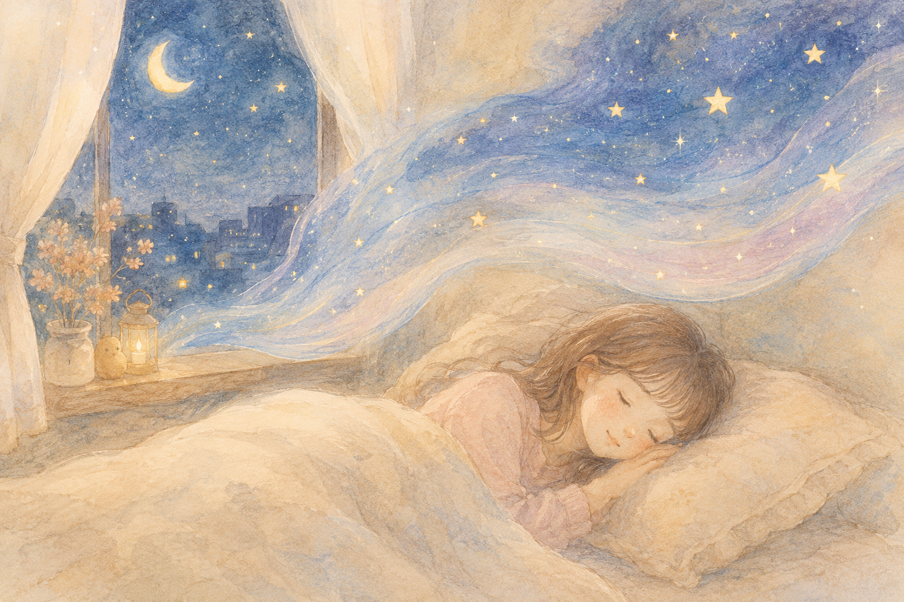
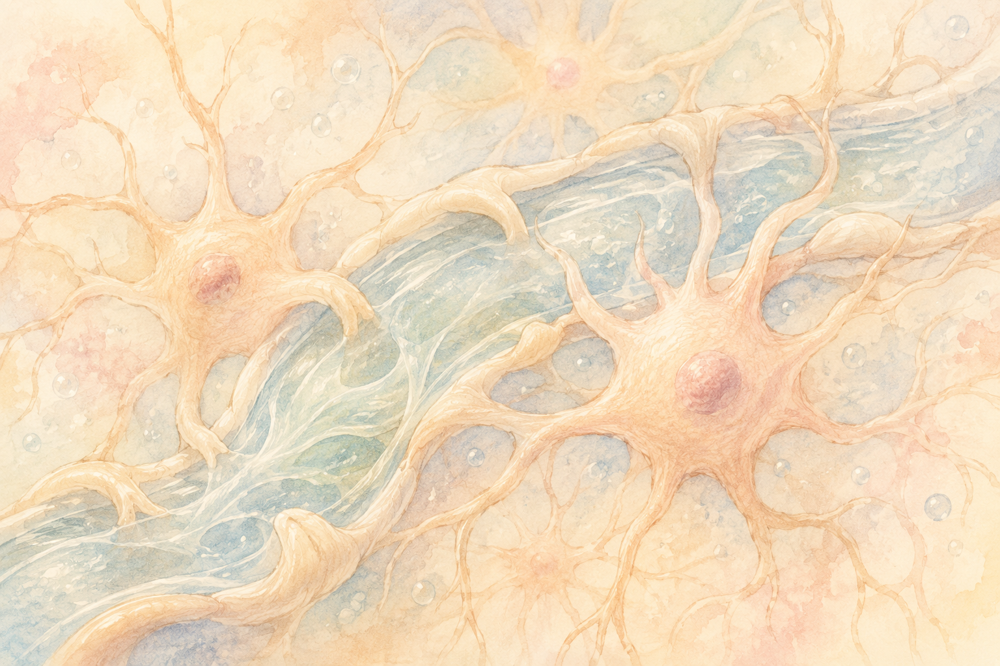
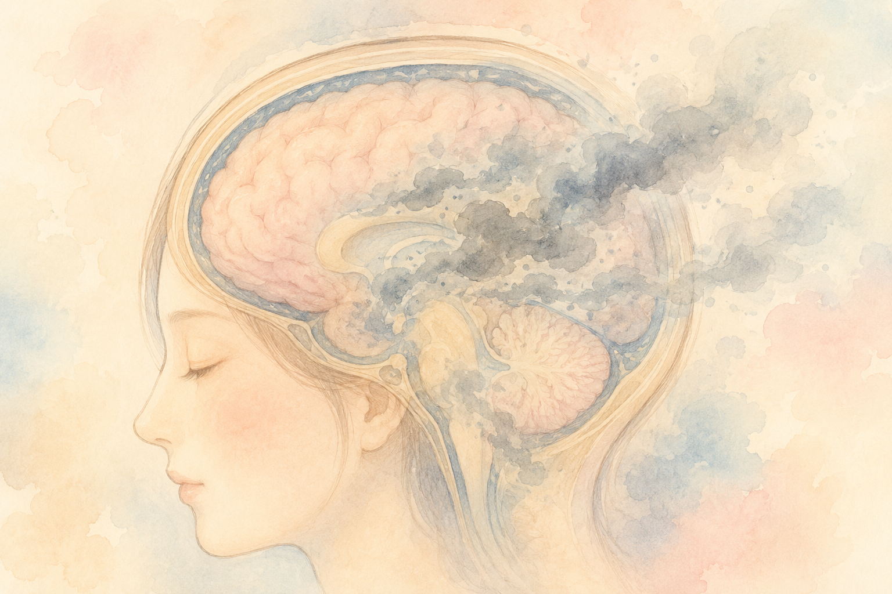

「最近、ぐっすり眠れていますか？」

夜中に何度も目が覚めたり、朝起きても疲れが残っていたり——。
そんな日が続くと、なんとなく頭がぼんやりして、集中力も落ちてきますよね。

でも、もし「睡眠」が、ただの休憩ではなく、**脳の中をきれいに掃除する大切な時間**だったとしたらどうでしょう？

実は、2012年に発見されたある仕組みによって、それが本当のことだと分かってきました。
今回はその仕組み——「グリンパティック・システム」をやさしくご紹介します。

> **この記事のポイント**
>
> ✅ 脳には、寝ている間に老廃物を流す独自の「掃除システム」があります
>
> ✅ そのカギを握るのは、脳脊髄液（のうせきずいえき）と、 　　星型の細胞「アストロサイト」です
>
> ✅ 睡眠不足は、認知症の原因物質の蓄積につながる可能性があります

## 目次

1. [そもそも「グリンパティック・システム」って？](#そもそもグリンパティック・システムって)
2. [寝ている間、脳の中で何が起きているの？](#寝ている間脳の中で何が起きているの)
3. [掃除がうまくいかないと、どうなる？](#掃除がうまくいかないとどうなる)
4. [どうやって守ればいいの？](#どうやって守ればいいの)
5. [まとめ](#まとめ)

## そもそも「グリンパティック・システム」って？

聞き慣れない言葉ですが、難しく考えなくて大丈夫です。
**脳の中を流れる水（脳脊髄液）が、老廃物を洗い流してくれる仕組み**——そう思っていただければ十分です。

私たちの体には「リンパ系」という、老廃物や余分な水分を集めて流す仕組みがあります。
ただ、脳の中にはリンパ管がほとんど通っていません。

ではどうやって脳の中の "ゴミ" を片付けているのか——。
それを2012年に解き明かしたのが、デンマークの神経科学者ネーデルガード博士のチームでした。
彼らは脳特有の "もう一つのリンパ系" として、この仕組みを**グリンパティック・システム**と名付けました。

「グリア（脳の支援細胞）＋リンパ」という意味の造語です。
脳の中にも、私たちが眠っている間にせっせと働く"掃除部隊"があったのです。

## 寝ている間、脳の中で何が起きているの？

このシステムの主役は、3人います。

**1. 脳脊髄液（のうせきずいえき）**——脳と背骨の中を流れる、無色透明の液体です。 
**2. アストロサイト**——脳の中で神経細胞を支える、星のような形をした細胞です。 
**3. 血管の "ゆっくりした拍動"**——心臓に合わせて広がったり縮んだりするポンプの動きです。

眠りに入ると、これらが連携して動き始めます。

### ① 細胞の "すき間" が広がる

ノンレム睡眠（深い眠り）に入ると、脳の中の興奮を高める物質（ノルアドレナリン）の量がぐっと下がります。
すると、脳の細胞が少し縮み、**細胞と細胞のすき間が約60%も広がる**ことが分かっています。

このすき間こそが、脳脊髄液の "通り道"。
広がった通り道を、液体が一気に流れやすくなるのです。

### ② 脳脊髄液が流れ込む

血管の周りには、ほんのわずかな空間（血管周囲腔）があります。
脳脊髄液は、ここを通って脳の奥深くまで入り込み、老廃物を集めて再び外へと運び出します。

このとき、アストロサイトの末端にある「アクアポリン4」という小さな水の通り道が、流れをスムーズにする大切な役割を果たします。

### ③ 老廃物が運び出される

最終的に集められた老廃物は、首のリンパ節へ送られ、体の外へと処理されていきます。
こうして、起きている間にたまった "脳のゴミ" が、一晩でしっかり片付けられているのです。

つまり、**眠っている時間は休んでいるのではなく、脳が "そうじタイム" を迎えている**といっても良いでしょう。

## 掃除がうまくいかないと、どうなる？

では、もしこの掃除システムがうまく働かなくなったら——。

研究では、**アルツハイマー型認知症の原因物質とされる「アミロイドβ（ベータ）」が脳にたまりやすくなる**ことが報告されています。

アミロイドβは、健康な人の脳でも毎日少しずつ生まれますが、本来はグリンパティック・システムによって夜の間に洗い流されます。
睡眠の質が悪かったり、深い眠りが不足したりすると、この "掃除" が追いつかず、少しずつ蓄積していくのです。

2025年に発表された大規模な研究では、**高血圧・喫煙・糖尿病といった生活習慣病が、血管の柔軟性を低下させ、グリンパティック・システムの働きを弱める**ことも明らかになりました。

つまり、「眠り」と「血管の健康」は、脳の "そうじ機能" を通して、思っていた以上に深くつながっていたのです。

> 認知症のしくみについては、こちらの記事もあわせてどうぞ。
> 👉 [認知機能はなぜ衰えるの？〜脳の中で起きている4つの変化〜](/posts/cognitive-decline-mechanism/)

## どうやって守ればいいの？

特別なお薬や高価なサプリは必要ありません。
グリンパティック・システムを守るために、今日から意識できることをまとめてみました。

- **眠る前のスマホ・パソコンは少し早めに切り上げる**
  深い眠り（ノンレム睡眠）への切り替えがスムーズになります。
- **寝室はやや涼しく、暗く、静かに**
  体温が少し下がることで、深い睡眠に入りやすくなります。
- **寝る直前のアルコール・夜のカフェインを控える**
  どちらも眠りの質を下げ、"掃除タイム" を邪魔します。
- **血圧・血糖値を定期的に確認する**
  血管の健康が、脳の掃除機能も支えています。
- **横向きで眠るとよい、という報告もあります**
  脳脊髄液の流れが、横向きの姿勢で最も活発になるという動物実験の結果が知られています。

これらは、どれも一晩でできることばかり。
「今日からひとつだけ」のつもりで取り入れてみてください。

※持病のある方や睡眠薬を使っている方は、必ずかかりつけの先生にご相談ください。

## まとめ

最後にもう一度、ポイントを整理しておきましょう。

- ✅ 脳には、寝ている間に老廃物を流す「グリンパティック・システム」という掃除の仕組みがあります

- ✅ ノンレム睡眠（深い眠り）の間に、脳の細胞のすき間が広がり、脳脊髄液が流れて老廃物を洗い流します

- ✅ 睡眠不足や血管の不調は、アミロイドβなど認知症と関わる物質の蓄積につながる可能性があります

- ✅ 良い眠りを守ることは、未来の脳を守ることにもつながります

夜は、心と体だけでなく、脳にとっても大切な "メンテナンス時間" です。
ぜひ今夜、いつもより少しだけ早く、ふとんに入ってみてくださいね。

次回は、**「眠っている間、脳は何をしているの？」**——記憶と感情の整理について、もう少し踏み込んでお話しします。お楽しみに。

---

### 🛍️ あわせておすすめのアイテム

{{< affiliate
    title="Xiaomi Smart Band 9 Pro"
    image="https://thumbnail.image.rakuten.co.jp/@0_mall/xiaomiofficial/cabinet/11215576/11215582/imgrc0104890177.jpg"
    amazon="https://af.moshimo.com/af/c/click?a_id=5534074&p_id=170&pc_id=185&pl_id=4062&url=https%3A%2F%2Fwww.amazon.co.jp%2Fdp%2FB0DK71CTCK"
    rakuten="https://af.moshimo.com/af/c/click?a_id=5533903&p_id=54&pc_id=54&pl_id=27059&url=https%3A%2F%2Fitem.rakuten.co.jp%2Fxiaomiofficial%2Fm53488%2F"
    description="脳の「お掃除タイム」（ノンレム睡眠）の長さは、自分の感覚だけではなかなかわかりません。手首に着けるだけで毎晩の睡眠を自動記録してくれるスマートバンドが、見える化の最初の一歩に。21日間のロングバッテリーで毎日の充電もほぼ不要です。" >}}

---

## 参考にした情報

- Iliff JJ, et al. "A paravascular pathway facilitates CSF flow through the brain parenchyma..." *Science Translational Medicine*, 2012.
- Nedergaard M, Goldman SA. "Glymphatic failure as a final common pathway to dementia." *Science*, 2020.
- "Vasomotion drives glymphatic clearance during sleep." *Nature Neuroscience*, 2025.
- 大規模脳画像研究（UK Biobank系コホート）による睡眠と脳構造の関連（2024–2025年報告）
