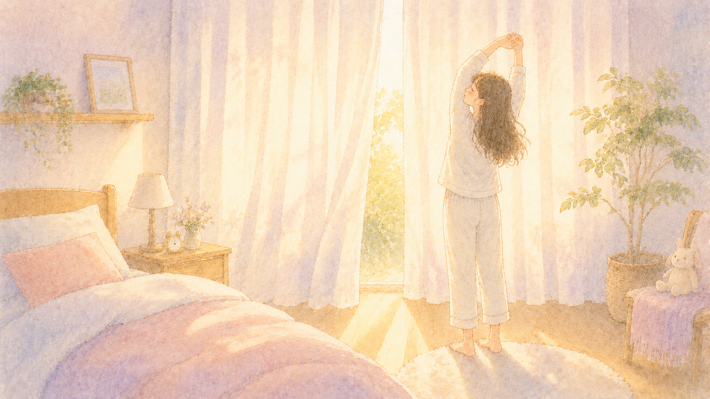
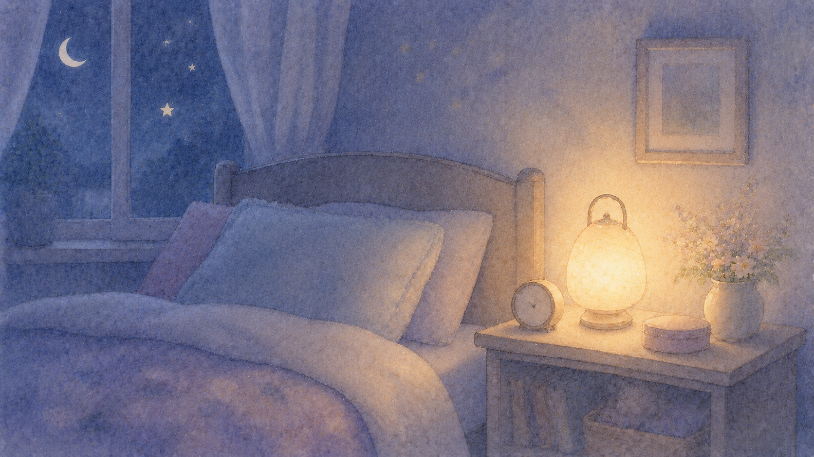

ここまで2回にわたって、睡眠と脳の関係を見てきました。

> 第1回：[ぐっすり眠ると、脳が掃除される？〜眠りと脳のふしぎな関係〜](/posts/brain-sleep-glymphatic/) 
> 第2回： 
> [眠っている間、脳は何をしているの？〜記憶と感情の整理整頓〜](/posts/brain-sleep-memory/)

「脳って、寝ている間にこんなに頑張ってくれているんだ」と、少しだけ眠る時間が愛おしくなった方もいらっしゃるかもしれません。

最終回の今回は、その大切な時間を**もっと味方につけるための、実践のお話**です。
むずかしい道具やお金は一切いりません。今夜から始められるものばかりです。

> **この記事のポイント**
>
> ✅ 「何時間寝るか」と「いつ寝るか」が、脳の修復力を大きく左右します
>
> ✅ お酒・カフェイン・スマホは、知らずに眠りの質を下げています
>
> ✅ 血圧・血糖値の管理は、脳の "そうじ機能" を守ることにつながります

## 目次

1. [まずは「7〜9時間ルール」](#まずは79時間ルール)
2. [寝る時間・起きる時間を一定に](#寝る時間起きる時間を一定に)
3. [お酒とカフェインの落とし穴](#お酒とカフェインの落とし穴)
4. [寝室の "三拍子"——涼しく・暗く・静かに](#寝室の-三拍子涼しく暗く静かに)
5. [血管の健康が、脳の眠りを守る](#血管の健康が脳の眠りを守る)
6. [まとめ](#まとめ)

## まずは「7〜9時間ルール」

研究の世界では、**成人の理想的な睡眠時間はおおむね7〜9時間**とされています。
この範囲を外れた場合、脳の老化の指標である「白質高信号（はくしつこうしんごう）」が増えやすいことが、4万人規模の脳画像研究で示されました。

「6時間で十分だ」と長く感じていた方も、**1日30分早く布団に入る**ことから始めてみませんか。
特に**朝方のレム睡眠**は、感情を整える大切な時間です。
睡眠時間を削ると、ここがいちばん最初に失われてしまいます。

「忙しい日ほど早く寝る」——これが、本当の意味での "脳の節約術" かもしれません。

## 寝る時間・起きる時間を一定に

「休みの日くらいは、ゆっくり寝かせて」——わかります。
でも、毎日の就寝・起床時刻が2時間以上ずれると、**体内時計が混乱**して、深い眠りに入りづらくなることが分かっています。

特に**起床時刻のばらつき**は、体内時計の調整に大きく影響します。
休日も、平日との差は1時間以内におさえると、脳のリズムが整いやすくなります。

朝、起きたら**カーテンを開けて自然光を浴びる**だけでも、体内時計のスイッチが入ります。
散歩や朝ごはんもセットにできれば、なお良し。

「寝つきが悪い」とお困りの方も、まずは**朝の光**から見直してみてください。
夜の眠りは、朝の習慣に支えられています。

## お酒とカフェインの落とし穴

「寝つきが悪いから、寝る前にちょっとだけ」——
お酒のお話、耳が痛い方もいらっしゃるかもしれません。

実は**アルコールは、レム睡眠を強く抑え込みます**。
たしかに寝つきは良くなったように感じますが、**感情の整理を担う"一晩のセラピー"の時間が削られてしまう**のです。
ストレスを感じた日ほど、寝酒は逆効果になりやすいことが知られています。

カフェインも要注意です。コーヒー、紅茶、緑茶、エナジードリンク——
**午後3時以降の摂取は、その夜の眠りに影響が出る**可能性があります。
カフェインは体内に半日ほど残ることもあるので、夕方以降は**ノンカフェイン**のお飲み物に切り替えてみてください。

> 寝酒がなぜよくないのか、もう少し詳しいお話は前回の記事でも触れています。
> 👉 [眠っている間、脳は何をしているの？〜記憶と感情の整理整頓〜](/posts/brain-sleep-memory/)

## 寝室の "三拍子"——涼しく・暗く・静かに

ぐっすり眠るためには、寝室の環境がかなり大事です。
ポイントは3つ。

**1. やや涼しく**——深い睡眠に入るとき、体は中心の温度をすこし下げる必要があります。室温は18〜22℃を目安に。 
**2. 暗く**——わずかな光でも、深い眠りを妨げると言われています。豆電球は消すか、なるべく暗いものに。 
**3. 静かに**——耳栓やホワイトノイズで、突発的な音をやわらげるのも有効です。

そしてもうひとつ、**寝る30分前のスマホ・テレビ・パソコン**。
これらの強い光と情報量は、脳を「まだ起きていてね」と勘違いさせてしまいます。
代わりに、**読書・ストレッチ・温かい飲み物**など、ゆったりした習慣を取り入れてみてください。

「眠る準備」を整える時間そのものが、脳のスイッチを少しずつオフにしてくれます。

## 血管の健康が、脳の眠りを守る

第1回でお話ししたグリンパティック・システム（脳の掃除機能）は、**血管のしなやかさ**に支えられています。
動脈がやさしく拍動することで、脳脊髄液が押し出され、老廃物が流れていく仕組みでしたね。

ところが、**高血圧・糖尿病・喫煙**などが続くと、この血管の柔軟性が少しずつ失われていきます。
すると、せっかく眠っていても、脳の "そうじ" が十分に進まなくなってしまうのです。

つまり——

- **血圧を測る習慣**（朝・夜のセルフチェック）
- **食後にちょこっと歩く**
- **検診で血糖値を確認**
- **禁煙を続ける**

これらはすべて、**血管を通して "脳の眠りの質" を底上げする行動**でもあるのです。

「健康診断で言われたけど、まだいいかな」と先延ばしにしていることがあれば、これを機にひとつだけ着手してみてくださいね。

## まとめ

最後にもう一度、ポイントを整理しておきましょう。

- ✅ 7〜9時間の睡眠を目安に、足りない方はまず30分早めに布団に入る

- ✅ 寝る・起きる時刻を一定にする（休日も差は1時間以内）

- ✅ 寝る前のアルコール、午後のカフェインは控えめに

- ✅ 寝室は「涼しく・暗く・静かに」、寝る30分前のスマホはお休み

- ✅ 血圧・血糖値・禁煙の積み重ねが、脳のそうじ機能も守ってくれる

睡眠は、特別なお金や道具がなくても**今夜から手をつけられる、いちばん身近な健康習慣**です。
完璧を目指さず、ひとつ・ふたつから——。
あなたの脳は、いつでも応えてくれます。

3回にわたるシリーズ、ここまでお読みいただきありがとうございました。
今夜、ふとんに入る前に、深呼吸をひとつ。
ゆっくり、おやすみなさい。

## 参考にした情報

- Hirshkowitz M, et al. "National Sleep Foundation's sleep time duration recommendations." *Sleep Health*, 2015.
- Walker MP. *Why We Sleep*（邦訳『睡眠こそ最強の解決策である』）, 2017.
- "Sleep duration and brain structure: UK Biobank analysis." *Nature Communications*, 2024–2025.
- 大規模脳画像研究による睡眠時間と白質高信号の関連（2024–2025年報告）
