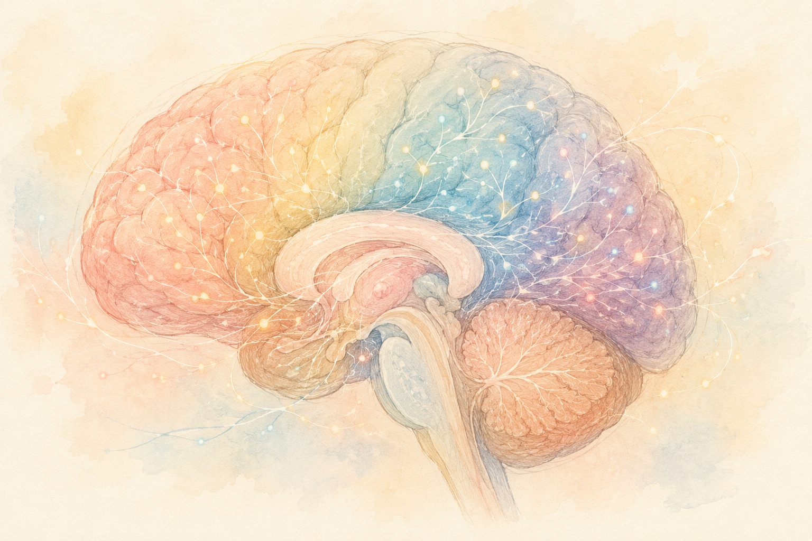

「脳トレって、本当に意味があるの？」――  
そう感じたことは、ありませんか？

ドリルやパズルをやってはみるものの、「これで本当に認知症が防げるのかな…」と、半信半疑の方も多いと思います。

ところが最近、その問いに **20年がかりで答えを出した研究** が話題になりました。

> **「ある脳トレを数週間受けただけで、認知症になるリスクが下がり、その効果が最長20年続いた可能性がある」**

今回は、その内容をできるだけやさしくお伝えします。

> ✅ 「情報を素早く処理する力」を鍛える脳トレを受けた人は、**10年後の認知症リスクが約29%低かった**
>
> ✅ その効果は **最長20年** 続いた可能性。途中で「追加レッスン」を受けた人ほど、効果が大きかった
>
> ✅ 特別な道具はいりません。大事なのは「素早く見て・気づく」練習を **続けること**

---

## 目次

1. [どんな脳トレだったの？](#どんな脳トレだったの)
2. [2,800人を20年追いかけた研究](#2800人を20年追いかけた研究)
3. [カギは「追加レッスン」](#カギは追加レッスン)
4. [おうちでできること](#おうちでできること)
5. [おわりに](#おわりに)

---

## どんな脳トレだったの？

今回の主役は、**「情報処理スピードのトレーニング」**（処理速度＝見たものを素早く理解し、判断する力）と呼ばれる脳トレです。

やることはシンプルで、画面にパッと出てくる絵や記号を **素早く見つけて答える** というもの。慣れてくると、表示時間がどんどん短くなり、まわりにじゃまな情報があっても、目的のものを素早く見分けられるようになっていきます。

車の運転で「歩行者や標識にパッと気づく」あの感覚に近い力、とイメージするとわかりやすいかもしれません。

---

## 2,800人を20年追いかけた研究

この研究は、アメリカで行われた **「ACTIVE研究」** という、とても大きな調査がもとになっています。

- 対象：65歳以上の **健康な高齢者 2,802人**
- 開始：**1998年ごろ** から、20年以上の追跡
- 体制：アメリカ国立衛生研究所（NIH）が支援

参加者を、いくつかの脳トレを受けるグループと、何もしないグループに分けて比べたところ――

> **情報処理スピードの脳トレを受けた人は、10年後に認知症と診断されるリスクが約29%低かった**

そして2026年2月、医学誌『Alzheimer's & Dementia』に発表された最新の解析では、その効果が **最長20年** にわたってみられた可能性が報告されました。

---

## カギは「追加レッスン」

ひとつ大事なポイントがあります。それは、**一度きりで終わらせないこと**。

最初の5〜6週間のトレーニングのあと、1〜3年後に **「追加レッスン」（ブースター）** を受けた人ほど、認知症リスクがより下がっていました。レッスンを1回受けるごとに、リスクがさらに少しずつ下がっていく傾向もみられたそうです。

運動と同じで、脳トレも **「ときどき思い出して、また続ける」** ことが効いてくる、というわけですね。

---

## おうちでできること

研究で使われたのは専用のパソコンプログラムですが、その「素早く見て・気づく」エッセンスは、毎日の暮らしの中にも取り入れられます。

> ✅ **トランプの神経衰弱や間違い探し** で、「素早く見つける」練習を
>
> ✅ **会話・カラオケ・囲碁将棋** など、人と関わりながら頭を使う遊びを
>
> ✅ そして何より、**ウォーキングなど体を動かす習慣** を。体を動かすことは、最強の「脳トレ」でもあります
>
> ✅ 大切なのは「完璧」より **「ときどきでも、続けること」**

> あわせて読みたい記事もどうぞ。  
> 👉 [1日5,000〜7,500歩で、アルツハイマー病の進行が遅くなる？](/posts/walking-7500-steps/)

---

## おわりに

「脳トレに意味はあるの？」という長年の問いに、20年がかりの研究が **「やり方しだいで、確かに意味がありそう」** という、ひとつの希望を見せてくれました。

ただし、これは「これさえやれば絶対に認知症にならない」という魔法ではありません。運動・食事・睡眠・人とのつながり――そうした土台の上に、脳トレも **そっと一枚加える** くらいの気持ちで、気軽に続けていけたらいいですね。

---

### 📚 あわせて読みたい本

{{< affiliate
    title="大人の間違い探し脳ドリル（川島隆太教授 監修）"
    image="https://m.media-amazon.com/images/P/4866514493.09.LZZZZZZZ.jpg"
    amazon="https://af.moshimo.com/af/c/click?a_id=5534074&p_id=170&pc_id=185&pl_id=4062&url=https%3A%2F%2Fwww.amazon.co.jp%2Fdp%2F4866514493"
    rakuten="https://af.moshimo.com/af/c/click?a_id=5533903&p_id=54&pc_id=54&pl_id=27059&url=https%3A%2F%2Fitem.rakuten.co.jp%2Fbookfan%2Fbk-4866514493%2F"
    description="記事で紹介した「素早く見つける」練習を、おうちでゲーム感覚で続けられる一冊。脳トレ研究の第一人者・川島隆太教授（東北大学）監修の間違い探しドリルです。名画や世界遺産の絵を見ながら、楽しく注意力・記憶力を働かせられます。" >}}

{{< affiliate
    title="運動脳（新版）"
    image="https://thumbnail.image.rakuten.co.jp/@0_mall/bookfan/cabinet/01021/bk4763140140.jpg?_ex=400x400"
    amazon="https://af.moshimo.com/af/c/click?a_id=5534074&p_id=170&pc_id=185&pl_id=4062&url=https%3A%2F%2Fwww.amazon.co.jp%2Fdp%2FB0GVBCKJDW"
    rakuten="https://af.moshimo.com/af/c/click?a_id=5533903&p_id=54&pc_id=54&pl_id=27059&url=https%3A%2F%2Fitem.rakuten.co.jp%2Fbookfan%2Fbk-4763140140%2F"
    description="「素早く考える脳」を育てる最大のカギは、実は運動だった――。スウェーデンの精神科医が、運動と脳の関係をやさしく解説した世界的ベストセラー。今回の脳トレの話と、ぜひあわせて読みたい一冊です。" >}}

---

### 参考にした情報

- ACTIVE研究（情報処理速度トレーニングと認知症リスク）に関する報告
- 医学誌『Alzheimer's & Dementia: Translational Research & Clinical Interventions』2026年2月発表の解析
- 米国ジョンズ・ホプキンス大学などによる研究紹介

※ 本記事は、上記の信頼できる研究・大学発表をもとに、一般読者向けにわかりやすくまとめ直したものです。脳トレの効果には個人差があり、認知症の発症を完全に防ぐものではありません。気になる症状がある場合は、かかりつけ医にご相談ください。

