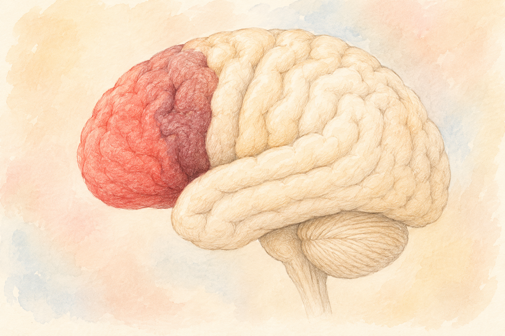
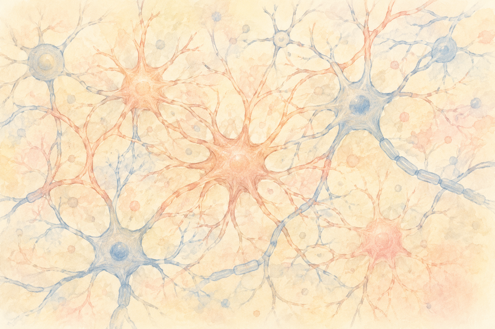

「最近、人の名前がスッと出てこない」  
「やることを順序立てて進めるのが、前より大変になってきた」――  
そんな小さな引っかかりを感じたことはありませんか？

そもそも私たちの「**認知機能**」とは、いったいどんな能力で、脳のどこが担っているのでしょうか。  
これを知っておくと、年を重ねたときに**何が起きているのか**、**どこを大切に守ればいいのか**が、ぐっと見通せるようになります。

今日は、認知機能の話の **いちばんはじめ**――脳のしくみのお話を、できるだけやさしくまとめてみます。

 

> ✅ 認知機能は、記憶・注意・判断など**いくつもの能力の集まり**。それぞれ脳の違う場所が担っています
>
> ✅ 脳は **単独の部屋** ではなく、**チームプレー（ネットワーク）** で働いています
>
> ✅ 「**衰える場所**」を知れば、「**守るべき場所**」が見えてきます

---

## 目次

1. [そもそも「認知機能」とは？](#そもそも認知機能とは)
2. [脳の主役①　前頭前皮質 〜段取りと判断の司令塔〜](#脳の主役-前頭前皮質-段取りと判断の司令塔)
3. [脳の主役②　海馬 〜記憶の入り口〜](#脳の主役-海馬-記憶の入り口)
4. [注意のスイッチを切り替える「サリエンスネットワーク」](#注意のスイッチを切り替えるサリエンスネットワーク)
5. [脳は「ネットワーク」で動いている](#脳はネットワークで動いている)
6. [最新の話題：脳をささえる「もう一つの細胞」アストロサイト](#最新の話題脳をささえるもう一つの細胞アストロサイト)
7. [まとめ](#まとめ)
8. [おわりに](#おわりに)

---

## そもそも「認知機能」とは？

「認知機能」と聞くと、なんとなく **記憶力** のことだけを思い浮かべる方が多いかもしれません。  
でも実は、認知機能はもっと幅広い能力の集まりです。

代表的なものを並べてみると――

- **記憶**：新しいことを覚える／思い出す
- **注意**：必要な情報に目を向ける／よそ見をしない
- **実行機能**：段取りを立てる・判断する・優先順位をつける
- **言語**：話す・聞く・読む・書く
- **視空間認知**：地図を読む／物の位置を把握する

これらが組み合わさってはじめて、私たちは買い物に行ったり、料理を作ったり、人と会話したりできるわけです。

つまり「認知機能の低下」と一口に言っても、**どの能力が、どのくらい衰えているか**で見え方はずいぶん違ってきます。

---

## 脳の主役①　前頭前皮質 〜段取りと判断の司令塔〜

おでこのすぐ裏側にあるのが **前頭前皮質（ぜんとうぜんひしつ）** と呼ばれる場所です。  
ここは、人間の脳の中でいちばん「人間らしさ」を支えている部分とも言われています。

担っているのは――

- **計画を立てる**（旅行の段取り、料理の手順）
- **判断する**（信号を渡るタイミング、買うかどうかの決断）
- **ワーキングメモリ**（一時的に情報を頭の中に置いておく能力）
- **がまんする**（衝動を抑える）

なかでも前頭前皮質の「外側」にある **背外側前頭前皮質（はいがいそく ぜんとうぜん ひしつ）** という部分は、**注意を維持して、頭の中の情報を操作する**ときに大活躍します。

> たとえば「電話番号を聞いて、それをメモするまでの数秒覚えておく」――こんなとき、ここがフル回転しています。

加齢やストレスでこの場所が弱ると、「**段取りが苦手になる**」「**気が散りやすくなる**」といった変化が出やすくなります。

---

## 脳の主役②　海馬 〜記憶の入り口〜

耳のすぐ内側、脳の奥のほうに **海馬（かいば）** と呼ばれる、タツノオトシゴのような形をした小さな器官があります。  
名前は知らなくても、「認知症で最初に縮みやすい場所」として聞いたことがあるかもしれません。

海馬の役割は、ひとことで言えば **「記憶の入り口」**。

- 新しい出来事や情報をいったん **預かる**
- それを **整理** して、ゆっくり大脳のほかの場所に **保存** していく

おもしろいのは、海馬と大脳がペアで働く点です。  
**寝ているあいだ**に、海馬は日中の体験を大脳に渡し、必要なものだけを長期記憶として焼きつけているのです。

> だから「**寝不足の翌日、昨日のことが思い出しにくい**」という体験には、ちゃんと理由があります。

海馬は、加齢・ストレス・睡眠不足の影響をとても受けやすい場所です。**だから守りがいがある場所**でもあります。

---

## 注意のスイッチを切り替える「サリエンスネットワーク」

ちょっと聞きなれない言葉ですが、**サリエンスネットワーク** という大事な仕組みのお話を少しだけ。

「サリエンス」とは「**目立つもの・大事なもの**」という意味です。  
脳の中で、**前部島皮質（ぜんぶ とうひしつ）** と **前帯状皮質（ぜんたいじょう ひしつ）** という2か所がチームになって、こんな仕事をしています。

- 周りに起きていることの中から、**いま注目すべき情報**を選び出す
- 「ぼんやりモード」から「集中モード」へ、**注意のスイッチを切り替える**
- 体の内側からの信号（疲れた・お腹がすいた・不安だ）にも目を向ける

たとえば、本を読んでいるときに電話が鳴ったら、パッと顔を上げて受話器を取りますよね。  
この **「いま、こっちが大事だよ」を瞬時に判断する** のが、サリエンスネットワークの仕事です。

ここがうまく働かないと、

- **必要な情報に注意を向けられない**
- **作業の切り替えが遅くなる**
- **無関係なことに気が散りやすくなる**

といった困りごとが出てきます。

---

## 脳は「ネットワーク」で動いている

ここまで「前頭前皮質」「海馬」「サリエンスネットワーク」と紹介してきましたが、ぜひ覚えていただきたいことがあります。

それは、**脳は1か所ずつ別々に働いているわけではない**、ということです。

最近の脳科学では、脳の働きを **3つの大きなネットワーク** で説明することが多くなっています（「**トリプルネットワーク・モデル**」と呼ばれます）。

- **デフォルトモードネットワーク（DMN）**  
  　ぼんやりしているとき、過去や未来に思いを巡らせているときに働く
- **実行制御ネットワーク（CEN）**  
  　仕事や計算、作業に集中しているときに働く
- **サリエンスネットワーク（SN）**  
  　この2つの間で **「いまはこっち」とスイッチを切り替える**

健康な脳は、この3つを**しなやかに切り替えながら**動いています。  
ところが加齢や病気で切り替えが鈍ると、**ぼんやりからスッと集中モードに入れない**、**気が散りやすい**、といった変化が現れてきます。

> 脳は「固定の機械」ではなく、**そのときの状況に合わせて編成が変わるオーケストラ**――そんなイメージで捉えるのが、いちばん近いかもしれません。

---

## 最新の話題：脳をささえる「もう一つの細胞」アストロサイト

ここで、ぜひご紹介したい **最新の話題** があります。

これまで脳科学では、**神経細胞（ニューロン）** が主役で、ほかの細胞は脇役と考えられてきました。  
ところが近年、**アストロサイト**（**星状細胞・せいじょう さいぼう** とも呼ばれます）が、神経細胞とは別の独自の通信ネットワークを築いていることが分かってきたのです。

アストロサイトは、

- 神経細胞に **栄養とエネルギーを届ける**
- 遠くの脳の領域とも信号をやりとりして、**脳全体の調子を整える**

といった重要な仕事をしているらしい――そんな研究が、ここ数年で次々に発表されています。

まだまだ研究の途中ではありますが、**「脳には、神経細胞だけでは説明できないもう一つの仕組みがある」** という発見は、認知症や精神疾患の予防・治療を考えるうえで、これからますます大事になっていきそうです。

> 何十年も前の常識が、いまもアップデートされ続けている――  
> それが脳科学の面白いところでもあります。

---

## まとめ

第1回はここまで。少し情報量が多かったかもしれませんね。  
最後に、**今日のおさらい** をチェックリストにしてまとめます。

- ✅ 認知機能は **記憶・注意・実行機能・言語・視空間** などの集まり
- ✅ **前頭前皮質**は「段取り・判断」を、**海馬**は「記憶の入り口」を担当
- ✅ **サリエンスネットワーク**が「**注意のスイッチ**」を切り替えている
- ✅ 脳は **ネットワーク（チームプレー）** で動いている
- ✅ 神経細胞だけでなく、**アストロサイト**という細胞もいま注目されている

> このシリーズは全3回でお届けします。  
> 次回は「**認知機能はなぜ衰えるのか？体の中で起こっていること**」をテーマに、加齢や生活習慣で脳がどう変わっていくのかを掘り下げます。

---

### 📚 あわせて読みたい一冊



---

## おわりに

「認知機能が衰える」と聞くと、なんとなく不安になりますよね。  
でも、**どこが・どんなふうに働いているか**を知っておくと、**「ここを守りたい」「ここを鍛えたい」** という具体的な道すじが見えてきます。

脳は、**何歳になっても変化し続ける器官** です。  
これは脅しではなく、**新しい回路を作る力（神経可塑性・しんけい かそせい）** は年をとってもちゃんと残っている、という意味でもあります。

次回は、その脳が **どのように衰えていくのか** ――そのメカニズムをご一緒に見ていきましょう。

---

### 参考にした情報

- Posner, M. I. ら 「注意ネットワークモデル」関連の脳科学レビュー
- トリプルネットワーク・モデル（Default Mode/Central Executive/Salience Network）に関する神経科学レビュー
- 厚生労働省「e-ヘルスネット」認知機能関連項目
- 日本神経科学学会・日本認知症学会の公開資料

※ 本記事は、上記の医療・神経科学の知見をもとに、一般読者向けにわかりやすくまとめ直したものです。気になる症状がある方は、自己判断せず、必ずかかりつけ医や専門医にご相談ください。

