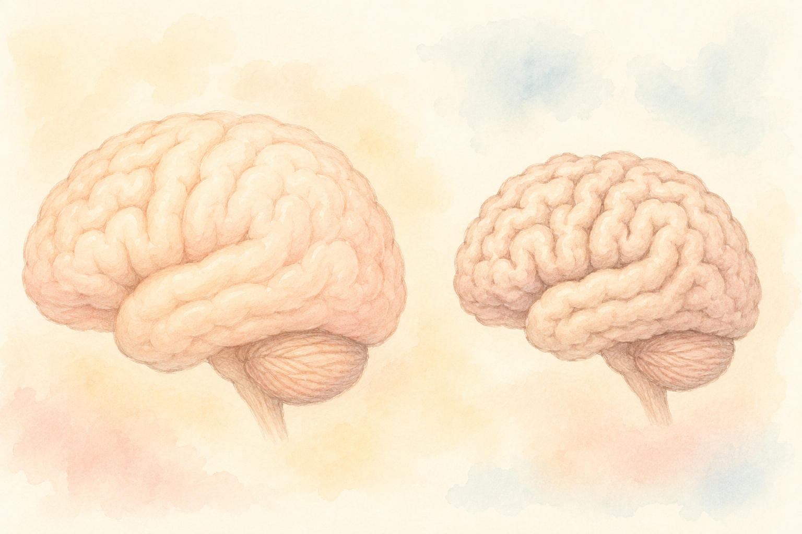
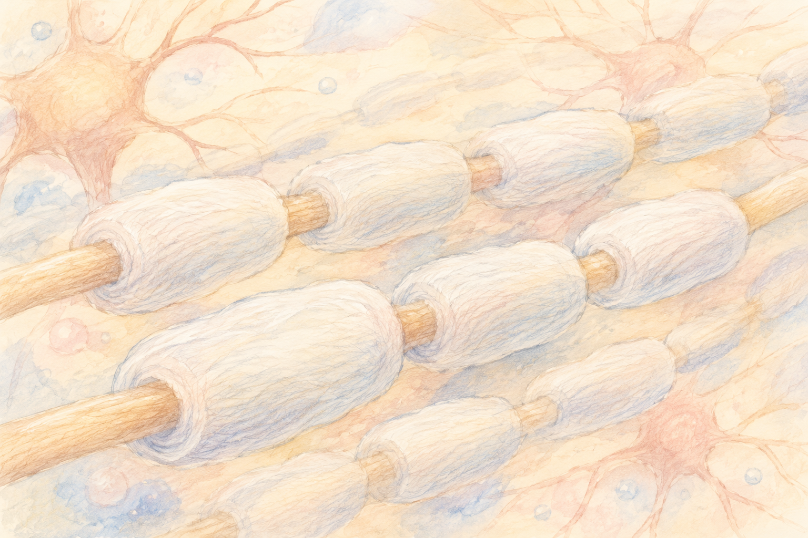

「同じ話を何度かしてしまう」  
「テレビのリモコンを置いた場所を、つい忘れてしまう」――

そんな小さな変化に気づくたび、**「これは年のせい？」「それとも何かのサイン？」** と心配になることはありませんか？

[前回の記事](/posts/cognitive-decline-brain-anatomy/)では、認知機能を支える脳の主役たち（前頭前皮質・海馬・サリエンスネットワーク）をご紹介しました。  
今回はその続きとして、**「では、それらが、どんなふうに衰えていくのか？」** をテーマにお話しします。

仕組みを知っておくと、「むやみに怖がること」も「逆に油断すること」も、少なくなります。

 

> ✅ 脳は加齢で **少しずつ縮みます**。でも、衰え方には**個人差**があります
>
> ✅ ポイントは **脳の萎縮・ミエリンの劣化・ネットワークの不調・ストレスや生活習慣** の4つ
>
> ✅ 認知症は「ある日突然」ではなく、**何年もかけて少しずつ**進んでいきます

---

## 目次

1. [そもそも脳は何歳まで成長するの？](#そもそも脳は何歳まで成長するの)
2. [脳の萎縮 〜灰白質がやせていく〜](#脳の萎縮-灰白質がやせていく)
3. [ミエリンの劣化 〜情報の通り道が傷んでくる〜](#ミエリンの劣化-情報の通り道が傷んでくる)
4. [ネットワークの不調 〜切り替えが鈍くなる〜](#ネットワークの不調-切り替えが鈍くなる)
5. [ストレスと生活習慣 〜脳をすり減らす要因〜](#ストレスと生活習慣-脳をすり減らす要因)
6. [認知症のタイプによってメカニズムも違う](#認知症のタイプによってメカニズムも違う)
7. [まとめ](#まとめ)
8. [おわりに](#おわりに)

---

## そもそも脳は何歳まで成長するの？

意外に思われるかもしれませんが、**脳は20代の前半くらいまで「育っている途中」** です。

特に、脳の中の電線にあたる「**ミエリン**」（神経の通り道を保護する膜）は、**20代半ばでようやく完成**するといわれています。

つまり――

- **0〜25歳ごろ**：脳がぐんぐん育つ時期
- **30〜50代**：成熟していて、もっとも安定している時期
- **60代以降**：少しずつ機能が変化していく時期

「もう年だから」と思いがちですが、**60〜70代で新しいことを学んでも、ちゃんと脳の中で回路ができる**ことが分かってきています。  
これを **神経可塑性（しんけい かそせい）** と呼びます。

衰えの話の前に、ぜひこの **「脳は変わり続ける」** という事実を、いちばんはじめに知っておいてください。

---

## 脳の萎縮 〜灰白質がやせていく〜

脳の表面は、**灰白質（かいはくしつ）** と呼ばれる神経細胞の集まりでできています。

年を重ねると、この灰白質が **少しずつ薄く・小さく** なっていきます。これが **脳の萎縮（いしゅく）** と呼ばれる変化です。

### 萎縮しやすい場所

特に縮みやすいのが、前回ご紹介した2か所――

- **前頭前皮質**：段取り・判断を担う場所
- **海馬**：記憶の入り口

だからこそ、年を重ねると、

- 「**段取りを立てるのが面倒**」になったり
- 「**新しいことが頭に入りにくい**」と感じたり

する変化が出てきます。

### でも、これは「普通の老化」

ここで大事なのは、**年相応の萎縮は誰にでも起きる**ということ。

健康な脳でも、毎年わずかずつ縮みます。  
それでも何ら困ることなく暮らせている方が大勢いらっしゃいます。

> **「萎縮＝認知症」ではありません**。  
> 萎縮があっても、認知機能が保たれている方はたくさんいます。

ただし、**急にものが分からなくなる・道に迷う**といった変化が短期間で進む場合は、**普通の老化を超えた変化**かもしれません。早めに専門医に相談しましょう。

---

## ミエリンの劣化 〜情報の通り道が傷んでくる〜

先ほどご紹介した **ミエリン**。これは、神経の電線を覆っている「**白い保護膜**」のようなものです。

電気の信号を **速く・正確に** 伝えるために、なくてはならないパーツです。

ところが、

- 加齢
- 慢性的なストレス
- 血管の病気（高血圧、糖尿病）

などで、このミエリンが **少しずつ薄くなったり、はがれたり** することが分かっています。

### ミエリンが傷むと…

- **情報処理が遅くなる**（パッと反応できない）
- **会話のスピードについていきにくい**
- **複数のことを同時にするのが大変になる**

「**最近、頭の回転が遅くなった気がする**」――  
そんな感覚の正体は、もしかするとミエリンの劣化かもしれません。

> 良いお知らせは、**ミエリンも作り直すことができる**ということ。  
> 有酸素運動と良い睡眠が、その材料を供給してくれます。

---

## ネットワークの不調 〜切り替えが鈍くなる〜

[前回の記事](/posts/cognitive-decline-brain-anatomy/)でご紹介した、脳の3つの大きなネットワーク――

- **デフォルトモードネットワーク（DMN）**：ぼんやりモード
- **実行制御ネットワーク（CEN）**：集中モード
- **サリエンスネットワーク（SN）**：その2つを切り替えるスイッチ

健康な脳は、この3つを **しなやかに切り替えながら** 動いています。

ところが、加齢や病気の影響でスイッチ役の **サリエンスネットワーク** がうまく働かなくなると、

- ぼんやりモードから **すっと集中モードに入れない**
- 集中していても、すぐ **他のことに気を取られてしまう**
- 「**頭の中の整理整頓**」が苦手になる

といった変化が現れてきます。

### 「Wの字」のような経過

おもしろいことに、近年の研究では、**認知症の脳のエネルギー使い方は「Wの字」のような波**を描くことが分かってきました。

- 一時的に **がんばってエネルギー効率を高める**（補おうとする）
- やがて限界がきて、**一気に低下する**
- また少し補おうとして、また落ちる

つまり脳は、**最後の最後まで「踏ん張っている」** のです。  
「なんとなく忘れっぽいけど、ちゃんと会話はできている」――そういう時期に、実は脳の中ではこんな攻防が起きています。

---

## ストレスと生活習慣 〜脳をすり減らす要因〜

意外と知られていないのですが、**強いストレス** は、脳の前頭前皮質――特に **背外側前頭前皮質（dlPFC）** の働きを **直接弱める** ことが分かっています。

### ストレスが続くと…

- 「**ワーキングメモリ**」が落ちる（一時的な記憶の保持が苦手に）
- 「**冷静な判断**」がしづらくなる
- 「**気持ちのコントロール**」が難しくなる

仕事が忙しい時期や、介護や看病で疲れている時期に「もの忘れが増えた気がする」のは、実はとても理にかなった話なのです。

### お酒との付き合い方

もう一つ気をつけたいのが **アルコール**。

少量のお酒なら必ずしも悪者ではないとの報告もありますが、**慢性的に多く飲むこと** は、

- 前頭前皮質の神経細胞を **少しずつ失わせる**
- 海馬の働きを **弱める**

ことが分かっています。

> 1日に純アルコールで20g程度（日本酒1合、ビール中瓶1本くらい）を目安に、**休肝日も大切に**。

その他、**高血圧・糖尿病・高LDLコレステロール・難聴・孤独・睡眠不足** なども、脳に少しずつダメージを蓄積させていきます。

---

## 認知症のタイプによってメカニズムも違う

「認知症」と一口に言っても、実は**いくつかのタイプ**があり、原因も少しずつ違います。

- **アルツハイマー型**：**アミロイドβ（ベータ）** や **タウ** という異常なたんぱく質が、脳に少しずつ溜まる
- **血管性認知症**：脳の血管が傷み、その先の脳細胞がダメージを受ける
- **レビー小体型**：**レビー小体** という異常なたんぱく質が、脳に蓄積する
- **前頭側頭型**：前頭葉や側頭葉が選択的に萎縮する

詳しくは、**[認知症の種類とMCI](/posts/dementia-types-mci/)** の記事もあわせてどうぞ。

> 大事なのは、**タイプによって対応や予防のポイントが少しずつ違う**ということ。  
> 「うちの家系は認知症だから」とひとくくりに不安になる必要はありません。

---

## まとめ

第2回はここまで。最後に、**今日のおさらい** を整理しておきます。

- ✅ 脳の **萎縮** は誰にでも起きる自然な変化（焦らない）
- ✅ **ミエリン** は作り直せる（運動と睡眠で守れる）
- ✅ **ネットワークの切り替え** が鈍ると「頭の回転が遅い」と感じる
- ✅ **ストレス・飲酒・血管の病気** は、脳をすり減らす要因
- ✅ **認知症のタイプ** によってメカニズムは違う
- ✅ 大事なのは「**衰えにくくする生活**」を続けること

> このシリーズの最終回は、**「では、どうやって守るのか？」**――今日からできる予防の全体像をまとめます。

---

### 📚 あわせて読みたい本

{{< affiliate
    title="川島隆太教授のらくらく脳ドリル60日"
    image="https://thumbnail.image.rakuten.co.jp/@0_mall/bookfan/cabinet/01002/bk4058017902.jpg"
    amazon="https://af.moshimo.com/af/c/click?a_id=5534074&p_id=170&pc_id=185&pl_id=4062&url=https%3A%2F%2Fwww.amazon.co.jp%2Fdp%2F4058017902"
    rakuten="https://af.moshimo.com/af/c/click?a_id=5533903&p_id=54&pc_id=54&pl_id=27059&url=https%3A%2F%2Fitem.rakuten.co.jp%2Fbookfan%2Fbk-4058017902%2F"
    description="衰えるしくみを知ったあとは、毎日の小さな『使い方』がカギ。東北大学・川島隆太教授監修の定番ドリルは、大きな字で読みやすく1日10分。前頭前野を働かせる「考える時間」を、無理なく続けるための1冊。" >}}

---

## おわりに

「脳が衰える」と聞くと、暗い気持ちになりがちです。  
でも、ここまで読んでくださったあなたなら、もうお気づきかもしれません。

衰えは、**ある日突然やってくる出来事ではなく、毎日の小さな積み重ね** で進みます。  
ということは――  
**毎日の小さな積み重ねで、ゆるやかにもできる**ということです。

次回は、運動・食事・人とのつながり・睡眠の **4つの柱** で、いっしょに守り方を見ていきましょう。

---

### 参考にした情報

- 国立長寿医療研究センター「脳の老化と認知症」
- 厚生労働省「e-ヘルスネット」加齢・認知機能関連項目
- ランセット委員会 2024年報告（認知症予防可能な14のリスク要因）
- 日本神経科学学会・日本認知症学会の公開資料

※ 本記事は、上記の医療・神経科学の知見をもとに、一般読者向けにわかりやすくまとめ直したものです。気になる症状がある方は、自己判断せず、必ずかかりつけ医や専門医にご相談ください。

