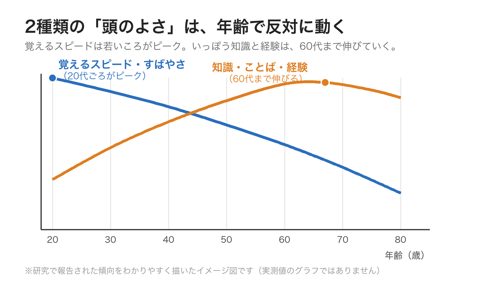
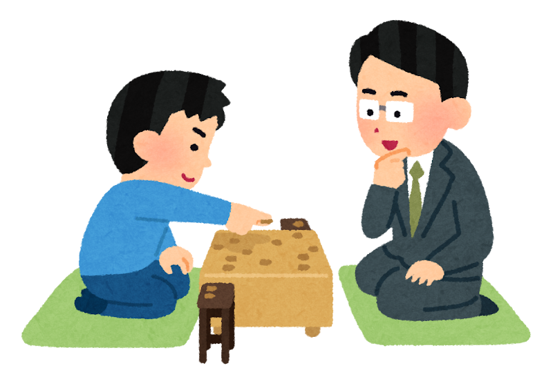
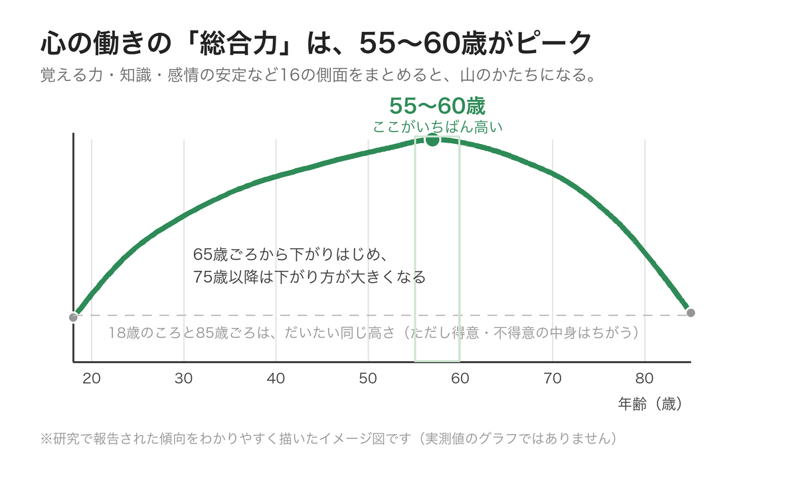

「人の名前が、すぐに出てこない」  
「新しい機械の使い方を覚えるのが、若いころより時間がかかる」

そんなふうに感じて、「**もう歳だから**」とため息をついたことはありませんか？

ところが2025年、その常識をゆさぶる研究が発表されました。**心の働きを総合すると、いちばん高くなるのは20代ではなく、55〜60歳ごろ**だというのです。

理学療法士として現場に立っていると、年齢を重ねた方の**落ち着いた判断**に、何度も助けられてきました。今回は、その感覚を裏づけるような研究のお話です。

> ✅ 「頭のよさ」は一つではありません。**覚えるスピードは20代がピーク**でも、**知識・ことば・経験は60代まで伸びていく**ことがわかっています
>
> ✅ 16の側面をまとめると、**総合的なピークは55〜60歳ごろ**。下がりはじめるのは65歳ごろ、下がり方が大きくなるのは75歳以降と報告されました
>
> ✅ ただし、これは**平均の傾向**の話です。個人差はとても大きく、「何歳だからこう」と決めつけられるものではありません

---

## 目次

1. [「頭のよさ」は、ひとつじゃない](#頭のよさはひとつじゃない)
2. [16の側面を足し合わせたら、山のかたちになった](#16の側面を足し合わせたら山のかたちになった)
3. [70代・80代まで伸びつづけるものもある](#70代80代まで伸びつづけるものもある)
4. [この研究には、限界もあります](#この研究には限界もあります)
5. [現場で感じていること](#現場で感じていること)
6. [いま私たちにできること](#いま私たちにできること)
7. [おわりに](#おわりに)

---

## 「頭のよさ」は、ひとつじゃない


頭の働きは、若いころがいちばんいい……そう思っていました。



半分は当たっていて、半分はちがうんです。**「頭のよさ」には少なくとも2種類ある**と考えられていて、その2つは年齢とともに**反対の方向に動く**んですよ。


心理学では、「頭のよさ」を大きく2つに分けて考えます。

- **覚えるスピードや、初めての問題を解く力**（専門的には「流動性知能」といいます）……こちらは**20代ごろがピーク**で、そのあとゆっくり下がっていきます
- **知識・ことば・積み上げた経験**（「結晶性知能」といいます）……こちらは**60代ごろまで伸びつづける**と報告されています

「人の名前が出てこない」「新しい機械に手間取る」というのは、前者の変化です。たしかにそこは、年齢とともにゆっくりになります。

でもそのあいだに、**もう一方はずっと育ち続けている**のです。長年つちかった知識、ことばの豊かさ、「こういうときは、こうしたほうがいい」という勘どころ。それらは、若いころには持っていなかったものです。

> 脳の中で何が起きて「ゆっくりめ」になるのかは、こちらの記事でくわしくお話ししています。  
> 👉 [認知機能はなぜ衰えるの？〜脳の中で起きている4つの変化〜](/posts/cognitive-decline-mechanism/)

---

## 16の側面を足し合わせたら、山のかたちになった

ここで紹介したいのが、**オーストラリアの西オーストラリア大学のジル・ギニャック博士**と、**ポーランドのワルシャワ大学のマルチン・ザイェンコフスキ博士**による研究です。2025年に、心理学の専門誌『Intelligence（インテリジェンス）』に発表されました。

二人が取り組んだのは、こんな疑問です。

**「覚える力のピークが20代なら、どうして仕事で成果を出す人のピークは、50代後半なのだろう？」**

そこで研究チームは、「人生をうまく運ぶ力」に関わる**9つの分野・16の側面**を選び出しました。推論する力、記憶、考えるスピード、知識、感情をあつかう力、まじめさ、気持ちの安定、お金についての判断力、道徳的な考え方、思いこみに振り回されにくさ……といったものです。

そして、それぞれについて「年齢とともにどう変わるか」を既存の大規模なデータから集め、**同じものさしにそろえて、一本の指標にまとめました**。

その結果が、こちらです。

- 18歳から**ぐんぐん上がり、55〜60歳ごろがいちばん高い**
- **65歳ごろから下がりはじめ、75歳以降は下がり方が大きくなる**
- 計算の仕方を変えても、ピークはやはり**55〜60歳ごろ**


55〜60歳がピーク……。ちょうど、いちばん忙しい時期ですね。



そうなんです。会社で責任のある立場を任される時期と、ぴったり重なります。研究チームも、「**仕事で成果が出るピークと、この山の頂上はほぼ同じ**」だと述べています。経験を積んだ人が現場で頼りにされるのは、気のせいではなかった、というわけですね。


なお、**「経験でみがかれる力」を重く見て計算した場合**、85歳ごろの高さは**18歳のころと同じくらい**になったとも報告されています。ただし中身は別もので、得意なことと苦手なことが入れ替わっている——そんなイメージです。

---

## 70代・80代まで伸びつづけるものもある

この研究でとくに興味深いのは、**60歳を過ぎても伸びつづけるもの**があった点です。

- **「もったいない」に引きずられにくい**……たとえば、あまり面白くない映画を観ていて、「お金を払ったのだから、最後まで観ないと損だ」と思って座り続けてしまう。こういう判断のくせは、だれにでもあります。ところが**年齢を重ねた方は、ここで上手に切り上げられる**と報告されています。しかもこの力は、70代・80代まで伸びつづける可能性があるそうです
- **お金についての判断力**……60代後半ごろまで伸びていきます
- **道徳的な考え方**……年齢とともに深まっていくと報告されています
- **まじめさ（几帳面さ）や、気持ちの安定**……60代から70代にかけて、いちばん高くなっていきます

いっぽうで、**中年以降にゆっくり下がっていくもの**もありました。頭の切り替えの早さ、相手の考えを読みとる力（65歳ごろから）、そして「あれこれ考えたい」という意欲などです。


年をとると、頑固になるものだと思っていました。



おもしろいですよね。**あわてて飛びつかず、落ち着いて決められる**——それも立派な力です。若さの「速さ」とはちがう種類の強さが、年齢とともに育っている、ということなんです。


---

## この研究には、限界もあります

ここは大事なところなので、正直にお伝えします。この研究には、いくつか気をつけて読むべき点があります。

- **多くが「横断データ」である**……同じ人を何十年も追いかけたのではなく、**いろいろな年齢の人を、同じ時期に比べたもの**が中心です。そのため、「年齢による変化」と「育った時代のちがい」が混ざっている可能性があります
- **欧米のデータが中心**……主に欧米の豊かな国のデータから集められています。日本を含む他の地域でも同じ形になるかは、これから調べる必要があります
- **あくまで「平均」の話**……人によるちがいは、とても大きいものです

研究チームは論文の中で、「高度な判断を求められる仕事には、40歳未満や65歳以上の人は向きにくいかもしれない」という見方にも触れています。ただ、これは**平均から導いた一般論**です。

年齢だけを見て「この人はもう」と判断するのではなく、**その人が実際にどうかを見る**。研究者自身も、そこを強調しています。

---

## 現場で感じていること

理学療法士として働いていると、**年齢を重ねた方の「落ち着き」に助けられる場面**が、たしかにあります。

こちらが焦って先を急ごうとするときに、「今日はこのくらいにしておきます」と、ご本人が自分の体の具合から冷静に判断される。長く生きてきた人が持つ、そういう感覚に、何度も教えられてきました。

覚えるスピードだけが「頭のよさ」なら、こうした場面は説明がつきません。**積み上げてきたものは、たしかに力になっている**——現場にいると、そう感じます。

---

## いま私たちにできること


ピークが55〜60歳なら、それを過ぎた私はどうすればいいのでしょう……。



ご心配なく。この山は**大勢の平均をならして描いたもの**で、あなた一人の山ではありません。しかも、ピークを過ぎてからの下がり方をゆるやかにする方法は、これまでの研究でかなりはっきりしているんですよ。


「ピークが遅い」ということは、**積み上げたものが力になる**ということです。だとすれば、私たちにできるのは「積み上げをやめないこと」。

- ✅ **体を動かす**：歩くこと、筋力を保つこと。脳を守る土台は、いまのところ運動がもっとも確かです
- ✅ **知識を足しつづける**：本を読む、講座に出る、人に教える。**知識と経験は60代まで伸びる**のですから、材料を入れ続けるほど有利です
- ✅ **人と話す**：相手の考えを読みとる力は年齢とともにゆっくりになります。会話の機会そのものが、いい練習になります
- ✅ **よく眠る**：眠っている間に、脳は記憶を整理しています
- ✅ **決めごとを急がない**：あわてて飛びつかない落ち着きは、年齢が育ててくれた強みです。大きな判断ほど、一晩おいて
- ✅ **年齢で自分を値切らない**：「もう歳だから」と手放したとたん、積み上げが止まってしまいます

> 「脳はいくつになっても変われる」というお話は、こちらもあわせてどうぞ。  
> 👉 [脳は、いくつになっても変われる 〜リハビリでわかった『脳の可塑性』のお話〜](/posts/brain-plasticity-rehabilitation-2026/)

### 📚 あわせて読みたい一冊

{{< affiliate
    title="生涯健康脳 こんなカンタンなことで脳は一生、健康でいられる！"
    image="https://m.media-amazon.com/images/P/4990521293.09._SCLZZZZZZZ_.jpg"
    amazon="https://af.moshimo.com/af/c/click?a_id=5534074&p_id=170&pc_id=185&pl_id=4062&url=https%3A%2F%2Fwww.amazon.co.jp%2Fdp%2F4990521293"
    rakuten="https://af.moshimo.com/af/c/click?a_id=5533903&p_id=54&pc_id=54&pl_id=27059&url=https%3A%2F%2Fbooks.rakuten.co.jp%2Frb%2F13289342%2F"
    description="16万人もの脳画像を診てきた東北大学の脳科学者が、「脳を一生元気に保つコツ」をやさしくまとめた一冊。年齢を重ねてからの積み上げ方を考えるヒントになります。" >}}

{{< affiliate
    title="運動脳（新版）"
    image="https://thumbnail.image.rakuten.co.jp/@0_mall/bookfan/cabinet/01021/bk4763140140.jpg?_ex=400x400"
    amazon="https://af.moshimo.com/af/c/click?a_id=5534074&p_id=170&pc_id=185&pl_id=4062&url=https%3A%2F%2Fwww.amazon.co.jp%2Fdp%2FB0GVBCKJDW"
    rakuten="https://af.moshimo.com/af/c/click?a_id=5533903&p_id=54&pc_id=54&pl_id=27059&url=https%3A%2F%2Fitem.rakuten.co.jp%2Fbookfan%2Fbk-4763140140%2F"
    description="「運動が、なぜ脳に効くのか」を神経科学の視点からやさしく解説した世界的ベストセラー。下がり方をゆるやかにする、いちばん確かな方法の話です。" >}}

---

## おわりに

「もう歳だから」——この言葉を、私たちはあまりにも軽く使っているのかもしれません。

覚えるスピードは、たしかに若いころのようにはいきません。でもそのあいだに、**知識も、ことばも、落ち着いた判断も、静かに積み上がっていました**。それを全部合わせた「総合力」の頂上は、20代ではなく**55〜60歳ごろ**にあった——研究が示したのは、そういうことです。

もちろん、これは平均の話です。あなたの山の形は、あなただけのものです。

ただ一つ、はっきりしていることがあります。**下り坂のゆるやかさは、日々の積み重ねで変えられる**ということ。読むこと、歩くこと、人と話すこと。そのどれもが、これまでの研究で脳を支えると示されてきたことばかりです。

今日の一歩は、もう遅い一歩ではありません。  
まだ、積み上げの途中なのですから。

---

### 参考にした情報

- 元になった研究：Gignac, G. E. & Zajenkowski, M.「Humans peak in midlife: A combined cognitive and personality trait perspective」『Intelligence』第113巻・論文番号101961（2025年、オンライン公開2025年9月22日／DOI: 10.1016/j.intell.2025.101961）。西オーストラリア大学とワルシャワ大学の研究者による報告
- 研究チームは、人生の成功に関わる9つの分野・16の側面について、既存の大規模データから年齢ごとの傾向を集め、一つの指標（認知‐性格機能指数）にまとめて比較しています
- 記事中の2枚のグラフは、報告された傾向をわかりやすく描いた**イメージ図**です（実測値をそのまま示したものではありません）
- ※本記事は一般的な情報提供を目的としたものです。もの忘れなどで気になる症状があるときは、自己判断せず、**かかりつけの医師にご相談ください。**
