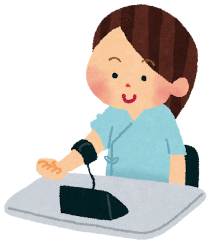
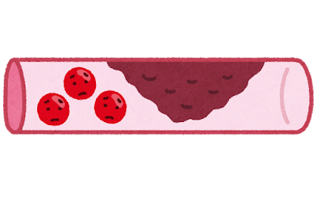
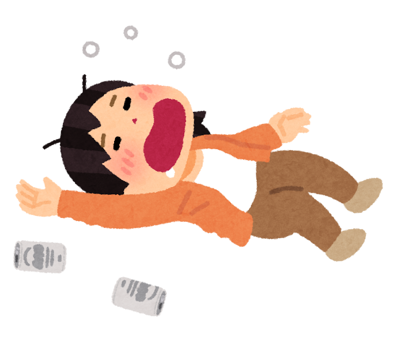

「血圧やコレステロールの数値、毎年なんとなく見て終わりにしていませんか？」  
「認知症の予防と、健診の数字って関係あるの？」――  
そんなふうに思ったことのある方へ。

実は、世界的に権威のある医学誌『ランセット』の専門委員会は、認知症のリスク要因のうち **約45％は生活習慣で減らせる** と報告しています。そして、その中でも大きなかたまりが、**「血管」と「代謝（体の中での栄養の使われ方）」にかかわる7つの因子** です。

これらは、**健診の数字で「見える」ことと、生活で「変えられる」こと** が、いちばんの強みです。

> ✅ 高血圧・糖尿病・高LDLコレステロール・肥満・運動不足・喫煙・お酒――この7つは「血管・代謝」のなかま
>
> ✅ 日本人では、この7つを合計すると **約2割** の認知症にかかわると推計
>
> ✅ どれも **健診の数値** や **毎日の習慣** で、今日から手をつけられる

> 認知症の14因子の「全体像」を先に知りたい方は、こちらの記事もどうぞ。  
> 👉 [日本人の認知症、約4割は予防できる 〜カギは「難聴」と「運動不足」〜](/posts/dementia-japan-14-factors/)

---

## 目次

1. [なぜ「血管と代謝」が脳に関係するの？](#なぜ血管と代謝が脳に関係するの)
2. [① 高血圧 ― いちばん身近な「血管の負担」](#-高血圧--いちばん身近な血管の負担)
3. [② 糖尿病 ― 高い血糖が脳をさびつかせる](#-糖尿病--高い血糖が脳をさびつかせる)
4. [③ 高LDLコレステロール ― 2024年に加わった新しい因子](#-高ldlコレステロール--2024年に加わった新しい因子)
5. [④ 肥満 ― 体の「静かな炎症」のもと](#-肥満--体の静かな炎症のもと)
6. [⑤ 運動不足 ― 日本人でとくに大きいカギ](#-運動不足--日本人でとくに大きいカギ)
7. [⑥ 喫煙 ― 血管にも脳にも届くダメージ](#-喫煙--血管にも脳にも届くダメージ)
8. [⑦ お酒の飲みすぎ ― 「ほどほど」を超えると](#-お酒の飲みすぎ--ほどほどを超えると)
9. [いま、私たちにできること](#いま私たちにできること)
10. [おわりに](#おわりに)

---

## なぜ「血管と代謝」が脳に関係するの？

脳は、体じゅうのなかでも **とくにたくさんの血液（酸素と栄養）** を必要とする臓器です。全身の血管がしなやかで、血液がきれいに流れていることが、脳が元気に働くための土台になります。

ところが、血圧や血糖、コレステロールが高い状態が続くと、**細い血管が少しずつ傷んで** いきます。脳の奥の小さな血管がダメージを受けると、目に見えないくらい小さな「詰まり」や「もれ」が積み重なり、考えるスピードがゆっくりめになったり、もの忘れが増えたりする一因になると考えられています。

つまり、ここで紹介する7つは、**「血管と代謝を通じて、じわじわ脳に効いてくる」** なかまです。逆に言えば、**数字を整えること自体が、そのまま脳を守ること** につながります。

> このシリーズのもう1本（耳・目・心・環境の7因子）はこちら。  
> 👉 [脳を守る「刺激とつながり」 〜耳・目・心・環境の7つの危険因子〜](/posts/dementia-14-factors-brain/)

---

## ① 高血圧 ― いちばん身近な「血管の負担」

**なぜ脳に良くない？**  
血圧が高い状態は、いわば「血管に強い水圧がかかり続けている」ようなもの。とくに **中年期（おおむね45〜64歳）の高血圧** は、脳の細い血管を傷め、のちのちの認知症リスクにつながることが分かっています。日本人では認知症の **約2.9％** にかかわると推計されています。

**今日からの一手**  
- 家庭で **朝晩に血圧を測る** 習慣をつける（病院だけだと見逃しがち）
- 上が135を超える日が続くなら、**かかりつけ医に相談**
- 減塩（汁物を1日1杯に、麺類の汁を残す）から始める

---

## ② 糖尿病 ― 高い血糖が脳をさびつかせる

**なぜ脳に良くない？**  
血液中の糖が多い状態が続くと、血管が傷みやすくなり、脳へも負担がかかります。糖尿病は日本人で認知症の **約3.0％** にかかわるとされ、血管性の認知症だけでなくアルツハイマー型とも関係が指摘されています。

**今日からの一手**  
- 健診の **HbA1c（ヘモグロビンエーワンシー＝過去1〜2か月の血糖の平均）** を毎年チェック
- 「白いごはん大盛り」「甘い飲み物」を少しずつ見直す
- 食事の整え方は、こちらの記事もどうぞ  
  👉 [認知症予防は「食卓」から 〜MCIからの回復にも効く食事の整え方〜](/posts/dementia-prevention-nutrition/)

---

## ③ 高LDLコレステロール ― 2024年に加わった新しい因子

**なぜ脳に良くない？**  
LDLコレステロール（いわゆる「悪玉」）が高いと、血管の壁にたまって動脈硬化を進めます。**2024年のランセット報告で新しく加わった因子** で、世界では認知症の **約7％**、日本人でも **約4.5％** にかかわると、影響の大きさが注目されています。

**今日からの一手**  
- 健診の **LDLコレステロール値** を見て、高めなら放置せず相談
- 揚げ物・脂身の多い肉を、魚や大豆製品に置きかえる日をつくる
- 「数値が高い」と言われたら、自己判断でサプリに頼らず **まず医師へ**（※薬が必要かどうかは必ずかかりつけ医に相談を）

---

## ④ 肥満 ― 体の「静かな炎症」のもと

**なぜ脳に良くない？**  
余分な脂肪、とくにお腹まわりの脂肪は、体のあちこちで **弱い炎症（静かな火事のようなもの）** を起こし、血管や脳にじわじわ影響すると考えられています。日本人での寄与は **約0.7％** と数字としては小さめですが、高血圧・糖尿病・高LDLと **重なって効いてくる** のが要注意な点です。

**今日からの一手**  
- 急なダイエットより、**体重を月単位でゆっくり** 落とす
- 「まず2〜3kg」「ベルトの穴ひとつ」など、小さな目標から
- 食べる量より先に、**座っている時間を減らす** のも効果的  
  👉 [1日8時間以上座っていませんか？ 〜「動く・座らない・眠る」で守る24時間〜](/posts/sedentary-24h-movement-2026/)

---

## ⑤ 運動不足 ― 日本人でとくに大きいカギ

**なぜ脳に良くない？**  
体を動かさないと、血流が落ち、血圧・血糖・コレステロールのすべてに悪い方向に働きます。さらに運動には、**脳そのものを元気にする** 働きもあります。日本人では認知症の **約6.0％** にかかわり、**14因子のなかでも上位** という、見逃せない因子です。

**今日からの一手**  
- 目安は **1日5,000〜7,500歩**。いきなり1万歩を目指さなくて大丈夫
- 「買い物は歩いて」「テレビを見ながら足踏み」でも立派な運動
- 運動と脳の関係は、こちらでくわしく  
  👉 [認知症リスクを45％下げる運動習慣 〜60代から始める「脳の貯金」〜](/posts/dementia-prevention-exercise/)  
  👉 [1日5,000〜7,500歩で、アルツハイマー病の進行が遅くなる？](/posts/walking-7500-steps/)

---

## ⑥ 喫煙 ― 血管にも脳にも届くダメージ

**なぜ脳に良くない？**  
たばこの煙は血管を縮め、傷つけ、全身の血流を悪くします。脳の細い血管にも当然影響し、日本人で認知症の **約2.2％** にかかわるとされています。

**今日からの一手**  
- 「もう歳だから今さら」は誤解。**やめた時点から** リスクは下がっていきます
- 一人でやめにくい場合は **禁煙外来** という選択肢も（保険が使えることがあります）
- まずは「本数を半分に」からでも一歩

---

## ⑦ お酒の飲みすぎ ― 「ほどほど」を超えると

**なぜ脳に良くない？**  
適量を超えた飲酒が続くと、脳が縮みやすくなることが知られています。日本人での寄与は **約1.3％**。「少量なら体に良い」という見方も以前はありましたが、近年は **飲まないにこしたことはない** という考え方が主流になりつつあります。

**今日からの一手**  
- 週に **2日は休肝日** をつくる
- 「とりあえずビール」を「まずお茶やお水」に変えてみる
- 寝つきのための寝酒は、かえって眠りを浅くするので見直しを

---

## いま、私たちにできること

ここまでの7つを、**今日からできるかたち** にまとめます。ぜんぶ一度にやろうとしなくて大丈夫。**ご自身に当てはまるところ** から、ひとつずつで十分です。

- ✅ 健診の **血圧・血糖（HbA1c）・LDLコレステロール** の数字に、今年はしっかり目を通す
- ✅ 家庭で **朝晩の血圧** を測る習慣を
- ✅ **1日5,000〜7,500歩** を目安に、毎日少し体を動かす
- ✅ 揚げ物・甘い飲み物を「減らす日」をつくる
- ✅ たばこ・お酒は、**今日から少しずつ** 見直す

> 理学療法士として高齢の方々と接していると、**毎日の活動への意識が高く、健診の数字を大事にしている方は、いきいきと元気に過ごしておられる** と感じることが多いです。特別なことでなく、日々のちょっとした生活の工夫と健康意識が大切だと思います。

---

### 🛍️ あわせておすすめのアイテム

{{< affiliate
    title="オムロン 上腕式血圧計"
    image="https://thumbnail.image.rakuten.co.jp/@0_mall/kenkocom/cabinet/4975479408656.jpg"
    amazon="https://af.moshimo.com/af/c/click?a_id=5534074&p_id=170&pc_id=185&pl_id=4062&url=https%3A%2F%2Fwww.amazon.co.jp%2Fs%3Fk%3D%25E3%2582%25AA%25E3%2583%25A0%25E3%2583%25AD%25E3%2583%25B3%2B%25E4%25B8%258A%25E8%2585%2595%25E5%25BC%258F%25E8%25A1%2580%25E5%259C%25A7%25E8%25A8%2588"
    rakuten="https://af.moshimo.com/af/c/click?a_id=5533903&p_id=54&pc_id=54&pl_id=27059&url=https%3A%2F%2Fsearch.rakuten.co.jp%2Fsearch%2Fmall%2F%25E3%2582%25AA%25E3%2583%25A0%25E3%2583%25AD%25E3%2583%25B3%2B%25E4%25B8%258A%25E8%2585%2595%25E5%25BC%258F%25E8%25A1%2580%25E5%259C%25A7%25E8%25A8%2588%2F"
    description="「血管と代謝」を守る第一歩は、まず自分の数字を知ること。腕に巻くタイプは手首式より正確で、朝晩の血圧を毎日記録するのに向いています。" >}}

{{< affiliate
    title="ガーミン vivosmart 5"
    image="https://thumbnail.image.rakuten.co.jp/@0_mall/iget/cabinet/garmin2/vivosmart5-1p.jpg"
    amazon="https://af.moshimo.com/af/c/click?a_id=5534074&p_id=170&pc_id=185&pl_id=4062&url=https%3A%2F%2Fwww.amazon.co.jp%2Fdp%2FB09XGX8ZRW"
    rakuten="https://af.moshimo.com/af/c/click?a_id=5533903&p_id=54&pc_id=54&pl_id=27059&url=https%3A%2F%2Fitem.rakuten.co.jp%2Figet%2Fvivosmart5%2F"
    description="毎日の歩数や活動量を「見える化」したい方には、腕に着けるだけのスマートウォッチが便利。前モデルより画面が66%大きく文字も見やすく、無理なく続ける後押しになります。" >}}

### 🏋️ 運動を続けたい方へ

「一人だとなかなか続かない」という方は、通えるジムを利用するのもひとつの方法です。

PR

【銀座】パーソナルジム ACCEPT

世界大会で活躍するプロトレーナーが、マンツーマンで指導。運動が初めての方や年齢が気になる方も、利用期限なしで自分のペースに合わせて続けられます。気になる方は、まず<strong>無料の体験トレーニング</strong>から。

店舗名：【銀座】パーソナルジム ACCEPT 住所：〒104-0061 東京都中央区銀座２丁目１２−４ アジリア銀座 J's402 電話：080-7052-5320 営業時間：10:00〜22:00（定休日：年末年始のみ 12/31〜1/1）

---

## おわりに

血圧、血糖、コレステロール――健診で並ぶこれらの数字は、ともすると「毎年見て終わり」になりがちです。でも、ひとつひとつが **脳の血管を守るサイン** だと思うと、見え方が少し変わってきませんか。

> 数字を整えることは、心臓や血管のためだけでなく、**5年後・10年後の「考える力」** を守ることでもある。

そう考えると、今日の食事や、ひと駅ぶんの歩きが、ぐっと前向きなものに感じられます。次の記事では、**耳・目・心・環境** という、もうひとつのなかまの7因子をご紹介します。

> 👉 [脳を守る「刺激とつながり」 〜耳・目・心・環境の7つの危険因子〜](/posts/dementia-14-factors-brain/)

---

### 参考にした情報

- ケアネット「**外来で役立つ！認知症Topics**」連載『Lancetの14の危険因子を読み解く（その1〜その4）』（2026年）※医療者向け・会員登録が必要
- ランセット委員会報告：Livingston G, et al. **Lancet**. 2024;404:572-628.
- 日本人での推計：Wasano K, et al. **Lancet Reg Health West Pac**. 2026;66:101792.

※ 本記事は、上記の医療メディアおよび原著論文をもとに、一般読者向けにわかりやすくまとめ直したものです。血圧・血糖・コレステロールの数値やお薬について気になる点があれば、必ずかかりつけ医にご相談ください。

