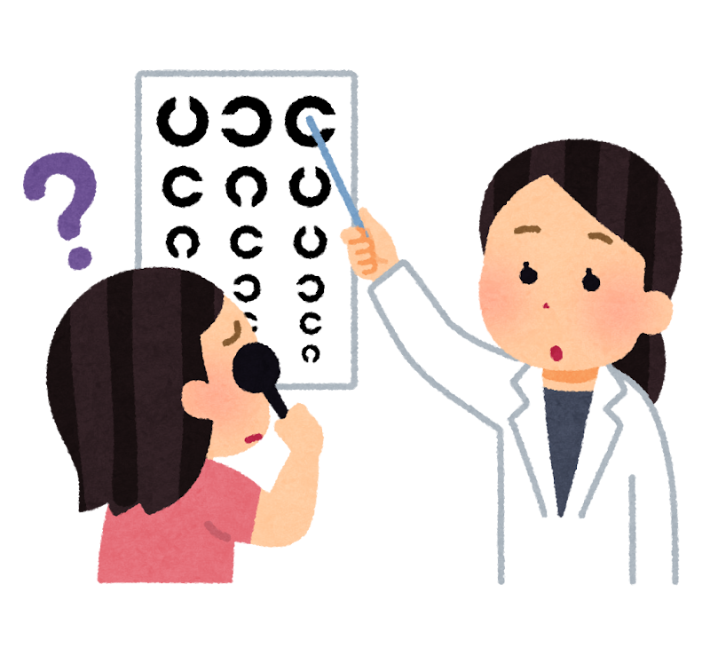
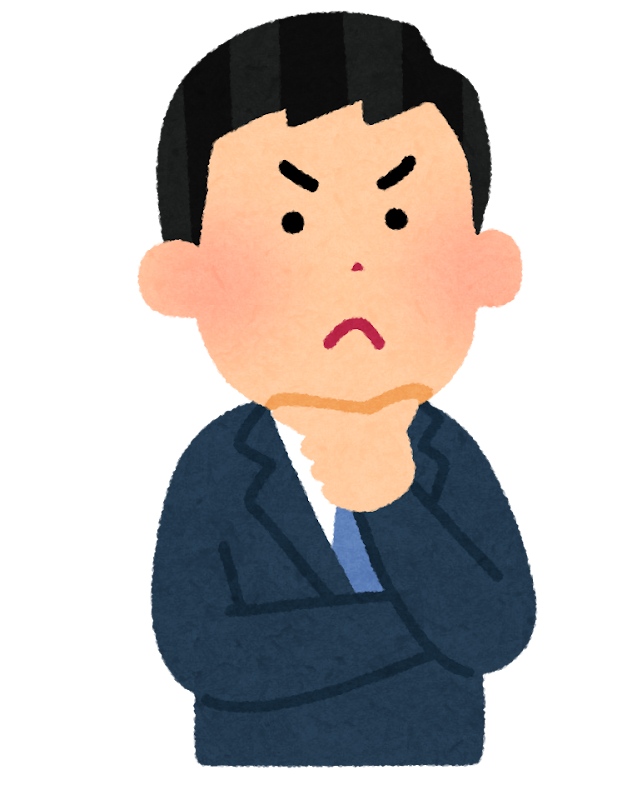
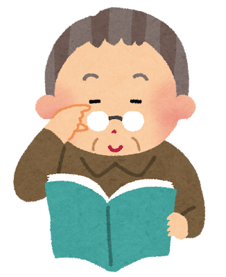
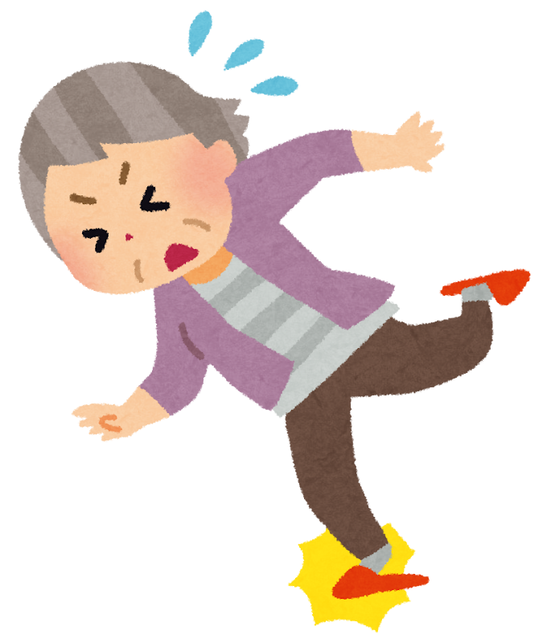
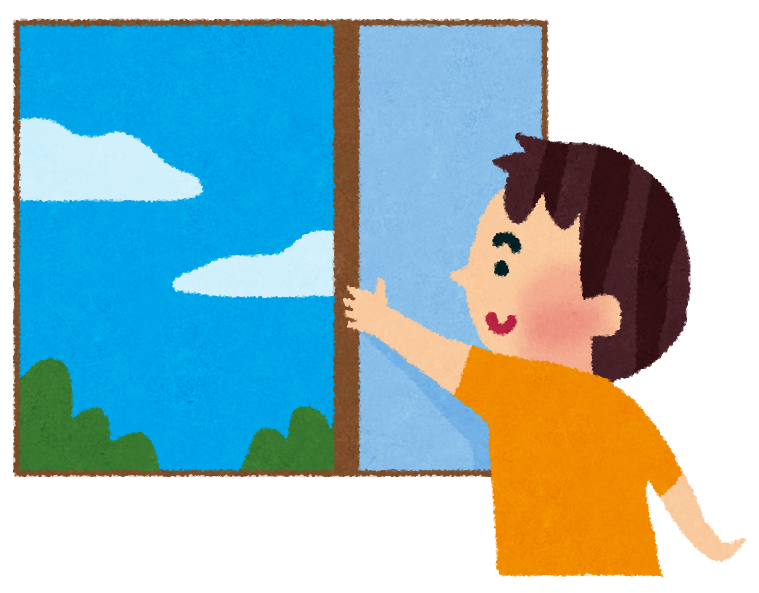

「最近、人と話す機会が減ったな」  
「テレビの音が大きいと言われるようになった」――  
そんな小さな変化を、年齢のせいとあきらめていませんか？

認知症のリスク要因のうち **約45％は生活習慣で減らせる** ――『ランセット』の専門委員会はそう報告しています。前回ご紹介した「血管と代謝」のなかま（→[記事はこちら](/posts/dementia-14-factors-body/)）に対して、今回は **「脳に入ってくる刺激」や「人とのつながり」「心の状態」「環境」** にかかわる7つの因子をまとめます。

血液検査では測れないけれど、**毎日の暮らしのなかで守れる** ――それがこのなかまの特徴です。

> ✅ 難聴・視力低下・社会的孤立・うつ・知的活動の少なさ・頭のケガ・大気汚染の7つ
>
> ✅ 脳は「使われ、つながっている」ほど元気でいられる
>
> ✅ 耳・目のケアや、人との交流は、**今日から** 始められる

> 認知症の14因子の「全体像」を先に知りたい方は、こちらの記事もどうぞ。  
> 👉 [日本人の認知症、約4割は予防できる 〜カギは「難聴」と「運動不足」〜](/posts/dementia-japan-14-factors/)

---

## 目次

1. [なぜ「刺激とつながり」が脳を守るの？](#なぜ刺激とつながりが脳を守るの)
2. [① 難聴 ― 最大級のカギになる因子](#-難聴--最大級のカギになる因子)
3. [② 視力低下 ― 2024年に加わった新しい因子](#-視力低下--2024年に加わった新しい因子)
4. [③ 社会的孤立 ― 「ひとり」が続くこと](#-社会的孤立--ひとりが続くこと)
5. [④ うつ ― 心の落ち込みと脳のつながり](#-うつ--心の落ち込みと脳のつながり)
6. [⑤ 知的活動の少なさ ― 「脳を使う」習慣](#-知的活動の少なさ--脳を使う習慣)
7. [⑥ 頭のケガ ― 転倒・事故から頭を守る](#-頭のケガ--転倒事故から頭を守る)
8. [⑦ 大気汚染 ― 環境というリスク](#-大気汚染--環境というリスク)
9. [いま、私たちにできること](#いま私たちにできること)
10. [おわりに](#おわりに)

---

## なぜ「刺激とつながり」が脳を守るの？

脳には、**「使われるほど鍛えられ、放っておくと衰えやすい」** という性質があります。会話をする、景色を見る、考える、人と笑う――こうした **刺激のひとつひとつ** が、脳の元気を保つ栄養になっています。

専門的には、こうして蓄えられた脳の余力を **「脳の予備能（よびのう＝脳のたくわえ）」** と呼びます。耳や目から入る情報、人とのつながり、前向きな気持ちは、この「たくわえ」を増やし、認知症の発症を遅らせる方向に働くと考えられています。

ここで紹介する7つは、**この「刺激とつながり」が細ってしまう** 因子です。逆に言えば、**耳と目をケアし、人と関わり続けること** が、そのまま予防になります。

---

## ① 難聴 ― 最大級のカギになる因子

**なぜ脳に良くない？**  
聞こえが悪くなると、脳に届く音の情報が減り、会話もおっくうになって、人との交流まで遠ざかりがちに。日本人では認知症の **約6.7％** にかかわり、**14因子のなかでも最大級** とされています。近年は、**補聴器を適切に使うとリスクが下がる可能性** も報告されています。

**今日からの一手**  
- 「聞き返しが増えた」「テレビの音が大きいと言われる」なら、年齢のせいにせず **耳鼻科で相談**
- 補聴器は「早めに慣れる」ほど使いこなしやすい
- 難聴については、こちらの記事でくわしく解説しています  
  👉 [日本人の認知症、約4割は予防できる 〜カギは「難聴」と「運動不足」〜](/posts/dementia-japan-14-factors/)

---

## ② 視力低下 ― 2024年に加わった新しい因子

**なぜ脳に良くない？**  
目から入る情報も、脳にとって大切な刺激です。**治療していない視力低下** が続くと、その刺激が減り、外出や活動もおっくうになります。**2024年のランセット報告で新しく加わった因子** で、日本人での寄与は **約0.6％**。白内障など **治せる原因が多い** のが特徴です。

**今日からの一手**  
- 「見えにくいな」を放置せず、**眼科で定期的にチェック**
- 白内障などは手術で見え方が大きく改善することも
- 眼鏡やコンタクトの度数が合っているか、ときどき見直しを

---

## ③ 社会的孤立 ― 「ひとり」が続くこと

**なぜ脳に良くない？**  
人との会話は、脳にとって上等な「運動」です。交流が減ると刺激も減り、気持ちも沈みやすくなります。日本人では認知症の **約3.5％** にかかわるとされ、老年期にとくに注意したい因子です。

**今日からの一手**  
- 月1回でもいいので、**人と会う・話す予定** を意識してつくる
- 地域の体操教室やサロン、趣味の集まりは一石二鳥
- 電話やビデオ通話でも、つながりは保てます

---

## ④ うつ ― 心の落ち込みと脳のつながり

**なぜ脳に良くない？**  
気分の落ち込みが続くと、活動も交流も減り、脳への刺激が少なくなります。うつと認知症は **互いに影響し合う** 関係が指摘されており、日本人では認知症の **約2.6％** にかかわるとされています。

**今日からの一手**  
- 「2週間以上、気分が晴れない」「眠れない・楽しめない」が続くなら、**ひとりで抱えず相談**
- かかりつけ医や、心療内科・精神科は特別な場所ではありません
- 日光を浴びる・体を動かすことも、気分の安定に役立ちます

---

## ⑤ 知的活動の少なさ ― 「脳を使う」習慣

**なぜ脳に良くない？**  
ランセット報告では「若いころの教育」が因子に挙げられますが、大切なのは学歴そのものより **生涯にわたって脳を使い続けること**。日本人では教育にかかわる寄与は **約1.5％** とされますが、**何歳からでも「学び直し」はできる** のが希望のあるところです。

**今日からの一手**  
- 読書、日記、囲碁・将棋、楽器、手芸など、**少し頭を使う趣味** を持つ
- 「新しいこと」に挑戦すると、脳への刺激はより大きくなります
- 人に教える・一緒に学ぶと、交流とのW効果に

---

## ⑥ 頭のケガ ― 転倒・事故から頭を守る

**なぜ脳に良くない？**  
強く頭を打つ **外傷性脳損傷（頭のケガ）** は、のちの認知症リスクを高めることが分かっています。日本人での寄与は **約0.8％**。高齢期では、**転倒** がいちばん身近な原因です。

**今日からの一手**  
- 家の中の **段差・滑りやすい床・暗い廊下** を見直す（つまずき予防）
- ふらつきが気になるなら、**足腰の運動** で転びにくい体づくりを
- 自転車に乗るときはヘルメットを

---

## ⑦ 大気汚染 ― 環境というリスク

**なぜ脳に良くない？**  
細かい粒子（PM2.5など）を含む汚れた空気は、体の炎症を通じて脳にも影響すると考えられています。日本人での寄与は **約2.5％**。個人の努力だけでは変えにくい因子ですが、**できる範囲の工夫** はあります。

**今日からの一手**  
- 大気汚染の予報が悪い日は、**窓を開けすぎない・長時間の屋外運動を控える**
- 室内の **換気と空気清浄** を意識する
- 家庭内では、たばこの煙を持ち込まないことも大切

---

## いま、私たちにできること

7つを、**今日からできるかたち** にまとめます。こちらも、ご自身に当てはまるところから、ひとつずつで十分です。

- ✅ 「聞こえ」「見え方」が気になったら、**耳鼻科・眼科で早めに相談**
- ✅ 月1回でも、**人と会って話す予定** をつくる
- ✅ 読書・手習いなど、**少し頭を使う趣味** を続ける
- ✅ 気分の落ち込みが続くなら、**ひとりで抱えず相談**
- ✅ 家の中の **段差・暗がり** を見直して、転倒を防ぐ

> 理学療法士として高齢の方々と接していると、**耳や目をこまめにケアし、人とのつながりを大事にしてきた方ほど、表情がいきいきしておられる** と感じます。からだのリハビリと同じくらい、「刺激とつながり」は脳の元気を支えていると実感します。

---

## おわりに

血圧やコレステロールのように数字には出ないけれど、**聞こえ・見え方・人とのつながり・心のはり** は、脳の元気にとってかけがえのないものです。

> 耳が聞こえ、目が見え、人と笑い合える――  
> その当たり前のひとつひとつが、脳のいちばんのごちそうになる。

特別な道具も、難しい知識もいりません。今日の「ちょっと耳鼻科に行ってみよう」「久しぶりに友だちに電話しよう」が、5年後・10年後の自分を支えてくれます。

> 「血管と代謝」のなかまの7因子は、前回の記事でご紹介しています。  
> 👉 [認知症を防ぐ「血管と代謝」の整え方 〜数字で見える7つの危険因子〜](/posts/dementia-14-factors-body/)

---

### 参考にした情報

- ケアネット「**外来で役立つ！認知症Topics**」連載『Lancetの14の危険因子を読み解く（その1〜その4）』（2026年）※医療者向け・会員登録が必要
- ランセット委員会報告：Livingston G, et al. **Lancet**. 2024;404:572-628.
- 日本人での推計：Wasano K, et al. **Lancet Reg Health West Pac**. 2026;66:101792.

※ 本記事は、上記の医療メディアおよび原著論文をもとに、一般読者向けにわかりやすくまとめ直したものです。聞こえ・見え方・気分の落ち込みなどで気になる点があれば、必ず専門の医療機関にご相談ください。

