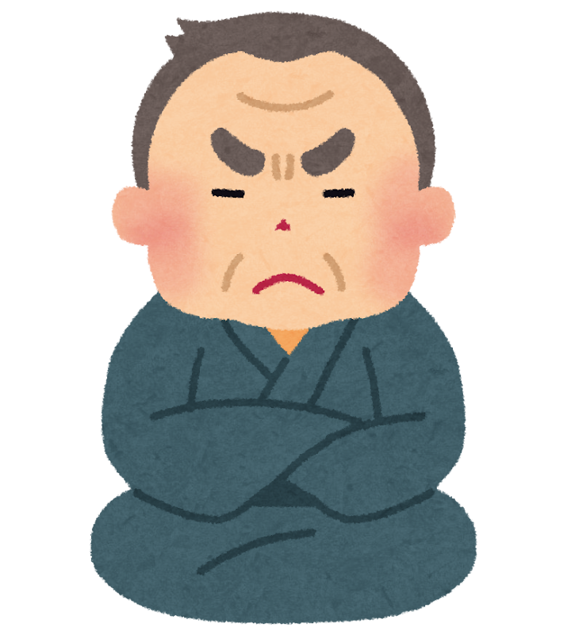
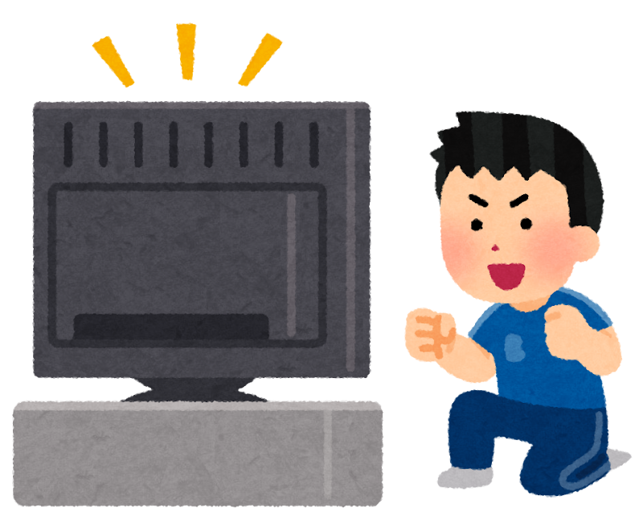
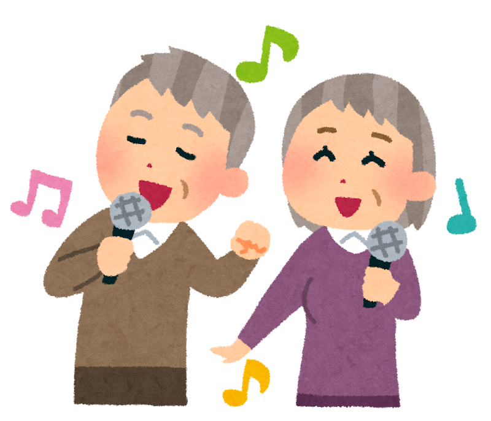
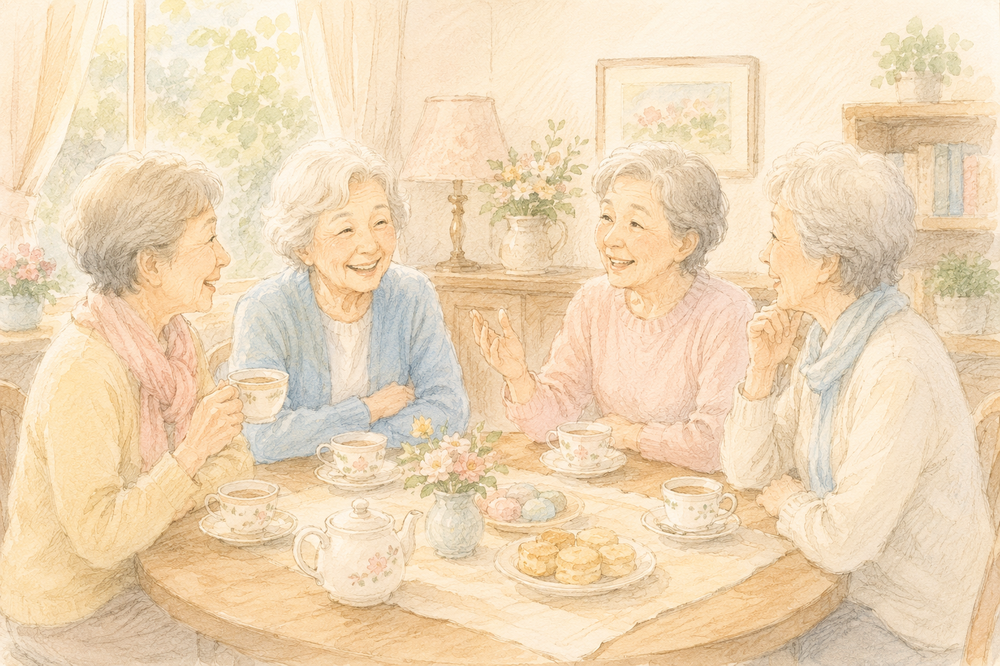

認知症のご家族が、以前より **怒りっぽくなった**、あるいは **元気がなくなって一日ぼんやり過ごすようになった**――そんな変化に、戸惑ったことはありませんか？

こうした、もの忘れ以外の「心と行動の変化」は、ご本人にとっても、支えるご家族にとっても、とてもつらいものです。

そんな中、ちょっと驚くような、でも心があたたかくなる研究が報告されました。テーマは、なんと **「プロ野球」**。**阪神タイガースが優勝したあと、ファンの認知症の方の "心の症状" がやわらいだ** というのです。

理学療法士として長く介護の現場にいる私自身、学生時代は野球部で、いまも阪神ファンのひとり。この話には、つい身を乗り出してしまいました。今日は、この研究から見えてくる **「好きなこと・楽しみの力」** について、ごいっしょに考えてみたいと思います。

> ✅ 阪神ファンの認知症の方 **19名** で、2023年の優勝後に **BPSD**（ビーピーエスディー＝認知症にともなう心と行動の症状）が **やわらいだ** と報告された
>
> ✅ 怒りっぽさ・無気力・興奮・昼夜逆転・気分の落ち込みなど、**幅広い症状** で良い変化がみられた
>
> ✅ ただし **19名の小さな探索的な研究**。「好きなこと・楽しみが心に効くかもしれない」という **ヒント** として受け止めたい

---

## 目次

1. [そもそも「BPSD」って何？](#そもそもbpsdって何)
2. [どんな研究だったの？](#どんな研究だったの)
3. [どんな症状が、やわらいだの？](#どんな症状がやわらいだの)
4. [なぜ「好きなこと」が、心に効くのでしょう](#なぜ好きなことが心に効くのでしょう)
5. [理学療法士として、私自身のこと](#理学療法士として私自身のこと)
6. [いま、私たちにできること](#いま私たちにできること)
7. [おわりに](#おわりに)

---

## そもそも「BPSD」って何？

認知症というと、「もの忘れ」を思い浮かべる方が多いと思います。これは **中核症状**（ちゅうかくしょうじょう）と呼ばれる、脳のはたらきが直接およぼす症状です。

いっぽうで、それを取り巻くように現れるのが **BPSD**（行動・心理症状）です。たとえば、

- 怒りっぽくなる、強い言葉が出る
- 不安そうにする、落ち着かず動き回る
- 元気がなくなる、何ごとにも関心をしめさなくなる
- 昼と夜が逆転する
- 気分が沈む

といったものです。BPSDは、**ご本人の体調・気持ち・まわりの環境** などによって、強くなったり、やわらいだりします。裏を返せば、**接し方や環境を整えることで、和らげられる可能性がある** ということでもあります。

---

## どんな研究だったの？

今回の研究は、大阪・脳神経内科はつたクリニックの **初田裕幸（はつた ひろゆき）医師** らによるもので、医学誌 *Geriatrics & Gerontology International*（2026年5月号）に報告されました。

研究では、関西地方にお住まいの認知症の方 **855名** を対象に、**プロ野球の試合結果** と **BPSDの変化** に関係がないかを調べました。

そして、そのうち **阪神タイガースのファンだった19名** に注目したところ、**2023年にチームがセ・リーグで優勝したあと、BPSDのスコア（症状の強さを表す点数）が、はっきりと下がっていた**（＝症状がやわらいでいた）のです。

ここで、ひとつ大切なことを正直にお伝えします。これは **「探索的レトロスペクティブ研究」** といって、**過去の記録をふり返って関係を探す、最初の手がかりを見つけるタイプ** の研究です。注目したのも19名という小さな人数。ですから、「優勝すれば症状が必ず良くなる」と言い切れるものではありません。あくまで **「こういう面白い関係がありそうだ」という、出発点の発見** です。

---

## どんな症状が、やわらいだの？

研究では、もう少しくわしく症状の種類ごとに見ています。優勝のあと、とくに次のような症状で良い変化がみられたと報告されています。

- **きつい言葉・相手を責めるような言葉** が減った
- **無関心・無気力**（何ごとにも興味がわかない状態）がやわらいだ
- **興奮・いらだち** が落ち着いた
- **昼夜の逆転** が整ってきた
- **気分の落ち込み・ゆううつな気分** が軽くなった

こうして並べてみると、ひとつの症状だけでなく、**心のあり方そのものが、ふわっと明るい方へ動いた** ような印象を受けます。好きなチームの優勝という、**心が大きく動く出来事** が、その人の毎日に良い波を広げたのかもしれません。

---

## なぜ「好きなこと」が、心に効くのでしょう

研究者らは、**「好きなチームに強い思い入れのある方ほど、心が動くスポーツの出来事がBPSDの変化に関係していた可能性がある」** と考えています。

ここで大切なのは、**「野球だから」ではない** ということです。鍵になっているのは、おそらく **その人の "好き" や "生きがい" が、強く心を動かしたこと** のほうです。

認知症が進んでも、**うれしい・たのしい・なつかしいといった「感情」は、最後まで豊かに残る** といわれています。記憶があいまいになっても、「好きな歌を聞くと表情がやわらぐ」「昔の趣味の話になると、目がいきいきする」――そんな場面に、現場で何度も出会います。

> あわせて読みたい  
> 👉 [脳を守る「刺激とつながり」 〜耳・目・心・環境の7つの危険因子〜](/posts/dementia-14-factors-brain/)

好きなこと、心が動くこと、誰かと分かち合えること。こうした **「楽しみ」** は、薬とはちがう形で、その人の心をそっと支えてくれているのかもしれません。

---

## 理学療法士として、私自身のこと

冒頭でも少し触れましたが、私は学生時代に野球をやっていて、いまも阪神ファンのひとりです。だからこの研究を読んだとき、「わかる気がするなあ」と、つい笑顔になりました。

そして、もうひとつ思い出したことがあります。私の母も、認知症とともに歩んだ人でした。母は **歌が好き** な人で、言葉が少なくなってからも、なじみのある歌が流れると、口ずさんだり、やわらかい表情を見せてくれることがありました。

「好きなこと」が心に届く瞬間は、特別なものではなく、**日々の暮らしのすぐそばにある** のだと思います。野球でも、歌でも、花でも、お茶でも――その人の「好き」を、いっしょに大切にすること。それが何より、と感じています。

---

## いま、私たちにできること

今回の研究は小さな一歩ですが、そこから受け取れる「できること」は、あたたかくてシンプルです。

> ✅ **その人の "好き" を、いっしょに楽しむ。** 野球、歌、相撲、園芸、お茶――昔から好きだったことを、生活の中に取り入れる
>
> ✅ **心が動く時間を大切に。** 勝ち負けや上手・下手よりも、「うれしい」「たのしい」と感じる時間そのものに価値がある
>
> ✅ **なじみのある音楽や思い出の品を、そばに。** 昔の歌・写真・好きだった場所の話などは、表情をやわらげるきっかけになりやすい
>
> ✅ **「できないこと」より「楽しめること」に目を向ける。** 完璧を目指さず、その人のペースで
>
> ✅ **困った症状が続くときは、抱え込まずに専門職へ。** かかりつけ医やケアマネジャーに相談を

BPSD（心と行動の症状）が強くて毎日がつらいときは、ご家族だけで抱えこまないでください。**※ 気になる症状が続くときは、必ずかかりつけ医や担当の専門職にご相談ください。**

---

## おわりに

「阪神が優勝したら、おじいちゃんが元気になった」――そんな話が、ちゃんと研究として報告される時代になりました。なんだか、ほっとするような、うれしいニュースです。

もちろん、これは19名の小さな探索的な研究で、これからさらに確かめていく段階のものです。それでも、**「好きなこと・楽しみが、その人の心を支えるかもしれない」** という方向性は、現場の実感ともよく重なります。

大切な人の「好き」は何だろう。そんなふうに思いをめぐらせる時間そのものが、きっと、いちばんの薬なのかもしれません。

---

### 参考にした情報

- Hatsuta H. **「Association between professional baseball outcomes and behavioral and psychological symptoms of dementia」** *Geriatrics & Gerontology International*（2026年5月号；2026;26:e70519）
- ケアネット 医療ニュース「阪神ファンの認知症患者、優勝後にBPSDが大きく改善!?」（2026年）※閲覧には会員登録が必要です

※ 本記事は、上記の研究・解説をもとに、一般読者向けにわかりやすくまとめ直したものです。ご紹介した研究は、少人数を対象とした探索的な（手がかりを探す段階の）研究であり、「好きなことをすれば症状が必ず良くなる」と保証するものではありません。気になる症状が続く場合や、接し方にお悩みの場合は、かかりつけ医や担当の専門職にご相談ください。

