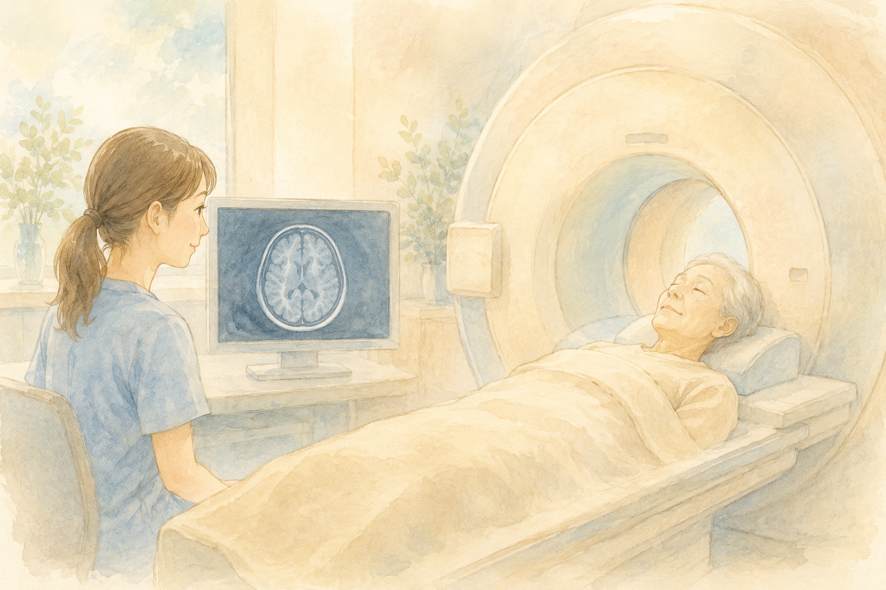

ご家族がアルツハイマー型認知症と診断されたとき、最初に気になるのは「**お薬で何ができるんだろう？**」ということではないでしょうか。

「最近、新しい薬の話題をよくニュースで見るけれど、自分や家族にも使えるのかな？」と気になっている方もいらっしゃるかもしれません。

実は認知症の薬物療法は、ここ数年で **大きな転換点** を迎えています。
今日はその全体像を、できるだけやさしく整理してみます。

 

> ✅ 認知症の薬は **「症状をやわらげる薬」** と **「進行を遅らせる薬（疾患修飾薬・DMT）」** の2系統に分かれてきている
>
> ✅ 注目の新薬（レカネマブ・ドナネマブ）は **MCI〜軽度の段階** で、かつ **アミロイド検査** の確認が必須
>
> ✅ **薬だけでは完結しません**。早期発見・運動・食事・対人交流を組み合わせた **「統合的アプローチ」** が大前提です

少し長めの記事になりますので、気になるところからお読みください。

- [そもそも：認知症の薬には2つの流れがある](#そもそも認知症の薬には2つの流れがある)
- [これまでの主役：症状をやわらげる4つの薬](#これまでの主役症状をやわらげる4つの薬)
- [新世代の薬：『進行を遅らせる』DMT](#新世代の薬進行を遅らせるdmt)
- [新薬の副作用「ARIA」をどう見守るか](#新薬の副作用ariaをどう見守るか)
- [2026年以降：さらに広がる治療の選択肢](#2026年以降さらに広がる治療の選択肢)
- [薬だけでは完結しない：統合的アプローチ](#薬だけでは完結しない統合的アプローチ)
- [いま私たちにできること](#いま私たちにできること)

## そもそも：認知症の薬には2つの流れがある


先生、新しい認知症の薬ってよくニュースで聞くんですけど、これまでの薬と何が違うんですか？



いい質問ですね。実は認知症の薬には、いま大きく **2つの流れ** があるんですよ。


ひとつ目は、**症状をやわらげる薬（対症療法薬）** です。
神経の働きを調整することで、記憶力や意欲、行動の悪化のスピードをゆるやかにしてくれます。
これまでの認知症治療の **主役** だったお薬です。

ふたつ目が、近年登場した **進行を遅らせる薬（疾患修飾薬＝DMT）** です。
DMTは「Disease-Modifying Therapy」の略で、**病気の経過そのものを変える治療** という意味です。
これまでの薬のように症状をやわらげるのではなく、**病気の原因物質そのもの** に直接働きかけて、進行のスピードを抑えようとする、まったく新しいタイプのお薬です。


「原因物質」って、いったい何のことですか？



アルツハイマー型認知症の場合、脳に **アミロイドβ（ベータ）**——ねばねばしたたんぱく質のかたまりが、20〜30年もかけて少しずつ溜まっていくことが、発症の一因と考えられているんです。


新世代の薬は、この **アミロイドβを脳から取り除く** ことを目的としています。

## これまでの主役：症状をやわらげる4つの薬

日本では、長らく以下の **4種類** が使われてきました。
症状や重症度、合併症、ご本人の状況にあわせて、医師が一人ひとりに合うものを選びます。

| お薬の名前 | 特徴 | 主な適応 |
|---|---|---|
| **ドネペジル**（アリセプト®） | 内服。意欲低下や自発性の低下が目立つときに | 軽度〜高度のAD、**レビー小体型認知症** にも保険適応 |
| **ガランタミン**（レミニール®） | 内服。**液剤**もあり、固形物が飲みにくい方に | 軽度〜中等度のAD |
| **リバスチグミン**（イクセロンパッチ®／リバスタッチ®） | **唯一の貼り薬** ◎ 飲み込みが心配な方や、内服での吐き気を避けたい方に | 軽度〜中等度のAD |
| **メマンチン**（メマリー®） | 上の3剤と **併用できる** ◎ イライラ・攻撃性・焦燥感が強いときに | 中等度〜高度のAD |

※AD＝アルツハイマー型認知症の略です。


同じ認知症でも、こんなに薬が分かれているんですね……。



そうなんです。**飲み込みやすさ・症状の出方・他の病気との兼ね合い** で、医師が一人ひとりに合わせて選びます。だから「ご近所の方と同じ薬」とは限らないんですよ。


> ※どのお薬も、**ご本人の症状や体の状態を見ながら微調整するもの** です。ご家族の判断で増やしたり中止したりせず、必ず主治医にご相談ください。

## 新世代の薬：『進行を遅らせる』DMT

2023年末から2024年にかけて、日本でもまったく新しい仕組みのお薬が使えるようになりました。
それが **抗アミロイドβ抗体薬**——脳に溜まったアミロイドβを、点滴で送り込んだ抗体が **物理的に除去** するという、新しいタイプのお薬です。

### レカネマブ（レケンビ®）

- 18ヶ月の投与で、認知機能低下の進行を **27％抑制**（およそ5.3ヶ月の遅延）
- **2週間に1回** の点滴投与

### ドナネマブ（ケサンラ®）

- 2024年9月に承認された、国内2例目の新薬
- 病気の進行を最大 **35.1％遅らせる** ことが期待
- **4週間に1回** の点滴投与
- 脳のアミロイドβが除去されたことが確認できれば、**治療を完了して中止できる可能性** がある点が大きな特徴


すごい！じゃあ、診断されたら誰でもすぐ使えるんですか？



ここがとても大事なところです。実は、**使える方の条件がしっかり決まっている** んですよ。


#### 適応の条件（ここが重要）

- **MCI（軽度認知障害）** または **軽度のアルツハイマー型認知症** の段階であること
- アミロイドPET検査または髄液検査で、**アミロイドβの蓄積が証明** されていること

つまり、**進行してしまってからでは適応外** になります。
ここに、これまでの薬とは違う、**早期発見・早期相談の大きな意味** があります。

### 私の母の体験から

実は私の母もアルツハイマー型認知症で、いまは介護施設で穏やかに暮らしています。
気づいたときにはすでに中等度に進んでいて、新薬の話題を知ったときには **「もっと早くこの薬に出会えていれば」** と何度も思いました。

だからこそ、**ご家族のちょっとした変化** に気づいたら、ためらわずに **物忘れ外来** や **地域包括支援センター** に相談してみてほしいのです。
こうした新しいお薬と早く出会えるかどうかは、**気づいたときの進み具合** で大きく変わってしまいます。
これは現場で介護のご相談を伺うなかでも、本当に痛感していることです。

> 認知症の種類や、MCI（軽度認知障害）の段階での対応については、こちらの記事もあわせてどうぞ。
> 👉 [認知症の種類とMCIをやさしく解説 〜母のアルツハイマーから学んだ早期対応の大切さ〜](/posts/dementia-types-mci/)

## 新薬の副作用「ARIA」をどう見守るか

新しいお薬には、新しい注意点もあります。
抗アミロイドβ抗体薬には **ARIA（アミロイド関連画像異常）** という、特有の副作用があることが知られています。

ARIAは、脳に溜まったアミロイドβが除去される過程で、一時的に血液や血漿（けっしょう）が漏れ出すことで起こる、**脳の浮腫（むくみ）** や **微小出血** のことです。


むくみや出血……ちょっと怖いですね。



**多くは無症状で、MRI検査でだけ見つかる軽いもの** なんですよ。とはいえ大事をとって、投与開始の初期に **定期的なMRIチェック** を行うことが、しっかり義務付けられています。


たとえばドナネマブでは、節目ごとにMRI検査を行い、医師が状態を慎重に見守ります。

> ※稀に頭痛や意識の変化などの症状が出ることもあります。投与中に体調の変化を感じたら、ご家族からも遠慮なくすぐに主治医に伝えてください。

## 2026年以降：さらに広がる治療の選択肢

2026年は、アルツハイマー病治療における **歴史的なターニングポイント** になると言われています。
注目されている動きを、4つにまとめてご紹介します。

### ① タウ標的薬の登場

アミロイドβの「次に」脳内に蓄積し、神経細胞死に直結すると言われる **タウたんぱく質**。
このタウを直接ターゲットにした新しい薬の試験結果が、**2026年中に公表される予定のようです**。

### ② 通院の負担を減らす形へ

これまで点滴中心だった抗アミロイドβ抗体薬ですが、**自宅で自分で打てる皮下注射**（オートインジェクター）や **飲み薬** の開発が進んでいます。
通院の負担が減れば、より多くの方が治療を受けやすくなります。

### ③ 日本発：iPS創薬とワクチン

日本では、**iPS細胞** を使った創薬研究から見出された **ブロモクリプチン** の臨床試験（第2/3相試験）が進められています。
また、**家族性アルツハイマー病** を対象としたワクチンの臨床試験も動き出しています。

### ④ 血液一滴で診断できる時代へ

血液中の **p-tau217** などのバイオマーカーをAIで解析することで、**90〜95％の精度** でアルツハイマー病の病態を捉えられるようになってきました。
病院での検査負担が減り、より **早期に・より気軽に** 診断ができる体制が整いつつあります。


血液一滴で、しかも90％以上の精度で……？すごい時代ですね。



ええ。**早期発見の手段が広がる** ことは、新薬を活かせる方を増やすことにもつながりますから、とても希望のある動きなんですよ。


## 薬だけでは完結しない：統合的アプローチ

ここまで「お薬の話」をたっぷりしてきましたが、最新の研究が一致して伝えているのは、ひとつシンプルなメッセージです。

> **お薬は『支え』であって、『主役』ではない。**

薬物療法と、生活習慣・対人交流・早期発見をうまく組み合わせる **「統合的アプローチ」** が、認知症と向き合ううえで何より大切とされています。

このブログでは、これまで認知症の予防について繰り返し書いてきました。あわせて読んでいただけると、薬の話とのつながりがすっと見えてきます。

- 👉 [認知症の種類とMCIをやさしく解説](/posts/dementia-types-mci/) — 早期発見の入り口
- 👉 [認知症リスクを45％下げる運動習慣](/posts/dementia-prevention-exercise/) — 運動の力
- 👉 [1日5,000〜7,500歩で、アルツハイマー病の進行が遅くなる？](/posts/walking-7500-steps/) — 歩数の科学
- 👉 [認知症予防は「食卓」から](/posts/dementia-prevention-nutrition/) — 食事の整え方
- 👉 [日本人の認知症、約4割は予防できる](/posts/dementia-japan-14-factors/) — 14因子から考える

## いま私たちにできること

最後に、私たちが今すぐにできることを、チェックリストにまとめてみます。

- ☐ ご家族の **小さな変化**（同じ話を繰り返す、物忘れの増加、段取りが苦手に）に早めに気づく
- ☐ 気になったら **物忘れ外来** か **地域包括支援センター** に相談する
- ☐ 早めに診断がついたら、**新薬（DMT）の適応条件**にあてはまるか主治医に確認する
- ☐ お薬を使っているときは **自己判断で中止せず**、必ず主治医に相談する
- ☐ 同時に、**運動・食事・対人交流・睡眠** など、生活全体を整える
- ☐ ご家族だけで抱え込まず、地域や専門職の助けを借りる

---

### 📚 あわせて読みたい一冊

{{< affiliate
    title="最高の体調"
    image="https://thumbnail.image.rakuten.co.jp/@0_mall/bookfan/cabinet/00814/bk4295402125.jpg?_ex=400x400"
    amazon="https://af.moshimo.com/af/c/click?a_id=5534074&p_id=170&pc_id=185&pl_id=4062&url=https%3A%2F%2Fwww.amazon.co.jp%2Fdp%2F4295402125"
    rakuten="https://af.moshimo.com/af/c/click?a_id=5533903&p_id=54&pc_id=54&pl_id=27059&url=https%3A%2F%2Fitem.rakuten.co.jp%2Fbookfan%2Fbk-4295402125%2F"
    description="お薬は「支え」、土台は生活習慣――本記事でも触れた『統合的アプローチ』を、進化医学の視点からていねいに解説した一冊。運動・食事・睡眠・対人交流をどう整えるか、100の科学的メソッドでまとめられています。" >}}

---

## おわりに

認知症のお薬は、ここ数年で確かに大きく進歩しました。
「進行を遅らせる」「治療を完了して中止できる可能性がある」というニュースは、長く認知症と向き合ってきたご家族にとって、まぎれもなく **希望の光** です。

一方で、新薬には適応の条件があり、副作用への注意も必要です。
そしてなにより、**お薬だけで認知症を解決できるわけではない** ということも、忘れてはいけません。

希望と慎重さの両方を持ちながら、ご家族・主治医・地域の力をかりて、一歩ずつ進んでいけるといいですね。


最後まで読んでいただいて、ありがとうございました。気になることがあれば、まずはお近くの **かかりつけ医** や **物忘れ外来**、**地域包括支援センター** に相談してみてくださいね。


> **※お薬の選択・開始・変更・中止は、必ずかかりつけ医にご相談ください。**

## 参考にした情報

- 認知症の既存4治療薬（ドネペジル／ガランタミン／リバスチグミン／メマンチン）の使い分けに関する医療情報
- レカネマブ（レケンビ®）：エーザイ・バイオジェン／18ヶ月で27％の進行抑制
- ドナネマブ（ケサンラ®）：日本イーライリリー／最大35.1％の進行抑制、2024年9月承認
- ARIA（アミロイド関連画像異常）の発生機序とMRIによる定期監視プロトコル
- 2026年以降の展望：タウ標的薬／皮下注射・経口薬／iPS創薬（ブロモクリプチン）／家族性ADワクチン／血液バイオマーカー（p-tau217）

各薬剤の詳細な適応条件や副作用については、必ずかかりつけ医・調剤薬局にご相談ください。
