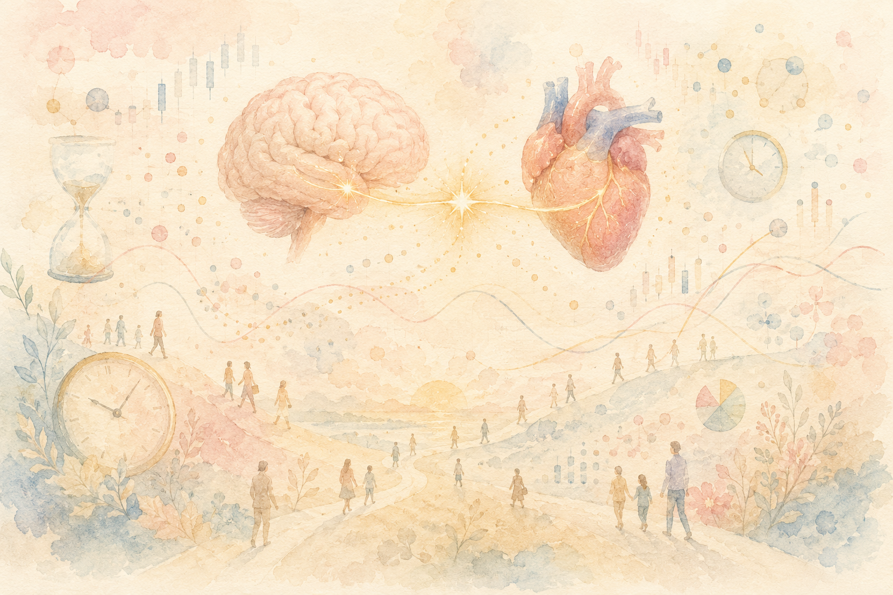
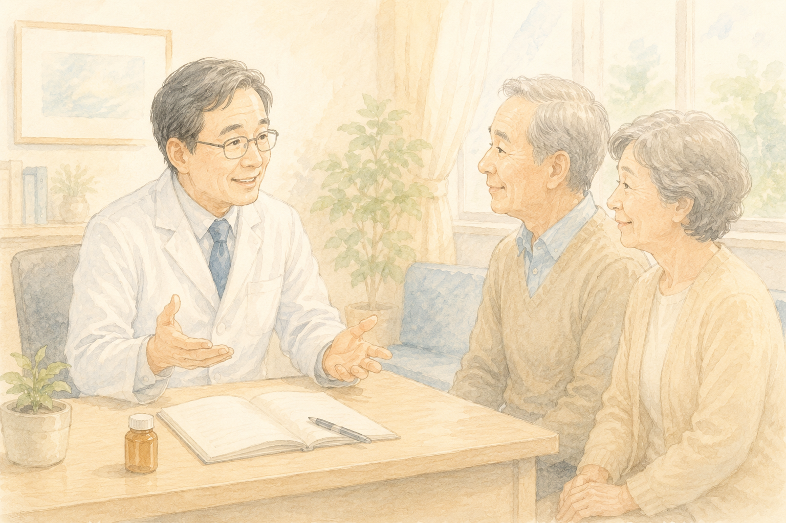

「認知症は、もう治せない病気だと思っていませんか？」

最近のニュースで、新しいお薬（レカネマブ・ドナネマブ）の話題を耳にした方も多いと思います。「うちの家族にも使えるのかな？」「薬がダメでも、家でできることってあるの？」——そんな疑問を抱えていらっしゃるご家族・ご本人もいらっしゃるのではないでしょうか。

実は、2026年5月、日本の認知症治療の **教科書（ガイドライン）** が **9年ぶりに大改訂** されました。
中身を読むと、認知症をめぐる景色が **この10年で大きく変わった** ことがよく分かります。

今日はその改訂のポイントを、できるだけやさしく整理してみます。

 

> ✅ 認知症は「治せない病」から **「進行を抑える病」** へと、医療の前提が変わってきています
>
> ✅ 新しいお薬は **MCI〜軽度** が対象。それ以外の方や進行例には **運動療法・認知リハ・音楽療法** がしっかり位置づけられました
>
> ✅ 中でも **「二重課題（デュアルタスク）」** は、認知機能が低下した方にも取り入れやすい新しい運動の形です

少し長めの記事になりますので、気になるところからお読みください。

- [そもそも：「ガイドライン」って何のこと？](#そもそもガイドラインって何のこと)
- [改訂のポイント①：「治せない」から「進行を抑える」へ](#改訂のポイント治せないから進行を抑えるへ)
- [改訂のポイント②：新しいお薬の位置づけが明確に](#改訂のポイント新しいお薬の位置づけが明確に)
- [改訂のポイント③：非薬物療法がしっかり書き込まれた](#改訂のポイント非薬物療法がしっかり書き込まれた)
- [PTの目から見た「二重課題運動」の重要性](#ptの目から見た二重課題運動の重要性)
- [家でできる二重課題の例](#家でできる二重課題の例)
- [いま私たちにできること](#いま私たちにできること)
- [おわりに 〜希望が持てる時代へ〜](#おわりに-希望が持てる時代へ)

## そもそも：「ガイドライン」って何のこと？

ガイドラインというのは、ひとことで言えば **お医者さんたちの「最新の教科書」** です。

日本では各分野の専門学会が、その時点で最も信頼できる研究をまとめて「いま、この病気にはこう向き合うのが標準ですよ」という指針を作っています。今回大改訂されたのは、日本神経学会などが中心となってまとめている **『認知症疾患診療ガイドライン2026』**。

前のバージョンは2017年版。**9年ぶりの大改訂** ということになります。

なぜ9年もかかったのか。それは、ここ数年で **認知症の景色が大きく変わった** からです。

## 改訂のポイント①：「治せない」から「進行を抑える」へ

これが、今回の改訂の **一番大きな変化** だと私は感じています。

2017年の前回版が出た頃、認知症は「進行を止められない病」と考えられていました。お薬は **症状をやわらげる** ことが目的で、病気そのものの進行には手が出せませんでした。

ところが、2023年末に **レカネマブ**、2024年に **ドナネマブ** という新しいタイプのお薬が日本で承認されたことで、状況が変わります。

これらの新薬は、アルツハイマー病の原因と考えられている **アミロイドβ（ベータ）** という脳のゴミを取り除くことで、**病気の進行そのものを遅らせる** ことを目指したお薬です。

つまり——

- 2017年：認知症は「治療不可能な病」
- 2026年：認知症は「**進行を抑制できる病**」

このわずか9年で、認知症医療の前提が **180度近く変わった** わけです。

> 💡 詳しい新薬の解説は、以前まとめた記事もぜひ参考にしてください。
> 👉 [認知症の薬、いま何が変わったのか](/posts/dementia-drug-therapy/)

## 改訂のポイント②：新しいお薬の位置づけが明確に

ガイドライン2026では、新薬（レカネマブ・ドナネマブ）の **使い方の枠組み** がしっかり書き込まれました。

ポイントは大きく2つです。

- **対象は MCI〜軽度のアルツハイマー型認知症** に限られる
- 使う前に **アミロイド検査（PET検査または脳脊髄液検査）** で、脳にアミロイドβが溜まっているかを確認する必要がある

つまり「アルツハイマー型認知症と診断された人全員が使えるお薬」ではないのです。
**早期に、検査を経て** 使うお薬という位置づけが明確になりました。

このため、**「もの忘れが少し気になる」段階で受診すること** の意味が、これまで以上に大きくなっています。

## 改訂のポイント③：非薬物療法がしっかり書き込まれた

新薬の話題が目立ちますが、私が今回の改訂で **特に注目** したいのは、もう一つの大きな変化です。

それは **「お薬の対象にならない方」「すでに進行している方」に対して、何ができるのか** が、これまで以上に詳しく書き込まれたことです。

具体的には——

- **運動療法**（有酸素運動・筋トレ・**二重課題**など）
- **認知リハビリテーション**（記憶・注意・判断のトレーニング）
- **音楽療法**
- **回想法**

といった **非薬物療法** が、エビデンスにもとづいて整理されています。

新薬は「早期」の方限定です。だからこそ、それ以外の幅広いステージの方には、**「生活そのもの」で支えていく** という方向性が、これまで以上にはっきりと打ち出されたわけです。

> 💡 関連記事：
> 👉 [認知症リスクを45％下げる運動習慣](/posts/dementia-prevention-exercise/)

## PTの目から見た「二重課題運動」の重要性

ここからは、現場で30年関わってきた **理学療法士としての視点** で、特に注目したい部分をご紹介します。

それが、ガイドライン2026で **進行例にも有効** と明記された **「二重課題（デュアルタスク）」** の運動療法です。

### 二重課題（デュアルタスク）ってなんですか？

ひとことで言えば、**「2つのことを同時にやる」** 運動のことです。

たとえば——

- 歩きながら **しりとり** をする
- 足踏みしながら **100から3ずつ引き算** をする
- 椅子に座って **足を上げ下げしながら** 都道府県の名前を順番に言う

このように、**体を動かしながら頭も使う** 運動です。皆さんも、「コグニサイズ」という言葉を聞いたことがあるかもしれませんね。コグニサイズも、この二重課題運動の代表的な取り組みのひとつです。

### なぜ「進行例にも有効」と書かれたのか

これまで、認知機能が低下してきた方には「単純な運動」が中心でした。複雑な指示は混乱を招くと考えられていたからです。

ところが近年、**軽度〜中等度の認知症の方であっても**、適切な難易度で二重課題を取り入れると——

- **転倒予防** に役立つ
- 認知機能の **維持** につながる
- **日常生活の自立** を支える

といった効果が報告されるようになってきました。

ガイドライン2026は、こうしたエビデンスを踏まえて、**進行例にも積極的に運動療法を組み合わせる** という方針を明確にしました。

これは、現場で関わる私たちにとって、とても大きな一歩です。

## 家でできる二重課題の例

実際にどんなことから始めればいいのでしょうか。ご自宅でも安全に取り入れやすい例を、いくつかご紹介します。

### ① 足踏み × しりとり

椅子に座って、または立って **足踏み** をしながら **しりとり** をします。
転倒の心配がなく、お一人でもご家族とでもできる **入門編** です。

### ② 椅子からの立ち座り × 引き算

「椅子から立ち上がって座る」を繰り返しながら、**100から3ずつ引き算** をします。
「100、97、94、91……」とつぶやきながら、ゆっくりで構いません。

### ③ ウォーキング × 計算

散歩しながら **100から7ずつ引き算する**、**今日の天気を口に出す**、**周りの色を3つ言う** など、**外の景色を観察しながら** 体を動かすのも立派な二重課題です。

ポイントは2つ：

- **転倒に注意** すること。最初は座って行う、または手すりがある場所で
- **やりすぎない** こと。疲れすぎると逆効果。「気持ちよく頭が回る」くらいで十分です

うちの母も以前、施設に入る前は、私が遊びがてら「数えながらお洗濯物をたたむ」をやってもらっていました。**遊びの延長で、楽しく取り入れる** のがいちばん長続きします。

### みんなでやるともっと楽しい

私が日々の臨床や地域の体操教室で実感していることがあります。それは——

**ご自宅でお一人でやる二重課題（コグニサイズ）よりも、地域のみんなで集まって一緒に取り組むほうが、ずっと楽しく、ずっと長続きする** ということです。

笑い声がある、間違えても恥ずかしくない、誰かのリズムに引っ張られる。これは、お一人ではなかなか味わえない時間です。

お住まいの地域に **介護予防教室・百歳体操の会・コグニサイズの集まり** があれば、ぜひ一度のぞいてみてください。きっと、ご本人にもご家族にも、新しい居場所が見つかるはずです。

> 💡 関連記事：
> 👉 [1日5,000〜7,500歩で、アルツハイマー病の進行が遅くなる？](/posts/walking-7500-steps/)

## いま私たちにできること

ガイドライン2026から、ご家族・ご本人の暮らしに引き寄せて、整理しておきます。

✅ もの忘れが気になり始めたら、**早めに受診** する。新薬は「早期」が対象です

✅ 受診時に **アミロイド検査** の話が出たら、検査が必要な理由をお医者さんに聞いてみる

✅ 新薬の対象でない方も、**運動療法・認知リハ・音楽療法** などの選択肢がしっかりある

✅ **二重課題運動**（例：足踏み × しりとり）は、ご自宅でも取り入れやすい

✅ お住まいの地域の **介護予防教室・コグニサイズの集まり** に参加すると、楽しく長続きしやすい

✅ お薬・検査の判断は **必ずかかりつけ医に相談** してから

## おわりに 〜希望が持てる時代へ〜

正直に申し上げます。
私自身、ガイドラインの改訂内容を読んで、**「希望が持てる時代になってきたな」** と素直に感じました。

「治せない病」から「進行を抑える病」へ。
これは、認知症と向き合うご家族にとっても、現場で関わる私たちにとっても、**気持ちの持ちようが変わる** 大きな転換だと思っています。

そしてもう一つ、私が嬉しく感じたのは——

> **「お薬だけ」ではなく、「運動」「リハビリ」「音楽」といった、生活そのものでも、認知症の進行を緩やかにできる**

ということが、教科書に明記されたことです。

私たち理学療法士が、地域の体操教室や通所リハで「**二重課題、もっと取り入れていきましょう**」と提案しやすくなりました。
ご家族の中で「**散歩しながらしりとりしてみよう**」と工夫することにも、ちゃんとした **科学的な裏付け** ができたわけです。

これからの9年間で、認知症が **「進行を抑える病」から「治せる病」へ** と、また景色が変わっていくことを、心から願っています。

希望は、もう絵空事ではありません。

---

## 参考にした情報

- 日本神経学会ほか『認知症疾患診療ガイドライン2026』2026年5月発刊
- 解説記事：[ケンタツマガジン「9年ぶりの大改訂！新薬承認とアルツハイマー病連続体がもたらすパラダイムシフト」](https://www.mcsg.co.jp/kentatsu/dementia/102261)（2026年）
- 関連：レカネマブ・ドナネマブの国内承認情報、各種医学誌レビュー

※本記事の医療情報は一般的な解説です。お薬の使用や検査の判断は、必ずかかりつけ医にご相談ください。
