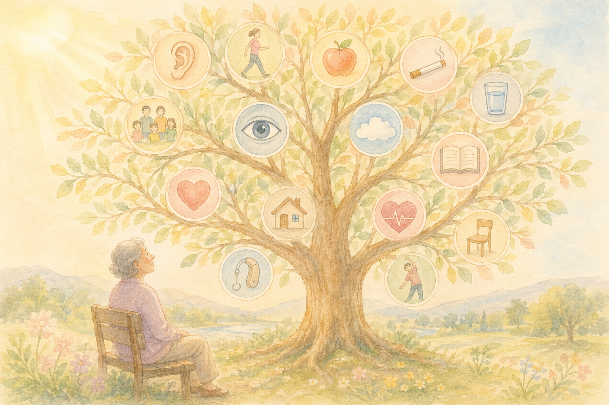
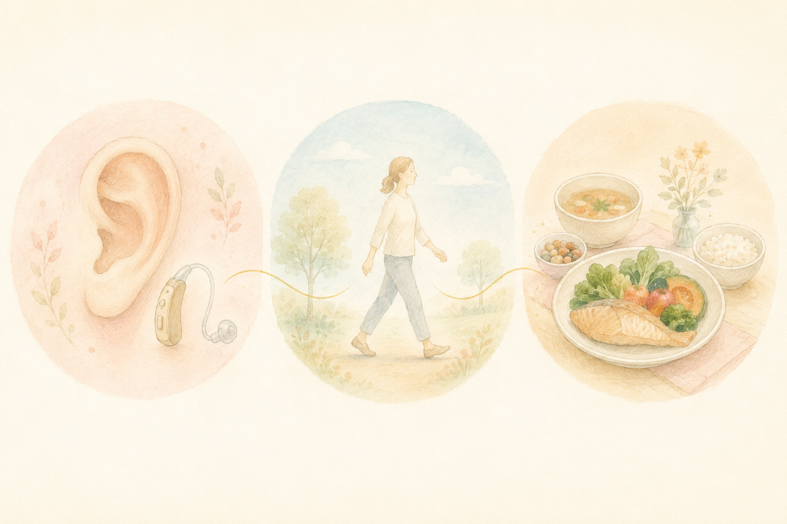
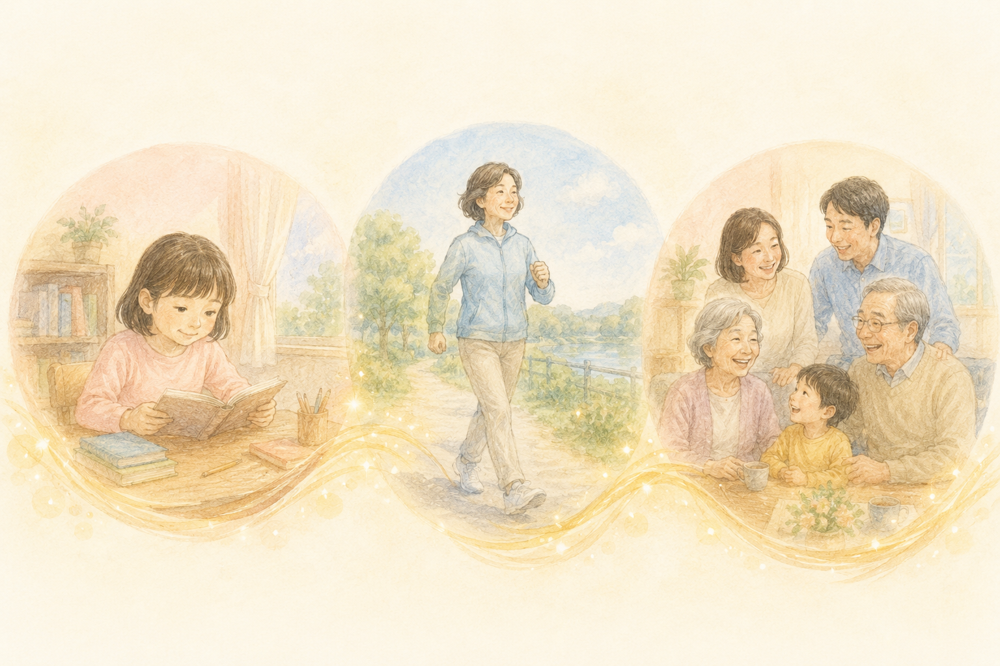

「認知症は、年をとれば誰でもなるもの」「家系だから、私もきっと……」――  
そんなふうに、半ばあきらめてしまっている方は、いらっしゃいませんか？

実は、世界的に権威のある医学誌『ランセット』の専門委員会が、こう報告しています。

> **「認知症のリスク要因の約45％は、生活習慣で管理・遅らせることができる」**

そして 2026年1月、**日本人を対象にした最新研究** が、その姉妹誌である **『The Lancet Regional Health – Western Pacific』** に掲載されました。  
東海大学の和佐野浩一郎先生らによる研究で、結論はこうです。

> **「日本人でも、最大で約 38.9％ の認知症は、理論上 予防できる」**

そして、日本でとくに大きな影響を持つのが、**「難聴」と「運動不足」** だったのです。

> ✅ 14のリスク要因を合計すると、日本人でも **約4割** の認知症が予防可能と推計
>
> ✅ 日本でとくに影響が大きい3因子は **難聴・身体不活動・高LDLコレステロール**
>
> ✅ 早めの対策（聴覚ケア・運動・健診）で、年間 **約20万人** の発症を抑えられる可能性

---

## 目次

1. [そもそも「14のリスク因子」って？](#そもそも14のリスク因子って)
2. [日本人で大きい3つの因子](#日本人で大きい3つの因子)
3. [なぜ「難聴」が最大のカギ？](#なぜ難聴が最大のカギ)
4. [14因子を年代別に整理してみる](#14因子を年代別に整理してみる)
5. [いま、私たちにできること](#いま私たちにできること)
6. [おわりに](#おわりに)

---

## そもそも「14のリスク因子」って？


認知症って、遺伝や年のせいでどうしようもない……と思っていました。本当に自分で減らせるものなんですか？



いい質問ですね。もちろん年齢や体質も関係します。でも研究では、生活や環境を整えることで **減らせるリスク** が14個も見つかっているんです。ひとつずつ見ていきましょう。


きっかけになったのは、世界の認知症研究をリードしている **「ランセット委員会」** が、2024年に発表した報告書です。

そこでは、認知症になるリスクを上げる要因のうち、**「自分や社会の力で変えられるもの＝修正可能なリスク因子」** が **14個** 挙げられました。

ざっくりまとめると──

> 「生まれつきや遺伝で決まるものではなく、**生活や環境を整えることで減らせるリスク**」が、世界全体では認知症の **約45％** を占めている。

これだけでも十分驚きの数字ですが、「日本ではどうなのか？」が気になるところです。

そこに答えを出してくれたのが、今回の和佐野先生らの研究です。

---

## 日本人で大きい3つの因子


1位が『難聴』なんですね。耳の聞こえが認知症と関係するなんて、ちょっと意外です……。



そう思いますよね。でも近年、**耳の聞こえは脳への大切な入り口** として注目されているんです。この表の数字の意味も、あとでやさしく解説していきますね。


研究では、日本の国民健康・栄養調査や大規模調査のデータを使って、**「日本人の中で、どの因子がどれくらい大きいか」** を計算しました。

| 順位 | 因子 | 日本での影響 |
|---|---|---|
| 1位 | **難聴** | 6.7％ |
| 2位 | **身体不活動（運動不足）** | 6.0％ |
| 3位 | **高LDLコレステロール** | 4.5％ |
| 4位 | 糖尿病 | 3.0％ |
| 5位 | 高血圧 | 2.9％ |

世界の研究では「難聴」と「高LDLコレステロール」が大きいとされていましたが、**日本人では「身体不活動（運動不足）」が世界平均より大きく** 出ているのが特徴的でした。

> 日本では「運動不足が、認知症の大きな原因のひとつ」――  
> あらためて、**毎日の体の動かし方** の大切さが見えてきます。

---

## なぜ「難聴」が最大のカギ？


最近、テレビの音が大きいって家族に言われて……。でも補聴器はまだ早い気がして。放っておいても大丈夫ですか？



気づいたことが、もう大きな一歩なんです。聞こえづらさを放っておくと、会話や外出がおっくうになりやすい。だからこそ **年齢のせいにせず、一度耳鼻科で相談してみましょう**。理由をこれから3つに分けてお話ししますね。


「耳の聞こえと、認知症が関係あるの？」と、不思議に思われるかもしれません。  
でも研究の世界では、**難聴は最大の修正可能なリスク因子** として、近年とても注目されています。

考えられている理由は、こんな感じです。

### ① 脳に届く情報が減ってしまう

聞こえが悪くなると、家族や友人との会話がだんだん面倒になり、**脳に入ってくる "刺激" が減ってしまいます**。脳は使われないと、少しずつ働きが衰えてしまうのです。

### ② 人との交流が減りやすい

会話がうまくいかないと、外出や集まりを **遠ざけがち** になります。社会的な孤立は、それ自体が認知症の大きなリスク要因のひとつです。

### ③ 補聴器の活用で、リスクが下がる可能性

近年の研究では、**適切に補聴器を使うことで、認知症の発症リスクが下がる可能性** も報告されてきています。

> 「ちょっと聞こえづらいな……」と感じたら、年齢のせいと放置せず、**耳鼻科で一度しっかり相談してみる** のが、いちばん確かな第一歩です。

---

## 14因子を年代別に整理してみる

ランセット委員会は、14因子を **「人生のどの時期に気をつけるとよいか」** で3つに分けています。日本人での割合（数字）と合わせて整理します。

### 早期（こども・若年期）

- 教育歴の低さ：1.5％

### 中年期（おおむね 45〜64歳）

- 難聴：6.7％
- 身体不活動：6.0％
- 高LDLコレステロール：4.5％
- 糖尿病：3.0％
- 高血圧：2.9％
- うつ：2.6％
- 喫煙：2.2％
- 過度の飲酒：1.3％
- 外傷性脳損傷（頭のケガ）：0.8％
- 肥満：0.7％

### 老年期（65歳以上）

- 社会的孤立：3.5％
- 大気汚染：2.5％
- 未治療の視力低下：0.6％

> こうやって眺めると、**ひとりで全部対策する必要はない** ことが分かります。  
> ご自身に当てはまるところから、ひとつずつで十分です。

---

## いま、私たちにできること


14個もあると、全部やらなきゃと思うと気が重くて……。何から手をつければいいですか？



全部を一度にやる必要はまったくないんです。**ご自分に当てはまりそうなものを、ひとつだけ** で十分。まずは気になる一つから始めてみましょう。


ここまでの内容を、**今日からできるかたち** にまとめます。

- ✅ 「最近、聞こえづらいかも」と感じたら、**年齢のせいにせず耳鼻科で相談**
- ✅ 中年期からは **健診の数値（血圧・LDL・血糖値）** をしっかり管理
- ✅ **1日5,000〜7,500歩** を目安に、毎日少しずつ体を動かす
- ✅ 月1回でもいいので、**人と会う・話す機会** を意識してつくる
- ✅ 喫煙・過度な飲酒は、**今日から少しずつ減らす**

> 関連する記事もあわせてどうぞ。  
> 👉 [1日5,000〜7,500歩で、アルツハイマー病の進行が遅くなる？](/posts/walking-7500-steps/)  
> 👉 [認知症リスクを45%下げる運動習慣 〜60代から始める「脳の貯金」〜](/posts/dementia-prevention-exercise/)

---

### 📚 あわせて読みたい一冊

{{< affiliate
    title="運動脳（新版）"
    image="https://thumbnail.image.rakuten.co.jp/@0_mall/bookfan/cabinet/01021/bk4763140140.jpg?_ex=400x400"
    amazon="https://af.moshimo.com/af/c/click?a_id=5534074&p_id=170&pc_id=185&pl_id=4062&url=https%3A%2F%2Fwww.amazon.co.jp%2Fdp%2FB0GVBCKJDW"
    rakuten="https://af.moshimo.com/af/c/click?a_id=5533903&p_id=54&pc_id=54&pl_id=27059&url=https%3A%2F%2Fitem.rakuten.co.jp%2Fbookfan%2Fbk-4763140140%2F"
    description="14因子のうち「運動不足」「うつ」「社会的孤立」など複数のリスクを、一度にまとめて下げられるのが運動です。スウェーデンの精神科医が、運動と脳の関係を一般向けにわかりやすく解説した世界的ベストセラー。" >}}

### 🛍️ あわせておすすめのアイテム

{{< affiliate
    title="ガーミン vivosmart 5"
    image="https://thumbnail.image.rakuten.co.jp/@0_mall/iget/cabinet/garmin2/vivosmart5-1p.jpg"
    amazon="https://af.moshimo.com/af/c/click?a_id=5534074&p_id=170&pc_id=185&pl_id=4062&url=https%3A%2F%2Fwww.amazon.co.jp%2Fdp%2FB09XGX8ZRW"
    rakuten="https://af.moshimo.com/af/c/click?a_id=5533903&p_id=54&pc_id=54&pl_id=27059&url=https%3A%2F%2Fitem.rakuten.co.jp%2Figet%2Fvivosmart5%2F"
    description="「運動不足」リスクを見える化するなら、毎日の歩数・睡眠スコア・体力レベル（Body Battery）が一目でわかるこの一台。前モデルより画面が66%大きく、シニアにも文字が読みやすくなっています。" >}}



---

## おわりに

認知症は、たしかに加齢とともに増えていく病気です。  
でも、「**約4割は、自分たちの工夫で減らせるかもしれない**」――この事実は、思っている以上に大きな希望だと感じます。

そして、その入り口は、決して特別なものではありません。

> 耳が聞こえやすい状態で、人と話して、毎日少し体を動かす。

たったそれだけのことが、5年後・10年後の自分や、家族の暮らしを、確かに支えてくれる。  
そう思うと、今日からの小さな選択が、ぐっと大切に感じられてきます。

新しい研究の動きは、これからもこのブログで、できるだけわかりやすくお伝えしていきたいと思います。

---

### 参考にした情報

- ケアネット「**認知症の修正可能な14因子、日本人で影響が大きいのは？**」（2026年2月16日）
- 原著論文：Wasano K, et al. **Lancet Reg Health West Pac**. 2026;66:101792.
- 元になったランセット委員会報告：Livingston G, et al. **Lancet**. 2024;404:572-628.
- 東海大学プレスリリース「日本における認知症予防の可能性」

※ 本記事は、上記の医療メディアおよび原著論文をもとに、一般読者向けにわかりやすくまとめ直したものです。耳の聞こえや健診結果について気になる点があれば、必ず耳鼻科やかかりつけ医にご相談ください。

