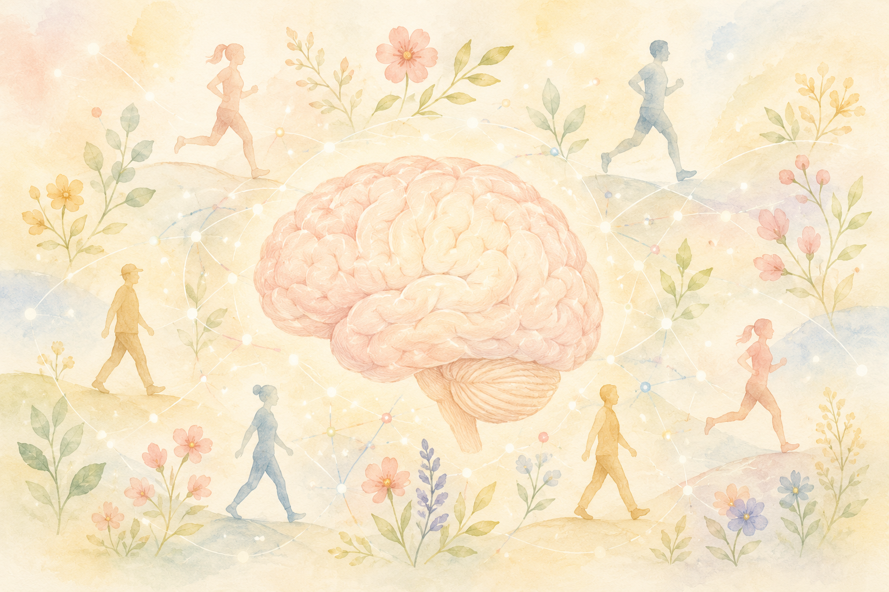
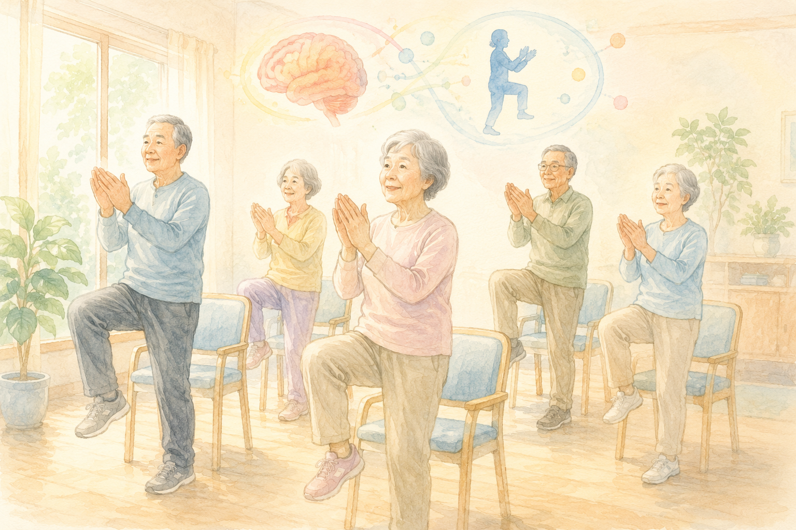
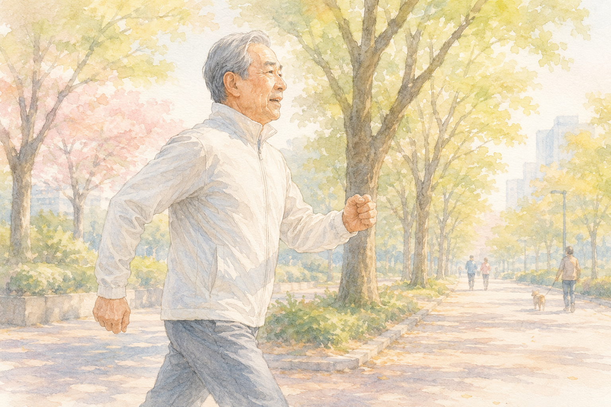

「最近、人の名前がすぐに出てこない」「物のしまった場所をよく忘れる」――  
そんな小さな不安を、ふと感じることはありませんか？

認知症は、ある日突然なるものではなく、**何十年もかけて静かに進む**病気だといわれています。  
だからこそ、「いま、何ができるか」がとても大切です。

最近、世界的に権威のある医学誌『ランセット』の専門委員会が、こんな報告を発表しました。

> **「認知症のリスク要因の約45％は、生活習慣で管理・遅らせることが可能」**

その中でも、今回お伝えしたいのが **「運動」** です。  
私も理学療法士として30年、たくさんの方の体と向き合ってきましたが、「運動が脳に効く」という事実は、年を追うごとに **科学的にもはっきり** してきています。

> ✅ 定期的に運動している人は、認知症リスクが **約31％低い**（早歩きを週3回以上で **50％低下** との報告も）
>
> ✅ 効くのは **有酸素運動＋筋トレ＋コグニサイズ（運動と脳トレの組合せ）** の合わせ技
>
> ✅ 「もう遅い」はありません。**60代・70代から始めても1年で変わります**

---

## 目次

1. [なぜ運動が脳にいいの？](#なぜ運動が脳にいいの)
2. [認知症予防に効く「4つの運動」](#認知症予防に効く4つの運動)
3. [どのくらいやればいい？　頻度・強度・期間の目安](#どのくらいやればいい-頻度強度期間の目安)
4. [60〜70代の方へ　無理なく続けるコツ](#6070代の方へ-無理なく続けるコツ)
5. [理学療法士として、現場で感じていること](#理学療法士として現場で感じていること)
6. [いま、私たちにできること](#いま私たちにできること)
7. [おわりに](#おわりに)

---

## なぜ運動が脳にいいの？


運動が体にいいのは分かるんですけど……『脳にいい』って、どうもピンとこなくて。



そうですよね。実はここ数年で、**運動が脳そのものに効く** しくみが少しずつ分かってきたんです。3つのポイントに分けて、やさしく見ていきましょう。


「運動が体にいい」のはイメージしやすいと思います。  
でも、**運動が "脳" にも直接効く** ということは、案外知られていません。

ここ数年の研究で、こんなしくみが分かってきました。

### ① 筋肉から「脳の肥料」が出る

スクワットなど筋肉を使う運動をすると、筋肉から **イリシン** という物質が出て、脳の中で **BDNF（脳由来神経栄養因子）** を増やすことが分かっています。

BDNF は別名 **「脳の肥料」**。新しい神経のつながりを作ったり、傷んだ神経を修復したりする、とても大切なはたらきをします。

### ② 脳の血のめぐりが良くなる

運動で全身の血流が良くなると、脳にも新鮮な酸素と栄養が届きます。  
特に **運動と頭の体操を組み合わせる** と、記憶を司る脳の領域（海馬）が **萎縮しにくくなる** ことが報告されています。

### ③ リスクそのものが下がる

統計的にも、運動習慣のある人は、ない人に比べて **認知症リスクが約31％低い** というデータがあります。さらに、早歩きなどの **少し息が上がる運動を週3回以上** 行っている方は、**リスクが50％も下がる** との報告もあります。

> 運動は、いま見つかっている認知症予防策の中でも、**もっとも証拠（エビデンス）の積み重なった方法のひとつ** です。

---

## 認知症予防に効く「4つの運動」


どれか一つだけ、いちばん効く運動を教えてもらえたら楽なんですけど……。



その気持ち、よく分かります。でもコツは、**ひとつに絞らず組み合わせる** ことなんです。ここでは4つご紹介しますね。ぜんぶやらなくても、気になったものから大丈夫ですよ。


ポイントは、**ひとつの運動に絞らず、いくつか組み合わせる** ことです。

### ① 有酸素運動

ウォーキング、水泳、サイクリング、軽いダンスなど。  
全身の血のめぐりを良くし、**高血圧・糖尿病といった "血管系のリスク"** を減らすことにもつながります。

### ② 筋力トレーニング

スクワット、つま先立ち、いすからの立ち座りなど。  
筋力を保つことは、将来の **フレイル（虚弱）の予防** にも直結します。

### ③ コグニサイズ（認知運動療法）

聞きなれない言葉かもしれません。これは **「運動」と「計算・しりとりなどの脳トレ」を同時に行う** プログラムです。

> 例：足踏みをしながら、**3の倍数のときだけ手を叩く**  
> 例：歩きながら、**100から7ずつ引き算** していく

「2つのことを同時にやる（二重課題＝デュアルタスク）」ことで、脳がいつもより強く刺激されます。

### ④ 音楽や芸術活動

音楽に合わせて体を動かすダンス、書道、絵画など。  
**前頭葉** など、思考や判断を担う領域の活性化につながると報告されています。

---

## どのくらいやればいい？　頻度・強度・期間の目安


毎日ハードにやらないと意味がないんでしょうか？　そこまでの自信はなくて……。



毎日ヘトヘトになる必要はないんです。目安は **週3日、合計で週150分ほど**。少し息が上がる早歩きくらいでちょうどいいんですよ。ゆっくり無理なく続けるのがいちばんです。


「では、どれくらいやれば効くの？」という、いちばん気になるところです。  
研究で示されている目安は、こんな感じです。

| | 目安 |
|---|---|
| **頻度** | **週3日以上**（合計で **週150分以上** が目標） |
| **強度** | **中強度以上**（少し息が上がる程度の早歩き） |
| **期間** | **半年（24週）以上** 続けると脳の変化が見えてくる |

ここで、ひとつ大事なポイントです。

> **ゆっくり散歩するだけでは、認知機能への効果ははっきり示されていません。**

「ふだんより少し速く歩く」ことを意識してみてください。  
「人と会話しながらでも続けられるけれど、歌うのは少しきつい」――そのくらいの強度が、ひとつの目安です。

---

## 60〜70代の方へ　無理なく続けるコツ


やろうと思っても、いつも三日坊主で終わってしまうんです……。



続かないのは、あなたの意志が弱いからではないんです。大事なのは **『続けられる仕組み』** のほう。誰かと一緒にできる場所を見つけると、ぐっと続けやすくなりますよ。


体力の変化を感じやすいこの年代では、**「無理なく」「楽しく」続ける工夫** が、いちばんの鍵になります。

### ① 「通いの場」やグループに参加する

地域の運動教室、いきいき百歳体操、ボランティア活動など。  
**運動 + 人との交流** が同時にできるので、ひとりでやるより圧倒的に続きます。  
「人と会う」こと自体も、認知症予防のとても大切な要素です。

### ② 日常生活を運動に変える

- 買い物に行くときに、**ひと駅手前から早歩きで歩く**
- テレビCMの間に **スクワットを5回**
- 歯みがきしながら **つま先立ち**

「運動の時間」をわざわざ作るのが難しい方は、**日常の動きを少し変える** だけでも十分な刺激になります。

### ③ 記録をつける

歩数、その日にやった活動、体調をひとことメモする「生活ノート」を作るのもおすすめです。  
**自分の変化が目に見える** ことで、続けるモチベーションが保てます。

---

## 理学療法士として、現場で感じていること

私は理学療法士として、これまでたくさんの高齢の方の運動指導に関わってきました。

「やる気」も、もちろん大事です。  
でも、現場で見ていてもっと大事だと感じるのは、**「続けられる仕組み」** のほうです。

立派な運動メニューを渡しても、ひとりで続けるのは本当に難しいものです。  
そこでおすすめしたいのは、**何でもいいから、地域のコミュニティに出かけてみる** こと。  
体操教室でも、カラオケでも、囲碁将棋の集まりでも、町内会の役でも構いません。

> 出かける → 誰かと話す → 体を動かす

この3つが自然にセットになる場所に、**月1回でも、週1回でも、定期的に顔を出す**。  
これが、私の経験のうえでは、長く続けられるいちばんのコツのように感じています。

---

## いま、私たちにできること

ここまでの内容を、**今日からできるかたち** にまとめます。

- ✅ **週3日**、少し息が上がる程度の **早歩きを30分** から
- ✅ テレビを見ながらでもいい、**スクワットや、いすからの立ち座り** を5〜10回
- ✅ 歩きながら **しりとり・引き算** など、頭も一緒に使う「コグニサイズ」をひとつ
- ✅ 地域の **運動教室・百歳体操・趣味の集まり** に、月1回でもいいので顔を出す
- ✅ 持病のある方は、**始める前にかかりつけ医へひとこと相談**を

すべてを完璧にやる必要は、まったくありません。  
**ひとつだけ、続けやすそうなものを今日から始める** ――それで十分です。

> 関連する記事もあわせてどうぞ。  
> 👉 [認知症の種類とMCIをやさしく解説](/posts/dementia-types-mci/)  
> 👉 [アルツハイマー病に明るい光？〜NAD+研究の進展〜](/posts/alzheimer-nad-plus-research/)

---

### 🏋️ 運動を続けたい方へ

「一人だとなかなか続かない」という方は、通えるジムを利用するのもひとつの方法です。

PR

【銀座】パーソナルジム ACCEPT

世界大会で活躍するプロトレーナーが、マンツーマンで指導。運動が初めての方や年齢が気になる方も、利用期限なしで自分のペースに合わせて続けられます。気になる方は、まず<strong>無料の体験トレーニング</strong>から。

店舗名：【銀座】パーソナルジム ACCEPT 住所：〒104-0061 東京都中央区銀座２丁目１２−４ アジリア銀座 J's402 電話：080-7052-5320 営業時間：10:00〜22:00（定休日：年末年始のみ 12/31〜1/1）

### 🛍️ あわせておすすめのアイテム

{{< affiliate
    title="Xiaomi Smart Band 9 Pro"
    image="https://thumbnail.image.rakuten.co.jp/@0_mall/xiaomiofficial/cabinet/11215576/11215582/imgrc0104890177.jpg"
    amazon="https://af.moshimo.com/af/c/click?a_id=5534074&p_id=170&pc_id=185&pl_id=4062&url=https%3A%2F%2Fwww.amazon.co.jp%2Fdp%2FB0DK71CTCK"
    rakuten="https://af.moshimo.com/af/c/click?a_id=5533903&p_id=54&pc_id=54&pl_id=27059&url=https%3A%2F%2Fitem.rakuten.co.jp%2Fxiaomiofficial%2Fm53488%2F"
    description="運動の継続には『見える化』がいちばんの応援団。シャオミの定番スマートバンドは、歩数・睡眠・心拍を自動記録、21日間のロングバッテリーで充電の手間も少なめ。コストを抑えて始めたい方に。" >}}


---

## おわりに

「もう年だから、いまさら運動しても……」  
そんな声を、現場でも本当によく聞きます。

でも、研究の結果ははっきりしています。  
**60代・70代から始めても、1年続ければ、体も脳も確実に変わります。**

派手な特効薬や、新しい高価なサプリは要りません。  
**今日の一歩が、10年後のあなたの脳を守る「貯金」** になります。

無理なく、楽しく、できれば誰かと一緒に。  
それが、いちばん確かな認知症予防のかたちです。

---

### 参考にした情報

- ランセット委員会 2024年報告（認知症予防可能な14のリスク要因）
- 国立長寿医療研究センター「あたまとからだを元気にする MCIハンドブック」
- 厚生労働省 認知症施策関連資料
- 認知症の予防・診断・治療に関する統合的アプローチ報告書

※ 本記事は、上記の信頼できる医療・公的資料をもとに、一般読者向けにわかりやすくまとめ直したものです。持病のある方や、運動を始めるのが久しぶりの方は、必ずかかりつけ医にご相談のうえ、ご自身に合った強度から始めてください。

