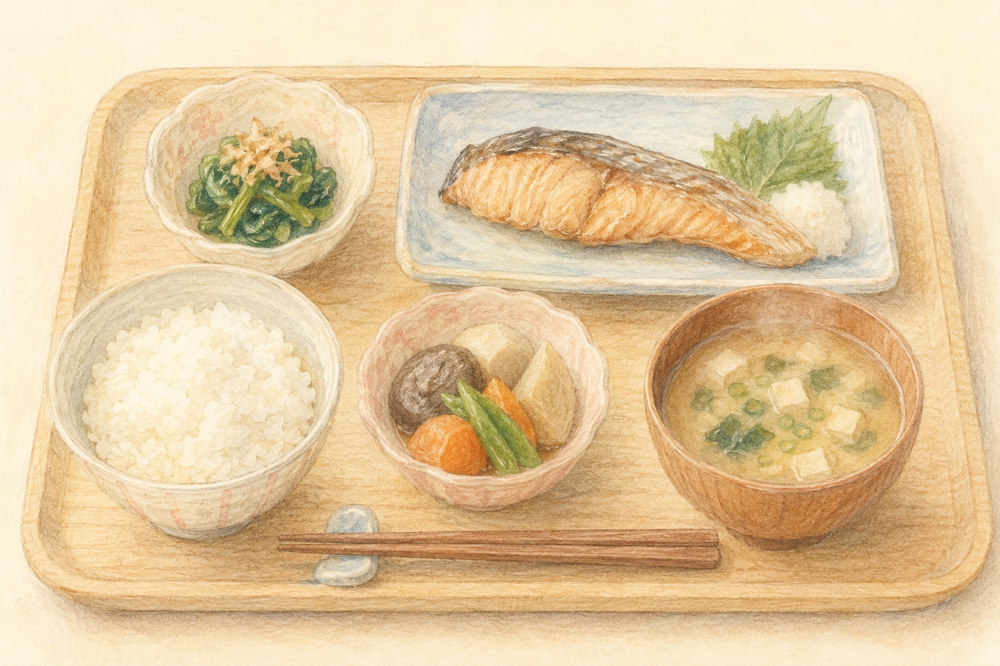
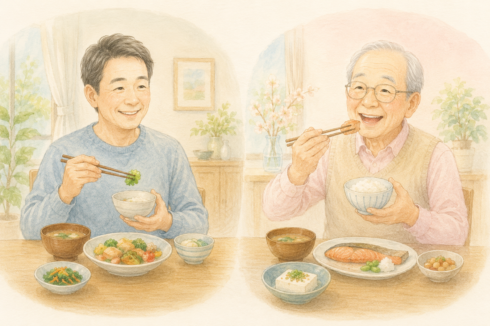
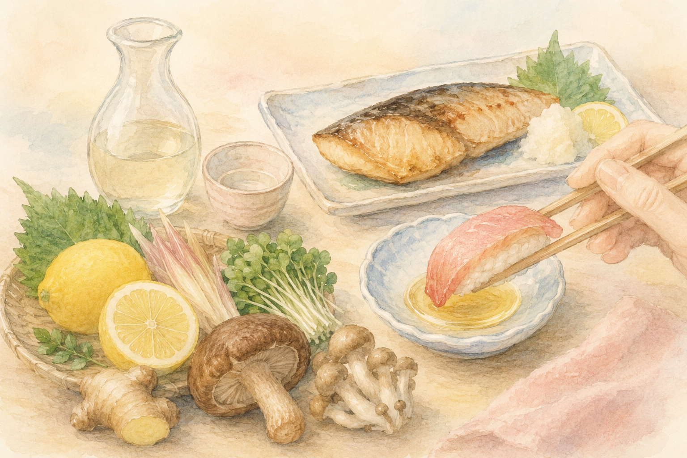
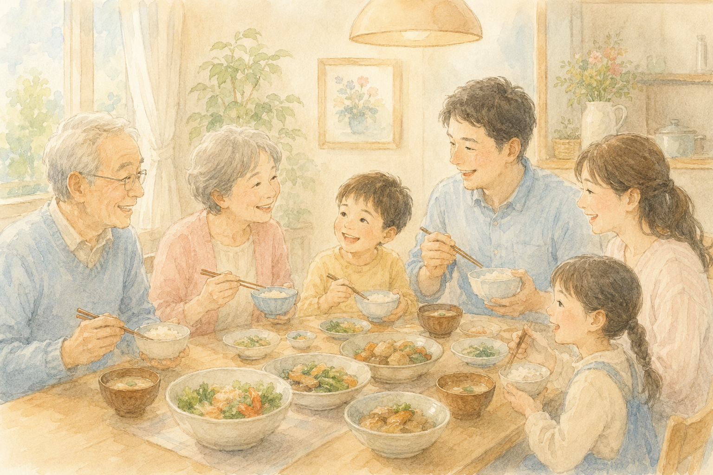

「最近、何を食べたか思い出せない」「同じおかずばかりになっている気がする」――  
食卓を見ながら、ふとそんな小さな不安を感じることはありませんか？

実は、**毎日の食事が、何十年もかけて少しずつ脳の健康をつくっている**ことが、近年の研究でだんだんはっきりしてきました。

そして、もし軽い物忘れ＝**MCI（軽度認知障害）**の段階であれば、適切な対策で **健常な状態へ戻る可能性がある** ことも分かっています。

 

> ✅ 「これさえ食べれば治る」**魔法の食品はありません**。基本は **多様な食品をバランスよく**
>
> ✅ **主食・主菜・副菜**を、1日2食以上そろえることが質のよい食事の目安
>
> ✅ **年代で食事のギアチェンジを**：中年期はメタボ対策、高齢期はフレイル（虚弱）対策

今日は、認知症予防やMCIからの回復を支える「食事の整え方」を、できるだけやさしくまとめてみます。

---

## 目次

1. [そもそも「食事と認知症」って関係あるの？](#そもそも食事と認知症って関係あるの)
2. [基本のキ：主食・主菜・副菜をそろえる](#基本のキ主食主菜副菜をそろえる)
3. [年代でギアチェンジ：中年期と高齢期で気をつけることは違う](#年代でギアチェンジ中年期と高齢期で気をつけることは違う)
4. [減塩・血糖・お酒の付き合い方](#減塩血糖お酒の付き合い方)
5. [「共食」と五感の刺激 〜心と脳を元気に〜](#共食と五感の刺激-心と脳を元気に)
6. [私自身が実践していること（体験談）](#私自身が実践していること体験談)
7. [いま、私たちにできること](#いま私たちにできること)
8. [おわりに](#おわりに)

---

## そもそも「食事と認知症」って関係あるの？

「食事で本当に脳が変わるの？」と思われるかもしれません。  
これについて、近年こんなことが分かってきました。

- いろいろな種類の食品を食べている人ほど、**認知機能の低下が抑えられている**
- 野菜・果物・魚を豊富に含む食事（**地中海食**や、それを応用した **MIND食** と呼ばれるもの）は、抗酸化・抗炎症のはたらきによって認知症予防に役立つと考えられている
- 高血圧・糖尿病・高LDLコレステロールなど **血管の病気** は、認知症のリスクを高めることが分かっている。だから「**血管の健康を保つ食事**」が、そのまま「**脳を守る食事**」になる

つまり食事は、ある日突然脳に効く特効薬ではなく、**毎日少しずつ、脳に栄養を貯金していく**ようなものなのです。

---

## 基本のキ：主食・主菜・副菜をそろえる

「何を食べたらいいの？」と聞かれたら、私はまず **3つの皿をそろえること** をおすすめしています。

### 主食（しゅしょく）

- ごはん、パン、麺類など
- **エネルギー源** になります

### 主菜（しゅさい）

- 魚、肉、卵、大豆製品（豆腐・納豆など）
- **筋肉や脳の材料となるたんぱく質** が豊富

### 副菜（ふくさい）

- 野菜、きのこ、海藻、サラダ、煮物
- **ビタミン・ミネラル・食物繊維** で、脳の酸化ストレスを和らげます

そこに、**果物・ナッツ・乳製品**を少しプラスできれば、栄養バランスはほぼ整います。

> 1日2食以上、**主食・主菜・副菜**がそろっているか――  
> これを意識するだけで栄養バランスは完璧です。

### 朝・昼・夜の小さな工夫

- **朝食**：手間をかけずに **ゆで卵** や **納豆** で主菜を確保。**ヨーグルト** で乳製品もプラス
- **昼食・夕食**：**魚（鯖・イワシ・サンマなど）** を週に2〜3回。**緑黄色野菜** を2種類以上
- **おやつ**：菓子パンやスナックの代わりに **ナッツ・果物・チーズ** を選ぶ

「全部きちんと」と思うと続きません。**1日1回からでOK**。私もそうしています。

---

## 年代でギアチェンジ：中年期と高齢期で気をつけることは違う

ここが、今日いちばんお伝えしたいポイントです。

**40〜64歳の中年期**と**65歳以上の高齢期**では、**気をつけるポイントが正反対** になります。これを知らずに同じ食事を続けていると、せっかくの努力が逆効果になることもあるのです。

### 中年期（40〜64歳）：太らない・血管をいたわる

将来の認知症リスクを高める **糖尿病・高血圧・高LDLコレステロール** を防ぐため、**太りすぎないこと** が大切です。

控えめにしたいもの：

- **肉の脂身・バター**（飽和脂肪酸）
- **マーガリン・ショートニングを使った菓子**（トランス脂肪酸）
- **菓子パン・甘い飲料**（糖質の摂りすぎ）
- **超加工食品**（カップ麺・スナック菓子・加工肉など）

### 高齢期（65歳以上）：痩せすぎ注意・しっかり食べる

ところが65歳を過ぎると、話が逆転します。  
この年代で **「やせすぎ」や「気づかないうちの体重減少」** は、認知症や **フレイル（虚弱）** のリスクをぐっと高めてしまいます。

意識したいこと：

- **BMI 21.5以上** を目安にしっかり食べる（※BMI＝体重kg ÷ 身長m ÷ 身長m）
- **3食欠かさない**
- 食が細くなってきたら、**スキムミルクやきなこを料理に足す** など、効率よく栄養を補う工夫を
- **たんぱく質**（魚・肉・卵・大豆製品）を毎食ひと品は

> 中年期は「**引き算の食事**」、高齢期は「**足し算の食事**」――  
> このギアチェンジを意識できるかどうかで、10年後の脳と体は大きく変わってきます。

---

## 減塩・血糖・お酒の付き合い方

血管の健康は、そのまま脳の健康につながります。3つだけ、押さえておきたいポイントがあります。

### ① 減塩：1日6g未満が目標

高血圧は、脳の細い血管を少しずつ傷つけます。  
すぐにできる工夫はこちらです。

- 醤油やソースは **「かける」より「つける」**
- **出汁・酢・レモン・香辛料** で味に変化をつける
- ラーメンやうどんの **汁は残す**
- 加工食品（ハム・かまぼこ・インスタント食品）は表示を見て **塩分の少ないもの** を

### ② 血糖：甘い飲料と間食を見直す

血糖値の急な上下は、血管に負担をかけます。

- **甘い飲料**（コーラ・甘い缶コーヒー）は週に数本まで
- 間食は **果物やナッツ** に置き換える
- **食物繊維**（野菜・きのこ・海藻）を先に食べると、血糖の上がり方がゆるやかに

### ③ お酒：飲むなら適量を守る

過度の飲酒は脳を萎縮させることが分かっています。一方で、少量なら必ずしも悪者ではないとの報告もあります。

日本の目安は、**1日に純アルコール20g程度まで**。  
これは、**日本酒で1合、ビール中瓶1本（500ml）、ワインなら小さめのグラス2杯** くらいです。

> 休肝日を週2日以上――この習慣も、ぜひセットで。

---

## 「共食」と五感の刺激 〜心と脳を元気に〜

意外に思われるかもしれませんが、**「誰と、どんな気持ちで食べるか」** も、認知機能にとても影響します。

### 「共食（きょうしょく）」のすすめ

ひとりで黙々と食べる「**孤食**」よりも、**誰かと会話しながら食べる**ほうが、

- 食欲が増し、**栄養バランスが自然と整う**
- 会話によって脳が刺激され、**社会的なつながり** が保たれる
- 食べるときの幸福感が、ストレスを和らげる

ご家族と一緒でも、地域の食事会でも、月に1〜2回ご友人とのランチでもかまいません。  
「**誰かと食べる時間**」を、意識して暮らしに組み込んでみてください。

### 五感を刺激する

旬の食材、彩り、温度、香り――こうしたものを楽しむことも、立派な脳トレです。

- 季節の野菜を一品取り入れる
- 器を変えてみる
- 外に出て、レストランや公園で食べる

「おいしいなあ」と感じる時間そのものが、脳と心を元気にしてくれます。

### サプリは「脇役」にとどめる

葉酸やDHAなどのサプリメントは、研究で一時的に効果が示されることもありますが、**長期的な認知症予防効果は十分には証明されていません**。

サプリに頼りすぎず、**まずは食事から**――これが、いまのところ最も確実な道です。

> ※ サプリや薬を新しく始めるときは、**必ずかかりつけ医にひとこと相談**してくださいね。

---

## 私自身が実践していること（体験談）

ここで少し、私の話をさせてください。

実は私自身、**LDLコレステロール値が少し高め** で、健診のたびに気にしている一人です。  
理学療法士として食事のアドバイスをする立場でもあるのですが、自分のこととなると、なかなか完璧にはいかないものです。

それでも、いまは無理のない範囲で、**3つのことだけ** を続けています。

### ① 肉の脂身・バターは控えめに

ステーキの脂身を残す、バターをマーガリンより少なめのオリーブオイルに変える――  
**「全部やめる」のではなく「減らす」** というゆるい気持ちで取り組んでいます。

### ② 魚（鯖・イワシなど）を意識して食べる

週に2〜3回は、**青魚** を食卓に。  
缶詰（鯖缶・イワシ缶）も気軽に使えて、調理も楽です。  
**n-3系脂肪酸**（EPA・DHA）が、血管にも脳にもやさしくはたらいてくれると言われています。

### ③ 野菜・豆類・きのこ・海藻を増やす

**食物繊維** は、コレステロール対策にも、血糖対策にも、お通じにも効きます。  
味噌汁の具に、きのこ・海藻・豆腐をたっぷり入れるだけでも、ぐっとバランスが良くなります。

---

完璧な食事を毎日続けるのは、本当に難しいことです。  
それでも、**「自分が無理なく続けられる、3つの工夫」** を持っておくと、不思議と続きます。

「**気にしすぎないこと**」も、長く続けるうえでとても大切です。  
私自身、外食したり、たまには甘いものを楽しんだりもしています。それでいいのだと思っています。

---

## いま、私たちにできること

ここまでの内容を、**今日からできるかたち** にまとめます。

- ✅ **1日2食以上**、主食・主菜・副菜の3つをそろえる
- ✅ **魚（鯖・イワシ・サンマなど）** を週に2〜3回食卓へ
- ✅ **野菜・きのこ・海藻** を、味噌汁や副菜でしっかり
- ✅ **菓子パン・甘い飲料・カップ麺** の頻度を減らす
- ✅ **減塩**：醤油は「つける」、麺の汁は残す
- ✅ 月に1〜2回は **誰かと食卓を囲む**「共食」を
- ✅ 65歳以上の方は **痩せすぎ注意**。たんぱく質と3食を欠かさず
- ✅ 持病のある方は、**かかりつけ医にひとこと相談**を

> 関連する記事もあわせてどうぞ。  
> 👉 [認知症リスクを45％下げる運動習慣](/posts/dementia-prevention-exercise/)  
> 👉 [日本人の認知症、約4割は予防できる](/posts/dementia-japan-14-factors/)  
> 👉 [認知症の種類とMCIをやさしく解説](/posts/dementia-types-mci/)

---

### 📚 あわせて読みたい本

{{< affiliate
    title="最高の体調"
    image="https://thumbnail.image.rakuten.co.jp/@0_mall/bookfan/cabinet/00814/bk4295402125.jpg?_ex=400x400"
    amazon="https://af.moshimo.com/af/c/click?a_id=5534074&p_id=170&pc_id=185&pl_id=4062&url=https%3A%2F%2Fwww.amazon.co.jp%2Fdp%2F4295402125"
    rakuten="https://af.moshimo.com/af/c/click?a_id=5533903&p_id=54&pc_id=54&pl_id=27059&url=https%3A%2F%2Fitem.rakuten.co.jp%2Fbookfan%2Fbk-4295402125%2F"
    description="「なぜ私たちは現代食で不調になるのか」を、進化医学の視点からやさしく整理した一冊。食事だけでなく、睡眠・運動・腸内環境まで含めて『最高の体調』を整える方法が、シニア世代にも分かりやすく書かれています。" >}}

{{< affiliate
    title="脳の毒を出す食事"
    image="https://thumbnail.image.rakuten.co.jp/@0_mall/bookfan/cabinet/00939/bk4478110255.jpg?_ex=400x400"
    amazon="https://af.moshimo.com/af/c/click?a_id=5534074&p_id=170&pc_id=185&pl_id=4062&url=https%3A%2F%2Fwww.amazon.co.jp%2Fdp%2F4478110255"
    rakuten="https://af.moshimo.com/af/c/click?a_id=5533903&p_id=54&pc_id=54&pl_id=27059&url=https%3A%2F%2Fitem.rakuten.co.jp%2Fbookfan%2Fbk-4478110255%2F"
    description="抗加齢医学の第一人者・白澤卓二先生による、認知症予防のための食事レシピ本。アルミニウム・糖化・酸化など、脳にたまりやすい「毒」をどう食事で減らしていくか――具体的な献立と買い物リストまで載っていて、明日からの食卓にすぐ取り入れられます。" >}}

---

## おわりに

「これを食べれば認知症にならない」という魔法の食品は、残念ながらありません。  
でも、**毎日の食卓を少しだけ整えること**が、5年後・10年後のあなたの脳を確かに守ってくれます。

そしてもし、いまMCI（軽度認知障害）の段階だとしても、**「もう手遅れ」ではありません**。  
食事を整え運動習慣をつけることで、**健常な状態に戻る可能性も十分にある**と分かってきています。

まずは、**毎日体重を測ること**、そして「1日1回、主食・主菜・副菜をそろえてみる」――  
そんな小さな一歩から、ご一緒に始めてみませんか。

---

### 参考にした情報

- ランセット委員会 2024年報告（認知症予防可能な14のリスク要因）
- 国立長寿医療研究センター「あたまとからだを元気にする MCIハンドブック」
- 厚生労働省 認知症施策関連資料
- 日本高血圧学会・日本動脈硬化学会のガイドライン

※ 本記事は、上記の信頼できる医療・公的資料をもとに、一般読者向けにわかりやすくまとめ直したものです。持病のある方や、現在治療中の方は、必ずかかりつけ医にご相談のうえ、ご自身に合った食事のかたちを見つけてください。

