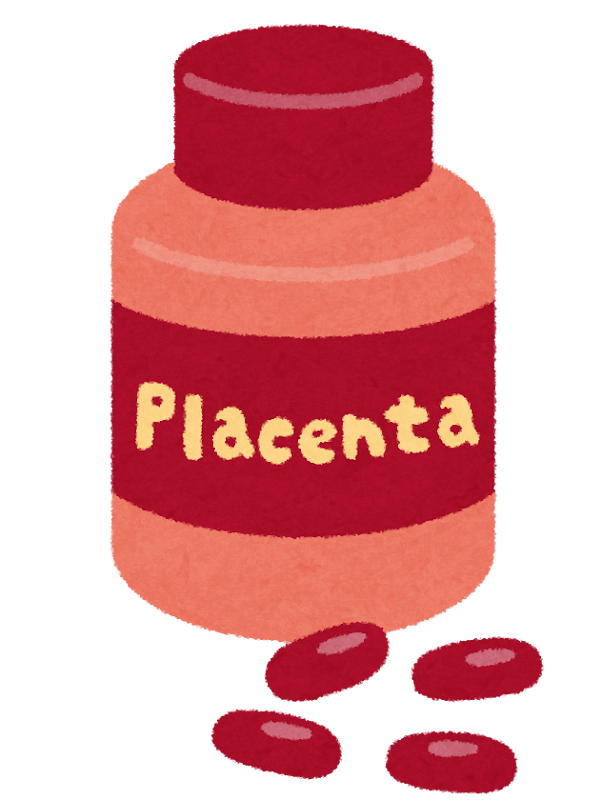

「頭のために、DHAを飲んでいます」

外来やリハビリの場で、何度も聞いた言葉です。テレビでも、新聞の広告でも、よく見かけます。**魚の油が脳にいい**というのは、もうすっかり定着した話になりました。

私自身、長いあいだ「まあ、悪いことではないだろう」と思っていました。

ところが2026年、その考え方をひとつ整理し直す研究が出ました。しかも、**期待はずれだったから**ではありません。**期待どおりだったのに、その先が続かなかった**からです。

> ✅ DHAのサプリを2年間しっかり飲んだ方の**髄液を調べたら、脳にはちゃんと届いていました**。ここは、はっきり証明されました
>
> ✅ ところが**2年後の脳の大きさも、考える力も、飲まなかった方と差は見つかりませんでした**
>
> ✅ 一方で、**食べものとしての魚**については、たくさん食べる方のほうが認知症が**2割ほど少ない**という報告が続いています。**魚とカプセルは、別の話**として考えたほうがよさそうです

> ひざのサプリについても、似た構図の記事を書いています。あわせてお読みください。
> 👉 [ひざのために飲んでいたサプリが、脳には](/posts/glucosamine-dementia-2026/)

---

## 目次

1. [まず、この研究のすごいところ](#まずこの研究のすごいところ)
2. [脳には、たしかに届いていた](#脳にはたしかに届いていた)
3. [それでも、2年後は変わらなかった](#それでも2年後は変わらなかった)
4. [正直に書いておきたい、この研究の限界](#正直に書いておきたいこの研究の限界)
5. [「かえって早いのでは」という報告と、その反論](#かえって早いのではという報告とその反論)
6. [これまでの研究をまとめると](#これまでの研究をまとめると)
7. [では、魚そのものはどうなのか](#では魚そのものはどうなのか)
8. [公的機関は、どう言っているか](#公的機関はどう言っているか)
9. [いま飲んでいる方へ](#いま飲んでいる方へ)
10. [現場で見てきたこと](#現場で見てきたこと)
11. [いま、私たちにできること](#いま私たちにできること)
12. [おわりに](#おわりに)
13. [参考にした情報](#参考にした情報)

---

## まず、この研究のすごいところ

アメリカ・南カリフォルニア大学のグループが行った「**PreventE4**」という試験です。

サプリの研究というと、「飲んでいる人と飲んでいない人を比べた」というものが大半です。それでは、**もともと健康に気をつかう人がサプリを飲んでいるだけ**かもしれません。

この試験は違います。

- **くじ引きで、DHAを飲むグループと、見た目が同じ偽物を飲むグループに分けた**
- **本人にも、調べる側にも、どちらか分からないようにした**
- **739人を調べて、条件に合う365人**を追いかけた
- 期間は**2年間**

対象になったのは、**平均66歳**で、まだ認知症のない方たち。しかも「**ふだん魚をあまり食べない方**」（食事からのDHAが1日200mg未満）に絞っています。もともと足りていない人に足したら、どうなるか。よく考えられた設計です。

**飲んだ量は1日2グラム。** 市販のサプリよりかなり多い量です。

---

## 脳には、たしかに届いていた

この試験がいちばん知りたかったのは、実は「頭が良くなるか」ではありませんでした。

**飲んだDHAが、本当に脳まで届くのか。** そこを確かめることが第一の目的でした。

そのために、**背中から針を刺して髄液（脳と脊髄をひたしている液体）を採る**という、かなり大変な検査をしています。

結果は、はっきりしていました。

| | 髄液のDHAの変わり方 |
|---|---|
| DHAを飲んだ方 | **増えた（+0.17）** |
| 偽物を飲んだ方 | ほぼ変わらず（−0.02） |

血液のほうでも、オメガ3の指標が**4.9%から11.0%へ**と、しっかり上がっていました。

**飲めば届く。** これは、この試験が証明したことです。


届いているなら、いいことなのでは？




私も最初にそう思いました。**ここまでは、期待どおりだったんです。**

問題は、その先でした。**届いたのに、その先で何かが変わったようには見えなかった**んですね。


---

## それでも、2年後は変わらなかった

2年後、参加した方たちの脳をMRIで調べ、考える力の検査も行いました。

- **海馬**（記憶にかかわる部分）の大きさ……差は見つからず
- **大脳皮質の厚み**……差は見つからず
- **考える力の検査**……差は見つからず

**脳には届いた。でも、脳は変わらなかった。**

これがこの試験の結論です。研究者たちは論文の最後で、「**今後は、サプリを飲ませる試験よりも、脳のなかでDHAがどう使われているかの研究を優先すべきだ**」と書いています。かなり踏み込んだ書き方だと思います。

---

## 正直に書いておきたい、この研究の限界

ただし、この結果も慎重に読む必要があります。

**ひとつめ。考える力の検査は、この試験の「おまけ」でした。**

この試験がいちばん確かめたかったのは、あくまで**髄液にDHAが増えるか**です。考える力の検査は「探索的」、つまり参考として調べた項目でした。ですから、**認知機能に効かないことが証明された、とまでは言えません**。

**ふたつめ。途中でやめた方が4割近くいました。**

新型コロナの流行と重なったこともあり、**2年間やり通せたのは225人**でした。しかも、途中でやめた方のほうが、もともとの検査の点数が低い傾向がありました。

つまり、**差がなかったのではなく、差は見つからなかった**というのが正確です。


「差がない」と「差が見つからない」は、違うんですか？




これは、健康の情報を読むときにいちばん役に立つ区別かもしれません。

**「差がない」＝ないことを確かめた。**
**「差が見つからない」＝探したけれど、見つけられなかった。**

人数が少なかったり、途中でやめた人が多かったりすると、**本当は小さな差があっても見つけられません。** 今回はそちらに近い状況でした。

ですから私は、この研究を「効かないと分かった」ではなく「**2年では、目に見える変化は出なかった**」と受け取っています。


---

## 「かえって早いのでは」という報告と、その反論

同じ2026年、もう少し気になる報告も出ました。

アメリカの大規模な脳の研究データを使って、**魚油サプリを飲んでいる273人と、飲んでいない546人**を約5年追いかけたところ、**飲んでいる方のほうが、考える力の下がり方が速かった**という結果でした。

ただ、この報告には**同じ雑誌に反論の手紙が載っています。** 要点は3つです。

- データには「飲んでいるか、いないか」しかなく、**質の良い魚油と、酸化した安物を区別していない**
- **サプリを飲みはじめる人は、うっすら不安を感じている人**かもしれない。つまり「衰えてきたから飲みはじめた」という**逆向きの説明**が十分に成り立つ
- **一律に「害がある」と言える段階ではない**

私も同じ意見です。**「サプリのせいで悪くなる」と結論づけるには、まだ材料が足りません。** ここは「そういう報告も出た。議論はこれから」という段階です。

---

## これまでの研究をまとめると

過去の研究をまとめた報告もあります。**9つのまとめ研究、14の臨床試験、のべ26,881人**を整理したものです。

結論は、こうでした。

- 認知機能の検査で、**ごくわずかな改善**が見られた
- ただしその差は**とても小さく**、統計上ぎりぎりのところ
- そして、**たくさん飲んでも良くなるわけではなかった**（量と効果に関係が見られなかった）

**「まったくの無駄とは言えないが、期待するほどではない」。** いまの科学が言えるのは、このあたりまでです。

---

## では、魚そのものはどうなのか

ここが、この記事でいちばんお伝えしたいところです。

**カプセルの話と、食べものとしての魚の話は、分けて考えたほうがよさそうです。**

2024年に出た、**35の研究をまとめた報告**では、魚をよく食べる方は、あまり食べない方に比べて、

| | リスク |
|---|---|
| 考える力の衰え | **18%少ない** |
| 認知症 | **18%少ない** |
| アルツハイマー病 | **20%少ない** |

という関係が見られました。1日150gくらいまでは、**食べるほど関係が強くなる**傾向もあったといいます。

ただし、こちらも**観察した研究のまとめ**です。魚をよく食べる方は、ほかの食事も整っていたり、よく運動していたりするかもしれません。**魚だけの手柄とは言い切れません。**


サプリと魚で、どうしてこんなに違うんでしょうか。




はっきりした答えはまだありません。ただ、いくつか考えられています。

**魚には、DHAとEPA以外のものもたくさん入っています。** たんぱく質、ビタミンD、セレン、ヨウ素。それに、**魚を食べる日は、揚げ物や肉が食卓に上がらない**という「置き換え」の効果もあります。

そして忘れてはいけないのが、**魚を食べる人の暮らし方**です。魚料理を用意して食べるという生活そのものが、健康に働いている可能性もあります。

**カプセルは、そのうちの一部分だけを取り出したもの**なんですね。取り出したとたんに効かなくなる、というのは、栄養の世界ではよくあることです。


---

## 公的機関は、どう言っているか

厚生労働省が運営している情報サイト（eJIM）には、こう書かれています。

> 魚介類をよく食べる人は、認知機能低下のリスクが下がる可能性があることが、一部の研究で示されている。**しかし、オメガ3サプリメントが認知症やアルツハイマー病の予防と、これらの症状の改善に有用であるとは示されていない。**

**魚については「可能性がある」、サプリについては「示されていない」。** 今回ご紹介した研究と、きれいに重なります。

なお、国立健康・栄養研究所の解説では、「**脳への移行性はDHAにのみ認められる**」とされています。EPAは脳にはあまり入っていきません。「DHA・EPA」とひとまとめに語られがちですが、脳の話にかぎれば主役はDHAのほうです。

---

## いま飲んでいる方へ

ここまで読んで、「やめたほうがいいのか」と思われたかもしれません。

**やめてください、とは書きません。** 判断は、飲んでいるご本人と、かかりつけの先生のものです。

ただ、いくつかお伝えしておきたいことがあります。

### ・血をサラサラにする薬を飲んでいる方は、相談を

厚生労働省のサイトでは、**血液が固まる働きに影響する薬との相互作用**が指摘されています。ワルファリンなどを飲んでいる方は、必ずかかりつけの先生や薬剤師に伝えてください。

### ・手術の予定がある方も、必ず伝えてください

日本麻酔科学会は、**魚油（EPA・DHA）を、出血の危険性が増す可能性のあるものとして挙げています**。何日前からやめるかは病院によって違いますので、**手術が決まったら、飲んでいるサプリを必ず申告してください。**

### ・「何を期待して飲んでいるか」を確かめ直す

これはお願いです。

中性脂肪を下げるために飲んでいるのか。膝や関節のためか。それとも「頭のため」か。

**目的によって、いまの研究の答えは変わります。** 頭のためだけに飲んでいるのなら、いったん立ち止まって考え直す材料がそろってきた、というのが今回の話です。


続けるにしても、やめるにしても、迷ってしまいます。




迷って当然だと思います。私からひとつだけ提案するとすれば、**次の診察のときに、飲んでいるものを全部持っていく**ことです。

袋にまとめて入れて、「これを飲んでいます」と見せる。それだけで、**薬との組み合わせも含めて見てもらえます。** サプリは薬と違って記録に残らないので、伝えないかぎり先生には分かりません。

やめるかどうかを一人で決めなくていいんです。


---

## 現場で見てきたこと

リハビリの現場で、ご家族から「何を飲ませたらいいですか」と聞かれることが、たびたびあります。

**その気持ちは、痛いほど分かります。** 目の前の方が少しずつ変わっていくのを見ていて、何もできないのがつらい。だから、何かを飲ませたい。

私はいつも、答えに詰まりました。「効くとは言えません」と正直に言うのは簡単ですが、それでは**その方の「何かしたい」という気持ちの行き場がなくなります。**

いまなら、こう答えると思います。

「**カプセルより、一緒に食卓を囲むほうが確かだと思います**」と。

魚を焼く。向かい合って食べる。「おいしいね」と言う。**この記事で紹介した研究がそろって指し示しているのは、そちらの方向**です。

---

## いま、私たちにできること

- ☑ **まず、魚を食べる回数を数えてみる**……週に何回でしょうか。サプリのことは、そのあとで考えても遅くありません
- ☑ **缶詰でかまいません**……さば缶、いわし缶。手軽で、値段も落ち着いています。「調理が面倒」でやめてしまうより、ずっといいです
- ☑ **飲んでいるサプリを、次の診察に持っていく**……薬との組み合わせを見てもらえます
- ☑ **血をサラサラにする薬を飲んでいる方、手術の予定がある方は、必ず申告する**……ここは自己判断しないでください
- ☑ **「頭のため」だけに飲んでいるなら、目的を見直す**……やめる必要はありませんが、期待の大きさは調整してよさそうです

### 🐟 いちばんの近道は、たぶん缶詰です

「魚を食べましょう」と言われて、いちばんの壁になるのは**調理の手間**です。焼けば脂がはねる、グリルを洗うのが面倒、生ゴミが出る。ここでやめてしまう方が、本当に多いのです。

その点、水煮の缶詰は開けるだけです。**DHAは脂のほうに多く含まれるので、缶の汁ごと使える料理**（大根と煮る、味噌汁に入れる、玉ねぎと和える）にすると無駄がありません。

{{< affiliate
    title="さば水煮の缶詰（まとめ買い）"
    amazon="https://af.moshimo.com/af/c/click?a_id=5534074&p_id=170&pc_id=185&pl_id=4062&url=https%3A%2F%2Fwww.amazon.co.jp%2Fs%3Fk%3D%25E3%2581%2595%25E3%2581%25B0%25E7%25BC%25B6%2520%25E6%25B0%25B4%25E7%2585%25AE"
    rakuten="https://af.moshimo.com/af/c/click?a_id=5533903&p_id=54&pc_id=54&pl_id=27059&url=https%3A%2F%2Fsearch.rakuten.co.jp%2Fsearch%2Fmall%2F%25E3%2581%2595%25E3%2581%25B0%25E7%25BC%25B6%2520%25E6%25B0%25B4%25E7%2585%25AE%2F"
    description="味付けのものより、水煮のほうが塩分を自分で加減できます。棚に置いておくと「今日は魚がないな」という日の保険になります。血圧を気にされている方は、味付けを控えめにしてお使いください。" >}}

### 🔥 焼き魚のあと片づけが苦手な方へ

「やっぱり焼いた魚が食べたい」という方には、電子レンジで使える調理器という手もあります。**グリルを洗わずにすむだけで、食卓に魚が上がる回数は変わります。**

{{< affiliate
    title="電子レンジで魚が焼ける調理器"
    amazon="https://af.moshimo.com/af/c/click?a_id=5534074&p_id=170&pc_id=185&pl_id=4062&url=https%3A%2F%2Fwww.amazon.co.jp%2Fs%3Fk%3D%25E3%2583%25AC%25E3%2583%25B3%25E3%2582%25B8%2520%25E7%2584%25BC%25E3%2581%258D%25E9%25AD%259A%2520%25E8%25AA%25BF%25E7%2590%2586%25E5%2599%25A8"
    rakuten="https://af.moshimo.com/af/c/click?a_id=5533903&p_id=54&pc_id=54&pl_id=27059&url=https%3A%2F%2Fsearch.rakuten.co.jp%2Fsearch%2Fmall%2F%25E3%2583%25AC%25E3%2583%25B3%25E3%2582%25B8%2520%25E7%2584%25BC%25E3%2581%258D%25E9%25AD%259A%2520%25E8%25AA%25BF%25E7%2590%2586%25E5%2599%25A8%2F"
    description="魚をのせてレンジに入れるだけの調理器です。においが広がりにくく、片づけも簡単。ひとり分・二人分を焼くのに向いています。焼き加減は機種によって差がありますので、短めの時間から試してみてください。" >}}

> 食事と脳の関係は、こちらにもまとめています。
> 👉 [認知症予防は「食卓」から](/posts/dementia-prevention-nutrition/)
> 👉 [地中海食と日本食、合わせるとどうなる？](/posts/japanese-mediterranean-diet/)

---

## おわりに

DHAは、脳に届いていました。それは今回、はっきり確かめられたことです。

けれど、届いた先で何かが変わったようには見えなかった。ここが、今回のいちばん大事なところだと思います。

**足りないから足す。それで元どおりになる。** 体はそんなに単純ではない、ということなのでしょう。

だからといって、がっかりする話ではないと私は思っています。**魚を食べることについては、いまも良い報告が続いています。** 変わったのは、「カプセルで代わりになる」という部分だけです。

今夜、魚を焼いてみませんか。**それがいちばん確かな一手**かもしれません。

---

## 参考にした情報

- Yassine HN ほか（南カリフォルニア大学）「CNS target engagement of high-dose DHA supplementation in older adults at risk for dementia」*EBioMedicine* 2026年;129:106316（DOI: 10.1016/j.ebiom.2026.106316）／PreventE4試験・365人・2年間
- Liao ZB ほか *The Journal of Prevention of Alzheimer's Disease* 2026年;13(6):100569 ／および同誌に掲載された反論のレター（2026年;13(9):100660）
- Barros MI ほか「Omega-3 Polyunsaturated Fatty Acids and Cognitive Decline」*Nutrients* 2025年;17(18):3002 ／9つのまとめ研究・14試験・26,881人
- Godos J ほか「Fish consumption, cognitive impairment and dementia」*Aging Clinical and Experimental Research* 2024年;36(1):171 ／観察研究35件のまとめ
- 厚生労働省 eJIM（統合医療情報発信サイト）「オメガ3系脂肪酸」
- 国立健康・栄養研究所「健康食品」の安全性・有効性情報「魚油」
- 日本麻酔科学会「よくある術前合併症 — 健康食品やサプリメント」

※この記事は公表された研究をもとに、一般の方向けにやさしく言い換えたものです。**サプリメントを続けるか、やめるかは、必ずかかりつけの先生にご相談ください。** この記事は診断や治療の代わりになるものではありません。
