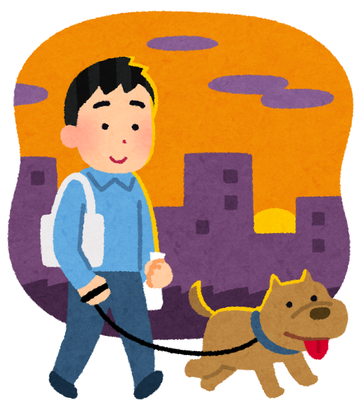
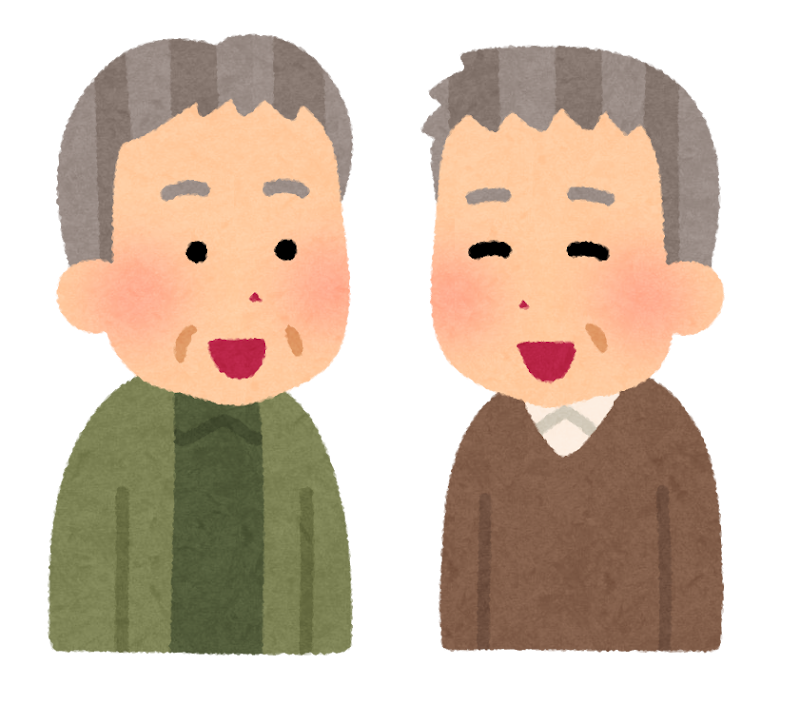
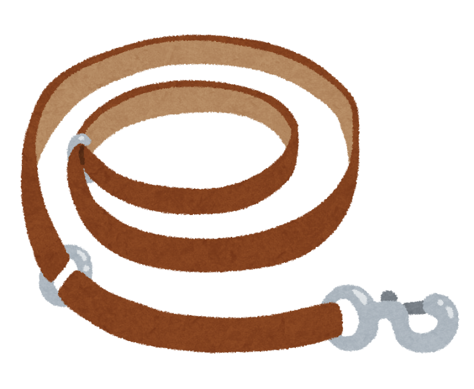

「犬を飼うと、ボケにくいって本当？」

そんな話を聞いたことはありませんか。

東京都健康長寿医療センターのグループが、**東京都大田区の高齢者約1万1千人**を追いかけた研究で、この問いに答えています。結果は、ちょっとうれしいものでした。

> ✅ 犬を飼っている人は、**介護が必要になるほどの認知症**になりにくい傾向がありました
>
> ✅ とくに差が大きかったのは、**犬と一緒に運動の習慣がある人**と、**人とのつながりがある人**でした
>
> ✅ 犬の散歩は、転倒に気をつければ、**毎日歩く最高の理由**になります

---

## 目次

1. [約1万1千人を追いかけた研究](#約1万1千人を追いかけた研究)
2. [カギは「散歩」と「つながり」](#カギは散歩とつながり)
3. [理学療法士から：犬の散歩で転ばないために](#理学療法士から犬の散歩で転ばないために)
4. [おわりに](#おわりに)
5. [参考にした情報](#参考にした情報)

---

## 約1万1千人を追いかけた研究

2016年に、大田区に住む高齢の方に「いま犬や猫を飼っていますか」とたずね、その後、**介護保険で認知症と判定されたかどうか**を追いかけました。

約4年後の結果（2023年発表）はこうです。

- **いま犬を飼っている人**は、飼っていない人（昔飼っていた人を含む）に比べて、認知症の起きやすさ（オッズ比）が **0.60**
- **猫を飼っている人**は **0.98** で、差はありませんでした

さらに約7年半まで追いかけた続報（2026年発表）でも、**いま犬を飼っている人**は、一度も飼ったことがない人に比べて **0.53** でした。一方、**昔飼っていたけれど今は飼っていない人**は **0.97** で、差はありませんでした。


猫ではダメなんですか？




猫がいけないわけではありません。猫との暮らしにも、心の支えなど良いところはたくさんあります。ただ、この研究で差が出たのは犬だけでした。そのヒントが、次の章にあります。


---

## カギは「散歩」と「つながり」

研究チームは、犬の飼い主をさらに細かく分けて比べました。

- **犬を飼っていて、運動の習慣がある人** … 犬を飼っておらず運動の習慣もない人と比べて **0.37**
- **犬を飼っていて、人づきあいがある人** … 犬を飼っておらず、人づきあいが少ない人と比べて **0.41**

犬は、雨の日も寒い日も「散歩に行こう」と誘ってくれます。散歩の途中で、ご近所の方と自然に言葉を交わすことも増えます。

つまり、**効いていたのは犬そのものより、毎日の散歩と、そこで生まれる人とのつながり**だった、と考えられます。猫や、今は飼っていない人で差がなかったことも、この考えと合っています。


年齢的に、今から犬を飼うのはちょっと……。




それで大丈夫です。犬は十数年生きますから、無理をする必要はありません。大事なのは「**毎日歩く理由**」と「**話す相手**」です。近所の犬好きさんと散歩仲間になる、ご家族の犬の散歩を手伝う、それだけでも十分です。


※ これは**観察研究**（すでにある記録を追いかけて調べた研究）です。もともと元気な人ほど犬を飼える、という面もあり、「犬を飼えば防げる」とまでは言えません。

> 人とのつながりと脳の関係は、こちらでもまとめています。
> 👉 [脳を守る「刺激とつながり」](/posts/dementia-14-factors-brain/)

---

## 理学療法士から：犬の散歩で転ばないために

うれしい話の一方で、理学療法士として必ずお伝えしたいことがあります。

アメリカの救急外来のデータ（20年分）では、犬の散歩中のけがの **55%** が、**リードに引っぱられたり、足を取られたりして転んだもの**でした。骨折は、**65歳以上の人は65歳未満の人に比べて2.1倍**起きやすくなっていました。

転ばないためのコツは、次の4つです。

- ✅ **リードを手首や指に巻きつけない**（急に引かれると、そのまま倒れたり、指を骨折したりします）
- ✅ **リードは短めに持ち、犬を体の横に**（前に出すと、急な飛び出しで引っぱられます）
- ✅ **滑りにくく、足に合った靴をはく**
- ✅ **夜や早朝は明るい服とライトで**。足元が不安な日は、ご家族と一緒に


うちの犬は力が強くて、よく引っぱられます……。




それは要注意です。**無理に一人で散歩せず**、しつけ教室に相談したり、引っぱりにくい胴輪（ハーネス）に替えたりするのも一つの方法です。散歩は「安全に続けられること」がいちばん大切ですよ。


暗い時間の散歩には、光るグッズがあると安心です。

{{< affiliate
    title="犬の散歩用ライト・反射グッズ"
    amazon="https://af.moshimo.com/af/c/click?a_id=5534074&p_id=170&pc_id=185&pl_id=4062&url=https%3A%2F%2Fwww.amazon.co.jp%2Fs%3Fk%3D%25E7%258A%25AC%2520%25E6%2595%25A3%25E6%25AD%25A9%2520%25E3%2583%25A9%25E3%2582%25A4%25E3%2583%2588%2520%25E5%258F%258D%25E5%25B0%2584"
    rakuten="https://af.moshimo.com/af/c/click?a_id=5533903&p_id=54&pc_id=54&pl_id=27059&url=https%3A%2F%2Fsearch.rakuten.co.jp%2Fsearch%2Fmall%2F%25E7%258A%25AC%2520%25E6%2595%25A3%25E6%25AD%25A9%2520%25E3%2583%25A9%25E3%2582%25A4%25E3%2583%2588%2520%25E5%258F%258D%25E5%25B0%2584%2F"
    description="首輪やリードに付けるライトや、光を反射するグッズです。車や自転車から見つけてもらいやすくなり、足元も照らせます。早朝や夕方の散歩が多い方に。" >}}

毎日歩くなら、足元の準備も大切です。

{{< affiliate
    title="ウォーキングシューズ（軽量）"
    amazon="https://af.moshimo.com/af/c/click?a_id=5534074&p_id=170&pc_id=185&pl_id=4062&url=https%3A%2F%2Fwww.amazon.co.jp%2Fs%3Fk%3D%25E3%2582%25A6%25E3%2582%25A9%25E3%2583%25BC%25E3%2582%25AD%25E3%2583%25B3%25E3%2582%25B0%25E3%2582%25B7%25E3%2583%25A5%25E3%2583%25BC%25E3%2582%25BA%2520%25E9%25AB%2598%25E9%25BD%25A2%25E8%2580%2585%2520%25E8%25BB%25BD%25E9%2587%258F"
    rakuten="https://af.moshimo.com/af/c/click?a_id=5533903&p_id=54&pc_id=54&pl_id=27059&url=https%3A%2F%2Fsearch.rakuten.co.jp%2Fsearch%2Fmall%2F%25E3%2582%25A6%25E3%2582%25A9%25E3%2583%25BC%25E3%2582%25AD%25E3%2583%25B3%25E3%2582%25B0%25E3%2582%25B7%25E3%2583%25A5%25E3%2583%25BC%25E3%2582%25BA%2520%25E9%25AB%2598%25E9%25BD%25A2%25E8%2580%2585%2520%25E8%25BB%25BD%25E9%2587%258F%2F"
    description="軽くて、かかとがしっかりした靴を選ぶと、つまずきにくくなります。お店で試すときは、夕方の少しむくんだ時間に合わせるのがおすすめです。" >}}

---

## おわりに

犬と暮らす人は、認知症になりにくい傾向がありました。そして、その理由は**毎日の散歩と、人とのつながり**にありそうです。

犬がいても、いなくても、今日できることは同じです。外に出て、少し歩いて、誰かとあいさつをする。その積み重ねが、脳の元気を支えてくれると思います。

---

## 参考にした情報

- Taniguchi Y ほか「Protective effects of dog ownership against the onset of disabling dementia in older community-dwelling Japanese: A longitudinal study」*Preventive Medicine Reports* 2023年;36:102465
- Taniguchi Y ほか「Investigating the Potential Protective Effect of Dog Ownership on Incident Disabling Dementia and Its Cost-Effectiveness」*International Journal of Environmental Research and Public Health* 2026年;23(7):938
- Maxson R ほか「Epidemiology of Dog Walking-Related Injuries among Adults Presenting to US Emergency Departments, 2001-2020」*Medicine & Science in Sports & Exercise* 2023年;55(9):1577-1583

---

※この記事は一般的な情報提供を目的としたものです。持病のある方や足腰に不安のある方は、散歩の距離や方法について、かかりつけ医にご相談ください。
