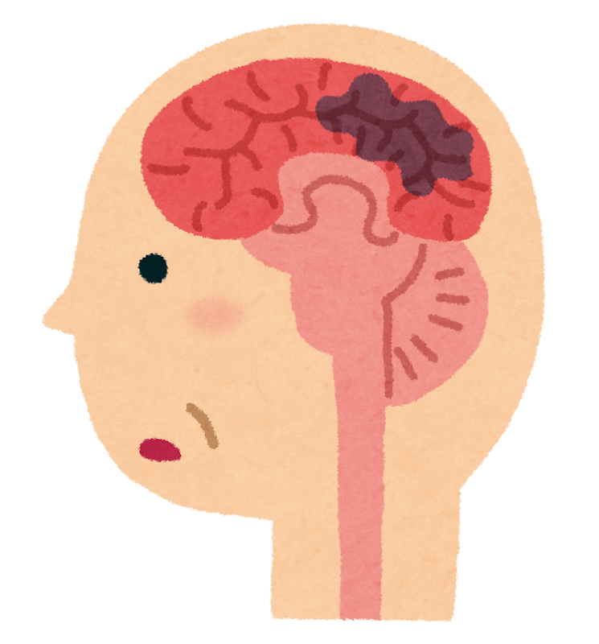

「運動は脳にいい」――もう耳にタコができるほど聞いた言葉かもしれません。

でも、こう思ったことはありませんか。

**「足を動かしているのに、どうして頭によいのだろう？」**

血のめぐりがよくなるから。気分が晴れるから。よく言われる説明ですが、どこか腑に落ちない感じが残ります。**筋肉と脳は、離れた場所にあるのに。**

その「離れた場所」を、実はモノがやりとりされていた――そんな研究が、2026年1月に順天堂大学から発表されました。

運動でつくられたある「部品」が、血のなかを流れて、**脳まで運ばれていた** というのです。

> ✅ 運動をすると、筋肉のなかで **ミトコンドリア（細胞のエネルギー工場）** が増えます
>
> ✅ 増えたミトコンドリアは血液中に放り出され、**血小板（けっしょうばん）** がそれを拾い上げます
>
> ✅ 血小板は **血のめぐりが悪くなった場所に集まる性質** があるため、結果的にミトコンドリアが **脳の弱った部分へ届けられて** いました

> ⚠️ **先にお伝えしておきます。** これは **マウス（ねずみ）の実験** で分かったことです。人間でも同じことが起きているかは、これから確かめる段階です。この記事では、そこを正直に書きます。

---

## 目次

1. [そもそもミトコンドリアって何？](#そもそもミトコンドリアって何)
2. [順天堂大学が見つけた「運び屋」](#順天堂大学が見つけた運び屋)
3. [なぜ血小板だったのか](#なぜ血小板だったのか)
4. [ここは正直に ― まだマウスの話です](#ここは正直に--まだマウスの話です)
5. [「にぎる力」の話とつながっている](#にぎる力の話とつながっている)
6. [いま、私たちにできること](#いま私たちにできること)
7. [おわりに](#おわりに)
8. [参考にした情報](#参考にした情報)

---

## そもそもミトコンドリアって何？

学校で聞いたことがある、という方も多いと思います。少しだけおさらいさせてください。

**ミトコンドリアは、細胞のなかにある「発電所」** です。私たちが食べたものと吸った酸素から、体を動かすためのエネルギーをつくり出しています。

大事なのは、**この発電所の数は、生まれつき決まっているわけではない** ということです。

**運動をすると、筋肉のなかのミトコンドリアは増えます。** これは以前から分かっていたことで、「持久力がついた」という状態の正体のひとつが、これです。

そして脳もまた、**体のなかでとくに電気を食う臓器** です。重さでは体の2%ほどしかないのに、エネルギーの2割前後を使っています。脳にとって、発電所の元気さは死活問題なのです。


運動すると筋肉の発電所が増える、というのは分かります。でも、それが脳とどう関係するのでしょう？




そこが、今回の研究のいちばん面白いところなんです。**筋肉で増えた発電所が、筋肉のなかにとどまらなかった** ――そういうお話です。


---

## 順天堂大学が見つけた「運び屋」

研究をしたのは、**順天堂大学**の稲葉俊東先生、宮元伸和先生、服部信孝先生らのグループです。成果は2026年1月15日、医学誌 **『MedComm』** のオンライン版に発表されました。

研究チームがマウスで確かめたのは、こういう流れでした。

### ① 運動する → 筋肉のミトコンドリアが増える

まず、これは想定どおりです。

### ② 増えたミトコンドリアが、血液のなかに出ていく

ここが意外なところです。筋肉のなかにしまわれたままではなく、**一部が血液中に放り出されて** いました。

### ③ 血小板が、それを拾い上げる

血液のなかを流れているミトコンドリアを、**血小板が取り込んで** いたのです。

### ④ 血小板が、脳の弱った場所へ運ぶ

そして血小板は、**血のめぐりが悪くなった場所に集まる** という性質を持っています。その性質のおかげで、ミトコンドリアは **脳の弱っている部分に届けられて** いました。

研究チームは、**脳の血流が慢性的に足りない状態のマウス** と、**急に脳梗塞を起こしたマウス** の両方で検証し、**運動していたマウスのほうが脳の細胞が守られていた** ことを確かめました。

つまり、こういうことです。

> **運動でつくった「発電所」を、血小板が宅配便のように脳まで届けていた。**


血小板って、けがをしたときに血を止めるもの、というイメージでした。




そのとおりです。**傷をふさぐのが本業** ですね。その血小板が、まさか荷物を運んでいたとは……。研究者の方も驚かれたのではないかと思います。


---

## なぜ血小板だったのか

「運び屋」が血小板だった、というのが、この研究のうまくできているところです。

考えてみてください。もし、ただ血液に溶けて流れるだけなら、ミトコンドリアは **体じゅうにばらまかれてしまいます**。必要な場所に集まってくれる保証はありません。

ところが血小板は、**血管が傷ついたり、血のめぐりが悪くなったりした場所を目がけて集まります**。

だから、血小板に乗せると――

**いちばん助けが必要な場所に、自然と荷物が届く。**

配達先を指定しなくても、困っている場所に届く仕組みになっていた、ということです。体のしくみのうまさに、あらためて感心させられます。


住所を書かなくても、必要な人のところに届く宅配便みたいですね。




うまい例えです。しかも **いちばん困っている家から先に回ってくれる** 宅配便ですね。人間の体は、こういう仕組みをいくつも持っています。


この発見は、**脳梗塞の後遺症** や **血管性認知症**（脳の血のめぐりが悪くなって起こる認知症）に対する、新しい治療の手がかりになるかもしれない、と期待されています。

> 血管性認知症をふくむ認知症の種類については、こちらの記事にまとめています。
> 👉 [認知症の種類とMCIをやさしく解説](/posts/dementia-types-mci/)

---

## ここは正直に ― まだマウスの話です

さて、ここからが大事なところです。

**この研究は、マウスで行われたものです。**

わくわくする話ではありますが、**「だから今日から運動すれば脳梗塞が治る」ということではありません**。研究チーム自身も、これから **人間で同じことが起きているかを確かめ、安全性と効果を調べる臨床研究を進める** としています。

動物で見つかった仕組みが、そのまま人間に当てはまるとはかぎりません。医学の歴史には、**マウスではうまくいったのに人間では効かなかった** という例が数えきれないほどあります。


では、この研究はまだ期待しないほうがいいのでしょうか。




いえ、そうとも思いません。ただ、**「運動が脳を守る理由が、またひとつ説明できるようになった」** という受け取り方がちょうどいいのだと思います。**運動をすすめる理由が増えた** ということですね。


もうひとつ、この研究には別の可能性もあります。研究チームは、**自分では運動するのが難しい方** への応用にも触れています。もしミトコンドリアを届ける仕組みだけを取り出せれば、**運動できない方にも、運動と同じ恩恵を届けられるかもしれない** ――そういう方向です。

リハビリの現場で、麻痺や痛みで思うように動けない方と向き合っていると、この一文には、正直なところ胸が熱くなります。

---

## にぎる力の話とつながっている

以前、[「にぎる力」が、脳を守る？](/posts/brain-muscle-strength-2026/) という記事を書きました。握力の強さと、認知症のなりにくさに関係がある、という内容です。

あのときは、**「なぜ筋肉と脳がつながっているのか」** という肝心のところを、はっきりとは書けませんでした。分かっていなかったからです。

今回の研究は、その空白に **ひとつの答えらしきもの** を置いてくれました。

**筋肉は、ただ体を動かす部品ではなく、脳に向けて何かを送り出している臓器でもある。**

筋肉から出て体じゅうに働きかける物質は、ほかにも見つかっています。当ブログでご紹介した **イリシン** も、そのひとつでした。

> 👉 [運動でつくられる「イリシン」の話](/posts/irisin-exercise-brain-2026/)

こうして並べてみると、ここ数年の研究の流れが見えてきます。**「運動が脳にいい」の中身が、少しずつ具体的になってきている** のです。

---

## いま、私たちにできること

こういう研究を読んだあと、私がいつも思うことがあります。

**結局、やることは変わらない。**

新しい仕組みが見つかっても、私たちにできることは、これまでと同じです。

- ☑ **今日、少し歩く**。研究がどう進んでも、これが土台であることは変わりません
- ☑ **息が少しはずむくらい** を目安に。ミトコンドリアが増えるのは、そのあたりからです
- ☑ **筋肉にも刺激を**。歩くだけでなく、立ち座りやかかと上げなども混ぜてみてください
- ☑ **続けられる形にする**。週に3回20分でも、まったくやらないのとは大違いです
- ☑ 膝や腰が痛む方は、**痛みの出ない範囲で**。水中歩行や椅子に座ってできる運動もあります
- ☑ 持病のある方は、**始める前にかかりつけ医へ** ひとこと相談を

とくに、**血圧が高い方、糖尿病のある方、以前に脳梗塞を起こしたことがある方**。今回の研究は、そういう方にこそ意味のある話だと思います。血のめぐりが心配な場所ほど、荷物が届く仕組みだったからです。

---

## おわりに

運動した筋肉から、発電所が血のなかへ出ていって、血小板がそれを拾って、弱った脳まで運ぶ。

はじめてこの流れを読んだとき、私は思わず「よくできているなあ」と声が出ました。**体は、私たちが思っているよりずっと連携している** のだと思います。

もちろん、まだマウスの話です。これが人間でも確かめられるまでには、何年もかかるでしょう。

それでも、ひとつだけ確かなことがあります。**その答えを待つあいだにも、歩くことはできる。**

散歩に出た足が、知らないうちに脳へ荷物を送っているかもしれない――そう思うと、いつもの道が少しだけ違って見えませんか。

今日も、無理のない範囲で。

---

## 参考にした情報

- 順天堂大学「運動が脳を守る新たな仕組みを解明」（2026年）。稲葉俊東先生、宮元伸和先生、服部信孝先生らによる研究。掲載誌は『MedComm』オンライン版（2026年1月15日）
- 研究は慢性的な脳の血流低下モデルと、急性脳梗塞モデルのマウスを用いて行われたものです

---

※この記事は一般的な情報提供を目的としたものです。紹介した研究は動物実験の段階であり、人間で同じ効果が確認されたものではありません。運動の内容や強さには個人差があります。持病のある方、痛みや不調が続く場合は、**必ずかかりつけ医にご相談ください。**
</content>
