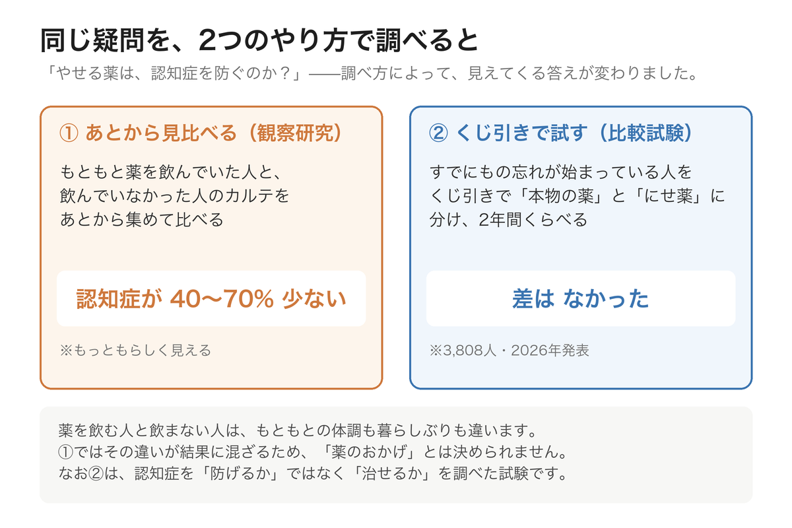

ここ数年、「**やせる薬**」という言葉をよく耳にするようになりました。もともとは糖尿病の薬として使われてきた **GLP-1（ジーエルピーワン）** という種類のお薬です。

この薬について、しばらく前からこんな話題がありました。

「この薬を飲んでいる人は、**認知症になる人が少ないらしい**」

大きな期待が集まりました。そして2026年、その答えの一つが出ました。今日は、**期待と、その正直な結果**のお話です。少し意外な結末ですが、そこから学べることのほうが、じつは大きいのです。

> ✅ カルテを集めた調査では、この薬を飲んでいる人は**認知症のリスクが40〜70%低い**という報告がありました
>
> ✅ ところが、**3,808人**を対象にきちんと比べた試験では、**差はありませんでした**（2026年3月発表）。ただしこれは「**すでに始まったもの忘れを治せるか**」を調べたものです
>
> ✅ 「**そもそも防げるか**」は、これから。**1億ドル**をかけた新しい試験が始まりましたが、その土台に置かれているのは、やはり**生活習慣**です

---

## 目次

1. [なぜ「脳にも効く」と期待されたのか](#なぜ脳にも効くと期待されたのか)
2. [きちんと試したら、差はなかった](#きちんと試したら差はなかった)
3. [期待と結果が、なぜずれたのか](#期待と結果がなぜずれたのか)
4. [それでも研究は終わらない](#それでも研究は終わらない)
5. [いま確かなのは、生活習慣のほう](#いま確かなのは生活習慣のほう)
6. [現場で感じていること](#現場で感じていること)
7. [いま私たちにできること](#いま私たちにできること)
8. [おわりに](#おわりに)

---

## なぜ「脳にも効く」と期待されたのか

GLP-1という薬は、もともと血糖値を下げる薬です。食欲を抑えるはたらきもあるため、体重が減ることから「やせる薬」として知られるようになりました。

この薬と認知症の関係が注目されたきっかけは、**大量のカルテのデータ**でした。

糖尿病の患者さんのうち、GLP-1の薬を使っていた人と、別の薬を使っていた人を後から比べたところ、**GLP-1のグループでは認知症になった人が40〜70%少なかった**という報告が、いくつも出てきたのです。

理屈の面でも、期待できる材料がありました。

- 脳の**炎症**をやわらげるはたらきがありそうだ
- 脳の**血のめぐり**によさそうだ
- 血糖や体重が整うこと自体が、脳にもよいはずだ


それだけそろっていれば、効きそうに思えますね。



そうなんです。世界中の研究者が期待しました。だからこそ、**本当にそうなのかを確かめる大きな試験**が組まれたんですよ。


---

## きちんと試したら、差はなかった

その試験の名前を **evoke（イヴォーク）** といいます。

- **3,808人**が参加（55〜85歳）
- 全員、**もの忘れが始まっている段階**の方（軽度認知障害、または軽度のアルツハイマー病）
- **くじ引きで**「本物の薬（飲むタイプのセマグルチド）」と「にせ薬」に分ける
- **2年間**、認知機能の変化を比べる

結果は、2026年3月の国際学会で発表され、医学誌『Lancet』にも掲載されました。

**本物の薬を飲んだ人と、にせ薬を飲んだ人とで、認知機能の変化に差はありませんでした。**

血液の検査では、脳の炎症に関わる数値が最大10%ほど改善していました。けれど、**もの忘れの進み方そのものは変わらなかった**のです。


あんなに期待されていたのに……。



残念な結果ではあります。でも私は、**この結果がきちんと発表されたこと自体が大切**だと思っています。効かなかったことをはっきり示してくれたから、私たちは「この薬を飲めばもの忘れが治る」という期待に、お金や時間を注がずにすむのですから。


---

## 期待と結果が、なぜずれたのか

理由は、大きく2つあります。

**ひとつは、調べ方の違いです。**

はじめの「40〜70%低い」は、**もともと薬を飲んでいた人のカルテを、後から集めて比べた**もの（観察研究）でした。この方法には落とし穴があります。**薬を飲んでいる人と飲んでいない人は、もともと違う**からです。通院を続けている、健康に気を配っている、経済的な余裕がある——そうした違いが、結果に混ざりこんでしまいます。

いっぽう evoke は、**くじ引きで薬とにせ薬に分ける**方法でした。こうすると2つのグループの条件がそろうので、薬そのものの効果がはっきり見えます。

> この「観察研究では言い切れない」という話は、前回の記事でもお伝えしました。  
> 👉 [帯状疱疹のワクチンで、認知症が減る？](/posts/shingles-vaccine-dementia-2026/)

**もうひとつは、タイミングです。**

evoke に参加したのは、**すでにもの忘れが始まっていた方々**でした。認知症の変化は、症状が出る**10年、20年前から**静かに始まっていると考えられています。だとすれば、**症状が出てからでは遅すぎた**のかもしれません。

---

## それでも研究は終わらない

2026年7月13日、ロンドンで開かれたアルツハイマー病の国際会議で、アメリカのアルツハイマー協会が新しい試験を発表しました。**PROTECT-Cog**（プロテクト・コグ）といいます。

- **1億ドル**（150億円ほど）をかけた、世界規模の試験
- 対象は、**まだ認知症になっていない、リスクの高い高齢の方**
- **生活習慣のプログラム**に、**GLP-1のような代謝を整える薬**を足すと、さらに効果が上がるかを調べる
- **3年間**、6か月ごとに認知機能と健康状態をくわしく調べる

責任者は、アルツハイマー協会の Maria C. Carrillo 博士です。

注目したいのは、この試験の**組み立て方**です。薬だけを試すのではありません。**生活習慣のプログラムを土台に置いて、そこに薬を足したらどうなるか**を見る。つまり、**土台はあくまで生活習慣**だという設計になっているのです。

---

## いま確かなのは、生活習慣のほう

その土台になっているのが、**U.S. POINTER**（ユーエス・ポインター）という研究です。2025年に発表され、医学誌『JAMA』に掲載されました。

- **2,111人**の高齢者が参加
- 全員に生活習慣の改善に取り組んでもらい、「**手厚くサポートする形**」と「**自分のペースで進める形**」を比べた
- 内容は、運動・食事（MIND食）・脳のトレーニング・人との交流・血圧の管理

**2年後、どちらのグループも認知機能の点数が上がっていました。** そのうえで、**手厚くサポートした形のほうが、上がり方がわずかに大きい**という結果でした。


「わずか」なのですね。



正直に申しますと、差そのものは小さいものでした。でも、私が大事だと思うのは別のところです。**どちらのグループも、点数が下がらずに上がった**ということ。自分のペースで取り組んだ方々も、ちゃんと伸びていたのです。**手が届く範囲のことでも、意味がある**——そう受け取っています。


---

## 現場で感じていること

理学療法士として現場に立っていると、「**何かいい薬はないですか**」と尋ねられることがあります。

そのお気持ちは、本当によく分かります。毎日こつこつ続けることは地味で、しかもすぐには結果が見えません。薬で解決するなら、それに越したことはない——そう思うのが自然です。

けれど、私がこれまで見てきたかぎり、**いちばん確かに変わっていくのは、続けた方**でした。今日の結果は、そのことを裏側から教えてくれたように思います。

---

## いま私たちにできること

- ✅ **やせる薬を、認知症のために求めない**：これらの薬は、**肥満や糖尿病の治療として、医師が必要と判断したときに使うもの**です。もの忘れを心配して自分で手に入れるようなお薬ではありません
- ✅ **血糖と体重を、主治医と一緒に整える**：結果として脳にもよい可能性があります。ただし、それは治療の一部としての話です
- ✅ **体を動かす**：いまのところ、もっとも確かな方法です。歩くこと、筋力を保つこと
- ✅ **食事を整える**：野菜・魚・全粒の穀物を中心に。特別な食品より、毎日の積み重ねを
- ✅ **人と関わり、頭を使う**：会話も、学びも、脳への大切な刺激です
- ✅ **血圧を測る**：地味ですが、研究のプログラムにも必ず入っています

> 生活習慣の整え方は、こちらの記事にまとめています。  
> 👉 [今日から始める「脳の守り方」〜4本柱で続ける認知機能の予防〜](/posts/cognitive-decline-prevention-overview/)

### 📚 あわせて読みたい一冊





---

## おわりに

新しい薬の話題が出るたび、私たちは期待します。それは悪いことではありません。研究が前に進むのは、その期待があるからです。

ただ今回、**きちんと確かめたら差がなかった**という結果が、正直に発表されました。地味なニュースですが、私はこれを**誠実な結果**だと思っています。効かないものを「効くかもしれない」と言い続けるより、ずっと。

そして、その正直な結果が指し示しているのは、結局のところ**同じ場所**でした。

歩くこと。よく食べること。人と話すこと。血圧を測ること。  
——薬の試験の設計図にさえ、その4つが土台として書き込まれているのです。

派手さはありません。でも、いちばん確かな道は、今日もあなたの足元にあります。

---

### 参考にした情報

- evoke／evoke+ 試験：飲むタイプのセマグルチド14mgを、早期のアルツハイマー病（軽度認知障害または軽度認知症、アミロイド陽性）の55〜85歳 3,808人に投与した第3相ランダム化比較試験。2026年3月19日の AD/PD 2026（国際会議）で全データが発表され、医学誌『The Lancet』に掲載。主要評価項目（CDR-SB の2年後の変化）で、にせ薬との差は認められなかった。神経の炎症に関わるバイオマーカーは最大10%程度の改善がみられたが、症状の差にはつながらなかった
- PROTECT-Cog 試験：アルツハイマー協会が2026年7月13日、AAIC 2026（ロンドン）で発表。1億ドル規模・3年間・6か月ごとに評価。多因子の生活習慣プログラムに GLP-1受容体作動薬などの代謝改善薬を組み合わせる。責任者は Maria C. Carrillo 博士、プロジェクトリードは Heather M. Snyder 博士。GLP-1が他の糖尿病薬と比べて認知症リスクを40〜70%低下させる可能性を示した実診療データが根拠として挙げられている
- U.S. POINTER 試験：米国5拠点・2,111人・2年間のランダム化比較試験。構造化された生活習慣プログラムと自己管理型を比較し、2025年に『JAMA』に掲載。両群とも認知機能の総合点は上昇し、構造化群のほうが上昇の度合いが有意に大きかった（年あたり 0.029 標準偏差の差）
- ※本記事は一般的な情報提供を目的としたものです。**GLP-1受容体作動薬は、医師の診断のもとで使われる医療用医薬品**であり、認知症の予防を目的に使う薬ではありません。お薬については、必ず**かかりつけの医師にご相談ください**
