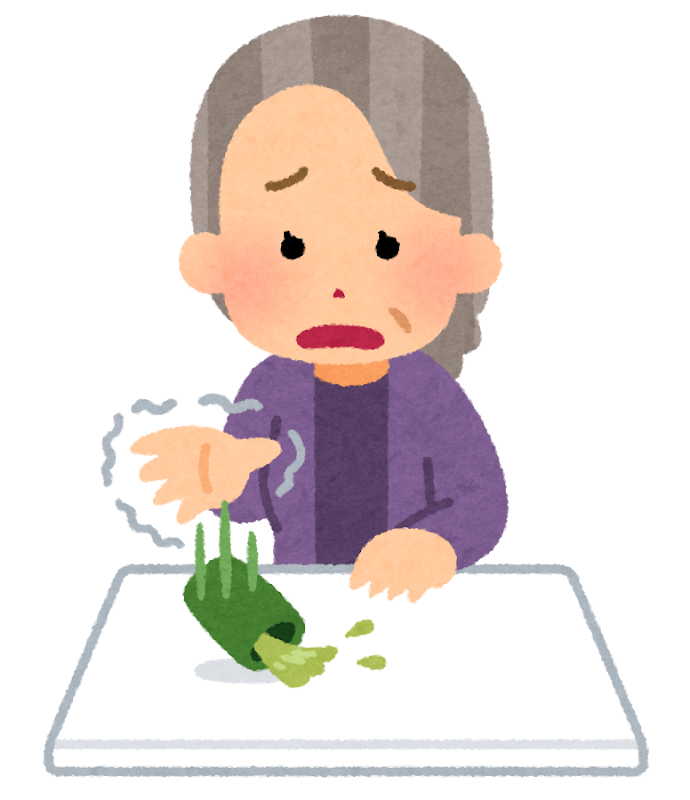
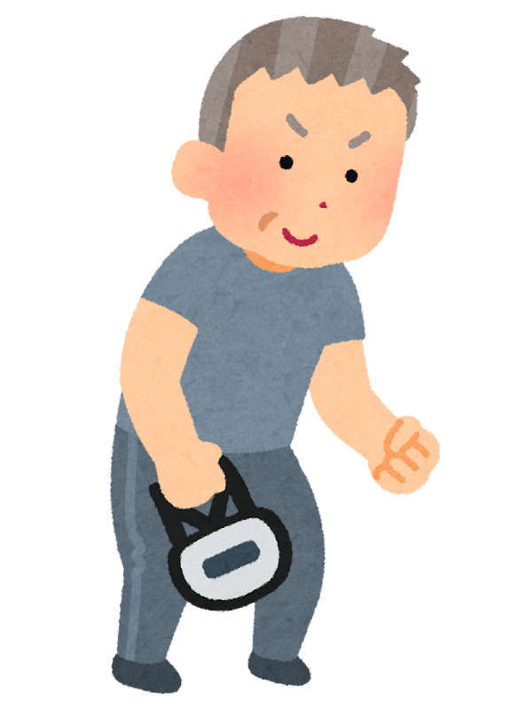

前回、「やせる薬」（GLP-1受容体作動薬といいます）が認知症に効くのかどうかを書きました。

> 前回の記事はこちらです。
> 👉 [「やせる薬」は、認知症に効くのか](/posts/glp1-dementia-prevention-2026/)

あの記事を書いたあと、ずっと引っかかっていたことがあります。**理学療法士として、いちばん気になるところに触れていなかった**のです。

体重が減るのは分かりました。では、**減っているのは何なのでしょうか。**

> ✅ 高齢の糖尿病の方432人を24か月追いかけたところ、薬を使った方は**筋肉の量・握力・歩く速さ**が、使わなかった方より低下していました
>
> ✅ これは薬を否定する話ではありません。**使うなら、筋肉を守る手を一緒に打っておきたい**、という話です
>
> ✅ 守り方は地味です。**たんぱく質をしっかり**摂り、**筋肉に力を出させる**こと。それだけです

---

## 目次

1. [体重が減るとき、何が減っているのか](#体重が減るとき何が減っているのか)
2. [432人を24か月追いかけた研究](#432人を24か月追いかけた研究)
3. [この研究の弱いところも書いておきます](#この研究の弱いところも書いておきます)
4. [なぜ高齢の方でとくに心配なのか](#なぜ高齢の方でとくに心配なのか)
5. [筋肉を守るために、できること](#筋肉を守るためにできること)
6. [現場で見てきたこと](#現場で見てきたこと)
7. [おわりに](#おわりに)
8. [参考にした情報](#参考にした情報)

---

## 体重が減るとき、何が減っているのか

体重計の数字は、脂肪と筋肉を区別してくれません。

食事の量が減れば、体は脂肪だけでなく**筋肉も一緒に手放します**。これは薬にかぎった話ではなく、どんなやせ方でも起きることです。

ただ、**若い方と高齢の方では、意味がまるで違います。**


どう違うんですか？




若い方は、あとから筋肉を取り戻せます。でも**年を重ねると、減らすのは簡単で、戻すのは何倍も大変**なんです。そして高齢の方にとって筋肉は、見た目の話ではありません。**立ち上がる、歩く、転ばない**——**暮らしそのもの**を支えているものなんですね。


---

## 432人を24か月追いかけた研究

2025年、中国のグループがこんな報告を出しました。

- 対象は**65歳以上で2型糖尿病のある432人**
- **セマグルチド**（やせる薬の一種）を使った220人と、使わなかった212人を比べた
- **24か月**追いかけて、筋肉の量・握力・歩く速さを測った

結果、薬を使ったグループは、使わなかったグループと比べて、

- **手足の筋肉の量**が低下
- **握力**が低下
- **歩く速さ**が低下

していました。しかも**薬の量が多い方ほど、影響が大きい**という関係も見えています。

もうひとつ気になるのは、**参加した方の27.7%が、はじめからサルコペニア**（筋肉が減って力が落ちた状態のこと）**だった**ことです。もともと少ない方が、さらに減らしていた可能性があります。

---

## この研究の弱いところも書いておきます

大事な但し書きです。この研究は、**あとから記録をさかのぼって調べたもの**でした。

くじ引きで薬を使う人と使わない人を分けた研究（そのほうが確かなことが言えます）ではありません。ですから、**「薬のせいで筋肉が減った」と断定はできません。**

「薬を使った方には、そういう変化が見られた」——いまはそこまでです。


じゃあ、そんなに心配しなくてもいいのでしょうか。




私は、**心配しすぎず、備えはしておく**くらいがちょうどいいと思っています。というのも、**筋肉を守る手立てはどれも、やって損のないことばかり**だからです。研究の結論を待たなくても、今日から始められます。


---

## なぜ高齢の方でとくに心配なのか

理由は単純です。**筋肉が減ると、生活の自由が減る**からです。

- 立ち上がりにくくなる
- 歩く速さが落ちる
- 転びやすくなる
- 転んで骨折すると、そこから寝たきりにつながることがある

体重が10キロ減って血糖値がよくなっても、**歩けなくなってしまったら、差し引きで損**です。そこは天秤にかけ直したいところです。

---

## 筋肉を守るために、できること

やることは、たった2つです。

### ・たんぱく質を、いつもより意識して摂る

食事の量が減るぶん、**中身の密度を上げます**。

目安は**体重1キロあたり1.0〜1.2グラム**。体重60キロの方なら、1日60〜72グラムです。肉・魚・卵・大豆製品・乳製品を、**毎食ひと品ずつ**入れるとおおよそ届きます。

※腎臓の病気がある方は、たんぱく質を増やすと負担になることがあります。**必ずかかりつけの先生に相談してから**にしてください。

### ・筋肉に、力を出させる

歩くだけでは、筋肉は増えません。**「よいしょ」と力を出す動き**が要ります。

- 椅子から立ち上がる。10回を1セット、朝と晩に
- かかとの上げ下げ。台所で、10回
- ペットボトルを持って、ひじの曲げ伸ばし。10回

きつくなくて大丈夫です。**続くことのほうが、はるかに大事**です。


歩くだけでは足りないんですね。毎日1時間は歩いているのですが……。




歩くのは素晴らしいことです。心臓にも脳にもいい。ただ、**筋肉を増やす刺激としては軽すぎる**んですね。歩くのはそのまま続けていただいて、**そこに「よいしょ」を10回足す**。それだけで受け持ちがひとつ増えます。


### ・ときどき、確かめる

**握力**は、いちばん手軽な目安です。健診で測る機会があれば、数字を控えておいてください。

一般に、**男性で28キロ未満、女性で18キロ未満**だと、筋肉が減っている可能性を考えます。あくまで目安ですが、**去年より下がっていないか**を見るだけでも役に立ちます。

---

## 現場で見てきたこと

リハビリの現場で、こんな方にお会いすることがありました。

**「痩せてよかったと思っていたのに、いつのまにか歩けなくなっていた」**

ご本人にもご家族にも、悪気はありません。体重が減ることは、長いあいだ「よいこと」とされてきましたから。減っているものの中身までは、なかなか気が回らないのです。

だから私は、**減らすときこそ、筋肉の話を一緒にしたい**と思っています。

---

## おわりに

この記事は、**薬をやめましょうという話ではありません。**

やせる薬は、必要な方にとって大きな助けになります。日本でも使えるようになり、一部は保険もききますが、**多くは自費**です。そして**自己判断で手に入れるのは、絶対にやめてください。** 使うかどうかは、必ず主治医と決めることです。

お伝えしたいのは、ただ一つです。**使うのなら、筋肉を守る手を同時に打っておきましょう。**

たんぱく質と、「よいしょ」の運動。地味ですが、**あとから効いてくるのはこちらのほう**だと、現場にいて思います。

---

## 参考にした情報

- Semaglutide Therapy and Accelerated Sarcopenia in Older Adults with Type 2 Diabetes: A 24-Month Retrospective Cohort Study（*Drug Design, Development and Therapy* 2025年）※後ろ向きコホート研究です
- 握力の目安は、アジアのサルコペニア診断基準（AWGS 2019）で示されている値です
- 前回の記事：[「やせる薬」は、認知症に効くのか](/posts/glp1-dementia-prevention-2026/)

※この記事は公表された研究をもとに、一般の方向けにやさしく言い換えたものです。お薬の使用・中止・変更は、必ずかかりつけの医師にご相談ください。
