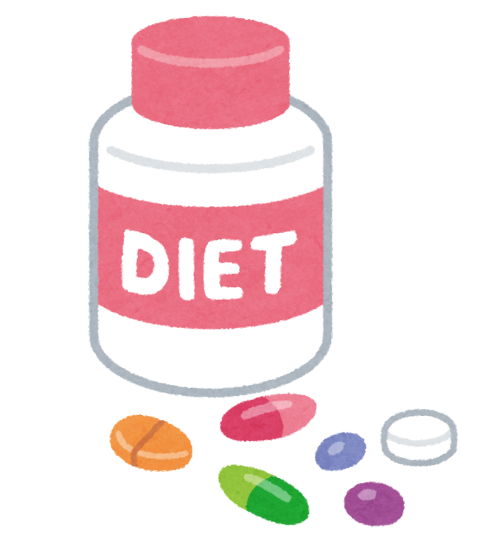
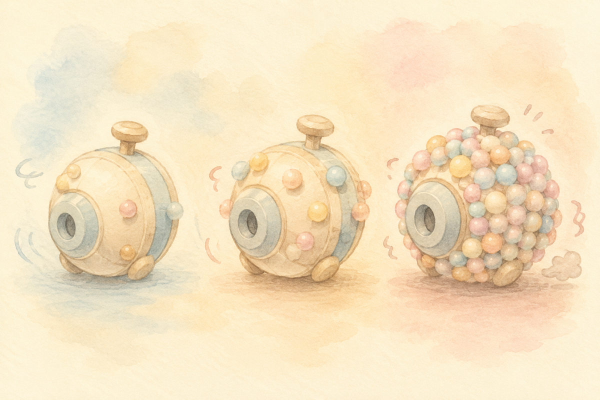
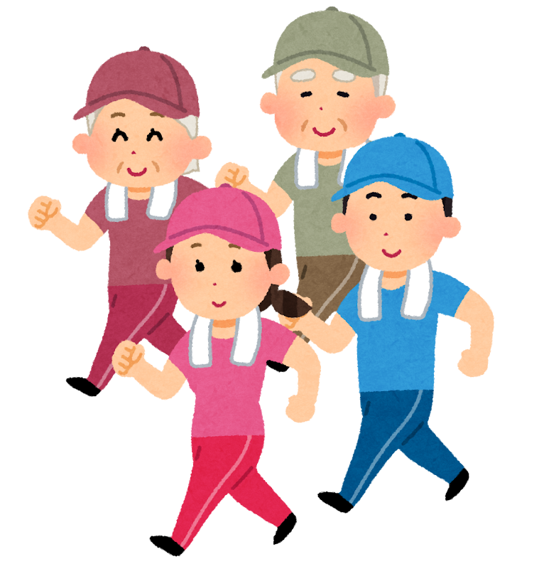
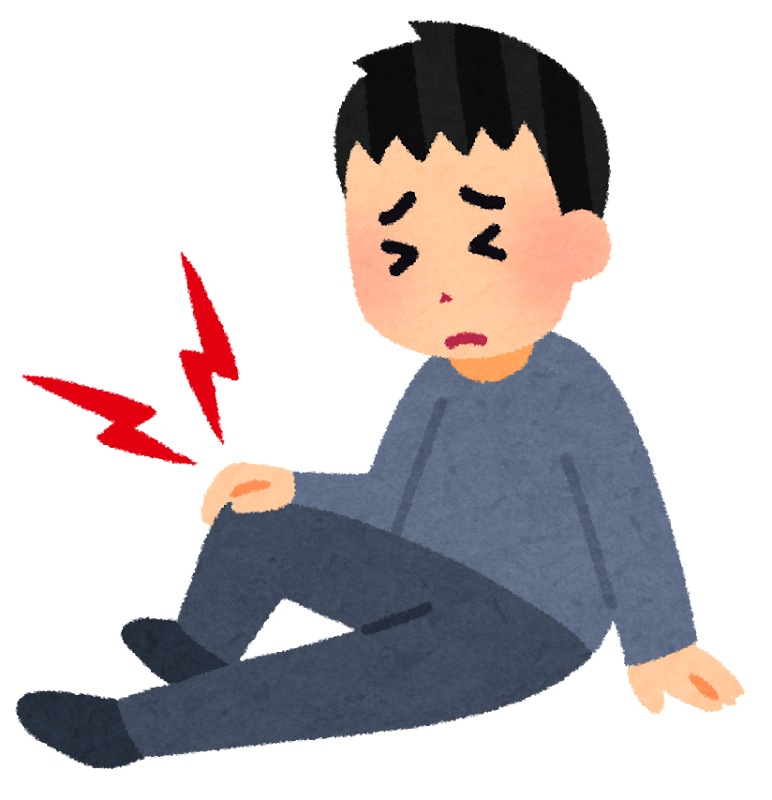

「ひざにいいらしいよ」

そう聞いて、グルコサミンを飲みはじめた。あるいは、親御さんに送っている。テレビでも新聞でも見かけますし、ドラッグストアの棚には、いつも大きく並んでいます。

そのグルコサミンについて、2026年6月、少し気になる報告が出ました。

先にお伝えしておきます。**この記事は「いますぐやめてください」という話ではありません。** むしろ研究をよく読むと、そう単純な話ではないことが分かります。ただ、**知っておいたほうがいい内容**ではありました。

> ✅ アメリカの研究で、グルコサミンを使っていた人は、**軽い物忘れ（MCI）から認知症に進む割合が25%高かった**という報告が出ました
>
> ✅ ただし動物実験では、**健康な脳ではまったく変化が起きませんでした**。影響が出たのは、すでにアルツハイマー病の状態にあった場合だけです
>
> ✅ 研究者自身が「**関連が見えただけで、原因と決まったわけではない**」と述べています。やめるかどうかは、**かかりつけの先生と相談して決めることです**

> サプリとのつき合い方全般については、こちらもあわせてどうぞ。
> 👉 [健康にかけるお金は年15.7万円。それでも「何を信じたらいい？」](/posts/health-info-money-2026/)

---

## 目次

1. [そもそもグルコサミンとは](#そもそもグルコサミンとは)
2. [何が報告されたのか](#何が報告されたのか)
3. [ここがいちばん大事なところ](#ここがいちばん大事なところ)
4. [正直に書いておきたいこの研究の弱いところ](#正直に書いておきたいこの研究の弱いところ)
5. [ひざには効いているのでしょうか](#ひざには効いているのでしょうか)
6. [天秤にかけ直してみませんか](#天秤にかけ直してみませんか)
7. [理学療法士として現場で思うこと](#理学療法士として現場で思うこと)
8. [いま私たちにできること](#いま私たちにできること)
9. [おわりに](#おわりに)
10. [参考にした情報](#参考にした情報)

---

## そもそもグルコサミンとは

グルコサミンは、**糖の仲間** です。名前に「グルコ」とついているとおり、ブドウ糖に近い形をしています。

体の中では、関節の軟骨（なんこつ＝骨と骨の間のクッション）をつくる材料のひとつとして使われています。ですから「**すり減った軟骨の材料を、飲んで補おう**」という考え方で、サプリとして売られてきました。

考え方としては、とても分かりやすいですよね。減ったものを足す。だからこれだけ広まったのだと思います。

ただ、ここで一つ、頭の隅に置いておいていただきたいことがあります。

**飲んだグルコサミンは、ひざにだけ届くわけではありません。** 体じゅうを巡ります。当然、脳にも届きます。今回の研究は、その「脳に届いたあと」の話です。


ひざのために飲んでいるのに、脳の話になるんですか？




そこが、今回いちばん意外だったところです。**口から入れたものは、行き先を選べません。** ひざに効かせたくても、体じゅうに配られてしまう。だから研究者の方たちは「では、ほかの場所では何が起きているのだろう」と調べたわけですね。


---

## 何が報告されたのか

報告したのは、**アメリカ・フロリダ大学** の研究チームです。2026年6月9日、『nature』の姉妹誌である **『Nature Metabolism』** に発表されました。

この研究のおもしろいところは、**まったく違う3つの方法で、同じ方向の結果が出た** ことです。ひとつずつ見ていきます。

### ① 病院の記録を、大量に調べた

フロリダ大学の病院に残っていた、**2012年から2024年までの患者さんの記録**（お名前などが分からないように処理したもの）を調べました。人数はこうです。

| グループ | 人数 | うちグルコサミンを使っていた人 |
|---|---:|---:|
| 認知症の診断がある方 | 24,481人 | 1,896人（約8%） |
| 軽度認知障害（MCI）の方 | 41,884人 | 2,750人（約8%） |

※ **軽度認知障害（MCI）** … 物忘れは出ているけれど、日常生活はまだ自分でできる段階。認知症の一歩手前と言われます。

追いかけた期間は、**中央値でおよそ5年** でした。その結果、こうなりました。

- **軽度認知障害の方** … グルコサミンを使っていた人は、**認知症に進んだ割合が25%高かった**
- **すでに認知症の診断がある方** … 1年以上使っていた人は、**亡くなる割合が25%高かった**

### ② 亡くなった方の脳を、直接調べた

次に研究チームは、**アルツハイマー病の方20人の脳（前頭葉の表面）** を、特殊な質量分析という方法で調べました。

すると、**タンパク質に糖の「飾り」が、たくさんくっついていた** のです。しかも、**病気が進んだ人ほど、その飾りが増えていました**。

タンパク質は、体の中で働く「小さな機械」のようなものです。その機械に糖の飾りをつけること自体は、もともと体がふつうに行っていることで、悪いことではありません。ところがアルツハイマー病の脳では、**その飾りつけが、働きすぎている状態** になっていた、というわけです。

### ③ マウスで、実際に試した

そして最後に、マウスで確かめました。アルツハイマー病の状態になるようにしたマウスに、**サプリと同じくらいの量のグルコサミンを2週間** 与えたのです。

結果は、こうでした。

- 糖の飾りが**増えた**
- 記憶の成績が**落ちた**
- 一方で、**アミロイドやタウ（アルツハイマー病でたまる物質）そのものは増えなかった**

さらに、**糖の飾りをつくる働きを遺伝子操作で弱めてやると、今度は認知の成績が良くなりました**。つまり、この「飾りすぎ」が病気を進める側にいる、ということになります。

---

## ここがいちばん大事なところ

ここまで読むと、「グルコサミンは危ない」と思われるかもしれません。

でも、**この研究でいちばん大事なのは、実はここから** です。

研究チームは、同じ実験を **健康なマウス**（生後8か月の、ふつうのマウス）にも行いました。同じ量のグルコサミンを、同じ2週間。

**その結果、何も起きませんでした。**

糖の飾りは増えず、記憶もはっきりしたままだったのです。

論文には、こう書かれています。**正常な脳には、もともと自分を守るしくみが備わっている**。だから、グルコサミンの影響が表に出てくるのは、**すでに脳の代謝が乱れている状態のときだけかもしれない**、と。


ということは、いま元気な人は、そこまで心配しなくていいということですか？




少なくとも今回の研究は、**「飲んでいる人みんなが危ない」とは言っていません**。心配したほうがよさそうなのは、**すでに物忘れが気になりはじめている方**です。ただし、まだ分からないことも多いので、「元気なら絶対大丈夫」とも言い切れません。そこは正直なところです。


---

## 正直に書いておきたいこの研究の弱いところ

医療の情報は、いいところだけを並べても意味がありません。この研究の弱いところも、きちんと書いておきます。

**① 「飲んだから進んだ」とは証明されていません**

これがいちばん大きな点です。病院の記録を後から調べた研究なので、分かるのは「**そういう傾向があった**」ということまでです。

たとえば、こういう可能性が残ります。**ひざが痛くて動けない方ほど、グルコサミンを飲む。そして、動けない方ほど認知症が進みやすい。** だとすれば、犯人はグルコサミンではなく「動けないこと」かもしれません。

研究チームの一人、**Matt Gentry先生**（生化学・分子生物学部長）も、はっきりこう述べています。

> 「電子カルテのデータは非常に示唆に富むが、**因果関係の証明ではない**。ただ、もっと注目されるべき重要な臨床上の問いを投げかけている」

**② サプリの使用は「自己申告」です**

誰が本当にどれだけ飲んでいたかは、患者さんの申告によります。飲んでいたのに記録されていない方も、いたはずです。

**③ マウスと人間は違います**

2週間のマウスの実験を、そのまま人間の何十年にあてはめることはできません。

**④ これから確かめる段階です**

研究チームも「**臨床試験（人を対象にしたきちんとした試験）で確かめる必要がある**」と述べています。今回の報告は、**答えではなく、問いかけ** だと考えるのが正確です。

---

## ひざには効いているのでしょうか

さて。ここでもう一つ、一緒に考えたいことがあります。

「脳に良くないかもしれない」という心配が出てきたとき、天秤のもう一方に乗るのは「**でも、ひざには効いているから**」という価値です。

では、その効果はどれくらい確かなのでしょうか。

**厚生労働省** が運営している、健康食品の情報サイト（eJIM）には、グルコサミンについてこう書かれています。

> 変形性膝関節症に対する研究では、**相反する結果が出ている**
>
> 幅広い研究が行われているが、**変形性関節症の症状に意味のある影響を与えるかどうかは明らかにされていない**

つまり、**「ひざに効く」という側も、実ははっきり決着がついていない** のです。効いたという報告もあれば、効かなかったという報告もある、という状態が長く続いています。


えっ。ずっと飲んできたのに、効いているかどうかも分かっていないんですか。




「効かない」と決まったわけでもないので、そこは誤解のないように。「**はっきりしていない**」というのが正確なところです。ただ、飲んでいる方ご自身が、「**これを飲んで、実際に楽になっているか**」を一度ふり返ってみる価値はあると思います。


---

## 天秤にかけ直してみませんか

今回の研究に関わっていない専門家の意見も、紹介しておきます。

**カンザス大学医療センターのRussell Swerdlow先生** は、この研究を「検証する価値のある、興味深い仮説につながる」と評価したうえで、飲んでいる人へのアドバイスとして、こう述べています。

> **そのサプリが自分の問題を良くしていると、はっきり言えないのであれば、長い目で見たときに、良い点より困る点のほうが大きくなる可能性を考えてみるとよい**

私は、これがいちばん現実的な受け止め方だと思いました。

「危ないからやめろ」でもなく、「気にせず飲み続けろ」でもありません。**いま自分は、何のためにこれを飲んでいるのか。それは、ちゃんと役に立っているのか。** それを一度、確かめてみましょう、という話です。

とくに、**ご自分やご家族に物忘れの心配が出はじめている方**。今回の研究が言っているのは、まさにその状況についてです。次に病院に行くとき、お薬手帳と一緒に、**飲んでいるサプリも先生に見せてみてください**。

---

## 理学療法士として現場で思うこと

リハビリの仕事をしていると、「**グルコサミンって、効きますか**」という質問は、本当によく受けます。おそらく、これまで何百回も聞かれてきました。

正直にお答えすると、私は毎回、少し困ります。「効きません」と言い切る根拠もなければ、「効きますよ」とお勧めする根拠もないからです。

ただ、ひとつだけ、いつもお伝えしていることがあります。

**ひざの痛みで、いちばん確実に変わるのは、飲むものではなく「動かし方」と「体重」です。**

これは、はっきりしています。太ももの筋肉をつけること。体重を少し落とすこと。この2つは、たくさんの研究で効果が確かめられていて、日本の診療でも柱になっている方法です。

サプリを飲むこと自体を否定するつもりはありません。「飲んでいると安心する」という気持ちも、よく分かります。ただ、**サプリを飲んでいるから運動は後回し**、という形になってしまうと、いちばん効くはずのものを逃してしまいます。

そこがいちばん、もったいないと感じるところです。

### 🦵 太ももの筋肉をつける、いちばん手軽な道具

ジムに行かなくても、家でできます。ゴムバンドは1本あれば、いすに座ったままでも太ももを鍛えられます。強さが何段階かに分かれているものを選ぶと、弱いところから無理なく始められます。



### 🏋️ 一人だと続かない、という方へ

「家だとつい後回しになる」という方は、ジムを利用するのもひとつの方法です。

PR

フィットネスジム FIT24

24時間いつでも通える、フィットネスジム。早朝でも夜でも、自分の生活リズムに合わせて体を動かせます。「決まった時間に通うのはむずかしい」という方の、運動を続けるきっかけに。

---

## いま私たちにできること

難しく考えなくて大丈夫です。順番に、ひとつずつで構いません。

- ☑ **いま飲んでいるサプリを、全部テーブルに出してみる**。何を、何のために飲んでいたか思い出してみてください
- ☑ **「これを飲んで、実際に楽になっているか」** を自分に聞いてみる。はっきり「はい」と言えないものは、相談の候補です
- ☑ **自己判断で急にやめる必要はありません**。次の受診のときに、先生に見せて相談してください
- ☑ とくに **物忘れが気になりはじめている方・ご家族に認知症の方がいる場合** は、必ず一度相談を
- ☑ **お薬手帳に、サプリも書いておく**。飲み合わせの確認にもなります
- ☑ ひざが痛むなら、**太ももの筋肉をつける運動と、体重の見直し** を先に置く
- ☑ ネットで「グルコサミン　危険」と検索して、不安だけを持ち帰らない。**この研究はまだ問いかけの段階です**

---

## おわりに

長く飲んできたものについて、こういう報告を目にすると、落ち着かない気持ちになると思います。「もっと早く知りたかった」と思われる方もいるかもしれません。

ですが、今回の研究で分かったのは、**「グルコサミンが認知症を引き起こす」ということではありません**。分かったのは、**そういう関連が見えたので、これから調べる必要がある** ということです。健康なマウスでは何も起きなかった、という事実も、忘れずに持ち帰っていただきたいところです。

それでも、この報告には意味があると思っています。

私たちは、サプリを **「効くかどうか」だけ** で選びがちです。効かなければ、ただ無駄になるだけ。そう考えている方が多いのではないでしょうか。今回の話は、**「効かないかもしれない」の先に、「ほかの場所に何か起きているかもしれない」がありうる** ことを、思い出させてくれます。

だからこそ、**飲んでいるものは、ときどき棚卸しをする**。

それだけのことですが、これがいちばん確かな身の守り方だと、私は思っています。

そして、ひざが痛いのであれば――遠回りに見えても、**足を動かすことが、いちばんの近道**です。

---

## 参考にした情報

- Hawkinson TR ら「Hyperglycosylation is a metabolic driver of Alzheimer's disease」『Nature Metabolism』2026年6月9日（米国フロリダ大学、Ramon Sun先生・Matt Gentry先生ら）
- 上記研究の解説記事（フロリダ大学発表、ScienceDaily、2026年6月10日）
- Alzforum「Sickly Sweet? Sugary Proteins Abound in AD Brain, May Worsen Dementia」（研究に関与していない専門家のコメントを含む）
- ケアネット「グルコサミン使用でアルツハイマー病リスク増大」2026年6月30日（会員登録が必要）
- 厚生労働省『「統合医療」情報発信サイト（eJIM）』変形性関節症に対する補完療法について

---

※この記事は一般的な情報提供を目的としたものです。お体の状態や持病、飲んでいるお薬には個人差があります。**サプリメントを始めるとき・やめるときは、自己判断せず、必ずかかりつけ医や薬剤師にご相談ください。** また、ひざの痛みが強い場合や長引く場合は、整形外科の受診をおすすめします。
