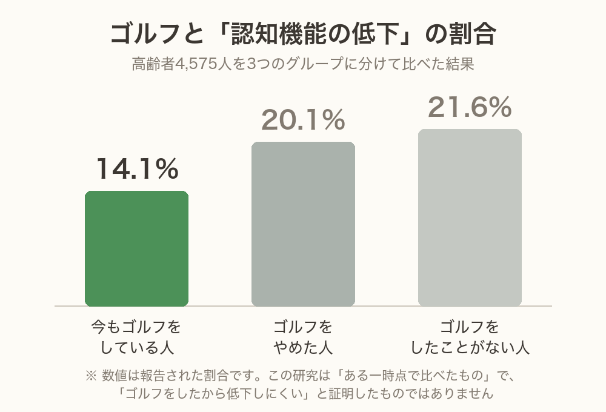
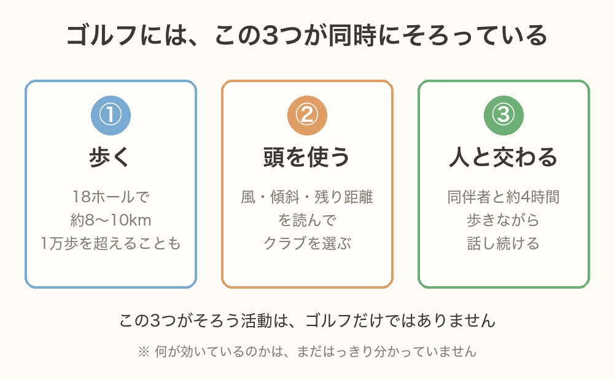
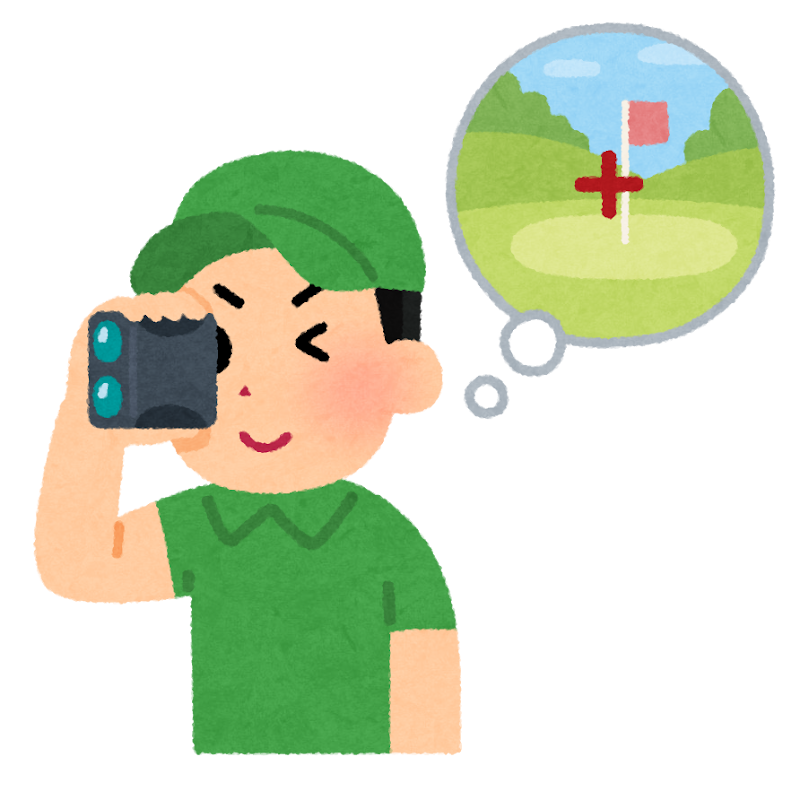
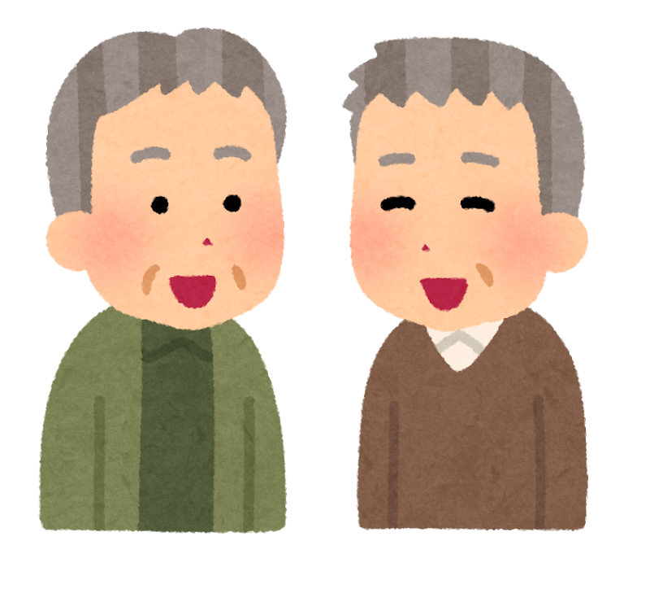
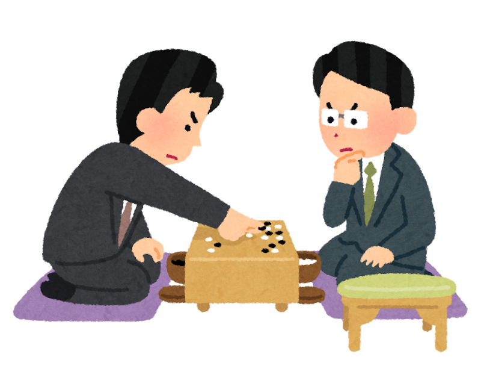
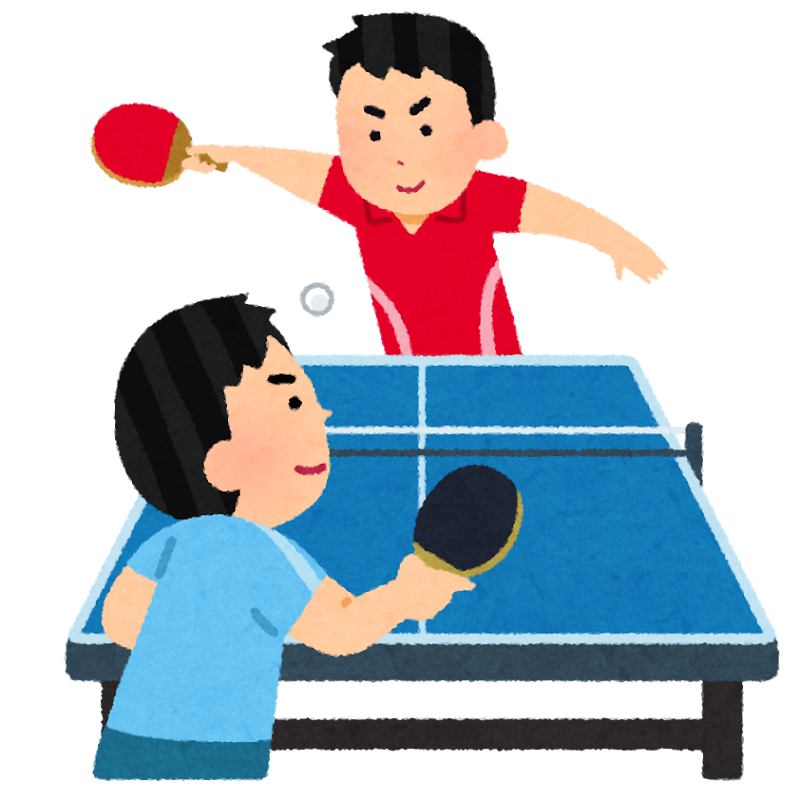

「そろそろ、ゴルフもやめどきかな」  
「腰も痛いし、スコアも昔のようにはいかないし……」

そんなふうに、長く続けてきた趣味を手放すことを考えたことはありませんか。

2026年、国立長寿医療研究センターの島田裕之先生たちが、**高齢者4,575人を対象にした研究**を発表しました。テーマは、ゴルフと頭の元気との関係です。

理学療法士として現場に立っていると、**趣味を手放した方から、少しずつ元気がなくなっていく**——そんな場面に何度か出会うことがありました。今回の研究は、その実感に静かに重なるものでした。

> ✅ 認知機能が下がっていた人の割合は、**今もゴルフをしている人14.1％／やめた人20.1％／したことがない人21.6％** でした
>
> ✅ 効いていそうなのは、**歩く・頭を使う・人と交わる、この3つが同時にそろうこと** です
>
> ✅ ただし **回数を増やす必要はありません** 。関係していたのは「たくさん回ること」ではなく「続いていること」でした

---

## 目次

1. [4,575人を、3つのグループに分けてみたら](#4575人を3つのグループに分けてみたら)
2. [ゴルフの、何が効いているのでしょう](#ゴルフの何が効いているのでしょう)
3. [ここは正直に——「だからゴルフをすれば安心」とは言えません](#ここは正直にだからゴルフをすれば安心とは言えません)
4. [では、ほかのスポーツや活動はどうなのでしょう](#ではほかのスポーツや活動はどうなのでしょう)
5. [共通しているのは「3つ」と「続いていること」](#共通しているのは3つと続いていること)
6. [私自身のこと](#私自身のこと)
7. [いま私たちにできること](#いま私たちにできること)
8. [おわりに](#おわりに)

---

## 4,575人を、3つのグループに分けてみたら

この研究では、高齢の方4,575人を、こんなふうに3つに分けて比べました。

- **今もゴルフをしている人**
- **昔はしていたが、やめた人**
- **ゴルフをしたことがない人**

そして4種類の検査で、認知機能が下がっているかどうかを調べました。結果が、こちらです。

**今も続けている人が14.1％** 。やめた人が20.1％、したことがない人が21.6％でした。統計的にみても、続けている人は「したことがない人」よりはっきり低い、と報告されています。

さらに興味深いのは、次の2点です。

- **ゴルフ歴が長い人ほど**、認知機能が下がっていない傾向がありました
- いっぽうで、**年間のラウンド数や練習の量**とは、はっきりした関係が見られませんでした


ゴルフをやめてしまった人は、もうダメということでしょうか……。



いいえ、そう読むのは早いです。実はこの研究、**記憶に関しては「やめた人」にも良い関連がみられた** と報告しています。それに、あとでお話ししますが、この数字には **逆向きの説明** も十分にあり得るんです。「頭が心配になってきたから、ゴルフをやめた」という順番ですね。


まとめると、この研究がいちばん強く示していたのは、こういうことになります。

**月に何回も回っている人が良い成績だったのではありません。回数は少なくても、ゴルフをやめずに長く続けてきた人**——そちらのほうに、良い結果が出ていたのです。

---

## ゴルフの、何が効いているのでしょう

では、ゴルフの何が頭に関わっているのでしょうか。研究チームは、ゴルフを「**体・頭・人づきあい、いくつもの要求が重なる活動**」だととらえています。

### ① 歩く

18ホールを回れば、カートを使っても、けっこうな距離を歩きます。歩いて回れば8〜10km、1万歩を超えることも珍しくありません。しかも**平らではありません**。上り下り、傾いた足場、ラフの中。ただの散歩より、体の使い方はずっと複雑です。

### ② 頭を使う

ここがゴルフの、いちばん面白いところかもしれません。

風の向きと強さ、グリーンまでの残り距離、足元の傾き、池やバンカーの位置、そして今日の自分の調子。**それを全部あわせて、1本のクラブを選ぶ** 。しかも、状況は毎回ちがいます。同じ場面は二度とありません。


言われてみれば、ラウンド中はずっと何か考えていますね。



そうなんです。しかも「決めて、打って、結果を見て、次を考える」のくり返しでしょう。これは脳の中でも **段取りをつけたり、切り替えたりする働き** をよく使います。ふだんの生活では、なかなかここまで使わないんですよ。


これを裏づける研究もあります。同じ島田先生たちが2018年に行った試験では、**運動習慣のなかった65歳以上の106人**を、24週間のゴルフ教室と健康講座のグループにくじ引きで分けました。その結果、**ゴルフ教室のグループでは、単語を覚える力が6.8％、お話を覚える力が11.2％** 高くなったと報告されています。

こちらは「くじ引きで分けて比べた試験」なので、**ゴルフの側に原因がある**と言いやすい研究です。

### ③ 人と交わる

そしてもう一つ。ゴルフは、**4時間前後を、だれかと一緒に過ごす**遊びです。

歩きながら話し、待ちながら話し、終わってからも話す。人とつながっていることは、認知症を遠ざける要素として、いま世界中で重く見られています。

> 人とのつながりや、耳・目のケアがなぜ大切なのかは、こちらの記事でくわしくお話ししています。  
> 👉 [脳を守る「刺激とつながり」〜耳・目・心・環境の7つの危険因子〜](/posts/dementia-14-factors-brain/)

### ただし——「歩くだけ」でも効いていました

ここは正直にお伝えします。

フィンランドなどの研究チームが、65歳以上の健康なゴルファー25人に、**18ホールのラウンド／6kmのノルディックウォーク／6kmのふつうの歩き**を、それぞれ体験してもらった実験があります。

その直後の頭の働きを測ったところ——**3つとも同じように改善しました**。

つまり、少なくともその日の効果に関しては、「ゴルフだから特別だった」わけではなかったのです。**歩くこと自体に、しっかり力があった**。ここは、ゴルフをしない方にとってこそ、大事な結果だと思います。

---

## ここは正直に——「だからゴルフをすれば安心」とは言えません

ここが、この記事でいちばんお伝えしたいところです。

今回の4,575人の研究は、**「ある一時点で、みんなをまとめて比べた研究」** です（専門的には「横断研究」といいます）。同じ人を何年も追いかけたものではありません。

そのため、こういう読み方ができてしまいます。

- **順番が逆かもしれない**……「ゴルフを続けたから頭が守られた」のではなく、「**頭がしっかりしているから、ゴルフを続けられている**」のかもしれません
- **もともとの違いがあるかもしれない**……ゴルフを続けられる方は、足腰が丈夫で、経済的にゆとりがあり、誘ってくれる仲間がいる。**その条件そのもの**が、頭の元気とつながっている可能性があります

とくに「順番が逆かもしれない」というのは、この研究の"やめた人"のグループを見ると、よく分かります。

ゴルフをやめる理由は、腰やひざが痛くなった、車の運転がつらくなった、誘ってくれる仲間が減った——いろいろあります。そして**もの忘れが出てきて、スコアの計算や段取りがおっくうになった**という方も、実際にいらっしゃいます。

つまり、"やめた人"のグループには、**やめる時点ですでに何かが起きていた方**が、多めに含まれている可能性があるのです。だとすれば、その人たちの認知機能が低めだったのは、**ゴルフをやめたせいではなく、やめる原因になったもののせい**かもしれません。

順番が「ゴルフをやめた → 頭が下がった」なのか、「頭が下がってきた → ゴルフをやめた」なのか。**一時点で比べただけの研究では、この2つを見分けられない**のです。


それでは、この研究には意味がないということですか？



とんでもない、大いに意味があります。ただ、**言えることの範囲** をはっきりさせておきたいんです。「ゴルフをすれば認知症を防げる」とまでは、まだ誰も言えません。でも「**今やっている活動を手放さないほうがよさそうだ**」——ここまでは、いくつもの研究が同じ方向を指しています。


研究者ご自身も、この研究だけで「ゴルフに予防効果がある」と結論づけてはいません。**「続けていることが、認知機能と関連している可能性がある」** ——ここまでが、この研究で言えることです。

---

## では、ほかのスポーツや活動はどうなのでしょう

「ゴルフはしないのだけれど」という方が、ほとんどだと思います。ここからが本題かもしれません。

### 日本の約5万人を6年追いかけた研究

日本には、高齢者およそ**49,700人を6年間追いかけた大きな研究**（JAGES）があります。この間に、認知症を伴う要介護認定を受けた方が4,758人（9.6％）いました。

そこで「どんな趣味を持っている人が、認知症になりにくかったか」を調べています。数字は**危険度の比**で、1.00が「趣味なし」の目安。**小さいほどリスクが低い**という読み方です。

| 趣味 | 危険度の比 |
|---|---|
| ゴルフ（男性） | 0.61 |
| パソコン（男性） | 0.65 |
| 手工芸（女性） | 0.73 |
| 旅行（女性0.76／男性0.80） | 0.76〜0.80 |
| グラウンド・ゴルフ（男女とも） | 0.80 |
| 釣り（男性） | 0.81 |
| 写真撮影（男性） | 0.83 |
| 園芸・庭いじり（女性） | 0.85 |

そして、この研究のいちばん大事な結論は、個々の趣味ではありませんでした。

**趣味の種類が多い人ほど、認知症になりにくい**（男性0.84／女性0.78）。つまり「何をやるか」より、**いくつ持っているか**のほうが、はっきりした傾向として出たのです。

### 25年前から言われていた「意外な結果」

もう一つ、有名な研究をご紹介します。アメリカで**75歳を超えた469人を、中央値で5年あまり追いかけた研究**（2003年・『ニューイングランド医学雑誌』）です。

| 活動 | 危険度の比 |
|---|---|
| 囲碁・将棋などの盤ゲーム | 0.26 |
| 楽器の演奏 | 0.31 |
| 読書 | 0.65 |
| **ダンス** | **0.24** |
| 歩く運動 | 0.67（はっきりした差とはいえず） |
| 水泳 | 0.71（同上） |
| 自転車 | 2.09（同上） |

ここで驚かれるかもしれません。**体を動かす活動のうち、はっきり差が出たのはダンスだけ**でした。歩くことも水泳も、この研究では有意な差になっていません。

では、この研究で大きな差が出たのはどこだったのでしょう。それは、**頭を使う活動を、どれだけの日数やっているか** でした。

この研究では、読書・盤ゲーム・楽器・クロスワード・書きもの・話し合いの6つについて、**週に何日やっているかを足し算**して、一人ひとりの点数を出しています。たとえば「読書を毎日（7日）＋盤ゲームを週2日」なら9点、という具合です。

そのうえで469人を、点数の高い順に3つのグループに分けました。

- **点数の高いほう3分の1**（週に11日分より多い＝毎日何かしら頭を使っている人たち）
- 真ん中の3分の1
- **点数の低いほう3分の1**（週に8日分より少ない人たち）

すると、**いちばん上のグループは、いちばん下のグループに比べて、認知症になる割合が63％低い**という結果でした。歩く・泳ぐでは差が出なかったのに、ここには大きな差が出たのです。


ダンスだけ、というのは不思議ですね。



研究者もそこに注目しています。ダンスは **体を動かしながら、順番を覚えて、相手や音楽に合わせる** 。つまり **運動と頭と人づきあいが、同時に混ざっている** んです。……お気づきでしょうか。ゴルフの「3つ」と、そっくりですよね。


なお、この研究では**ゴルフとテニスをしていた方が10人に満たず、評価できなかった**と正直に書かれています。「ゴルフが最強」などと言った研究者は、どこにもいません。

### 「相手や状況が変わる運動」のほうが強いかもしれない

近年よく言われるのが、この分け方です。

- **状況が毎回変わる運動**……卓球、テニス、バドミントン、ダンス、そしてゴルフ
- **同じ動きをくり返す運動**……ランニング、自転車、水泳

高齢の方を対象にした試験で、**卓球のグループのほうが、自転車や早歩きのグループより、頭の切り替えの改善が広く出た**という報告があります。予測できない状況に合わせ続けること自体が、脳への課題になっているのだろう、という考え方です。

---

## 共通しているのは「3つ」と「続いていること」

ここまでを、いったんまとめます。

ゴルフ、ダンス、卓球、囲碁将棋、グラウンド・ゴルフ、旅行、写真、釣り、園芸——ばらばらに見えるこれらに、共通していそうなものが二つあります。

**ひとつめは、「歩く」「頭を使う」「人と交わる」のうち、複数が同時にそろっていること。**

歩くだけでも意味はあります。頭を使うだけでも意味はあります。でも、**同時にそろっているほうが強そうだ**——これが、いろいろな研究をならべて見えてくる姿です。

**ふたつめは、続いていること。**

今回のゴルフの研究で、いちばん心に残ったのはここでした。**ラウンド数を増やした人が有利だったのではありません。ゴルフ歴が長い人、つまり手放さなかった人**のほうに、傾向が出ていたのです。

> 運動が脳にどう働くのか、その仕組みについてはこちらもどうぞ。  
> 👉 [認知症リスクを45％下げる運動習慣 〜60代から始める「脳の貯金」〜](/posts/dementia-prevention-exercise/)

---

## 私自身のこと

私自身、ゴルフを続けて10年以上になります。

コースに立つと、意外なほど頭を使っていることに気づきます。**風はどちらから吹いているか。ピンまで残り何ヤードか。足元は左足下がりか。** それを全部あわせて、番手を1本選ぶ。迷って、結局1本大きいクラブを持って、また迷う。あの数十秒が、じつはなかなかの作業です。

そしてもうひとつ。**歩きながらの会話**が、思っていた以上にいいものだと感じています。向かい合って話すのではなく、並んで歩きながら、ぽつぽつと話す。ラウンドが終わってからの「あの一打がねぇ」という振り返りも含めて、あの時間は、ほかではなかなか手に入りません。

研究の数字を見ながら、「ああ、あの時間のことか」と、腑に落ちるところがありました。

---

## いま私たちにできること


ゴルフはしていないのですが、私にもできることはありますか？



もちろんです。むしろ **今やっていることを続けるほうが、新しく何かを始めるよりずっと現実的** なんですよ。研究が示していたのも、まさにそこでした。


- ✅ **今ある趣味を、手放さない**……これがいちばん大事です。「もう歳だから」と一つやめると、次もやめやすくなります
- ✅ **回数を増やさなくていい**……月1回でも、続いていることに意味がありそうです。無理に増やして体を痛めては、元も子もありません
- ✅ **「歩く・考える・人と会う」がいくつそろっているか**で見てみる……1つしかないなら、そこに一つ足せないか考えてみてください。歩く仲間をつくる、教室に通う、それだけで2つになります
- ✅ **一人でやらない工夫を**……同じことでも、だれかと一緒だと続きます
- ✅ **趣味は、いくつあってもいい**……日本の研究では「種類が多いほど良い」という結果でした。一つに絞る必要はありません
- ✅ **体を痛めない工夫をする**……長く続けるための、いちばん現実的な備えです

続けるうえで、いちばんの敵は「痛み」です。腰や肩をかばいながらでは、どうしても足が遠のいてしまいます。ゴルフをされる方は、体の使い方をこちらでもお話ししていますので、よろしければどうぞ。

> 👉 [回すのは腰ではなかった 〜ゴルフに必要な可動域と筋力（第1回・体幹編）〜](https://golf-karada.com/posts/golf-rom-strength-1/)（姉妹ブログ「ゴルフのカラダ研究所」）

記事の中でお話ししたとおり、**音楽に合わせて体を動かす**タイプの運動は、研究のうえでも注目されてきました。ご家族やお子さん世代で「そういう運動を始めてみたい」という方がいらしたら、こんな選択肢もあります。

PR

暗闇フィットネス EXPA（エクスパ）

RIZAPが監修した、暗闇のスタジオで音楽に合わせて体を動かすフィットネスです。ダンス系のプログラムのほか、ヨガやストレッチのクラスもあり、月額制で通い放題。人前で動くのが苦手な方でも、暗い中なら気にせず動けるのがこのスタイルの良さです。

<a href="https://px.a8.net/svt/ejp?a8mat=4BA1PD+BZNBWI+CW6+E80ZYQ" rel="nofollow">RIZAP監修！月額15555円で毎日通い放題＆RIZAP流食事改善指導付き！-5kgを目指すなら【暗闇ダイエットEXPA】</a>

※<strong>女性専用</strong>のスタジオで、店舗は東京・大阪など都市部が中心です。ひざや腰に不安のある方、持病をお持ちの方は、始める前にかかりつけの医師にご相談ください。

### 📚 あわせて読みたい一冊

{{< affiliate
    title="運動脳（新版）"
    image="https://thumbnail.image.rakuten.co.jp/@0_mall/bookfan/cabinet/01021/bk4763140140.jpg?_ex=400x400"
    amazon="https://af.moshimo.com/af/c/click?a_id=5534074&p_id=170&pc_id=185&pl_id=4062&url=https%3A%2F%2Fwww.amazon.co.jp%2Fdp%2FB0GVBCKJDW"
    rakuten="https://af.moshimo.com/af/c/click?a_id=5533903&p_id=54&pc_id=54&pl_id=27059&url=https%3A%2F%2Fitem.rakuten.co.jp%2Fbookfan%2Fbk-4763140140%2F"
    description="「運動が、なぜ脳に効くのか」を神経科学の視点からやさしく解説した世界的ベストセラー。歩くことがなぜ頭に効くのかを知りたい方に。" >}}



---

## おわりに

「そろそろ、やめどきかな」

その言葉が出そうになったとき、今日の数字を少しだけ思い出していただけたらと思います。**続けている人14.1％、やめた人20.1％** 。もちろん、これは「やめたから下がった」と証明したものではありません。そこは正直に申し上げます。

それでも、日本の5万人の研究も、25年前のアメリカの研究も、そして今回のゴルフの研究も、同じ方を向いていました。**体を動かし、頭を使い、人と交わる時間を、手放さないこと。**

上手である必要はありません。回数を増やす必要もありません。

**細くても、続いていること。** それが、いま研究が指し示している一点です。

今日のラウンドも、今日の一局も、今日の畑仕事も。  
どうか、大切になさってください。

---

### 参考にした情報

- 元になった研究：Shimada H, Doi T, Makizako H, Toba K.「Relationship between playing golf and cognitive function in old age」『Acta Psychologica』第268巻・論文番号107354（2026年／DOI: 10.1016/j.actpsy.2026.107354）。国立長寿医療センターの研究チームによる、高齢者4,575人を対象とした**横断研究**です
- この研究を紹介した記事：ケアネット「日本人高齢者、ゴルフと認知機能が関連」（会員登録が必要です）
- ゴルフ教室の試験：Shimada H, et al.『Journal of Epidemiology and Community Health』2018年72巻944-950頁（DOI: 10.1136/jech-2017-210052）。65歳以上106人を24週間のゴルフ教室と健康講座に無作為に割り付けた試験
- 1回のラウンドの効果：Kettinen J, et al.『BMJ Open Sport & Exercise Medicine』2023年。東フィンランド大学・エディンバラ大学・チューリッヒ工科大学の研究チームが、65歳以上のゴルファー25人を対象に実施
- 日本の趣味と認知症：「高齢者の趣味の種類および数と認知症発症：JAGES 6年縦断研究」『日本公衆衛生雑誌』第67巻11号（2020年）。約49,700人を6年間追跡
- 余暇活動と認知症：Verghese J, et al.「Leisure Activities and the Risk of Dementia in the Elderly」『New England Journal of Medicine』2003年348巻2508-2516頁。75歳超の469人を追跡
- 記事中の2枚の図は、報告された数値をわかりやすく描いた**イメージ図**です
- ※本記事は一般的な情報提供を目的としたものです。もの忘れなどで気になる症状があるときや、痛みを抱えながら運動を続けてよいか迷うときは、自己判断せず、**かかりつけの医師にご相談ください。**
