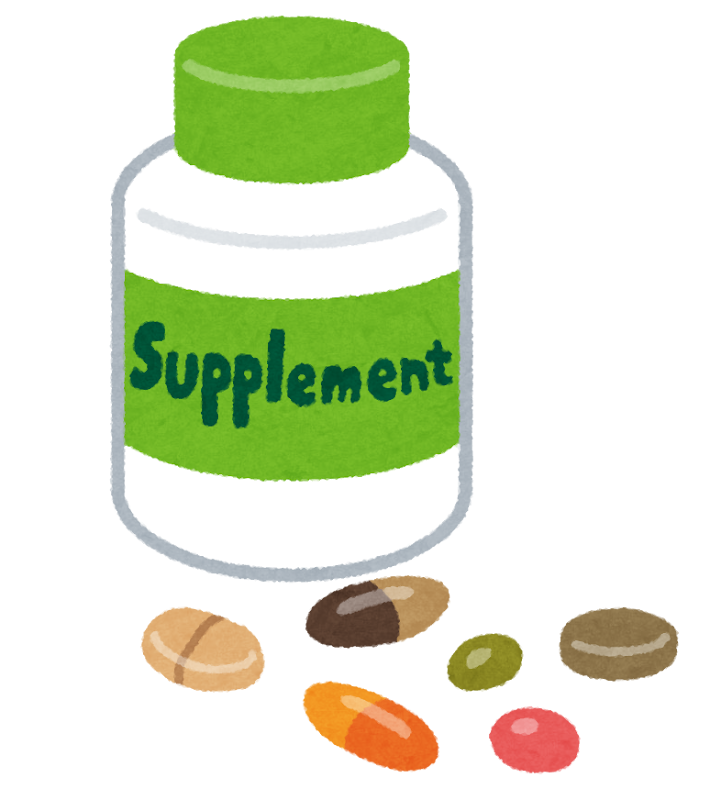

「テレビで良いと言っていたから」「ネットで評判だったから」——。
そう思って買った健康食品やサプリが、いつの間にか戸棚にたまっていませんか？

じつは今、**健康にお金をかけている人ほど、「何を信じたらいいか分からない」と感じている** という調査結果が出ています。今回は、その最新データを見ながら、あふれる健康情報とのかしこいつき合い方を、ご一緒に考えてみたいと思います。

> ✅ 1年間に健康にかけるお金は、平均で **約15.7万円**（前の年より約1.8万円アップ）
>
> ✅ 「健康の正しい情報が分からない、何を信じたらいいか分からない」と感じる人は **24.0%**（3年で5.1ポイント増加）
>
> ✅ 情報にふり回されないコツは、**「誰が・何人に・いつ調べたか」** を確かめること

---

## 目次

1. [健康にかけるお金は、年15.7万円まで増えている](#健康にかけるお金は年157万円まで増えている)
2. [お金をかけるほど、「迷い」も増えている](#お金をかけるほど迷いも増えている)
3. [情報にふり回されないための、3つのものさし](#情報にふり回されないための3つのものさし)
4. [理学療法士として、現場で感じること](#理学療法士として現場で感じること)
5. [いま、私たちにできること](#いま私たちにできること)
6. [おわりに](#おわりに)

---

## 健康にかけるお金は、年15.7万円まで増えている


みんな、健康のためにどれくらいお金を使っているんでしょう？



最近の調査だと、**1年で平均15.7万円** なんですよ。しかも、年々増えているんです。


ハルメクグループの生きかた上手研究所が、2025年に **50〜79歳の女性467人** に行った「健康に関する意識・実態調査2025」によると——

- 1年間に健康にかけているお金は、平均で **約15.7万円**
- 前の年より **約1.8万円** 増えていました

内訳を見ると、「運動サービス」「マッサージ・整体」「医薬品・医療品」への出費が、それぞれ増えています。「認知症になりにくい生活を送りたい」「入院や介護のいらない体でいたい」といった **予防への意識** も、この3年で高まっているそうです。

体を大切に思う気持ちが、こうしてお金の使い方にも表れているのですね。

---

## お金をかけるほど、「迷い」も増えている

ところが、ここで少し気になる数字があります。

同じ調査で、**「健康に関する正しい情報が分からない、何を信じたらよいのか分からない」** と答えた人が、こんなふうに増えているのです。

| 年 | 「何を信じたらいいか分からない」と感じる人 |
|---|---|
| 2023年 | 18.9% |
| 2025年 | **24.0%** |

3年で **5.1ポイント** も増えています。いまや、**4人に1人** が情報に迷っている計算です。


たしかに……。テレビ、ネット、ご近所の話。どれもそれらしく聞こえて、かえって分からなくなります。



そうなんです。**情報が多すぎると、選ぶのがかえって難しくなる**。だからこそ、情報を見分けるちょっとしたコツが役に立つんですよ。


健康を大切に思う気持ちが強いからこそ、たくさんの情報を集める。でも集めるほど、どれが本当か分からなくなる——。そんな“情報の渋滞”が、いま多くの方に起きているのかもしれません。

---

## 情報にふり回されないための、3つのものさし

医療の現場でも、私たちは新しい情報の「たしからしさ」を、いくつかの目印で見分けています。むずかしい知識はいりません。次の **3つのものさし** を持つだけで、ぐっと惑わされにくくなります。

### ものさし① 「誰が言っているか」を見る

まず、その情報の **発信元** を確かめます。国や学会、大学、公的な研究機関などが出している情報は、比較的たしかです。反対に、**その商品を売っている会社だけ** が「効きます」と言っている場合は、少し立ち止まって考えたいところです。

### ものさし② 「何人を調べたか」を見る

「飲んだら元気になった」という声も、それが **一人の感想** なのか、**何百人・何千人を調べた結果** なのかで、意味は大きく変わります。人数が多く、きちんと比べて調べたものほど、信頼しやすくなります。

### ものさし③ 「いつの情報か」を見る

健康の常識は、少しずつ新しくなっていきます。「昔は良いとされていたが、今は違う」ということも珍しくありません。**なるべく新しい情報** を選ぶのも、大切なものさしです。


「個人の感想です」って、よく小さく書いてありますよね。



いいところに気づかれましたね。あの一言は、**「たくさんの人で確かめたわけではありませんよ」** という合図なんです。頭の片すみに置いておくと、ふり回されにくくなりますよ。


---

## 理学療法士として、現場で感じること

リハビリの現場でも、「テレビで見たこの体操、やってもいいの？」「この健康食品、続けたほうがいい？」と聞かれることが、よくあります。

そんなとき私がお伝えしているのは、**「良さそうでも、まずは今の体に合うか一緒に考えましょう」** ということです。同じ方法でも、合う人と合わない人がいます。情報そのものより、**「自分の体に合っているか」** を確かめる——その一手間が、いちばんの近道だと感じています。

---

## いま、私たちにできること

情報とかしこくつき合うために、今日からできることをまとめます。

- ✅ 気になる健康法を見つけたら、**「誰が・何人に・いつ調べたか」** をひと呼吸おいて確かめる
- ✅ 「絶対に治る」「これだけで大丈夫」という **言い切りには、いったん立ち止まる**
- ✅ 高価なサプリや器具を買う前に、**かかりつけ医や薬剤師に一言相談する**
- ✅ 情報を集めすぎて疲れたら、**いったん離れてみる**（“情報の休憩”も立派な健康法です）
- ✅ 迷ったら、**国や公的機関のサイト** を見に行く

お金をかけることが悪いわけではありません。大切なのは、**「納得して選べているか」**。それだけで、同じ出費でも安心感がまったく変わってきます。

---

## おわりに

健康にお金をかける人が増えているのは、それだけ **「元気で長生きしたい」** という願いが強いということ。とても自然で、すてきな気持ちです。

だからこそ、その大切なお金と時間を、あやふやな情報でムダにしてほしくない——。医療者として、そう思います。

次に「体に良さそう」な情報に出会ったら、ぜひ今日の3つのものさしを思い出してみてください。ふり回されず、自分にとって本当に必要なものを、落ち着いて選べるようになるはずです。

> 健康とお金の話題は、こちらの記事もどうぞ。
> 👉 [夜中に目が覚めるのは、私だけ？ 〜年代で変わる睡眠の悩みと、今夜からできる工夫〜](/posts/sleep-troubles-by-age-2026/)

---

### 参考にした情報

- ハルメク 生きかた上手研究所 **「健康に関する意識・実態調査2025」**（2025年9月実施、全国の50〜79歳の女性467人）

※ 本記事は、上記の調査結果をもとに、一般読者向けにわかりやすくまとめ直したものです。特定の商品・サービスの効果を保証するものではありません。健康食品・サプリメント・治療法の利用に迷う場合は、かかりつけ医や薬剤師にご相談ください。

