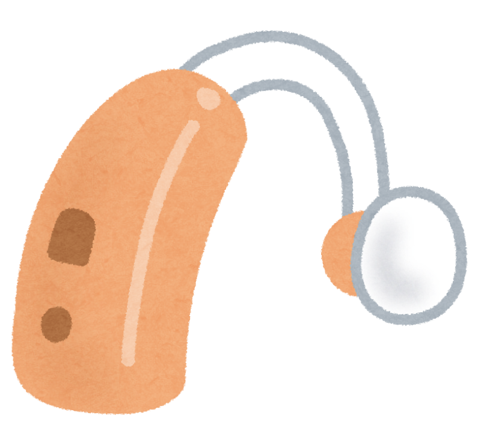

「買ったんですけどね、あんまり使っていないんです」

補聴器の話をすると、驚くほどよく返ってくる言葉です。**引き出しにしまったまま**、という方に、私は何人もお会いしてきました。

前回の記事では「いつから使えばいいのか」を書きました。今回はその続きです。**つけたあと**の話をします。

> 前回の記事はこちらです。
> 👉 [補聴器は、いつから使えばいいの？](/posts/hearing-aid-when-to-start/)

> ✅ 33か国・6万人を超える調査で、補聴器を使っている方は認知症のリスクが**9%低い**という結果が出ました
>
> ✅ ただし内訳を見ると、**「よく聞こえるようになった」と答えた方だけが14%低く**、「あまり良くならなかった」方では**差がありませんでした**
>
> ✅ 大事なのは持っていることではなく、**ちゃんと聞こえる状態にしておくこと**。そのために、**調整に通う**必要があります

---

## 目次

1. [6万人を超える調査でわかったこと](#6万人を超える調査でわかったこと)
2. [「持っている」と「聞こえている」は違う](#持っていると聞こえているは違う)
3. [なぜ、つけただけでは足りないのか](#なぜつけただけでは足りないのか)
4. [調整に通う、ということ](#調整に通うということ)
5. [現場で見てきたこと](#現場で見てきたこと)
6. [いま、私たちにできること](#いま私たちにできること)
7. [おわりに](#おわりに)
8. [参考にした情報](#参考にした情報)

---

## 6万人を超える調査でわかったこと

2026年、香港大学のグループが大きな調査結果を発表しました。

- **33か国**、7つの大規模調査のデータをまとめたもの
- 対象は**55歳以上で、聞こえに問題のある61,089人**
- **平均6.5年**追いかけ、そのあいだに認知症が疑われた方は**8,911人**

結果、補聴器を使っている方は、使っていない方に比べて認知症のリスクが**9%低い**という関係が見られました。

ここまでは、これまでにも言われてきたことです。**新しいのは、その先でした。**

---

## 「持っている」と「聞こえている」は違う

研究チームは、使っている方をさらに2つに分けました。

| | 認知症のリスク |
|---|---|
| 「**よく聞こえるようになった**」と答えた方 | **14%低い** |
| 「あまり良くならなかった」と答えた方 | **差なし** |

**同じ「補聴器を使っている人」でも、結果がまったく違いました。**

研究をまとめた先生は、こう述べています。

> 大事なのは機器をつけているかどうかではなく、**その機器が日常生活のなかで、聞こえを本当に良くしているかどうか**である。


つけていれば効く、というわけではないんですね……。




そうなんです。ここは、**私にとってもハッとする結果**でした。「補聴器を使いましょう」とお伝えするだけでは、足りなかったわけです。**「聞こえるようになりましたか」まで確かめないと、意味が半分になってしまう**のですね。


---

## なぜ、つけただけでは足りないのか

補聴器は、めがねとは違います。**買ったその日に、よく聞こえるようにはなりません。**

理由は3つあります。

- **その人の聞こえ方に合わせる作業が要る**……高い音が聞こえにくい方、低い音が聞こえにくい方。どの音をどれだけ大きくするかは、一人ひとり違います
- **脳が慣れるのに時間がかかる**……久しぶりに音が戻ってくると、はじめは「うるさい」と感じます。多くの方が、ここでやめてしまいます
- **聞こえは変わっていく**……年月とともに聞こえ方は変わります。**去年合っていた設定が、今年も合うとはかぎりません**

だから、**買ったあとに何度か通って、少しずつ合わせていく**必要があるのです。


はじめの「うるさい」は、我慢するしかないんですか？




我慢しなくて大丈夫です。**むしろ、そのまま伝えてください。** 「うるさい」は調整の大事な手がかりですから、遠慮すると合わせようがないんですね。ただ、**少しずつ音に慣れていく期間**はどうしても要ります。そこは「慣らしていく時期」と思っていただけたらと思います。


---

## 調整に通う、ということ

具体的には、こういうことです。

- はじめの数か月は、**何度か調整に通う**
- **「うるさい」「言葉が聞き取りにくい」を、遠慮せず伝える**。それが調整の材料になります
- 落ち着いたあとも、**年に1度は聞こえの確認**をする
- 電池や耳あかの詰まりでも、聞こえは落ちます。**手入れの仕方も教わっておく**


何度も行くのは、正直めんどうです……。




よく分かります。ただ今回の結果からすると、**この通う手間こそが効いている**のだと思います。せっかくのものを引き出しにしまってしまうより、**あと数回だけ足を運ぶ**。そう考えていただけたらと思います。


---

## 現場で見てきたこと

私がリハビリの現場でよく見たのは、**補聴器を持っているのに、机の上に置いたままの方**でした。

理由を聞くと、たいてい同じです。「うるさいから」「よく聞こえないから」。

そういうとき、ご本人は「**補聴器は自分に合わなかった**」と思っておられます。でも実際は、**合わせきる前にやめてしまった**ことが多いのです。もったいない、といつも思っていました。

今回の調査は、その実感に数字をつけてくれたように感じています。

---

## いま、私たちにできること

- ☑ **すでにお持ちの方**……いま「よく聞こえている」と言えますか。言えないなら、**買ったお店か耳鼻科に、もう一度相談**を
- ☑ **しまい込んでいる方**……捨てないでください。**調整で変わることがあります**
- ☑ **これから買う方**……値段より先に、**調整に通えるお店か**を見てください
- ☑ **ご家族の方**……「聞こえてる？」ではなく、「**テレビの音、前より小さくできてる？**」のように具体的に聞くと分かります
- ☑ 聞こえが気になり始めたら、**まず耳鼻科**へ。耳あかが原因のこともあります

> 補聴器を始める時期や、集音器との違いについては前回の記事にまとめています。
> 👉 [補聴器は、いつから使えばいいの？](/posts/hearing-aid-when-to-start/)

---

## おわりに

この調査は、**「補聴器を買えば安心」ではない**ことを教えてくれました。

けれど私は、これを残念な結果だとは受け取っていません。むしろ逆です。「**聞こえるようにすれば、意味がある**」とはっきりしたのですから。

そして聞こえるようにする方法は、もう分かっています。**通って、合わせること。** 手間はかかりますが、できないことではありません。

引き出しの奥に、しまったままのものはありませんか。もう一度だけ、出してみてください。

---

## 参考にした情報

- Hearing aid effectiveness and probable dementia risk across 33 countries: A pooled analysis of seven cohorts（*Cell Reports Medicine* 2026年5月）／香港大学公衆衛生大学院ほか
- 前回の記事：[補聴器は、いつから使えばいいの？](/posts/hearing-aid-when-to-start/)

※この記事は公表された研究をもとに、一般の方向けにやさしく言い換えたものです。聞こえに不安があるときは、耳鼻咽喉科にご相談ください。
