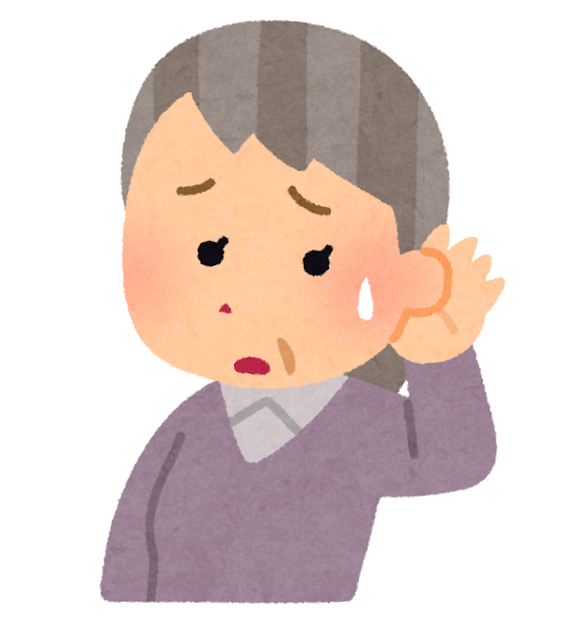
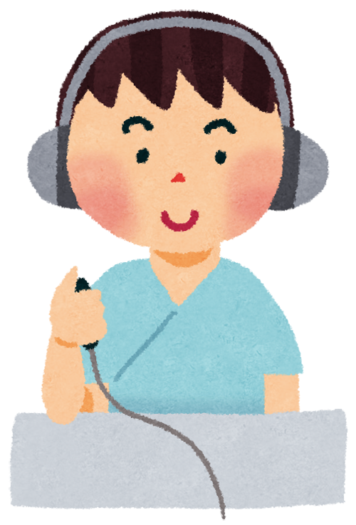
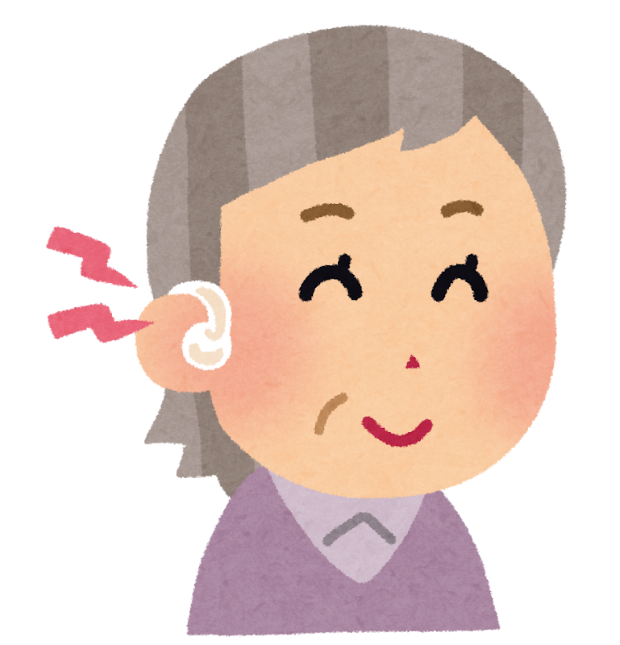

「えっ？　もう一回言って」が、口ぐせになっていませんか。

テレビの音量を上げたら、家族に「大きい」と言われた。3人以上で話していると、話の流れがつかめない。ざわざわしたお店だと、相手の声だけ聞き取れない――。

そんなとき、多くの方がこう思われます。**「年のせいだから、しかたない」** と。

でも、もしその「しかたない」が、**あとから効いてくる**のだとしたら。

前回の記事で、日本人の認知症のリスク要因のうち **いちばん大きいのは「難聴」だった** ことをご紹介しました。ではその先――**「じゃあ、いつ補聴器を使えばいいの？」**。この問いに、最近ようやく研究が答えを出しはじめています。

> ✅ 慶應義塾大学の研究で、**平均聴力が「38.75デシベル」を超えたあたり** から、聞こえの悪さと認知機能の低下が結びつくことが分かりました
>
> ✅ ただし補聴器は **「つければ認知症を防げる」道具ではありません**。効果がはっきり出たのは、**持病や生活習慣の面で、もともと認知機能が下がりやすい状態にあった人たち** でした
>
> ✅ 迷ったら、まず **耳鼻科（耳鼻咽喉科）で聴力検査**。通販の「集音器」を自分で選ぶ前にです

> 難聴が「なぜ」リスクになるのか、全体像を先に知りたい方はこちらをどうぞ。
> 👉 [日本人の認知症、約4割は予防できる 〜カギは「難聴」と「運動不足」〜](/posts/dementia-japan-14-factors/)

---

## 目次

1. [なぜ「聞こえ」が脳に関わるの？](#なぜ聞こえが脳に関わるの)
2. [「38.75」という目安 ― 慶應大学の研究](#3875という目安--慶應大学の研究)
3. [補聴器をつけると、どうなるのか](#補聴器をつけるとどうなるのか)
4. [「集音器」と「補聴器」は別のものです](#集音器と補聴器は別のものです)
5. [値段と、賢い買い方](#値段と賢い買い方)
6. [母のことを思い出しながら](#母のことを思い出しながら)
7. [いま、私たちにできること](#いま私たちにできること)
8. [おわりに](#おわりに)
9. [参考にした情報](#参考にした情報)

---

## なぜ「聞こえ」が脳に関わるの？

耳が遠くなると、脳には3つのことが起こると考えられています。

**① 脳に届く「音の情報」が減る**
脳は使われることで元気を保ちます。入ってくる音が減れば、それだけ脳の出番が減ってしまいます。

**② 聞き取りに、脳が余計な力を使う**
聞こえにくいと、脳は足りない音を推測して補おうとします。その分、覚えたり考えたりに回す力が削られます。会話のあとにどっと疲れるのは、このためです。

**③ 人と会うのが、おっくうになる**
これがいちばん大きいかもしれません。聞き返すのが申し訳なくて、集まりを断るようになる。**難聴は、じわじわと人づきあいを減らしていきます**。


うちの主人がまさにそれです。最近、町内の集まりに行きたがらなくて……。




実はとても多いんです。ご本人は「めんどうだから」とおっしゃるのですが、よく聞くと **「話が分からないから、いるのがつらい」** ということが少なくありません。性格の問題ではなく、**耳の問題** だったりします。


---

## 38.75という目安 ― 慶應大学の研究

さて、本題です。

「耳が遠くなってきた」と感じても、**どこからが「対策すべき段階」なのか**。これまで、はっきりした目安がありませんでした。

そこに答えを出そうとしたのが、**慶應義塾大学病院 耳鼻咽喉科・頭頸部外科**の研究チーム（西山崇経先生、大石直樹先生ら）です。研究成果は2025年2月、『nature』の姉妹誌である **『npj Aging』** に掲載されました。

### どんな研究だったか

対象になったのは、慶應義塾大学病院に通院していた **55歳以上の難聴のある方117人**。この方たちを、2つのグループに分けました。

| グループ | 人数 |
|---|---|
| 補聴器を使ったことがない方 | 55人 |
| 3年以上、補聴器を使っている方 | 62人 |

そのうえで、聞こえの程度と、認知機能の検査の成績を比べたのです。

### 分かったこと

結果は、はっきり分かれました。

- **補聴器を使っていないグループ** … 聞こえが悪い人ほど、認知機能の検査成績が低い、という関係が見られた
- **補聴器を使っているグループ** … その関係が **見られなかった**

そして、聞こえの悪さと認知機能の低下が結びつきはじめる境目が、**平均聴力で「38.75デシベル」あたり** だったのです。

### 「38.75デシベル」って、どのくらい？

数字だけではピンと来ないと思いますので、目安を並べてみます。

| 平均聴力 | 一般的な区分 | 聞こえ方の目安 |
|---|---|---|
| 25デシベル未満 | 正常 | ふつうに聞こえる |
| 25〜40デシベル | **軽度難聴** | 小さな声や、ざわざわした場所で聞き取りにくい |
| 40〜70デシベル | 中等度難聴 | ふつうの会話が聞き取りにくい |
| 70デシベル以上 | 高度難聴 | 大きな声でないと聞こえない |

つまり **38.75デシベルは、「軽度難聴」の終わりごろ**。「中等度」に入る一歩手前です。

ここが大事なところで、この段階の方は、たいてい **ご自分では「まだ大丈夫」と思っています**。日常会話はなんとかなるからです。でも研究が示した境目は、**その「まだ大丈夫」のあたりにあった** ということになります。


「聞こえなくて困る」ようになってからでは、遅いということですか？




遅い、と決めつけるつもりはありません。ただ、**「困ってから」ではなく「聞き返しが増えてきたら」** くらいの感覚で相談していただくと、選択肢が広がるのは確かだと思います。


### ここは、正直にお伝えします

この研究には、注意して読むべき点があります。

**117人という人数は、決して多くありません。** また、ある一時点での聞こえと認知機能を比べた研究なので、**「補聴器を使ったから認知機能が保たれた」と証明したわけではない** のです。「もともと元気な方が補聴器を使っていた」という可能性も残ります。

それでも、**「どのくらいから動いたほうがいいのか」に数字の目安を示した** という点で、意味のある研究だと思います。

---

## 補聴器をつけると、どうなるのか

では、「補聴器を使えば認知症を防げる」のでしょうか。

ここは、**慎重にお伝えしなければならないところ** です。

世界でいちばん大がかりに調べたのが、アメリカで行われた **ACHIEVE（アチーブ）試験** です。2023年、医学誌『ランセット』に発表されました。

### どんな試験だったか

**70〜84歳で、難聴があるのに補聴器を使っていない977人** を、くじ引きのように2つのグループに分けました。

- 補聴器を使うグループ（490人）
- 健康の勉強会に参加するグループ（487人）

そして **3年間** 追いかけ、認知機能がどう変わるかを比べたのです。研究の質としては、いちばん信頼できるやり方です。

### 結果は、2つに分かれました

**全体で見ると、2つのグループに差はありませんでした。**

これは事実として、きちんと書いておきたいと思います。「補聴器をつければ、誰でも認知症を防げる」わけではないのです。

ところが、**参加者の一部**――もともと生活習慣などの面で **認知機能が低下しやすい状態にあった約240人** に限ってみると、話が変わりました。このグループでは、**補聴器を使った人のほうが、3年間の認知機能の落ち方がはっきり小さかった** のです。その差は、およそ半分ほどでした。


同じ試験なのに、結果が2つあるんですね。どちらを信じたらいいのでしょう。




どちらも本当のことです。研究者の方たちは、こう考えています。**「もともと下がりにくい人は、そもそも下がらない。だから差がつかなかった」** と。逆に言えば、**リスクを抱えている方ほど、補聴器の意味は大きくなる** ということになります。


高血圧や糖尿病がある、運動不足が続いている、ご家族に認知症の方がいる――そういう心当たりのある方にとっては、**耳のケアは後回しにしないほうがいい**。この試験は、そう読むのがいちばん誠実だと思います。

---

## 集音器と補聴器は別のものです

ここで、ぜひ知っておいていただきたいことがあります。

通販やお店で「よく聞こえる」とうたわれている商品には、**補聴器** と **集音器（しゅうおんき）** の2種類があります。名前は似ていますが、**まったく別のもの** です。

| | 補聴器 | 集音器 |
|---|---|---|
| 位置づけ | **国が認めた医療機器** | 医療機器ではない（家電に近い） |
| 音の調整 | **その人の聞こえに合わせて調整する** | 全体の音を一律に大きくする |
| 買う場所 | 専門店・耳鼻科の紹介 | 通販・家電量販店など |
| 値段 | 高め | 数千円〜数万円 |

難聴は、**すべての高さの音が均等に聞こえなくなるわけではありません**。多くの場合、まず高い音から聞こえにくくなります。「アイウエオ」の母音は聞こえるのに、「サ行」「カ行」が聞き取りにくい、というのはこのためです。

集音器は、**全部の音をまとめて大きくします**。ですから、必要な高い音がまだ足りないのに、うるさい低い音ばかりが大きくなる、ということが起こります。「買ったけど、うるさいだけで使わなくなった」という話をよく聞くのは、これが理由のひとつです。


値段が全然ちがうので、つい集音器のほうに手が伸びてしまいそうです。




お気持ちはよく分かります。ただ、**「合わなくて使わなくなった集音器」がいちばんもったいない** のです。まず耳鼻科で聞こえを測って、**ご自分がどの段階なのかを知ってから** 選んでいただくのが、結果的に近道になります。


---

## 値段と、賢い買い方

正直なところ、補聴器は安い買い物ではありません。ここもはっきり書いておきます。

### 相場

日本補聴器工業会の2025年の調査では、**1台あたり10万円以上20万円未満がいちばん多く（約35%）**、次いで20万円以上30万円未満（約13%）でした。**片耳でおよそ15万円前後** が、ひとつの目安と考えてよさそうです。両耳なら、その倍になります。

### 医療費控除が使えることがあります

ここは、知っているかどうかで負担が変わるところです。

補聴器の購入費用は、**条件を満たせば医療費控除の対象になります**。ただし、**手順を間違えると対象になりません**。

> **⚠️ いちばん大事な注意点**
>
> **先に補聴器を買ってしまうと、あとから書類を作ってもらっても対象外になります。**
> 必ず「受診 → 書類 → 購入」の順番で進めてください。

正しい手順は、こうです。

1. **補聴器相談医のいる耳鼻科を受診する**
   日本耳鼻咽喉科頭頸部外科学会が認定した「補聴器相談医」という資格を持つ先生です。
2. **「補聴器適合に関する診療情報提供書」を書いてもらう**
   検査を受けて、補聴器が必要と判断されると作成してもらえます。
3. **認定補聴器専門店で購入する**
   その書類を持って、「認定補聴器技能者」がいるお店で選びます。
4. **確定申告をする**
   購入した年の分として申告します。


順番を間違えたら戻せない、というのは知りませんでした。




ここでつまずく方が本当に多いんです。**「よさそうなお店を見つけて、その場で買った」** というのがいちばん惜しいパターンですね。まず耳鼻科、と覚えておいてください。


なお、お住まいの市区町村によっては、**高齢者向けの補聴器購入補助**を行っているところもあります。金額も条件も自治体ごとに違いますので、**役所の高齢福祉の窓口**で「補聴器の補助はありますか」と聞いてみてください。

---

## 母のことを思い出しながら

私の母は、2017年ごろから物忘れが目立つようになり、のちにアルツハイマー型認知症と診断されました。そのときのことは、[以前の記事](/posts/dementia-types-mci/)にも書きました。

いま振り返って思うのは、**聞こえにくさや忘れやすさの変化に気づいてはいたのに、「年のせい」で片づけてしまった時間があった** ということです。

理学療法士として働いていても、家族のこととなると、そうなるものだと知りました。だからこそ、この記事を書いています。

リハビリの現場でも、耳の遠い方が、少しずつ会話の輪から外れていく場面をよく見てきました。ご本人は「もういいよ」と笑っておられるのですが、その「もういいよ」が、**脳にとっては小さな損失の積み重ね** になっているかもしれない。そう思うと、耳のことは、もっと早く話題にしていいのだと感じます。

---

## いま、私たちにできること

難しいことはありません。順番に、ひとつずつで大丈夫です。

- ☑ **聞き返しが増えたら、それが合図**。「聞こえなくて困る」まで待たない
- ☑ **まず耳鼻科（耳鼻咽喉科）で聴力検査を受ける**。健診の簡易な検査だけでは分からないことがあります
- ☑ 自分の **平均聴力が何デシベルか** を聞いておく。「38.75」に近づいていたら、相談の時期です
- ☑ **通販の集音器を自己判断で買わない**。まず自分の聞こえを知ってから
- ☑ 買うときは **「受診 → 診療情報提供書 → 認定補聴器専門店」の順番** を守る（医療費控除のため）
- ☑ 市区町村の **補助制度** を役所の窓口で確認する
- ☑ ご家族は、**「テレビ大きいよ」で終わらせず、「一度みてもらおうか」** と誘ってみる

とくに、**高血圧・糖尿病・運動不足など、ほかの心当たりがある方**。ACHIEVE試験の結果からすると、あなたのような方こそ、耳のケアの意味が大きくなります。

---

## おわりに

補聴器は、かけたその日から世界が変わる魔法の道具ではありません。慣れるまでに時間もかかりますし、お金もかかります。研究も、まだ「これで決まり」と言える段階ではありません。

それでも、今回の2つの研究が共通して示していたのは、**「困りきってからでは、選べる手が減る」** ということでした。

耳は、**人とつながっているための入り口** です。その入り口が細くなると、会話が減り、外出が減り、脳への刺激が減っていきます。逆に言えば、ここを開いておくことは、**脳を守る、いちばん現実的な方法のひとつ** だとも言えます。

「聞き返しが増えたな」と思ったら、それだけで十分な理由です。**一度、耳鼻科で測ってみてください。** 測るだけなら、たいしたことではありませんから。

---

## 参考にした情報

- 慶應義塾大学病院「認知症のリスクとなり得る聴力レベルを解明 ― どのくらいの聴力から認知症予防として補聴器を始めた方が良いか」（2025年）。掲載誌は『npj Aging』（natureの姉妹誌）
- ACHIEVE試験：難聴のある高齢者977人を3年間追跡した無作為化比較試験。『The Lancet』2023年
- 日本補聴器工業会による補聴器の価格調査（2025年）
- 補聴器の医療費控除の手続きについては、日本耳鼻咽喉科頭頸部外科学会の「補聴器適合に関する診療情報提供書」の制度にもとづいています

---

※この記事は一般的な情報提供を目的としたものです。聞こえの状態やお体の状況には個人差があります。補聴器の使用や治療については、**必ずかかりつけ医・耳鼻咽喉科の医師にご相談ください。** また、医療費控除や補助制度の詳細は、お住まいの地域や年度によって異なりますので、税務署・市区町村の窓口でご確認ください。
</content>
