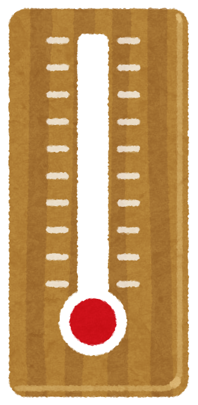
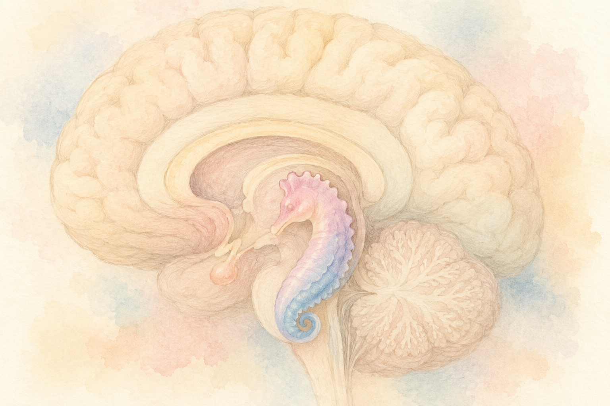
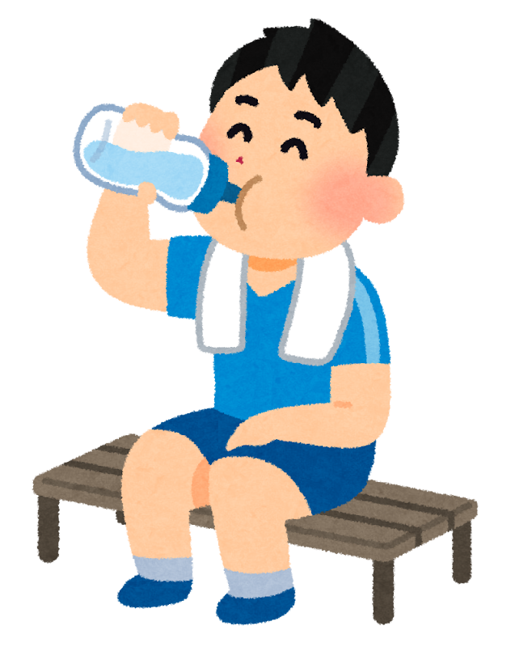

年々きびしくなる夏の暑さ。「ご高齢のご家族が心配」「自分も夏になると体がつらい」と感じている方は、多いのではないでしょうか。

暑さといえば、まず気になるのは **熱中症**。けれど最近、それだけではない可能性を示す研究が報告されました。テーマは **「長く続く猛暑と、認知症のリスク」** です。

日本の大規模な調査で、**極端な暑さに何年もさらされることが、認知症の発症リスクと関係していそうだ** という結果が出たのです。少し心配な話に聞こえるかもしれませんが、大事なのは **「だからこそ、今年の夏からできる対策がある」** ということ。今日は、研究の中身と、すぐに実践できる暑さ対策を、ごいっしょに見ていきます。

> ✅ 日本の高齢者 **約5万7千人** の調査で、**極端な暑さに多くさらされた人ほど**、認知症の発症リスクがやや高まる傾向がみられた
>
> ✅ 目安として、**猛烈に暑い日が7日増えるごとに、認知症のリスクが約9%・亡くなるリスクが約13%** 高まる計算だった
>
> ✅ ただし「暑さが原因」と言い切れる段階ではない。だからこそ **今年の夏から、エアコン・水分・室温の対策** を大切にしたい

---

## 目次

1. [どんな研究だったの？](#どんな研究だったの)
2. [どれくらい、リスクが上がるの？](#どれくらいリスクが上がるの)
3. [なぜ暑さが、脳に関わるのでしょう](#なぜ暑さが脳に関わるのでしょう)
4. [理学療法士として、夏の現場で感じること](#理学療法士として夏の現場で感じること)
5. [いま、私たちにできること](#いま私たちにできること)
6. [おわりに](#おわりに)

---

## どんな研究だったの？


暑さで「熱中症」はよく聞きますけど、「認知症」にも関係があるなんて初耳です。どんな調査だったんですか？



日本の高齢者 **約5万7千人** を長く追いかけた、とても大きな調査なんです。順番に見ていきましょう。


この研究は、東京科学大学・公衆衛生学分野の **森田彩子（もりた あやこ）氏** らによるもので、認知症の世界的な医学誌 *Alzheimer's & Dementia*（2026年1月4日号）に報告されました。

使われたのは、**JAGES（ジェイジス＝日本老年学的評価研究）** という、日本の高齢者を長く追いかけた大規模な調査のデータ（2016〜2019年）です。対象になったのは、**同じ町に30年以上住み、認知症がなく、自立して生活している65歳以上の方 約5万7千人**。これだけ多くの方を追跡した、信頼性の高い調査です。

研究では、それぞれの地域の **ふだんの気候とくらべて「極端に暑い日」が何日あったか** を計算し、その暑さへの「のべの量」が多い人と少ない人で、その後の **認知症の発症** や **死亡** に差が出るかを調べました。

追跡のあいだに、**2,454名（4.3%）が認知症を発症**し、2,375名（4.2%）が亡くなっていました。

---

## どれくらい、リスクが上がるの？

結果は、**「極端な暑さにさらされた量が多い人ほど、認知症や死亡のリスクがやや高くなる」** という傾向を示すものでした。

数字でいうと、わかりやすい目安はこちらです。

- **猛烈に暑い日が7日ふえるごとに**、認知症になるリスクは約 **9%**、亡くなるリスクは約 **13%** 高まる計算だった
- さらに研究チームは、**2016〜18年に実際にあったレベルの猛暑** にあてはめると、認知症のリスクは **約1.43倍**、死亡のリスクは約1.63倍になると試算した


「1.43倍」って聞くと、ちょっとこわい数字です……。



どきっとしますよね。でも、ここで落ち着いて受け止めたい点があるんです。


これは **たくさんの人を集めて見たときの「全体の傾向」** であって、「暑い夏を過ごした人が必ず認知症になる」という意味ではありません。また、この種の研究は **「関係がありそうだ」を示すもの** で、暑さが直接の原因だと断定できる段階ではない、ということも大切です。

それでも、これだけ多くの方を調べて傾向が見えたことは、**「夏の暑さ対策を、脳の健康の視点からも大切にしよう」** という、十分な後押しになります。

---

## なぜ暑さが、脳に関わるのでしょう


そもそも、どうして「暑さ」が脳に関係するんでしょう？



研究チームは、いくつかの「道すじ」を挙げています。むずかしい言葉は、やさしく言いかえてみますね。


**① 熱が、脳に直接ダメージを与える可能性**  
強い熱は、神経の細胞を傷つけたり、記憶の中心である **海馬**（かいば）に、アルツハイマー病と関係する **アミロイドβ**（脳にたまる老廃物のようなたんぱく質）がたまるのを、後押ししてしまう可能性が指摘されています。

**② 暑さが、暮らしの「悪循環」を生む可能性**  
暑い日が続くと、外に出るのがおっくうになり、**体を動かす量が減ります**。すると、人との交わりが減って **孤立** しがちになり、**睡眠** も乱れ、持病の管理もうまくいかなくなる……。こうした積み重ねが、数年かけてじわじわと、脳の健康や体の状態に影響していく、というわけです。

裏を返せば、**暑い時期も、無理のない範囲で体を動かし、人とつながり、よく眠ることが、脳を守ることにつながる** とも言えます。

---

## 理学療法士として、夏の現場で感じること


うちの親は「エアコンはもったいない」って、なかなかつけてくれなくて……。



よく聞くお悩みです。現場で感じている「コツ」をお話ししますね。


リハビリや介護の現場にいると、夏のご高齢の方には、独特の「気をつけたい点」があると感じます。

ひとつは、**「暑さを感じにくくなる」** こと。年齢を重ねると、暑さやのどの渇きのセンサーがゆっくりになり、ご本人は平気なつもりでも、体の中で熱がこもっていることがあります。「エアコンは苦手」「もったいない」とつけずに過ごされる方、トイレが近くなるからと **水分を控えてしまう** 方も少なくありません。

だからこそ、まわりが **さりげなく声をかけ、環境を整える** ことがとても大切です。「暑くない?」と聞くより、「いっしょに一杯飲みましょう」「少し涼しくしましょうね」と、**行動でうながす** ほうが、すっと受け入れてもらえることが多いように感じます。

---

## いま、私たちにできること

研究はむずかしくても、できることはとてもシンプルです。今年の夏から、無理なく始めてみましょう。

> ✅ **エアコンを、がまんしない。** 「暑い」と感じる前につける。室温の目安は **28℃以下** を意識して
>
> ✅ **のどが渇く前に、水分を。** こまめに少しずつ。トイレを気にして控えすぎないことも大切
>
> ✅ **室温・湿度を「見える化」。** 温湿度計を部屋に置くと、本人もまわりも気づきやすい
>
> ✅ **暑い時間を避けて、体を動かす。** 早朝や夕方の涼しい時間、または室内でできる体操を
>
> ✅ **離れて暮らすご家族は、こまめな声かけを。** 電話で「エアコンつけてる?」の一言が、見守りになる

ご高齢の方や持病のある方は、暑さの影響を受けやすいことがあります。**※ 体調や水分の取り方に不安があるときは、かかりつけ医にご相談ください。**

暑さ対策のちょっとした道具も、心強い味方になります。記事でも触れた「室温・湿度の見える化」や「身近な冷感グッズ」を、無理のない範囲で取り入れてみてください。

{{< affiliate
    title="デジタル温湿度計（卓上・マグネット式）"
    image="https://shop.r10s.jp/meijo/cabinet/11012444/11176229/rt-sdj-t17-wh-15.jpg"
    amazon="https://af.moshimo.com/af/c/click?a_id=5534074&p_id=170&pc_id=185&pl_id=4062&url=https%3A%2F%2Fwww.amazon.co.jp%2Fdp%2FB010CK58K4"
    rakuten="https://af.moshimo.com/af/c/click?a_id=5533903&p_id=54&pc_id=54&pl_id=27059&url=https%3A%2F%2Fitem.rakuten.co.jp%2Fmeijo%2Fm-ws01wh%2F"
    description="記事でも触れた「室温・湿度の見える化」に。手のひらサイズで、卓上にもマグネットでも置けて、温度と湿度がひと目でわかります。数字で見えると、ご本人もまわりも『そろそろエアコンを』と気づきやすくなります。" >}}

{{< affiliate
    title="SUO クールリング（首もとひんやり）"
    image="https://image.rakuten.co.jp/suo-life/cabinet/07612893/coolring_l/2026/ovalring_001.jpg"
    amazon="https://af.moshimo.com/af/c/click?a_id=5534074&p_id=170&pc_id=185&pl_id=4062&url=https%3A%2F%2Fwww.amazon.co.jp%2Fdp%2FB0B4ND3J2F"
    rakuten="https://af.moshimo.com/af/c/click?a_id=5533903&p_id=54&pc_id=54&pl_id=27059&url=https%3A%2F%2Fitem.rakuten.co.jp%2Fsuo-life%2Fsuo_ovalring%2F"
    description="首もとを冷やすクールリングは、外出時や入浴後のほてり対策に手軽です。一定の温度で自然に凍る素材で結露しにくく、くり返し使えます。エアコンが苦手な方の『もう少し涼しく』を、無理なく助けてくれます。" >}}

> あわせて読みたい  
> 👉 [認知症予防の4本柱 〜運動・食事・つながり・睡眠〜](/posts/cognitive-decline-prevention-overview/)

---

## おわりに

「夏の暑さが、脳にも関わっているかもしれない」――そう聞くと、少し不安になるかもしれません。けれど、この研究がいちばん伝えたいのは、**「暑さ対策は、熱中症だけでなく、長い目で見た脳の健康のためにも大切」** という前向きなメッセージだと、私は受け止めています。

エアコンをつける、こまめに水を飲む、室温に気を配る、声をかけ合う。どれも特別なことではありません。**今年の夏からできる小さな習慣** が、ご自身と大切な人の、これからの健康を静かに支えてくれます。

どうか、無理をせず、上手に夏を越えていきましょう。

---

### 参考にした情報

- Morita A, et al. **「Long-term exposure to extreme heat and the onset of dementia and mortality in older adults」** *Alzheimer's & Dementia*（2026年1月4日号）
- 日本老年学的評価研究（JAGES）
- ケアネット 医療ニュース「猛暑への長期曝露、認知症発症リスクを高める可能性」（2026年）※閲覧には会員登録が必要です

※ 本記事は、上記の研究・解説をもとに、一般読者向けにわかりやすくまとめ直したものです。ご紹介した研究は、多くの人を対象に「関係がありそうか」を調べた観察研究であり、暑さが認知症の直接の原因だと断定するものではありません。体調や暑さ対策に不安がある場合は、かかりつけ医にご相談ください。

