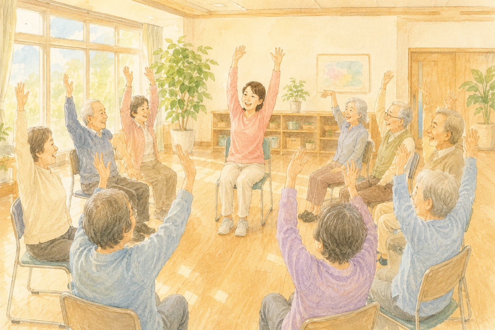

「運動は体にいい」――これは、みなさんよくご存じだと思います。  
では、**「運動は "脳" にもいい」** のはなぜか、考えてみたことはありますか？

「歩くのは足の運動なのに、どうして頭にまで効くんだろう？」  
実は、その "橋渡し" をしている物質が、近年とても注目されています。  
その名前が **イリシン**。運動をすると、**筋肉そのものから分泌され、血液に乗って脳まで届く** といわれる物質です。

理学療法士として30年、私はたくさんの方の体と向き合ってきました。「運動が脳に効く」という実感は前からありましたが、その "理由" が少しずつ科学で説明できるようになってきたのは、とても心強いことです。

> ✅ 運動すると、筋肉から **イリシン**（運動でつくられるホルモンのような物質）が出ると考えられている
>
> ✅ イリシンは脳に届き、**「脳を育てる物質（BDNF）」** を増やして、記憶の中心 **「海馬」** を助けるとみられる
>
> ✅ 2026年には、**人間でも「運動→イリシン→海馬」のつながり** を示す研究が報告された（ただし、まだ研究の途上です）

---

## 目次

1. [そもそも「イリシン」って何？](#そもそもイリシンって何)
2. [なぜ筋肉の物質が、脳にまで効くの？](#なぜ筋肉の物質が脳にまで効くの)
3. [2026年の新しい研究が示したこと](#2026年の新しい研究が示したこと)
4. [どんな運動でイリシンは出るの？](#どんな運動でイリシンは出るの)
5. [理学療法士として、現場で感じていること](#理学療法士として現場で感じていること)
6. [いま、私たちにできること](#いま私たちにできること)
7. [おわりに](#おわりに)

---

## そもそも「イリシン」って何？

イリシン（irisin）は、**運動をしたときに筋肉から出てくる物質** です。  
こうした「筋肉から分泌される物質」は **マイオカイン**（＝筋肉がつくるメッセージ物質）と呼ばれ、イリシンはその代表選手のひとつです。

最初に報告されたのは2012年のこと。「筋肉は、ただ体を動かすための器官ではなく、**体じゅうに指令を送る "臓器" でもある**」――そんな見方を広げるきっかけになりました。

おもしろいのは、このイリシンが **血液に乗って全身をめぐり、脳にまで届く** と考えられている点です。  
「足腰を動かしているだけ」のつもりが、実は **体の中で "脳あての手紙"** を出しているのかもしれない、というわけです。

---

## なぜ筋肉の物質が、脳にまで効くの？

カギになるのが、**BDNF**（ビーディーエヌエフ＝脳由来神経栄養因子）という物質です。  
むずかしい名前ですが、ひとことで言えば **「脳の神経細胞を育てて、元気に保つための栄養」** のようなものです。

イリシンは脳に届くと、この **BDNFを増やす** はたらきがあるとみられています。BDNFが増えると、記憶をつかさどる **海馬**（かいば）という場所で、神経細胞のつながりが保たれたり、新しく生まれたりするのを助けると考えられています。

流れをまとめると、こうなります。

> **運動する → 筋肉からイリシンが出る → 血液に乗って脳へ → BDNFが増える → 記憶の中心「海馬」が元気に**

実際、過去には「**高齢の方が1年間、ウォーキングなどの有酸素運動を続けたところ、海馬の体積がわずかに増えた**」という研究も報告されています。年齢とともに少しずつ縮みやすい海馬が、運動で逆に育つ可能性がある――というのは、とても希望のある話です。

---

## 2026年の新しい研究が示したこと

これまでイリシンの研究は、多くがネズミなどの **動物実験** で進められてきました。「人間でも本当に同じことが起きているの？」という点は、まだはっきりしていなかったのです。

そんな中、**2026年に発表された研究**（医学誌 *Aging Cell*）では、高齢の方を対象に、**「運動が多い人ほどイリシンが高く、それが海馬の状態の良さにつながっている」** という関係が、人間でも初めて示されました。

海馬は、ひとつの大きなかたまりではなく、いくつかの細かな区画に分かれています。今回の研究では、そのうち **「記憶をつくる区画」「新しい神経細胞が生まれる区画」、そしてアルツハイマー病で早くからダメージを受けやすい区画** にまで、よい関係が見られたのです。つまり、運動とイリシンの効果が、**脳の "守りたい場所" にきちんと届いている可能性** が示された、ということになります。

そのうえで、いくつか心にとめておきたいこともあります。

- 今回わかったのは、あくまで **「運動・イリシン・海馬の良い関係」** です。「運動すれば認知症を防げる」とまで結論づけるには、これからさらに研究が必要な段階です。
- イリシンは、過去に **「正しく測れているのか」という測定上の議論** もあった物質で、研究者たちはいまも慎重に検証を重ねています。

それでも、「**運動の効果が脳に届くしくみ**」が少しずつ見えてきたことは、これから先の予防や治療を考えるうえで、大きな一歩だといえます。

---

## どんな運動でイリシンは出るの？

「特別なトレーニングが必要なの？」と思われるかもしれませんが、そんなことはありません。  
研究で多く取り上げられているのは、**ふだんから取り組みやすい運動** です。

- **有酸素運動**：ウォーキング、軽いジョギング、自転車、水中歩行など
- **筋トレ（軽い負荷でOK）**：スクワットや、いすからの立ち座りなど。筋肉に適度な刺激を与える運動
- **続けること**：1回だけでなく、**週に数回・無理のないペースで続ける** ことが大切とされています

そして、忘れてはいけないのが「**運動だけが特効薬ではない**」ということ。  
たとえば神戸大学の研究では、運動に加えて **栄養・脳トレ・生活習慣病の管理** を組み合わせて続けたところ、高齢の方の認知機能が改善した、と報告されています。**「あれもこれも完璧に」ではなく、できることを組み合わせる** ――それが現実的で、効果も期待できる近道のようです。

> あわせて読みたい  
> 👉 [認知症リスクを45％下げる運動習慣 〜60代から始める「脳の貯金」〜](/posts/dementia-prevention-exercise/)

---

## 理学療法士として、現場で感じていること

リハビリの現場にいると、「体を動かすと、表情まで明るくなる」場面に何度も出会います。  
運動のあとに「頭がすっきりした」「気持ちが前向きになった」とおっしゃる方は、本当に多いのです。

イリシンのような物質の研究は、そうした **現場での実感** に、少しずつ科学の裏づけを与えてくれているように感じます。難しい理屈を覚える必要はありません。**「体を動かすことは、脳にもごほうびを届けている」** ――そう思えるだけで、毎日の一歩が少し軽くなるのではないでしょうか。

---

「運動が大切なのはわかっていても、**ひとりではなかなか続かない**」「**自己流で本当に合っているのか不安**」――そんな方も多いと思います。  
そんなときは、**専門家にそばで支えてもらう** のもひとつの方法です。年齢や運動経験に合わせて、無理のないペースで見てもらえる場所もあります。

PR

【銀座】パーソナルジム ACCEPT

世界大会で活躍するプロトレーナーが、マンツーマンで指導。運動が初めての方や年齢が気になる方も、利用期限なしで自分のペースに合わせて続けられます。気になる方は、まず<strong>無料の体験トレーニング</strong>から。

店舗名：【銀座】パーソナルジム ACCEPT 住所：〒104-0061 東京都中央区銀座２丁目１２−４ アジリア銀座 J's402 電話：080-7052-5320 営業時間：10:00〜22:00（定休日：年末年始のみ 12/31〜1/1）

---

## いま、私たちにできること

イリシンの研究はまだ途中ですが、そこから見えてくる「できること」は、とてもシンプルです。

> ✅ **まずは歩くことから。** 1日のうち、少しでも体を動かす時間をつくる
>
> ✅ **「ながら運動」もおすすめ。** 散歩しながら景色を眺める、軽い体操をしながら歌う、など頭も一緒に使う
>
> ✅ **筋肉にも軽い刺激を。** いすからの立ち座りなど、無理のない範囲で
>
> ✅ **続けることがいちばん大事。** できれば誰かと一緒に、楽しみながら
>
> ✅ **運動・食事・睡眠・つながりを、ちょっとずつ。** 完璧でなくて大丈夫

持病のある方や、長く運動から離れていた方は、急に頑張りすぎないことも大切です。**※ ご自身に合った運動量については、必ずかかりつけ医にご相談ください。**

---

## おわりに

「運動が脳にいい」――昔からよく言われてきたこの言葉に、**イリシン** という物質が、ひとつの "理由" を与えてくれようとしています。

筋肉は、ただ体を支えるだけの存在ではなく、**脳に向けて元気の便りを送ってくれる頼もしいパートナー** なのかもしれません。

まだ研究の途上ではありますが、わかってきたことはとても前向きです。  
今日の散歩、今日のひと汗が、5年後・10年後の脳の健康を、静かに支えてくれているかもしれません。  
どうか無理なく、楽しみながら、体を動かしていきましょう。

---

### 参考にした情報

- Pace, R., et al. **「The Myokine Irisin Represents an Indirect Pathway Linking Exercise to Hippocampal Subfields Relevant to Alzheimer's Disease and Neurogenesis」** *Aging Cell*（2026年）
- レビュー論文：**「Irisin: An unveiled bridge between physical exercise and a healthy brain」** *Life Sciences*（2023年）
- 新潟大学脳研究所 脳研コラム **「運動が支える脳の健康」**
- 神戸大学ニュース **「運動を主体とした多因子介入により認知機能が向上」**（2024年）

※ 本記事は、上記の研究・解説をもとに、一般読者向けにわかりやすくまとめ直したものです。イリシンに関する研究は現在も進行中であり、本記事の内容は「現時点でわかってきたこと」をお伝えするものです。持病のある方や、長く運動から離れていた方は、運動を始める前に必ずかかりつけ医にご相談ください。

