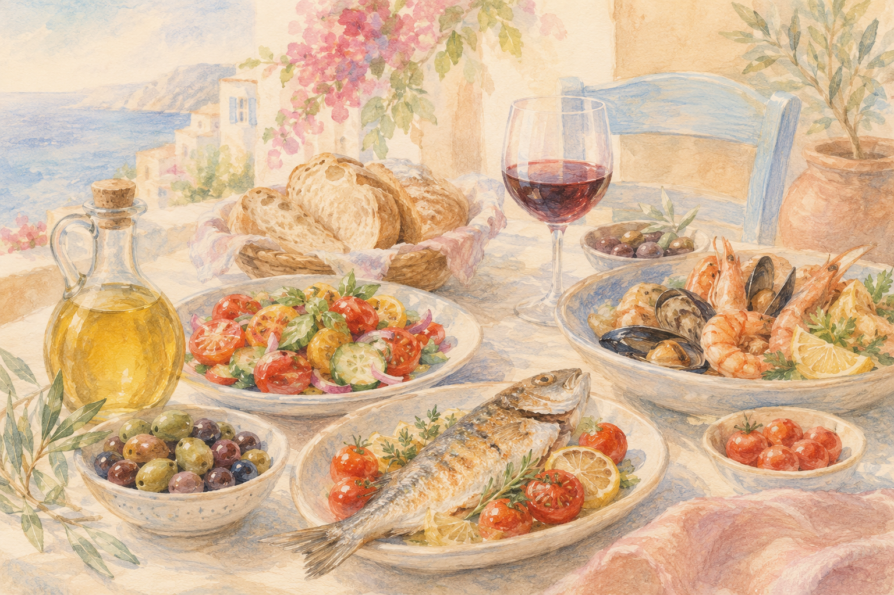
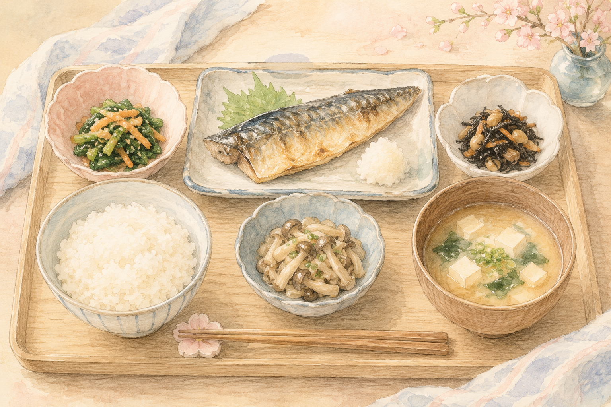
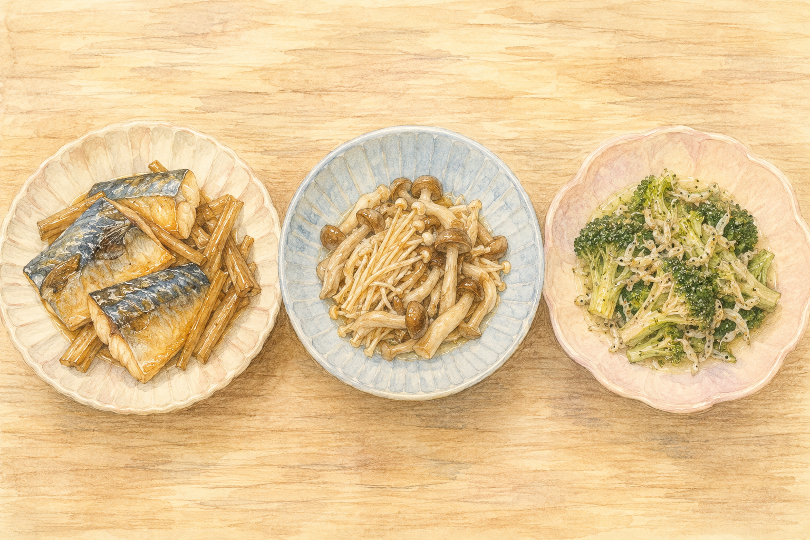
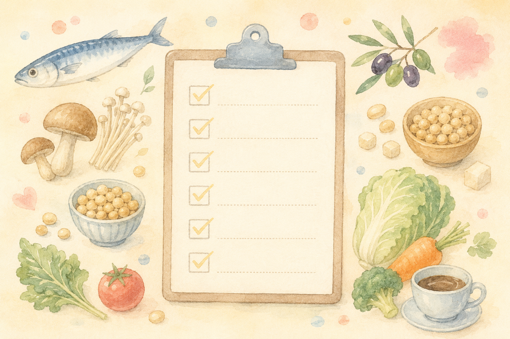

「毎日同じおかずばかりで、なんだか脳によくない気がする」  
「地中海食がいいって聞くけれど、急にオリーブオイル中心の食卓には変えられない」――  

そんなふうに、**自分の食卓と"理想の食事"のあいだで迷っている**ことはありませんか？

実は近年、**地中海食と日本食、どちらも認知症予防によい**ことが分かってきました。  
そして国立長寿医療研究センターの研究では、**日本食をよく食べている人ほど認知症になりにくく、腸内環境にも違いが出る**ことが明らかになっています。

「地中海風」か「和食」かで悩む必要はありません。**いいとこ取り**で、今日からの食卓を少しずつ整えていくのが現実的な答えです。

 

> ✅ **「単品サプリ」より「食事全体のパターン」**が認知症予防のカギ
>
> ✅ 地中海食と日本食は**どちらも理にかなっている**――両方のいいとこ取りでOK
>
> ✅ 注目したい4つの食材：**魚介・きのこ・大豆・コーヒー**（日本食スコア研究より）

今日は、地中海食と日本食をどう"合体"させるか――そして私の食卓によく並ぶ3つのメニューを、やさしくご紹介します。

---

## 目次

- [そもそも「脳によい食事」って？](#brain-food)
- [地中海食のここがいい](#mediterranean)
- [日本食スコアという発見](#japanese-score)
- [地中海食×日本食という選択肢](#hybrid)
- [私の食卓によく並ぶ3つの一皿](#torapon-dishes)
- [いま私たちにできること](#action)
- [おすすめの一冊](#book)

---

<h2 id="brain-food">そもそも「脳によい食事」って？</h2>

国立長寿医療研究センターは、認知症予防の食事についてはっきりこう言っています。

> **単一の栄養素（サプリメント等）を摂取しても、認知症予防には効果がありません。**

つまり、「これさえ飲めば」という魔法のサプリは無く、**実際の食品から、いろいろな栄養をパターンで摂る**ことが大事だ、ということです。

そのうえで、これまでの研究で繰り返し名前が挙がるのが、**地中海食**と**日本食**の二つの食事パターンです。

 

---

<h2 id="mediterranean">地中海食のここがいい</h2>

地中海食とは、イタリア南部やギリシャ沿岸で昔から食べられてきた食事のことです。  
特徴をひと言でまとめると――

- **色とりどりの野菜・果物**（赤・黄・緑）
- **魚介類**が豊富
- **オリーブ油**を使う
- **全粒の穀類**と**食物繊維**
- ポリフェノールたっぷりの**赤ワイン**を少々

国立長寿医療研究センターも「認知症予防効果が期待できます」と紹介しており、糖尿病の予防にもよいとされています。

ただ、**毎日オリーブ油でパスタを食べる暮らしには無理がある**――それが日本に住む多くの人の本音だと思います。

 

---

<h2 id="japanese-score">日本食スコアという発見</h2>

ここで嬉しいニュースがあります。  
国立長寿医療研究センターの **佐治直樹副センター長** たちのチームは、**日本食をよく食べている人ほど認知症になりにくい**ことを、実際の患者さんを調べて確かめました（*Nutrition*誌、2021年）。

研究チームが使った「**日本食スコア**」は、こんな食品を組み合わせて点数化したものです。

**JDI9（基本の9品目）**  
米・味噌・魚介類・緑黄色野菜・海藻類・漬物・緑茶・牛肉/豚肉・コーヒー

**JDI12（拡張版）**  
↑に加えて、**大豆・大豆製品／果物／きのこ**

結果はとても分かりやすいものでした。

- 認知症のない人 vs 認知症のある人：**JDI9 スコア 7点 vs 5点**
- 同じく **JDI12 スコア 8点 vs 7点**
- 特に **魚介類・きのこ・大豆・コーヒー** をよく食べている人で差が大きかった
- これらの食品が多い人は **腸内細菌の代謝産物の濃度も低い** 傾向

つまり、**お味噌汁・焼き魚・きのこ・豆腐・コーヒー**といった、ふだんの和食の延長線上にあるものが、ちゃんと脳の健康と結びついていた、ということです。

 

> 詳しい「年代別の食事の整え方」については、前の記事もあわせてどうぞ。  
> 👉 [認知症予防は「食卓」から 〜MCIからの回復にも効く食事の整え方〜](/posts/dementia-prevention-nutrition/)

 

---

<h2 id="hybrid">地中海食×日本食という選択肢</h2>

地中海食と日本食、それぞれの強みを並べてみると、**重なる部分**がとても多いことが分かります。

| | 地中海食 | 日本食 |
|---|---|---|
| 油 | オリーブ油 | 魚の油（DHA・EPA） |
| たんぱく質 | 魚介・豆類 | 魚介・大豆製品 |
| 野菜 | 色の濃い野菜・果物 | 緑黄色野菜・きのこ・海藻 |
| 飲み物 | 赤ワインを少々 | 緑茶・コーヒー |
| 主食 | 全粒の穀類 | ご飯（精製を控えめに） |

どちらも「**魚介をしっかり、野菜と豆をたっぷり、加工食品は控えめ**」という骨格は同じ。  
だから、**毎日の和食の中に、地中海食らしさ（オリーブ油・色の濃い野菜・豆）を少し足す**だけで、両方の良さを取り入れられます。

完璧に一つの流派へ寄せる必要はありません。**今ある食卓を1つだけアップデートする**――それが続けられる道です。

 

---

<h2 id="torapon-dishes">私の食卓によく並ぶ3つの一皿</h2>

私自身、こんな3つのメニューを「**地中海食×日本食のいいとこ取り**」のつもりで、ふだんの食卓によく並べています。  
レシピ本ではないので、まずは**メニュー名と主な材料**だけご紹介します。詳しい作り方は、ぜひお手元の料理本や検索で。

### ① サバごぼう
- 主材料：サバ（青魚）・ごぼう・しょうが
- 「**魚介＋根菜＋香味野菜**」の組み合わせ。サバは DHA・EPA が豊富、ごぼうは食物繊維がたっぷり

### ② きのこの生姜醤油炒め
- 主材料：しめじ・えのき・まいたけ・生姜・醤油
- 「**3種類のきのこ**」を一度に取れる一皿。日本食スコアでも"きのこ"は重要な食品の一つ

### ③ ブロッコリーとちりめんのにんにく炒め
- 主材料：ブロッコリー・ちりめんじゃこ・にんにく・オリーブ油
- **地中海食の主役"オリーブ油・にんにく"**と、**日本食の主役"ちりめんじゃこ（小魚）・緑黄色野菜"**の合作

どれも特別な食材は使いません。**スーパーで普通に買えるもの**ばかりです。  
「3つ全部やらなくちゃ」と思わなくて大丈夫。**今週まずどれか一つ**――それで十分なスタートです。

 

---

<h2 id="action">いま私たちにできること</h2>

> ✅ **魚介を週2〜3回**――サバ・サンマ・イワシなどの青魚を意識して
>
> ✅ **きのこを毎日1種類**――汁物・炒め物・和え物に何でも合います
>
> ✅ **大豆製品を毎日**――豆腐・納豆・お味噌汁ひと椀から
>
> ✅ **緑黄色野菜と海藻**――色の濃い野菜＋わかめ・ひじきを副菜に
>
> ✅ **油はオリーブ油も使ってみる**――炒め物の半分くらいから
>
> ✅ **緑茶・コーヒー**を1日1〜2杯（嗜好品として無理なく）

 

> 持病があったり、糖尿病・腎臓病で食事制限のある方は、**必ずかかりつけ医・管理栄養士に相談**してから取り入れてください。

 

---

<h2 id="book">おすすめの一冊</h2>

「もっと具体的な献立や買い物のコツが知りたい」――そんな方には、以下の一冊がおすすめです。

{{< affiliate
    title="「脳の毒」をだす食事"
    image="https://thumbnail.image.rakuten.co.jp/@0_mall/bookfan/cabinet/00939/bk4478110255.jpg?_ex=400x400"
    amazon="https://af.moshimo.com/af/c/click?a_id=5534074&p_id=170&pc_id=185&pl_id=4062&url=https%3A%2F%2Fwww.amazon.co.jp%2Fdp%2F4478110255"
    rakuten="https://af.moshimo.com/af/c/click?a_id=5533903&p_id=54&pc_id=54&pl_id=27059&url=https%3A%2F%2Fitem.rakuten.co.jp%2Fbookfan%2Fbk-4478110255%2F"
    description="抗加齢医学の第一人者・白澤卓二先生による、認知症予防の食事レシピ本。アルミニウム・糖化・酸化など、脳にたまりやすい「毒」をどう食事で減らしていくか――具体的な献立と買い物リストまで載っていて、明日からの食卓にすぐ取り入れられます。" >}}

---

## おわりに

「地中海食がいいらしい」「いや、日本食のほうが体に合う」――  
どちらか一方を選ぼうとして、結局なにも変えられないまま、というのはよくある話です。

でも、**地中海食と日本食は、争うものではなく、足し算できるもの**でした。  
お味噌汁にきのこを足す。焼き魚の付け合わせをブロッコリーのオリーブ油炒めにする。  
**そんな小さな"足し算"が、5年後・10年後の脳を確かに支えていきます。**

今夜の食卓に、まずは一品だけ――  
**サバごぼう、きのこ炒め、ブロッコリーとちりめんの炒め物**、お好きなものをぜひ。

---

### 参考にした情報

- 国立長寿医療研究センター「[認知症の予防には、どのような食事がよいでしょうか。](https://www.ncgg.go.jp/dementia/prophylaxis/002.html)」
- 国立長寿医療研究センター「[日本食スコアと認知症、腸内細菌との関連（佐治直樹副センター長ら）](https://www.ncgg.go.jp/hospital/monowasure/news/20211025.html)」（*Nutrition*, 2021年）
- 白澤卓二『「脳の毒」をだす食事』ダイヤモンド社

※ 本記事は、上記の信頼できる医療・公的資料をもとに、一般読者向けにわかりやすくまとめ直したものです。持病のある方や、現在治療中の方は、必ずかかりつけ医にご相談のうえ、ご自身に合った食事のかたちを見つけてください。

