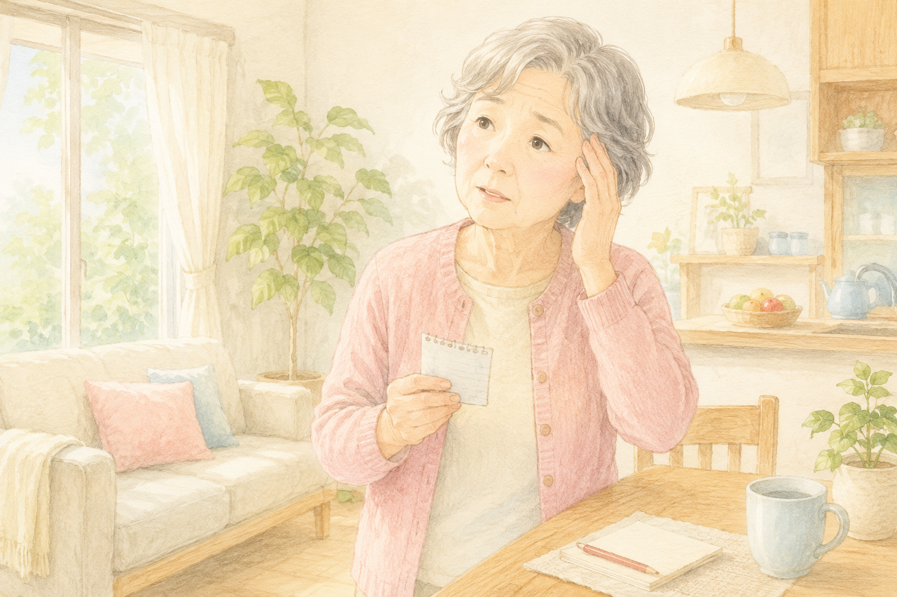

「**MCI（軽度認知障害）** と言われたけれど、いったい何から始めればいいのか分からない…」
「運動がいいのは分かるけど、 **何を、どれくらい** やれば本当に効くのかしら？」

そんなお声を、地域の体操教室や介護現場でよく耳にします。

実は、2026年に入ってから **MCIや軽度の認知症の方を対象にした運動研究** が立て続けに公表されました。
中身を読んでみると、これまで「とりあえず体を動かしましょう」と曖昧になっていた部分に、 **具体的な答えのヒント** が見えてきています。

今日は、特に注目したい **2つの研究** を、現場の目線でやさしくご紹介します。

 

> ✅ **「何を、どれくらい」が見えてきました**：複数の運動を組み合わせて、**週3回以上** がひとつの目安です
>
> ✅ **続けることが何より大切**：5年間の追跡では、**参加率60%以上** のグループに認知機能の安定した経過傾向がみられました
>
> ✅ **一人で頑張らないこと**：地域の仲間と一緒にやると **長続きしやすい**——これが「効く運動」の隠れた条件かもしれません

少し長めの記事になりますので、気になるところからお読みください。

- [そもそも：MCI（軽度認知障害）ってどんな状態？](#そもそもmci軽度認知障害ってどんな状態)
- [研究①：MCIの方に「どんな運動が効く」のか？](#研究mciの方にどんな運動が効くのか)
- [研究②：5年続けると、本当に差が出るのか？](#研究5年続けると本当に差が出るのか)
- [「組み合わせる」と「続ける」のかけ算](#組み合わせると続けるのかけ算)
- [家でできる組み合わせ運動の例](#家でできる組み合わせ運動の例)
- [Toraponの現場から：地域体操教室で感じていること](#toraponの現場から地域体操教室で感じていること)
- [いま私たちにできること](#いま私たちにできること)
- [おわりに 〜進行しても、遅らせることはできる〜](#おわりに進行しても遅らせることはできる)

## そもそも：MCI（軽度認知障害）ってどんな状態？

**MCI（エム・シー・アイ）** は **Mild Cognitive Impairment** の略で、日本語では「**軽度認知障害**」と呼ばれます。

ひとことで言うと、

> 「年相応の物忘れ」と「認知症」の **あいだの状態**

です。本人やご家族が「あれ？」と気付くことはあっても、まだ日常生活には大きな支障が出ていない段階のことを言います。

ただ、ここからが大事な話で、MCIは **そのままにしておくと数年で認知症に進む方** もいれば、 **元の状態に戻られる方や、長く安定したまま過ごされる方** もいらっしゃいます。

つまり、MCIは **「いま何をするか」で先が変わってくる段階** ——「分かれ道」のような時期です。

だからこそ、 **「何を、どれくらいやればいいのか」** をできるだけ具体的に知っておきたいですよね。

 

## 研究①：MCIの方に「どんな運動が効く」のか？

ひとつ目は、 **MCIの方にどんな運動が一番効くのか** を世界中の研究をまとめて比較した報告です（**ネットワークメタ解析** と呼ばれる手法）。

複数のランダム化比較試験を集めて、

- 有酸素運動（ウォーキング・自転車など）
- 筋トレ（レジスタンス運動）
- バランス運動（太極拳・体操など）
- **デュアルタスク（二重課題）** 運動

を、 **どれが一番認知機能を改善するか** という観点で比べたものです。

### ポイントは大きく2つ

ひとつ目は、 **「組み合わせると効きやすい」** ということ。
有酸素運動 **だけ** よりも、筋トレ・バランス・デュアルタスクなどを **組み合わせた群** で、認知機能の改善がより大きい傾向が示されました。

ふたつ目は、 **「週3回以上が一つの目安」** ということ。
頻度の少ない介入では効果が出にくく、 **週3回以上** で一貫して有意な改善が報告されています。

> 💡 「毎日たくさん」ではなく、 **「週3回以上をムリなく続ける」** のが現実的なゴールラインです。

 

## 研究②：5年続けると、本当に差が出るのか？

もうひとつは、 **筑波大学附属病院** から2026年3月に発表されたプレスリリースです。
こちらは「短期で効くか？」ではなく、 **5年という長い目** で見たときに、生活に運動を組み込み続けるとどうなるかを調べた研究です。

対象は **MCI〜軽度認知症の方** 。

- 運動療法
- 音楽療法
- 芸術療法
- 知的活動（読書・パズルなど）

を組み合わせた **多因子介入プログラム** を提供し、 **最長5年** 追いかけました。

### 「参加率60%以上」が一つの分かれ目

注目したいのは、 **「どれくらい続けられたか」** という観点での違いです。

| 続けられた度合い | 5年後の認知機能 |
|---|---|
| **参加率60%以上** の継続群 | 比較的 **安定した経過** を示す傾向 |
| **それより低い** 参加群 | 認知機能の低下が目立ちやすい |

「やる／やらない」よりも、 **「やり続けられたかどうか」** で差が出てくる——
これは、現場でリハビリを担当していると、強く実感する数字でもあります。

> 💡 短期間がんばるよりも、 **5年単位で「ほどよく」続けられる仕組み** をつくることが大切。

 

## 「組み合わせる」と「続ける」のかけ算

ふたつの研究から見えてくるのは、こんなシンプルなかけ算です。

> ✅ **「複数の運動を組み合わせる」 × 「週3回以上」 × 「続けられる仕組み」**

特別な機器も、高額なジムも必要ありません。
ただ、 **続けられる工夫** がいるのです。

理学療法士の私から見ると、認知症の進行抑制で大事なのは「強い運動」より、

- **続けやすい運動**
- **楽しめる運動**

の2つが揃っていることだと感じます。

 

## 家でできる組み合わせ運動の例

「いきなり週3回・5年なんて無理…」と思われるかもしれません。
そこで、 **家庭でも始められる組み合わせ運動** を3つご紹介します。
どれも、 **有酸素＋筋トレ＋デュアルタスク** がさりげなく入っています。

### ① 数字を数えながらの足踏み（5分）

- 椅子の前に立ち、その場で足踏み
- **「100から3ずつ引きながら」** 数を数える（100、97、94…）
- 慣れたら **7ずつ** や **しりとり** にステップアップ

引き算をしながら足踏みするだけで、 **有酸素＋デュアルタスク** が同時に行えます。

### ② 椅子からの立ち座り＋言葉あそび（5分）

- 椅子からゆっくり立ち上がる→座る、を10回
- そのあいだに **「春夏秋冬」「い・ろ・は」** など順番に唱える
- 慣れたら **「都道府県を北から順に」** などに変えていく

下半身の筋トレと、 **「思い出しながら動く」** デュアルタスクの組み合わせです。

### ③ ラジオ体操＋掛け声（10分）

毎朝の **ラジオ体操** に、

- 「いち、に、さん、し…」と **自分で声を出して数える**
- **テレビを見ながら** 同じ動きをまねる

これだけで、 **全身の有酸素・バランス・デュアルタスク** が10分でひとセットになります。

> 💡 「ちょっと頭を使いながら、ちょっと体を動かす」が **デュアルタスクの基本** です。

 

## Toraponの現場から：地域体操教室で感じていること

私（Torapon）は、理学療法士として **地域の高齢者向け体操教室** にも関わっています。

そこで感じるのは、

> **「効く運動」は、「続く運動」**

ということです。

一人で家に帰ってもう一度…というのは、なかなか続きません。
でも、 **同じ時間に、同じ場所で、顔なじみと一緒に** 体を動かす日課があると、不思議とみなさん来てくださいます。
「あの人が今日休みだ、心配だな」と気にかけ合うようなつながりも生まれてきます。

筑波大の研究で **「参加率60%以上」が一つのライン** になっていたのも、
おそらく **「来たくなる場」と「待ってくれる人」** があるかどうかが大きいのではないかと感じています。

母も、 **家庭で過ごしていた頃** は、デイサービスでみなさんと一緒に体操をする時間が大好きでした。
「みんなとやるなら頑張れる」——その表情は、いまも忘れられません。

> 💡 ご家族の方には、 **「家で頑張らせる」より「通える場所をひとつ確保する」** ことをぜひ考えてみていただきたいです。

 

## いま私たちにできること

最後に、今日の話を行動に落とすためのチェックリストです。

✅ **MCIや軽度認知症と言われても、「これからの過ごし方」で変えられる部分はたくさんあります**

✅ **運動は「組み合わせる」**——有酸素＋筋トレ＋バランス＋デュアルタスクをミックスして

✅ **頻度は「週3回以上」**——毎日でなくて大丈夫、長く続くペースを大切に

✅ **「家で一人」より「みんなで」**——通える教室・サークル・デイサービスを一つ確保する

✅ **5年単位で「ゆるく続けられる仕組み」をつくる**——完璧を目指さず、休む日もOK

✅ **ご家族は「監視」より「一緒に楽しむ」**——背中ではなく **となり** で

 

## おわりに 〜進行しても、遅らせることはできる〜

MCIや軽度の認知症と言われると、ご本人もご家族も、どうしても **「これからどうなってしまうのか」** と不安が大きくなります。

でも、 **2026年のガイドライン改訂** でも、 **今日ご紹介した2つの研究** でも、共通して伝えてくれているメッセージはひとつです。

> **「進行を完全に止めることは難しい。でも、遅らせることはできる」**

そして、その「遅らせる力」のかなりの部分が、 **薬ではなく日々の生活** ——とくに **運動・つながり・楽しみ** にあるということ。

これは、薬の進歩を待ちながらでも、 **今日からご自宅で始められる希望** です。

決して一人で頑張らず、 **ご家族や仲間と一緒に**、ゆっくり続けていきましょう。

> 詳しくは、前回のガイドライン改訂の記事もあわせてお読みください。
> 👉 [認知症ガイドラインが9年ぶりに大改訂](/posts/dementia-guideline-2026/)

 

## 参考にした情報

- 筑波大学附属病院 プレスリリース「認知症"1,200万人時代"を見据えた多因子介入プログラムの最長5年追跡」（2026年3月18日公表）
- システマティックレビュー＆ネットワークメタ解析「MCI患者に対する運動介入の最適な種類と用量」（PubMed掲載）
- 日本神経学会『認知症疾患診療ガイドライン2026』（2026年5月発刊）

※本記事は最新の研究をもとに作成していますが、運動の開始や強度については、 **必ずかかりつけ医・リハビリ担当者と相談** したうえで進めてください。
