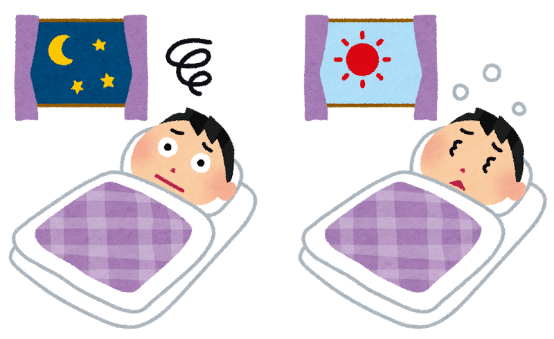

「気がつくと、夕食が夜の9時を回っている」

「朝はあまりお腹がすかないので、コーヒーだけで済ませてしまう」

どちらも、めずらしい話ではないと思います。私自身、仕事から帰るのが遅くなった日は、そうなりがちです。

その「食べる時間」について、2026年7月、日本から大きな調査の報告が出ました。**健康診断を受けた65歳以上の28万人を、その後も追いかけた** ものです。

先にお伝えしておきます。**この記事は「時間を守れば認知症を防げます」という話ではありません。** むしろ研究をよく読むと、そう単純ではないことが分かります。ただ、**知っておくと役に立つ内容**ではありました。

> ✅ 九州大学のグループが、日本の65歳以上 **283,166人** を追いかけました。そのあいだに新たに認知症と診断されたのは **18,056人** です
>
> ✅ **寝る2時間以内に夕食をとる日が週3回以上ある人** は、そうでない人と比べて、新たに認知症と診断された人が **1.17倍** でした。**朝食を抜く日が週3回以上ある人** は、そうでない人と比べて **1.13倍** です
>
> ✅ ただしこれは **観察した研究** で、原因と結果は分かりません。**「認知症になりかけていたから、食事の時間が乱れた」という逆の順番** も、じゅうぶんに考えられます

> 食事の中身については、こちらでまとめています。
> 👉 [認知症予防は「食卓」から　〜MCIからの回復にも効く食事の整え方〜](/posts/dementia-prevention-nutrition/)

---

## 目次

1. [どんな調査だったのか](#どんな調査だったのか)
2. [分かったことは2つ](#分かったことは2つ)
3. [数字の読み方をここでまとめます](#数字の読み方をここでまとめます)
4. [いちばん疑わしいのは「順番が逆」という可能性](#いちばん疑わしいのは順番が逆という可能性)
5. [正直に書いておきたいこの研究の弱いところ](#正直に書いておきたいこの研究の弱いところ)
6. [それでも生活リズムには意味があると思う理由](#それでも生活リズムには意味があると思う理由)
7. [理学療法士として現場で思うこと](#理学療法士として現場で思うこと)
8. [いま私たちにできること](#いま私たちにできること)
9. [おわりに](#おわりに)
10. [参考にした情報](#参考にした情報)

---

## どんな調査だったのか

報告したのは、**九州大学の川口健悟先生** たちのグループです。2026年7月28日、**『GeroScience』** という老化の研究をあつかう医学雑誌のオンライン版に発表されました。

LIFE研究という、大きな調査の一部です。使われたのは、**日本の19の自治体** に残っている、健康診断・医療保険・介護保険の記録です（どなたの記録か分からないように処理したものを使っています）。

- 対象になった方 … **65歳以上の283,166人**
- 平均年齢 … **72.8歳**
- 女性の割合 … 58.5%
- 調査に加わった時期 … **2016年4月から2021年3月のあいだに健康診断を受けた方**
- その後、新たに認知症と診断された方 … **18,056人**

28万人という人数は、日本の研究としてはかなり大きなものです。しかも、あとから昔を思い出して答えてもらう形ではなく、**健康診断のときに先に食事の時間を聞いておいて、そのあとどうなったかを追いかける** やり方（前向きコホート研究＝はじめに集団を分けておいて、その後を追いかける調べ方）で行われています。

食べる時間については、**健康診断の問診票** で、次の2つを「はい・いいえ」で答えてもらっています。

- **寝る2時間以内に夕食をとる日が、週3回以上あるか** … あてはまる方は **36,609人** で、全体の12.9%です
- **朝食を抜く日が、週3回以上あるか** … あてはまる方は **17,727人** で、全体の6.3%です


28万人も調べたのなら、もうはっきりしたということですか？




人数が多いことと、原因が分かることは、別の話なんです。人数が多いと **「たまたまそう見えただけ」という可能性は小さくなります**。でも、**食事の時間の乱れと認知症の、どちらが先に始まっていたのか** までは、人数を増やしても分かりません。ここが今回のいちばん大事なところなので、あとでゆっくり説明しますね。


---

## 分かったことは2つ

報告された内容は、とてもすっきりしています。

**① 寝る2時間以内の夕食が週3回以上ある人**

そうでない人と比べて、そのあと新たに認知症と診断された人が **1.17倍** でした（95%信頼区間 1.12〜1.20）。

**② 朝食を抜く日が週3回以上ある人**

そうでない人と比べて、そのあと新たに認知症と診断された人が **1.13倍** でした（95%信頼区間 1.06〜1.20）。

年齢や男女、持病といった、もともと結果に影響しそうな条件は、計算のうえで調整されています。それでも、この関係は残りました。

ここで一度、数字の読み方をまとめておきます。次の見出しだけ読んでいただければ、この記事の数字はすべて分かるようにしてあります。

---

## 数字の読み方をここでまとめます

数字の話は、ここ1か所にまとめます。ここさえ読めば、あとは読み飛ばしていただいて大丈夫です。

**「1.17倍」は、人数そのものではなく、割合の比べ方です。**

寝る2時間以内に夕食をとる日が週3回以上ある人たちのグループと、そうでない人たちのグループを並べて、**追いかけているあいだに新たに認知症と診断された人の割合を比べた** ものが1.17倍、ということです。

今回、全体では 283,166人のうち 18,056人が診断されています。割合にすると、**100人のうち6人ほど** です（およそ6.4%）。

ここから、ごく大まかなイメージをつくってみます。正確な計算ではありませんが、**100人のうち6人だったところが、7人になるくらい**。それが1.17倍という数字の手ざわりです。

つまりこれは、**わずかに多い、という程度の話** です。「2倍」「3倍」といった大きなものではありません。ここを大きく受け取ってしまうと、**必要以上に不安になるだけで、得るものがありません**。

もうひとつ、**95%信頼区間** という言葉が出てきました。これは、**本当の値はだいたいこのあたりに入っているだろう、という幅** のことです。

- 夕食の1.17倍 … 幅は 1.12〜1.20
- 朝食の1.13倍 … 幅は 1.06〜1.20

この幅が **1をまたいでいない** とき、「たまたまそう見えただけ、とは考えにくい」と判断します。今回はどちらも1をまたいでいません。ですから、**関係そのものは、まぐれではなさそうだ** と言えます。

ただし、これで分かるのは「関係がありそうだ」ということまでです。**なぜそうなっているのかは、この数字からは何も分かりません。**


まぐれではない、と分かっているのに、理由は分からないんですか。




そうなんです。ここが医療の数字のいちばんややこしいところです。**夕食が遅い人に、認知症が多く見つかる**ことと、**遅い夕食が原因で、認知症になる**ことは、まったく別の話なんですね。たとえば、ほかの理由（もともとの持病や暮らしぶりなど）が両方に関わっているだけかもしれません。そしてもうひとつ、順番がそもそも逆かもしれない。次の章で、そのいちばん本命の説明をお話しします。


---

## いちばん疑わしいのは「順番が逆」という可能性

ここが、この記事でいちばんお伝えしたいところです。

今回の結果を素直に読むと、こういう順番を思い浮かべます。

> 夕食が遅くなる ・ 朝食を抜く　→　そのせいで、のちに認知症になる

けれども、**まったく逆の順番** も考えられます。

> 本人も家族も気づかないうちに、脳の変化が少しずつ始まっている　→　そのせいで、夕食が遅くなる ・ 朝食を抜くようになる　→　何年かたって、認知症と診断される

ここで、こう思われた方もいるかもしれません。

**「食事のことは、認知症と診断される前に、健康診断で聞いているのでは？」**

そのとおりです。この調査では、食事の時間を **健康診断の問診票で先に聞いて** います。そして数えているのは、そのあと **新たに** 認知症と診断された人です。

ただ、ここに落とし穴があります。**認知症は、診断がつく何年も前から、脳の中では変化が始まっている** 病気です。物忘れがはっきりして病院にかかり、診断がつくのは、そのずっと後のことです。

つまり、健康診断で「はい」と答えたその時点で、**診断はまだついていないけれど、変化はもう始まっていた** という人が含まれている可能性があります。先に聞いているからといって、食事の乱れのほうが先だったとは言い切れないのです。

そして今回の場合、この「逆の順番」は、**決して苦しまぎれの言いわけではありません。** むしろ、かなり本命の説明だと私は思っています。理由は3つあります。

**① 認知症の初期には、生活のリズムが乱れることが知られています**

これは以前から分かっていることです。眠る時間と起きる時間があいまいになる。昼と夜が入れかわる。時間の感覚がつかみにくくなる。**こうした変化は、物忘れがはっきりする前から出てくることがあります。**

だとすれば、「夕食が寝る直前になってしまう」も「朝ごはんを食べる気にならない」も、**病気の原因ではなく、病気の早い時期のあらわれ** かもしれません。

**② 食欲そのものが先に変わることがあります**

においや味の感じ方が変わる。食べることへの興味が薄れる。こうした変化も、認知症の早い時期に起こることがあります。朝食を抜くようになった背景に、これがある方もいるはずです。

**③ 健康診断から、あまり間をおかずに診断された人も含まれています**

論文の要旨には、一人ひとりを何年追いかけたのかは書かれていません。ただ、調査に加わった時期は2016年から2021年までと幅があるので、追いかけた期間が短い人も含まれていると考えられます。認知症は **10年、20年かけて静かに進む** 病気ですから、健康診断のときの食事の習慣が、**すでに変化が始まったあとの習慣** だった可能性はじゅうぶんにあります。


では、夕食を早めても意味がないということですか？




そうとも言い切れないんです。**逆の順番かもしれない、というだけで、逆だと決まったわけでもありません。** どちらもありうる、というのが今の正直なところです。ただ、少なくとも **「時間を守れば防げる」と受け取るのは行きすぎ** だと思います。


---

## 正直に書いておきたいこの研究の弱いところ

いいところだけを並べても、役に立ちません。弱いところも書いておきます。

**① 観察した研究なので、原因と結果は言えません**

くり返しになりますが、これがいちばん大きな点です。分かるのは「**そういう傾向があった**」ということまでで、「**遅い夕食が認知症を起こした**」とは言えません。

**② 順番が逆かどうかを確かめた解析は、要旨には書かれていません**

こうした研究では、「健康診断から1〜2年のうちに診断された人を除いても、同じ結果になるか」を確かめることがあります。診断の直前だった人を除けば、逆の順番の影響を小さくできるからです。けれども、公開されている要旨には、そうした解析の記載がありません。**先ほどの順番が逆という可能性を、いちばん強く残してしまうのが、この点** です。

**③ 生活習慣は、ご本人の申告です**

寝る何時間前に食べたか、朝食を抜いた日が週に何回あったか。これは記録に残っているものではなく、ご本人に答えていただいた内容です。正確に思い出せない方も、いらっしゃったはずです。

**④ 調整しきれない条件が残ります**

年齢や持病は計算のうえで調整されています。けれども、たとえば **一人暮らしかどうか、日中どれくらい体を動かしているか、経済的な余裕があるか**。こうした条件が、食事の時間と認知症の両方に関わっている可能性は残ります。

**⑤ 日本の65歳以上の方についての結果です**

19の自治体のデータで、対象は65歳以上です。ほかの年代や、ほかの国にそのままあてはめることはできません。

---

## それでも生活リズムには意味があると思う理由

ここまで慎重なことばかり書いてきましたが、「では気にしなくていいのか」というと、そうも思いません。

理由は、**食べる時間を整えることに、困る点がほとんどない** からです。

夕食を少し早める。朝、何かひと口でも食べる。これで体をこわす人はいませんし、お金もかかりません。**やってみて損がないことは、はっきりする前に始めても構わない** と、私は考えています。

それに、食べる時間を整えると、ついてくるものがあります。**夕食が早くなると、寝つきや眠りの質が落ち着きやすくなります。朝ごはんを食べると、朝の光を浴びる時間ができます。** どちらも、体の1日のリズムを整える側に働きます。

睡眠と脳の関係については、これまでもくり返し報告されてきました。**食べる時間を整えることは、遠回りに見えて、眠りを整えることにつながっている** ――そういう受け取り方が、いまのところいちばん現実的だと思います。


夕食を早くしたくても、仕事や介護で、どうしても遅くなる日があります。




無理をしなくて大丈夫です。今回の調査で見ていたのも 「**週3回以上あるかどうか**」 という、ゆるい区切りでした。毎日きっちり守る話ではありません。**できる日を少し増やす**、それくらいで構わないと思います。


食事の中身のほうも気になる方は、こちらもあわせてどうぞ。

> 👉 [地中海食と日本食、合わせるとどうなる？　〜認知症予防の食卓に並べたい3つの食材習慣〜](/posts/japanese-mediterranean-diet/)

---

## 理学療法士として現場で思うこと

リハビリの仕事をしていると、生活のリズムが崩れている方に、しばしば出会います。

夕方に眠ってしまって、夜中に目が覚めて何か食べる。そのぶん朝は食べられない。ご本人もご家族も、「だらしなくなった」と受け取っていることが多いのですが、**話をうかがっていくと、順番が逆だったと感じることがあります。**

考えるスピードがゆっくりめになってきたことで、時間の見当がつきにくくなり、その結果として食事の時間がずれていった。そういう流れです。

ですから私は、今回の報告を「**遅い夕食に気をつけましょう**」という話としてだけでは読んでいません。むしろ、**ご家族の食事の時間が、この1〜2年で大きくずれてきたのなら、それは体からのお知らせかもしれない** ――そういう合図として受け取っています。

---

## いま私たちにできること

難しく考えなくて大丈夫です。できそうなものから、ひとつずつで構いません。

- ☑ **夕食から寝るまで、2時間あけられそうな日をつくってみる**。毎日でなくて構いません
- ☑ **朝、ひと口でも食べてみる**。バナナ1本、みそ汁1杯でも、何もないよりは違います
- ☑ **朝、カーテンを開けて光を浴びる**。食べる時間と眠る時間は、セットで動きます
- ☑ **食事の時間を、責める材料にしない**。「遅いから認知症になる」という話ではありません
- ☑ **ご家族の食事の時間が、この1〜2年で大きくずれてきたなら、一度気にとめておく**。ほかの変化（もの忘れ、外出が減った、興味がうすれた）と重なっていないか見てみてください
- ☑ **心配が続くなら、かかりつけの先生に相談する**。生活リズムの変化は、診察のときに伝える価値のある情報です
- ☑ **食事の中身も、あわせて見直す**。時間だけを整えても、栄養が足りていなければ意味が薄くなります

---

## おわりに

28万人という大きな調査から出てきたのは、「**寝る直前に夕食をとる人と、朝食を抜く人は、そうでない人と比べて、そのあと認知症と診断された人がわずかに多かった**」ということでした。

倍率にすると1.17倍と1.13倍。100人のうち6人が7人になるくらいの、静かな数字です。

そして、その理由は分かっていません。**食事の時間が体に影響したのかもしれませんし、体の変化が食事の時間にあらわれたのかもしれません。** 今回の研究は、そこを区別できる形にはなっていません。

だから私は、この報告をこう受け取ることにしました。

**生活リズムの乱れは、防ぐべき原因というより、体からの早めのお知らせかもしれない。**

食事の時間がずれてきたことに気づいたとき、「気をつけなければ」と自分を責めるのではなく、「**何か変わってきていないだろうか**」と、少し立ち止まってみる。

それだけで、この研究は、じゅうぶん役に立ってくれると思っています。

夕食を早めることも、朝ごはんを食べることも、どちらもやって損のないことです。ただ、**それで安心を買うのではなく、体からの合図に気づくきっかけにする**。そのほうが、この28万人のデータの使い方として、ずっと正直な気がしています。

---

## 参考にした情報

- Kawaguchi K ら「Late-night dinner, skipping breakfast, and the risk of dementia in Japan: the LIFE Study」『GeroScience』2026年7月28日オンライン版（九州大学）　https://pubmed.ncbi.nlm.nih.gov/42518136/ （論文の本文は有料のため、この記事は公開されている要旨をもとにしています）
- ケアネット「夕食は寝る2時間前まで、朝食は抜かない〜認知症リスクとの関連／九州大学」2026年（会員登録が必要）　https://www.carenet.com/news/general/carenet/63508

---

※この記事は一般的な情報提供を目的としたものです。お体の状態や持病、飲んでいるお薬には個人差があります。**食事の時間や内容を大きく変えるときは、とくに糖尿病などで食事の指示を受けている方は、必ずかかりつけ医や管理栄養士にご相談ください。** また、もの忘れや生活リズムの変化が気になる場合は、かかりつけ医にご相談ください。
