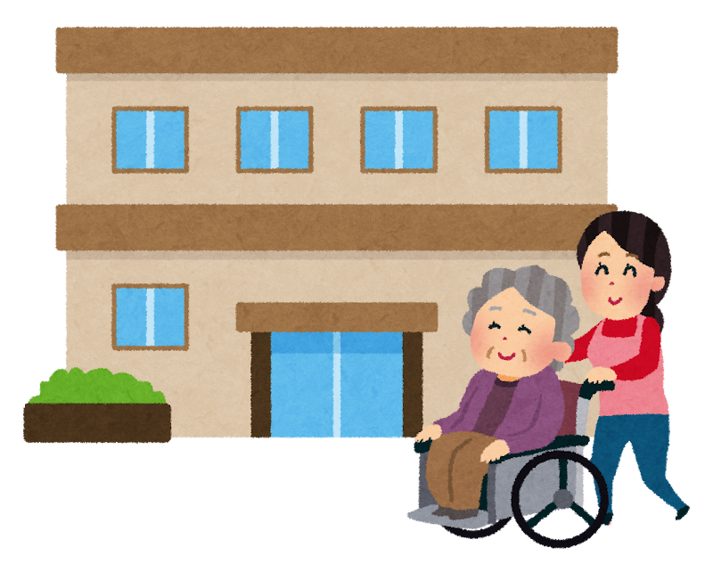
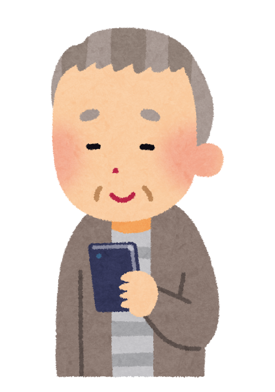

「病院や介護の領収書、なんとなく引き出しにしまったままになっていませんか？」  
「医療費控除って病院のお金だけの話でしょ？」――  
そんなふうに思っている方へ。

実は、**介護サービスの自己負担額やおむつ代も、医療費控除の対象になるものがたくさんあります**。知らずに申告していないと、本来戻ってくるはずの税金を受け取りそこねているかもしれません。

この記事では、リハビリの現場で働く理学療法士の視点も交えながら、**「介護のお金と医療費控除」** を中心に、確定申告のきほんをできるだけやさしく整理します。

> ✅ 1年間の医療費が **10万円（所得によっては所得の5%）を超えると**、払った税金の一部が戻ってくる
>
> ✅ **介護施設の費用・訪問リハビリ・おむつ代なども対象**になるものが多い（家族の分も合算OK）
>
> ✅ 申告し忘れていても、**過去5年分までさかのぼって申告できる**

## 目次

1. [そもそも医療費控除って何？](#そもそも医療費控除って何)
2. [介護のお金はどこまで対象？](#介護のお金はどこまで対象)
3. [おむつ代と通院の交通費](#おむつ代と通院の交通費)
4. [対象にならないもの・セルフメディケーション税制](#対象にならないものセルフメディケーション税制)
5. [確定申告のやり方](#確定申告のやり方)
6. [いま私たちにできること](#いま私たちにできること)
7. [おわりに](#おわりに)

---

## そもそも医療費控除って何？

税金は、その人の1年間の収入（所得）をもとに計算されています。医療費控除とは、**「今年は医療費がたくさんかかったので、その分を考えに入れて税金を計算し直してください」と申告できる仕組み** です。計算し直した結果、**すでに払った税金の一部が戻ってきて、翌年の住民税も安くなります**。

いくら分を「計算し直してもらえる」かは、次の式で決まります。

> **支払った医療費 − 保険などから戻ってきたお金 − 10万円** ＝ 医療費控除の額（最高200万円）

「保険などから戻ってきたお金」とは、たとえばこんなお金のことです。

- 生命保険や医療保険に入っている方が受け取った **入院給付金・手術給付金**
- 健康保険から戻ってきた **高額療養費**（1か月の医療費が上限を超えたときの払い戻し）
- 出産したときの **出産育児一時金**

つまり、「自分の財布から実際に出ていった分」だけが対象になる、ということです。

※ その年の所得（総所得金額等）が200万円未満の方は、「10万円」の代わりに **「所得の5%」** を差し引きます。年金暮らしの方などは、10万円より低いラインで対象になることがあります。


10万円を超えた分が、そのまま戻ってくるんですか？



そこはよくある誤解で、**全額そのままではない** んです。ざっくり言うと、戻ってくる（安くなる）のは **超えた分の15〜30%くらい**（収入によって変わります）。たとえば医療費が10万円のラインを10万円分超えた方なら、**だいたい1万5千円〜3万円、税金が安くなる** イメージです。全額ではありませんが、**家族の分もまとめられる** ので、積み重なるとばかにならない額になりますよ。


もうひとつ大事なポイントは、**「生計を一にする家族」の分をまとめて申告できる** こと。たとえば、同居しているご両親の医療費や介護費用を息子さんが払っている場合、息子さんの申告に合算できます。家族の中で **いちばん所得の高い（税率の高い）人がまとめて申告する** と、戻りが大きくなりやすいです。

---

## 介護のお金はどこまで対象？

ここがこの記事の本題です。**介護保険サービスの自己負担額も、種類によって医療費控除の対象になります**。

### 施設に入所している場合

| 施設の種類 | 医療費控除の対象 |
|---|---|
| 介護老人保健施設（老健）・介護医療院 | 自己負担額（介護費・食費・居住費）の **全額** |
| 特別養護老人ホーム（特養） | 自己負担額（介護費・食費・居住費）の **2分の1** |
| 有料老人ホーム・グループホーム | 対象外 |

老健や介護医療院は医療の色合いが濃い施設なので全額、特養は半分、という区別です。施設が発行する領収書には、**医療費控除の対象額が記載されている** のがふつうなので、まずは領収書を確認してみてください。

### 自宅で介護サービスを使っている場合

- **そのまま対象（医療系サービス）**：訪問看護、**訪問リハビリテーション**、**通所リハビリテーション（デイケア）**、居宅療養管理指導（医師や薬剤師の訪問）、短期入所療養介護 など
- **医療系サービスと一緒に使っていれば対象（福祉系サービス）**：訪問介護（身体介護）、訪問入浴、通所介護（デイサービス）、短期入所生活介護（ショートステイ） など ※ケアプランに医療系サービスが入っていることが条件
- **対象外**：訪問介護のうち調理・掃除などの生活援助中心型、福祉用具のレンタル など


デイサービスだけ使っている場合は、対象にならないんですか？



デイサービス**だけ**だと対象外ですが、同じケアプランに訪問看護やデイケアなどの **医療系サービスが1つでも入っていれば、デイサービスの分も対象になる** んです。ここは本当に知られていないポイント。担当のケアマネジャーさんに「医療費控除の対象になるサービスはどれですか？」と聞いてみるのが早いですよ。


なお、高額介護サービス費など **後から払い戻しを受けたお金がある場合は、「支払った介護費用」からその分を引いた残りだけ** が対象です。たとえば介護費用を年30万円払い、後から5万円戻ってきたなら、対象になるのは25万円です。

> 介護の自己負担の仕組みは、こちらの記事で詳しく書いています。
> 👉 [病院や介護サービスを使ったとき、実際いくら払う？](/posts/medical-kaigo-copayment-2026/)

---

## おむつ代と通院の交通費

### おむつ代は「証明書」があれば対象

大人用おむつは毎月1万円前後かかることも多く、ご家族の負担が大きい出費です。次の条件を満たせば、**おむつ代も医療費控除の対象になります**。

- 病気やケガで **おおむね6か月以上寝たきり** で、医師の治療を受けていること
- 医師が発行する **「おむつ使用証明書」** を受け取っておくこと

2年目以降は、証明書の代わりに **市町村が発行する「主治医意見書の内容を確認できる書類」** などでもOKです。さらに2024年10月からは、その年に意見書が作られていなくても、**前の年などの主治医意見書で代用できるケースが広がりました**（要介護認定の有効期間が13か月以上の場合）。手続きは少しずつ簡単になっています。


おむつ代がそんなにかさむなんて……。証明書のことは初めて知りました。



リハビリの現場でも、ご家族から「おむつ代が対象になるなんて知らなかった」という声を本当によく聞きます。**主治医の先生に「おむつ使用証明書をお願いします」と伝えるだけ** なので、思い当たる方はぜひ次の受診のときに相談してみてください。


### 通院の交通費

- **対象**：電車・バスなど公共交通機関の運賃（付き添いが必要な場合は付き添いの方の分も）
- **タクシー**：公共交通機関が使えない場合（急病や歩行困難など）のみ対象
- **対象外**：自家用車のガソリン代・駐車場代

---

## 対象にならないもの・セルフメディケーション税制

対象になるのは、あくまで **「治療のため」のお金** です。次のようなものは対象外です。

- 人間ドック・健康診断の費用（病気が見つかって治療につながった場合を除く）
- 病気の予防や健康増進のためのサプリメント・健康食品
- 本人や家族の希望だけで利用した差額ベッド代
- 施設での理美容代などの日常生活費

また、**「セルフメディケーション税制」** という別の仕組みもあります。ドラッグストアで買える対象の市販薬（レシートに★印などが付いています）を年間12,000円を超えて購入した場合、超えた分（最高88,000円）を控除できる制度です。ただし **医療費控除とどちらか一方しか使えません**。医療費が10万円に届かない年の選択肢として覚えておくとよいでしょう（2026年12月31日までの制度とされています）。

---

## 確定申告のやり方

「確定申告」と聞くと身構えてしまいますが、医療費控除だけの申告（**還付申告**）は、思ったよりシンプルです。

- **いつでも出せる**：2〜3月の確定申告の時期を待たなくてOK。対象の年の翌年1月1日から **5年間、いつでも** 提出できます。申告し忘れた年があれば、**今からでも5年分さかのぼれます**
- **領収書の束は出さなくてよい**：提出するのは「医療費控除の明細書」という1枚の用紙だけ。**「誰が・どの病院や薬局で・いくら払ったか」を一覧に書き写して** 提出します。領収書そのものは出しませんが、後から税務署に「見せてください」と言われることがあるので、**5年間は自宅に保管** しておきます
- **健康保険からの通知を添えれば、書き写しが減る**：加入している健康保険から年に1回ほど「医療費のお知らせ」というハガキや封書が届きます。これを申告書に添えると、**そこに載っている病院代は明細書に1件ずつ書き写さなくてOK** になります
- **スマホでもできる**：国税庁の「確定申告書等作成コーナー」から e-Tax で申告できます。マイナンバーカードがあれば、**マイナポータル連携で1年分の医療費データを自動で取り込む** こともできます


パソコンやスマホの操作が苦手な場合は、どうすれば……。



紙の申告書を税務署に郵送する昔ながらの方法も、もちろん使えます。確定申告の時期には税務署や市町村の **無料相談窓口** も開かれますし、還付申告なら時期をずらして **空いている時期に税務署へ相談に行く** のもおすすめですよ。


---

## いま私たちにできること

今日からできる準備のチェックリストです。

- ☑ **医療費・介護費の領収書を、家族の分もまとめて1つの箱や封筒に入れる**（1月〜12月で区切る）
- ☑ **介護施設・介護サービスの領収書で「医療費控除対象額」の欄を確認する**
- ☑ **おむつを使っているご家族がいたら、主治医に「おむつ使用証明書」を相談する**
- ☑ **ケアマネジャーに「うちのケアプランで医療費控除の対象になるサービスはどれか」を聞いてみる**
- ☑ **申告していない年がないか、過去5年をふり返ってみる**

---

## おわりに

医療費控除は、「知っている人だけが得をする」典型のような制度です。特に介護の費用は対象になるものが多いのに、病院のお金だけで計算してあきらめてしまう方が少なくありません。

まずは領収書を捨てずに集めるところから。金額の判定や個別のケースについては、**税務署・税理士・お住まいの市町村の相談窓口** で確認しながら進めてくださいね。

次回は、老後のお金のもう一つの柱――**年金を「何歳から受け取るか」** の話です。

---

### 参考にした情報

- 国税庁タックスアンサー No.1120「医療費を支払ったとき（医療費控除）」
- 国税庁タックスアンサー No.1122「医療費控除の対象となる医療費」
- 国税庁タックスアンサー No.1125「医療費控除の対象となる介護保険制度下での施設サービスの対価」
- 国税庁タックスアンサー No.1127「医療費控除の対象となる介護保険制度下での居宅サービス等の対価」
- 国税庁タックスアンサー No.1129「特定一般用医薬品等購入費を支払ったとき（セルフメディケーション税制）」
- 国税庁「おむつに係る費用の医療費控除の取扱いについて」（令和6年10月）

※ 本記事は、国税庁の公表資料をもとに一般読者向けにわかりやすくまとめ直したものです（2026年7月時点）。制度や金額は変わることがあります。個別のケースが対象になるかどうかは、税務署・税理士・お住まいの市町村にご確認ください。

