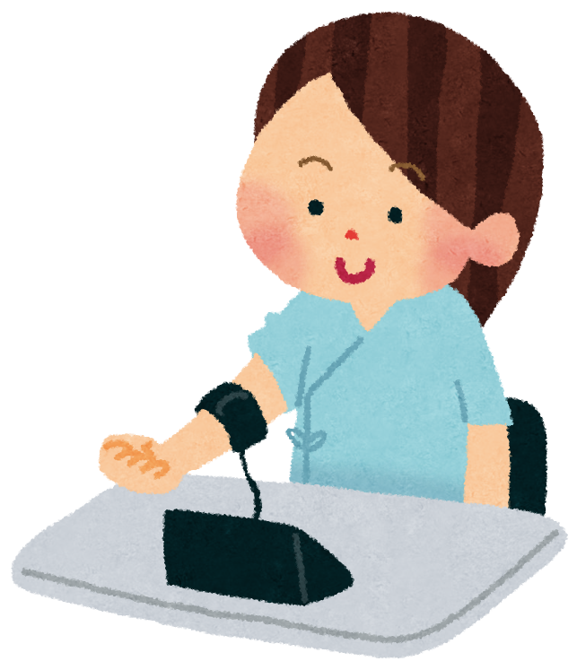
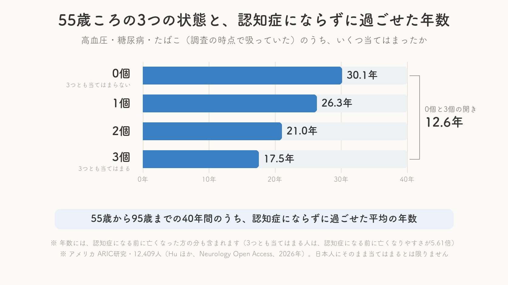
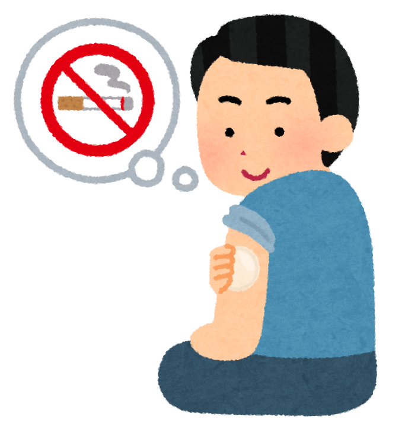

「認知症になる確率が何パーセント上がります」

こういう言い方を、健康の話題でよく見かけます。私も仕事柄、たくさん目にしてきました。ただ、正直に申し上げると、**パーセントで言われても、自分の生活とどうつながるのかが、なかなか実感できません** 。

ところが2026年8月、少し変わった角度から書かれた報告が出ました。確率ではなく、**認知症にならずに過ごせた年数** で見た、という研究です。

年数で言われると、急に、身近な話に感じられます。

> ✅ アメリカの12,409人を **およそ26年間** 追いかけた研究で、**55歳の時点で高血圧・糖尿病・喫煙のどれにも当てはまらなかった人** は、**95歳までのうち**、認知症にならずに過ごせた年数が **30.1年** でした
>
> ✅ 一方、**3つとも当てはまった人は17.5年** 。0個の人と3個の人では、**12.6年の開き** がありました
>
> ✅ ただしこれは **アメリカのデータ** で、**原因と結果を証明した研究ではありません** 。しかも、この年数には「早くお亡くなりになった方の分」も混ざっています。ここは正直にお伝えします

> 認知症にかかわる要因の全体像は、こちらの記事にまとめてあります。
> 👉 [認知症を防ぐ「血管と代謝」の整え方 〜数字で見える7つの危険因子〜](/posts/dementia-14-factors-body/)

---

## 目次

1. [確率ではなく年数で考えるという発想](#確率ではなく年数で考えるという発想)
2. [どんな研究だったのか](#どんな研究だったのか)
3. [中年期の3つとは高血圧と糖尿病とたばこ](#中年期の3つとは高血圧と糖尿病とたばこ)
4. [55歳の時点で何が見えたのか](#55歳の時点で何が見えたのか)
5. [正直に書いておきたいこの研究の弱いところ](#正直に書いておきたいこの研究の弱いところ)
6. [もう手遅れという意味ではありません](#もう手遅れという意味ではありません)
7. [理学療法士として現場で思うこと](#理学療法士として現場で思うこと)
8. [いま私たちにできること](#いま私たちにできること)
9. [おわりに](#おわりに)
10. [参考にした情報](#参考にした情報)

---

## 確率ではなく年数で考えるという発想

たとえば「認知症になる可能性が2倍になります」と言われたとします。

そう言われても、多くの方はこう思うのではないでしょうか。**もともと何パーセントだったのか。2倍になると、自分の生活は具体的にどう変わるのか。**

今回ご紹介する研究チームは、その伝わりにくさを分かっていたようです。だから、こういう出し方をしました。

> **55歳のあなたは、これから何年、認知症にならずに過ごせそうか。**

同じデータを見ていても、こう言われると、頭に絵が浮かびます。55歳から30年なら85歳。17年なら72歳。自分の家族や、自分がやりたいことを、その年齢に当てはめて考えられます。


たしかに、パーセントより年数のほうが、ぴんときますね。




そうなんです。研究者の方たちも、そこを狙ったのだと思います。ただ、**分かりやすい数字ほど、後ろにある注意書きが飛ばされやすい** という弱点もあります。この記事では、その注意書きのほうも、きちんと書いていきますね。


---

## どんな研究だったのか

報告したのは、**中国の清華大学のJiaqi Hu先生ら** の研究チームです。2026年8月5日、アメリカ神経学会が出している医学誌 **Neurology Open Access** に、オンラインで公開されました。

使われたのは、アメリカで長年続いている **ARIC研究** という大きな調査のデータです。ARICは「Atherosclerosis Risk in Communities」の略で、日本語にすると「地域住民における動脈硬化の調査」という意味になります。

数字を並べると、こうなります。

| 項目 | 内容 |
|---|---|
| 参加した人数 | 12,409人 |
| 調査を始めたときの平均年齢 | 56.2歳 |
| 女性の割合 | 56.0% |
| 追いかけた期間 | 中央値でおよそ26.3年（1990〜92年に開始し、2022年まで） |
| 期間中に認知症になった人 | 3,008人 |
| 期間中に認知症にならないまま亡くなった人 | 5,238人 |

※ **中央値** … 全員を短い順に並べたとき、ちょうど真ん中に来る人の値のことです。平均値と違って、極端に長い人や短い人に引っぱられにくい数字です。

30年近くにわたって、1万人以上を追いかけ続けた調査です。これだけ長く人を追った研究は、そう多くはありません。そこは、この研究の強みです。

---

## 中年期の3つとは高血圧と糖尿病とたばこ

研究チームが注目したのは、**中年のころの3つの状態** です。

**① 高血圧**

血圧が高い状態が続くと、脳の奥にある細い血管が、少しずつ傷んでいきます。目に見えないほど小さな詰まりやもれが積み重なることが、考えるスピードがゆっくりになる一因になると考えられています。

**② 糖尿病**

血糖（けっとう＝血液の中のブドウ糖）が高い状態が続くことでも、同じように血管が傷みます。あわせて、脳の神経細胞そのものにも負担がかかると言われています。

**③ 喫煙**

たばこの煙に含まれる成分は、肺から血液に入り、体じゅうを巡ります。血管を縮ませ、傷つける働きがあります。

なお、この研究で数えたのは、**調査の時点でたばこを吸っていた人** です（本人の申告）。以前に吸っていてやめた人は、当てはまらない側に入っています。

この3つは、以前ご紹介した **ランセット委員会の14の要因** にも、そろって入っているものです。今回の研究は、そのうち中年期に測りやすい3つを取り出して、「年数」に置き換えてみた、という位置づけになります。

> 14の要因の全体像は、こちらでまとめています。
> 👉 [日本人の認知症、約4割は予防できる 〜カギは「難聴」と「運動不足」〜](/posts/dementia-japan-14-factors/)


どれも、健康診断でよく言われるものばかりですね。




はい。目新しいものは一つもありません。**むしろ、そこがこの研究の要点** だと私は思っています。健康診断で毎年見ている血圧と血糖の数字、そしてたばこを吸っているかどうか。**たったこれだけの違いで、95歳までに認知症にならずに過ごせた年数に、最大で12.6年もの開きが出ていた** わけですから。


---

## 55歳の時点で何が見えたのか

ここが、この記事の中心です。

研究チームは、**55歳の時点でこの3つがいくつ当てはまるか** で参加者を分け、そこから、**55歳から95歳までの40年間のうち、平均して何年を認知症にならずに過ごせたか** を計算しました。結果はこうでした。

| 55歳の時点で当てはまった数 | 95歳までに、認知症にならずに過ごせた年数 |
|---|---:|
| 0個（3つとも当てはまらない） | 30.1年 |
| 1個 | 26.3年 |
| 2個 | 21.0年 |
| 3個（3つとも当てはまる） | 17.5年 |

**0個の人と3個の人では、12.6年の開きがありました。**

1つ増えるごとに、階段を降りるように短くなっていく形です。0個から1個で3.8年、1個から2個で5.3年、2個から3個で3.5年、それぞれ短くなっています。

もうひとつ、この研究では **3つとも当てはまった人は、3つとも当てはまらなかった人と比べて、認知症になりやすさが2.69倍** と計算されています。そして、**認知症になる前に亡くなりやすさは、さらに大きく5.61倍** でした。この5.61倍の意味は、あとの「弱いところ」でお話しします。

**この記事で統計の数字が出てくるのは、ここまでです。** 以降は、これらの数字をどう受け取ればいいか、という話になります。

---

## 正直に書いておきたいこの研究の弱いところ

数字がきれいに並んでいるときほど、いったん立ち止まる必要があります。この研究には、はっきり書いておかなければならない注意点が4つあります。

**① これは観察研究であって、原因と結果を証明したものではありません**

この研究は **前向きコホート研究** という形のものです。たくさんの人を先に集めて、その後を長く追いかけて、何が起きたかを記録していく方法です。人間を対象にした研究としては、信頼度の高いやり方のひとつです。

ただし、これで分かるのは「**そういう傾向があった**」ということまでです。「高血圧だったから認知症になった」と証明したわけではありません。

たとえば、こういう可能性が残ります。中年のころに高血圧や糖尿病がある方は、**同時に、体を動かす機会が少なかったり、経済的に余裕がなかったり、ほかの持病を抱えていたり** することも多いものです。年数を短くしていた本当の理由が、そちらにあった可能性は消せません。

**② これはアメリカのデータです**

参加者はアメリカの地域住民です。食事も、医療のかかり方も、たばこの吸われ方も、日本とは違います。**日本人にそのまま当てはまる数字だとは考えないでください。** 「日本人なら30.1年です」とは、この研究からは言えません。

**③ ここがいちばん大事です。年数には、早くお亡くなりになった方の分が混ざっています**

追跡した期間のうちに、**認知症にならないまま亡くなった方が5,238人** いらっしゃいました。認知症になった3,008人より、多い人数です。

「認知症にならずに過ごせた年数」という言い方をすると、その年数が終わったあとに認知症になったように聞こえます。でも実際には、**その年数の一部は、認知症になる前にお亡くなりになったことで終わっています** 。

つまり、3つとも当てはまる人の17.5年という数字は、「**17.5年たったら認知症になる**」という意味ではありません。「**認知症にならずにいられた期間が、平均するとそこまでだった**」という意味です。高血圧・糖尿病・喫煙は、心臓の病気や脳卒中、がんとも深く関わっていますから、**年数が短くなった分には、寿命そのものが短くなった分が含まれています** 。先ほどの、**認知症になる前に亡くなりやすさが5.61倍** という数字が、そのことを表しています。

ここを混同すると、この研究をまったく違う意味に読んでしまいます。

**④ 3つを調べたのは、1990〜92年の1回だけです**

高血圧・糖尿病・たばこを調べたのは、**1990〜92年の調査の1回だけ** です。いまから30年以上前で、しかも、**その後に治療を始めたり、たばこをやめたりした変化は、数字に入っていません**。研究チーム自身も、これを弱いところとして挙げています。当時と現在では、血圧の薬も、糖尿病の治療も、大きく変わりました。**当時の高血圧と、いまの高血圧では、その後にたどる道が同じとは限りません。**


なんだか、読めば読むほど、この数字を信じていいのか分からなくなってきました。




そう感じていただけたなら、この記事は役に立っています。**数字そのものを暗記する必要はありません。** 持ち帰っていただきたいのは、「**中年のころの血圧・血糖・たばこは、その後の長い時間にかかわっていそうだ**」という方向だけです。年数の細かいところは、正直、日本人にそのまま当てはめられません。


---

## もう手遅れという意味ではありません

この記事を読んでくださっている方の多くは、すでに55歳を過ぎていらっしゃると思います。

だから、こう思われた方がいるかもしれません。「**もう55歳は過ぎてしまった。いまさら言われても遅い**」と。

ここは、はっきり書いておきます。

**この研究は、中年期に1回だけ調べた状態をもとにした研究です。その後にたばこをやめた人、血圧の薬を飲みはじめた人、血糖を整えた人が、その後どうなったかを調べた研究ではありません。**

つまり、この研究は「**55歳を過ぎたら何をしても変わらない**」とは、一言も言っていないのです。言っていないことを、読み取らないようにしましょう。

そして、別の研究からは、**年齢を重ねてからでも手はある** ことが分かっています。血圧を整えることも、禁煙することも、体を動かすことも、何歳から始めても体に良い方向に働くことが、たくさんの報告で示されています。

私が現場で見てきた範囲でも、50代、60代で禁煙された方、歩く距離が伸びた方は、たくさんいらっしゃいます。**「もう遅い」と言って、いま手が届くものまで手放してしまうことのほうが、私はもったいないと思います。**


70代からでも、意味がありますか。




あります。ただし、**期待の置きどころは変えたほうがいい** とも思っています。60代70代から始めることで、認知症を完全に防げるかは分かりません。でも、**歩ける距離、息切れのしにくさ、転びにくさ** といったところは、始めた方から確実に変わっていきます。そちらは、私が毎日見ているものです。


---

## 理学療法士として現場で思うこと

リハビリの現場にいると、患者さんのカルテを見る機会が多くあります。

そこで気づくのは、**脳卒中で運ばれてきた方の記録には、たいてい、何十年も前からの高血圧や糖尿病の記載が並んでいる** ということです。その方が50代だったころの数字が、いま目の前にある体につながっている。そう感じる場面は、少なくありません。

もうひとつ思うのは、**中年のころは、自覚症状がほとんどないこと** です。血圧が高くても、血糖が高くても、痛くもかゆくもありません。だから後回しになります。

今回の研究がしてくれたのは、その「痛くもかゆくもない数字」を、**認知症にならずに過ごせる年数という、自分の人生に当てはめて考えやすい形** に置きかえてくれたことだと思います。それだけでも、意味のある仕事だと感じました。

---

## いま私たちにできること

難しいことは書きません。順番に、ひとつずつで大丈夫です。

- ☑ **今年の健診の結果を、もう一度出してみる** 。血圧と血糖の欄だけで構いません
- ☑ 高いと言われたことがあるなら、**放置せず、一度かかりつけの先生に相談する** 。薬を飲むかどうかは、そこで決めれば十分です
- ☑ **たばこを吸っている方は、禁煙外来という選択肢があります** 。自力でやめられなかった経験があっても、それは意志の問題ではありません
- ☑ **55歳を過ぎたからと、あきらめない** 。この研究は、その後にやめた人・治した人を見ていません
- ☑ お子さんや、まだ40代50代のご家族がいらっしゃるなら、**この話を伝えてあげてください** 。いちばん効くのは、その年代の方です
- ☑ 数字を覚えようとしない。「**中年の血圧・血糖・たばこは、後々まで響くらしい**」。それだけ持ち帰れば十分です
- ☑ 不安になったら検索を止めて、次の受診で先生に聞く。**ネットで不安だけを持ち帰らない**

---

## おわりに

「認知症にならずに過ごせた年数」という見方は、私にとって、新しい受け取り方でした。

パーセントは、頭には入っても、体には入ってきません。でも年数は違います。**30年と17年。その開きに、これから行きたい場所や、まだやっていないことを、当てはめられてしまう** からです。

ただ、繰り返しになりますが、この数字はアメリカのもので、原因を証明したものでもなく、しかも「認知症にならないうちに亡くなった」という重い事実を含んでいます。**きれいな数字ほど、そのまま持ち歩かないほうがいい。** それが、この研究をひととおり読んでの、私の正直な感想です。

そのうえで、残るものは、たぶんこれだけです。

**血圧を測る。血糖を見る。たばこをやめる。**

新しくもなければ、面白くもない3つです。でも、30年近く1万人を追いかけて出てきた答えが、結局この3つだったということには、それなりの重みがあると思っています。

そして、55歳を過ぎた私たちにできることも、まだ、ちゃんと残っています。

---

## 参考にした情報

- Hu J, Coresh J, Smith JR, ほか「Midlife vascular risk burden and dementia-free survival years: The Atherosclerosis Risk in Communities Neurocognitive Study」『Neurology Open Access』2026年8月5日オンライン公開（米国ARIC研究のデータ解析）
- アメリカ神経学会（AAN）のプレスリリース、2026年8月5日　https://www.prnewswire.com/news-releases/avoiding-three-things-during-middle-age-is-linked-to-13-more-years-without-dementia-302844142.html
- ケアネットによる上記研究の日本語解説記事、2026年（※医療者向け・会員登録が必要）　https://www.carenet.com/news/general/carenet/63456
- Medscape「Three Midlife Risk Factors Linked to Earlier Dementia Onset」2026年（上記研究の英語解説記事）
- ランセット委員会報告：Livingston G, et al. **Lancet** . 2024;404:572-628.（14の要因の全体像）

---

※この記事は一般的な情報提供を目的としたものです。血圧・血糖の数値やお薬については、お一人おひとりで事情が異なります。**気になる数字があるときは、自己判断せず、かかりつけの先生にご相談ください。** また、この記事で紹介した年数は米国のデータにもとづくもので、日本人にそのまま当てはまるものではありません。
