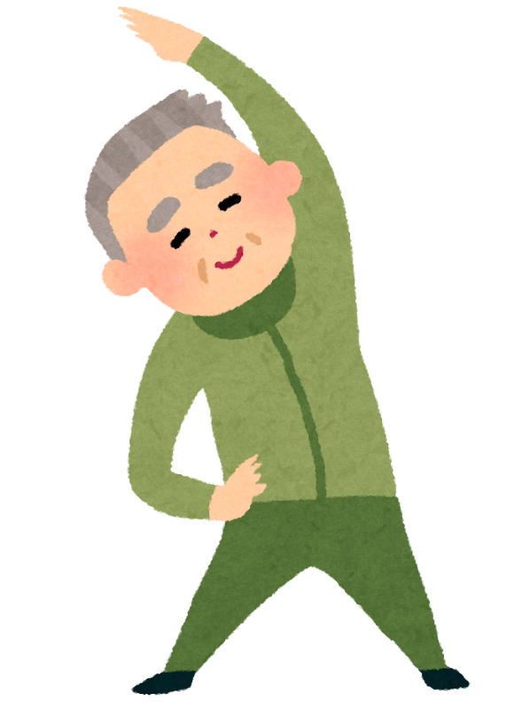
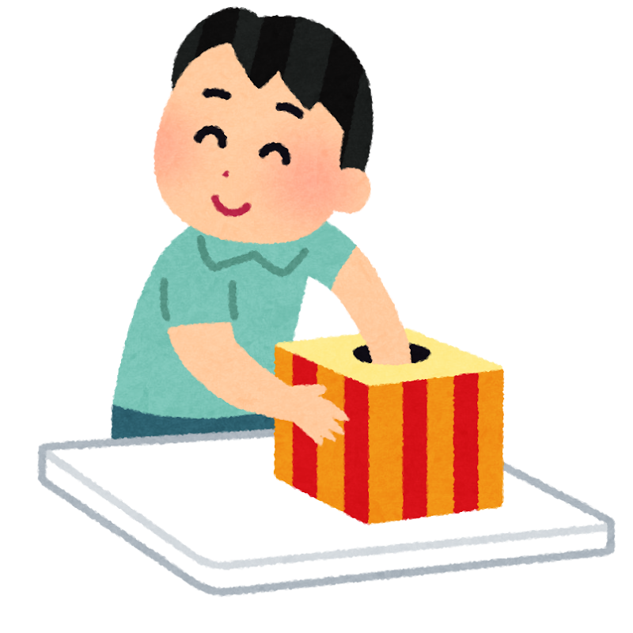
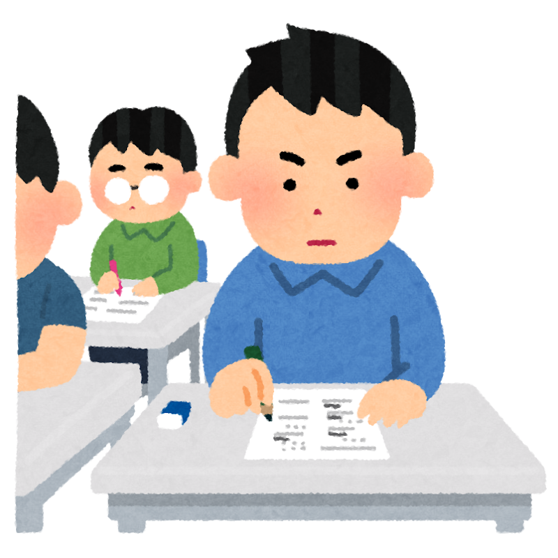
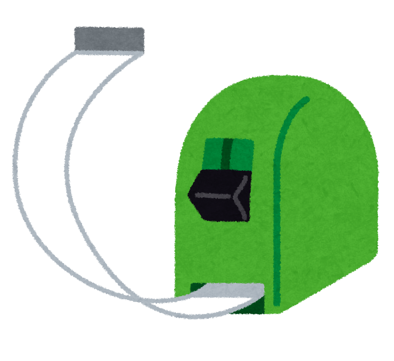
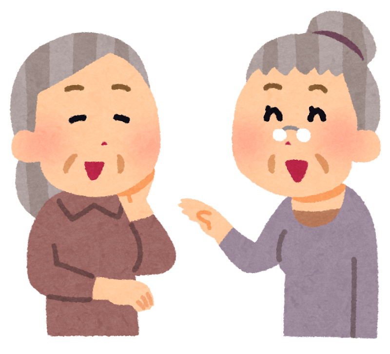

「体にいいのは分かっているんです。でも、一人だとどうしても続かなくて」

地域の体操教室でも、リハビリの場面でも、私がいちばんよく聞くお話です。そして、たいていそのあとに、こう続きます。

「私は、意志が弱いから」

2026年7月、その受け止め方を少し変えてくれそうな研究が、医学雑誌『The Lancet（ランセット）』に発表されました。

先にお伝えしておきます。**この研究は「運動や食事が効くかどうか」を調べたものではありません。** 調べたのは、**同じテーマの生活改善を、手厚い支えのもとで続けるか、アドバイスをもらって自分で取り組むか** の違いでした。

> ✅ 中南米11か国の1,065人（平均67.5歳）を、**くじ引きで2つのグループに分けて2年間** 比べました。比べたのは「**スタッフの指導と、仲間との集まり（2年間で38回）がある、手厚く支えるやり方**」と「**アドバイスをもらって、自分で取り組むやり方（集まりは4回）**」です
>
> ✅ 認知機能テストの点の伸びは、**手厚く支えたグループが1年あたり0.31、自分で取り組むグループが1年あたり0.20** （どちらも「標準偏差」という統計の単位です）。その開きは **1年あたり0.11** でした
>
> ✅ ただし、これは **認知機能テストの点についての話** です。暮らしの中で何がどう変わるのか、認知症そのものが減るのかまでは、この2年間の研究では **分かっていません**

> 「何を、どれくらいやればいいのか」については、以前の記事にまとめました。今回はその続きで、「**どういう形でやるのか**」 のお話です。
> 👉 [『何を、どれくらい』のヒントが見えてきました 〜MCIから始める運動の最適解〜](/posts/mci-exercise-multidomain-2026/)

---

## 目次

1. [そもそも何を比べた研究なのか](#そもそも何を比べた研究なのか)
2. [くじ引きで分ける試験という形](#くじ引きで分ける試験という形)
3. [結果はこうでした](#結果はこうでした)
4. [この数字をどう受け取るか](#この数字をどう受け取るか)
5. [正直に書いておきたいこの研究の限界](#正直に書いておきたいこの研究の限界)
6. [理学療法士として現場で思うこと](#理学療法士として現場で思うこと)
7. [いま私たちにできること](#いま私たちにできること)
8. [おわりに](#おわりに)
9. [参考にした情報](#参考にした情報)

---

## そもそも何を比べた研究なのか

研究の名前は **LatAm-FINGERS** （ラタム・フィンガーズ）といいます。中南米の11か国が参加した、大がかりな研究です。

参加したのは **1,065人**、平均年齢は **67.5歳**。期間は **2年間** でした。60〜77歳で、血圧などの危険因子があって認知症になりやすいと判定され、テストの成績もやや低めだった方々です。

扱ったテーマは、両方のグループとも同じです。

- 運動
- 食事の見直し
- 頭を使う活動
- 血管の危険因子の管理（血圧・血糖・コレステロールなどを整えること）

このように、ひとつのことだけでなく、いくつもの生活習慣をまとめて整えるやり方を **多因子介入** （たいんしかいにゅう）と呼びます。

ここがこの研究のいちばん大事なところです。**テーマは同じでも、支え方の手厚さがまったく違いました。**

| | 手厚く支えたグループ（539人） | 自分で取り組むグループ（526人） |
|---|---|---|
| 運動 | スタッフの指導つき | アドバイスのみ |
| 食事 | 脳によいとされる食事法をもとにした相談 | アドバイスのみ |
| 頭を使う活動 | パソコンを使ったトレーニング | アドバイスのみ |
| 血圧などの管理 | 定期的なチェック | アドバイスのみ |
| グループでの集まり | **2年間で38回** | **2年間で4回** |

つまり、この研究が比べたのは「やる人」と「何もしない人」ではありません。**どちらのグループも、生活を良くすることに取り組んでいます。** 違ったのは、**専門スタッフの指導や見守りと、仲間と集まる機会の多さ** でした。ここは、あとでもう一度触れます。


テーマが同じなら、結果もあまり変わらない気がしますけれど。



私は逆で、**支えの手厚さがこれだけ違えば、結果も変わるだろう** と思いました。実際、そのとおりの結果でした。大事なのは、それを思い込みではなく、**くじ引きで分けた試験で確かめた** ことです。


---

## くじ引きで分ける試験という形

この研究は、**無作為化比較試験** （むさくいかひかくしけん）という形で行われました。

**無作為化**とは、平たく言えば **くじ引き** です。参加した1,065人を、本人の希望ではなく、くじ引きで2つのグループに分けました。

もし本人に選んでもらうと、**もともと元気でやる気のある人ほど、手厚いほうを選ぶ** かもしれません。そうなると、良い結果が出ても、プログラムのおかげなのか、もともとの元気さのおかげなのかが分かりません。くじ引きなら、そうした違いが両方のグループに均等にばらけます。だから、**医学の証拠としていちばん強い形** と言われています。

さらに、テストの点を測る担当者には、その人がどちらのグループかを伏せていました（**単盲検**＝たんもうけん）。思い込みが点数に入り込まないようにするためです。

---

## 結果はこうでした

2年間の結果です。

総合的な認知機能テストの点の伸びは、こうなりました。

| グループ | 1年あたりの伸び |
|---|---|
| 手厚く支えたグループ | **0.31** |
| 自分で取り組むグループ | **0.20** |
| その開き | **0.11** （P<0.0001） |

単位は「標準偏差」というものです。これが何なのかは、次の章でまとめて説明します。

まず、数字の並びだけを見ておきましょう。**0.31と0.20** ですから、手厚く支えたグループのほうが、伸びが **およそ55%大きかった** ことになります。

そして、この開きは **記憶・実行機能・処理速度** のそれぞれの項目でも、同じ傾向が見られました。

- **記憶** … 覚えて、思い出すはたらき
- **実行機能** （じっこうきのう）… 段取りを立てて、順序よく進めるはたらき
- **処理速度** （しょりそくど）… 考えるスピード

また、**途中でやめた人は、自分で取り組むグループのほうが多く**（20.2%と15.2%）、手厚く支えたグループのほうが続けやすかったこともうかがえます。

なお、表の中の **P<0.0001** というのは、「**たまたまこうなっただけ、という可能性はとても低い**」ということを示す目安です。偶然のいたずらでこうなった、とは考えにくい、という意味だとお考えください。


55%も大きいなんて、ずいぶん違うんですね。




ここは、ちょっと落ち着いてお読みいただきたいところです。**もとの数字が0.31と0.20という小さな数字** ですから、割合にすると大きく見えます。この0.11がどれくらいのものなのか、次の章で説明します。


---

## この数字をどう受け取るか

**標準偏差** （ひょうじゅんへんさ）とは、**点数のばらつき具合を測る物差し** です。ばらつき1つ分を「1」とした目盛りで、11か国で違う種類のテストをまとめて比べるために使われました。

今回の **0.11** は、その目盛りの **10分の1くらい** の開きです。

ただし、**これは統計の上での目盛りで、暮らしの中で何がどう変わるかを表したものではありません。** 買い物の計算が楽になるのか、人の名前が出てきやすくなるのか。そうしたことは、この研究では示されていません。


では、この研究は何を教えてくれたのでしょうか。



**続かないのは、意志が弱いからではなく、続けやすい仕組みがないからかもしれない** ということです。指導してくれる人がいて、仲間と集まる機会がたくさんある形のほうが、テストの点はよく伸びました。何が効いたのか一つには絞れませんが、**支えのある形で続けるのがよさそうだ、という強い裏づけ** が得られた、と私は受け取っています。


---

## 正直に書いておきたいこの研究の限界

良いところだけを並べても、役に立つ情報にはなりません。この研究について、気をつけて読むべきところを書いておきます。

**① 比べた相手も、生活を良くしています**

いちばん誤解されやすいところです。今回の0.11という開きは、**「取り組んだ人」と「何もしなかった人」を比べたものではありません。** 自分で取り組んだグループも、生活改善に取り組んで、**1年あたり0.20 伸びています。** どちらのグループも前に進んでいて、その進み方を比べた研究です。

**② 見ているのは、認知機能テストの点です**

2年間の研究で分かったのは、テストの点の伸び方までです。**認知症になる人が減ったのかどうかは、この研究では分かっていません。** 認知症そのものが減るかを確かめるには、もっと長い年数が必要になります。

**③ 暮らしへの意味は、まだ示されていません**

前の章で書いたとおりです。0.11という目盛りが、日々の暮らしの何にあたるのか。そこはこれから確かめられていく部分です。

**④ 中南米のデータです**

参加したのは中南米11か国の方々です。食事の中身も、家族との暮らし方も、地域の集まりの形も、日本とは違います。**日本人にそのまま当てはまるとは限りません。** ただ、「仲間と決まった形で取り組む」という部分は、日本の通いの場や体操教室と、かなり近い形でもあります。

**⑤ 何が効いたのかは、切り分けられていません**

手厚いグループには、指導つきの運動、食事の相談、頭のトレーニング、血圧などのチェック、そして38回の集まりが、**まとめて** 入っていました。ですから、**仲間と一緒だったから伸びたのか、専門スタッフの指導があったから伸びたのか、それとも全部が合わさった結果なのかは、この研究からは分かりません。**


なんだか、良い話なのか悪い話なのか、分からなくなってきました。




分かりにくくて申し訳ありません。私はこう整理しています。**「一緒にやると認知症を防げる」とまでは、まだ言えません。** けれど、**手厚い支えのもとで、仲間と集まりながら続けたほうが、テストの点はよく伸びた** ことは、かなり強い形で確かめられました。 言い切れるところと、まだ言えないところを分けておくと、ふり回されずにすみます。


---

## 理学療法士として現場で思うこと

私は理学療法士として、病院でのリハビリのほかに、地域の健康教室にも関わってきました。そこで毎年のように見てきた光景があります。

教室で一緒に体操をしていた方に、「同じことを、おうちでも週に2回やってみてくださいね」とお伝えします。紙に書いてお渡しもします。ところが次にお会いすると、多くの方が「やろうと思ったんですけどね」とおっしゃる。そして決まって、ご自分を責められます。

一方で、同じ方が、**教室には毎回きちんと来られます。** 雨の日も、少し膝が痛い日も来られる。「今日は休もうかと思ったけれど、行かないと心配されるから」と笑いながら来られた方もいました。誰かが休むと「あの人どうしたのかな」と声が上がり、次の週にその方が来ると、みんなで迎えるのです。

同じ人が、同じ体操をするのに、**家では続かず、教室では続く。** 現場にいると、これは意志の強さの問題ではなく、**続く形になっているかどうかの問題** だと感じます。決まった曜日と時間があり、行く場所があり、待っている人がいる。それだけで、続き方が変わります。

現場で感じてきた「みんなでやると続く」ということが、今回、**くじ引きで分けた試験でも同じ傾向として出た** のは、うれしい驚きでした。もちろん、分かったのはテストの点の伸び方までで、仲間と集まることだけの効果を確かめたわけではありません。それでも、教室で毎週顔を合わせることには意味がある、と背中を押してもらえた気がしています。

---

## いま私たちにできること

難しく考えなくて大丈夫です。ひとつだけ選んで始めていただければ十分です。

- ☑ **続かないご自分を、責めないでください。** 続かないのは意志の弱さではなく、続く形になっていないだけかもしれません
- ☑ **「通える場所」をひとつ確保する。** お住まいの市区町村には、高齢者向けの体操教室や、公民館・集会所で開かれている集まりがあります。広報紙やホームページに載っていることが多いです
- ☑ **地域包括支援センターに聞いてみる。** 近所にどんな通いの場があるかを教えてくれる、公的な相談窓口です。お住まいの地区の担当が決まっています
- ☑ **「決まった曜日・決まった時間」にする。** 家で続けたい方も、日時を決めてしまうほうが続きます。今回の研究でよく伸びたのも、決まった予定で集まる機会が多かった、手厚く支えたグループでした
- ☑ **一人で始めるなら、誰かに宣言する。** ご近所の方でも、通院先のスタッフでもかまいません。待っている人がいるかどうかは、思っている以上に大きいです
- ☑ **内容は、組み合わせるほうがよさそうです。** 運動だけでなく、食事・頭を使う活動・血圧や血糖の管理も一緒に。ここは以前の記事にまとめました
- ☑ **持病のある方は、始める前にかかりつけの先生に相談を。** 運動の強さや量には、お一人ずつ違いがあります

> つながりが減ることと認知症の関わりについては、こちらもあわせてどうぞ。
> 👉 [脳を守る「刺激とつながり」 〜耳・目・心・環境の7つの危険因子〜](/posts/dementia-14-factors-brain/)

---

## おわりに

健康の話は、どうしても「何をやるか」に集まりがちです。どの運動がいいのか。何を食べるといいのか。私自身、そういう記事を何本も書いてきました。

今回の研究が投げかけているのは、それとは少し違う問いだと思っています。

**同じことをやるとしても、あなたはそれを、どういう形でやりますか。**

一人で、思い立った日に。それとも、決まった曜日に、顔なじみの人たちと。

同じテーマでも、**支えがあって続けやすい形かどうかで、2年後の伸び方は同じではなかった。** それが、1,065人が2年かけて見せてくれたことでした。

もちろん、この研究が示したのは認知機能テストの点についてであって、「認知症を防げる」と言い切れる話ではありません。そこは正直に受け止めておきたいところです。

それでも、もしいま「続けたいのに続かない」とご自分を責めている方がいらっしゃったら、**責める先を、意志から仕組みに変えてみませんか。**

行く場所をひとつ決める。曜日をひとつ決める。待ってくれる人を一人つくる。

遠回りに見えるかもしれませんが、**続く形をつくることが、いちばんの近道** なのだと思います。

---

## 参考にした情報

- Crivelli L ほか「Multidomain lifestyle intervention for the prevention of cognitive decline in at-risk older adults in Latin America (LatAm-FINGERS): a single-blind, multicentre, randomised controlled trial」『The Lancet』2026年7月13日
  https://www.thelancet.com/journals/lancet/article/PIIS0140-6736(26)01278-X/abstract
- 国際アルツハイマー病協会国際会議（AAIC 2026）発表資料「LatAm-FINGERS improves brain health in Latin America」（2026年7月13日、上記論文と同時発表）
  https://aaic.alz.org/releases-2026/latam-fingers-improves-brain-health-latin-america.asp
- 当ブログ関連記事「『何を、どれくらい』のヒントが見えてきました 〜MCIから始める運動の最適解〜」

---

※この記事は一般的な情報提供を目的としたものです。お体の状態や持病には個人差があります。**運動を始めるとき・強さを上げるときは、必ずかかりつけ医やリハビリ担当者にご相談ください。** また、物忘れが気になる場合は、自己判断せず医療機関にご相談ください。
