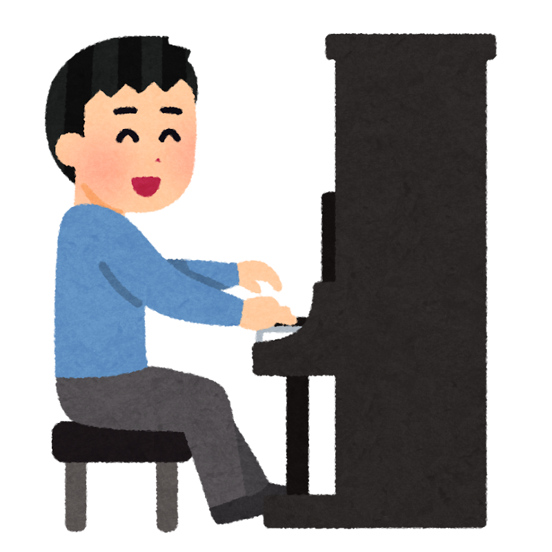

「楽器は、子どものころから習っていないと無理でしょう？」

そう思って、あきらめている方は多いかもしれません。

ドイツとスイスの研究チームが、**楽器の経験がほとんどない62〜78歳の156人**に、1年間ピアノを習ってもらう試験をおこないました。

> ✅ ピアノを習った人は、音楽を聴いて学んだ人にくらべて、**生活の質（心・体・まわりの環境）の満足度**が上がりました
>
> ✅ **頭の切り替え**は、ピアノ組も聴く組も伸びました。ピアノ組が上回ったのは**1項目だけ**でした
>
> ✅ 4年後、連絡がついたピアノ組の**約6割**が、まだ弾いていました

---

## 目次

1. [音楽をいつも聴く人は、認知症になりにくい？](#音楽をいつも聴く人は認知症になりにくい)
2. [未経験の人に、1年ピアノを習ってもらった](#未経験の人に1年ピアノを習ってもらった)
3. [この研究の弱いところ](#この研究の弱いところ)
4. [おわりに](#おわりに)
5. [参考にした情報](#参考にした情報)

---

## 音楽をいつも聴く人は、認知症になりにくい？

オーストラリアで、**70歳以上の約1万900人**を追いかけた研究があります。

音楽を「いつも」聴く人は、「聴かない・たまに・ときどき」の人とくらべて、**認知症になる割合が39%低い**という結果でした。

ただし、これは**観察研究**です。調整したのは年齢・性別・学歴だけで、運動や持病などの影響は取りきれていません。「聴けるくらい元気な人だった」可能性も残ります。

そこで知りたくなるのが、「**実際に始めてもらったら、どうなるのか**」です。

---

## 未経験の人に、1年ピアノを習ってもらった

ドイツ・ハノーファーとスイス・ジュネーブで、62〜78歳の健康な156人（平均69.5歳）が参加しました。条件は、**これまでの人生で楽器の経験が半年未満**の人です。

くじ引きで2つの組に分けました。

- **ピアノ組**（74人） … ピアノを習う
- **聴く組**（82人） … 音楽を聴いて学ぶ（ジャンルや作曲家のお話など。弾いたり歌ったりはしません）

どちらも**週1回60分のレッスンを1年間**、毎日の宿題つきです。ピアノ組の比べた相手は「何もしない人」ではなく、同じように講座に通う「**聴く組**」でした。両方の組が1年間、先生のいる講座に通ったので、「習い事に通うこと自体」の効果を取りのぞいて比べられています。

結果は次のとおりです。

- **生活の質** … ピアノ組のほうが、**心の面・体の面・まわりの環境の面**で上がりました。人づきあいの面は、組による違いはありませんでした
- **頭の切り替え** … **ピアノ組も聴く組も**、いくつかの項目で伸びました。ピアノ組が上回ったのは、数字の切り替え課題の**1項目だけ**でした
- **4年後** … 連絡がついたピアノ組のうち、**約6割（32人）がまだ弾いていました**


楽器なんて、今さら始められるでしょうか……。



この研究の参加者は、**ほとんどが楽器の初心者**でした。それでも1年で、音の強弱や区切りをつけた演奏が、中くらいまで上達しています。年齢や、始める前の頭の調子は、上達の度合いと関係しませんでした。



弾かずに、聴くだけではだめですか？



頭の切り替えは、**聴く組も伸びました**。好きな曲をゆったり聴くのも、気軽な一歩です。ただ、「聴けば認知症を防げる」とまでは言えません。


---

## この研究の弱いところ

- 測ったのは**生活の質や頭の切り替え**で、**認知症になるかどうかは調べていません**。期間も1年あまりです
- 参加者は、**音楽に興味があって自分から応募した、健康な人**です。そうでない人にも同じ結果が出るかは分かりません
- 途中で新型コロナの流行があり、レッスンがオンラインになった時期がありました

つまり、「ピアノで認知症が防げる」という話ではありません。分かったのは、**始める年齢が遅くても、楽しみながら続けられて、暮らしの満足度が上がる可能性がある**ということです。

> 趣味や人とのつながりと脳の関係は、こちらでもまとめています。
> 👉 [今日から始める「脳の守り方」〜4本柱で続ける認知機能の予防〜](/posts/cognitive-decline-prevention-overview/)

---

## おわりに

「聴く」でも「弾く」でも、音楽のある時間は、暮らしを少し明るくしてくれそうです。

始めるなら、いきなり大きな楽器を買わなくても大丈夫です。まずは好きな曲を、毎日1曲聴くことからでも。弾いてみたくなったら、お店で鍵盤を触ってみるのもいいと思います。

{{< affiliate
    title="電子ピアノ（初心者向け）"
    amazon="https://af.moshimo.com/af/c/click?a_id=5534074&p_id=170&pc_id=185&pl_id=4062&url=https%3A%2F%2Fwww.amazon.co.jp%2Fs%3Fk%3D%25E9%259B%25BB%25E5%25AD%2590%25E3%2583%2594%25E3%2582%25A2%25E3%2583%258E%2520%25E5%2588%259D%25E5%25BF%2583%25E8%2580%2585%2520%25E5%25A4%25A7%25E4%25BA%25BA"
    rakuten="https://af.moshimo.com/af/c/click?a_id=5533903&p_id=54&pc_id=54&pl_id=27059&url=https%3A%2F%2Fsearch.rakuten.co.jp%2Fsearch%2Fmall%2F%25E9%259B%25BB%25E5%25AD%2590%25E3%2583%2594%25E3%2582%25A2%25E3%2583%258E%2520%25E5%2588%259D%25E5%25BF%2583%25E8%2580%2585%2520%25E5%25A4%25A7%25E4%25BA%25BA%2F"
    description="置き場所をとらない電子ピアノは、初心者の入り口に向いています。大きさや鍵盤の重さが機種で違うので、できれば店頭で触って選ぶと安心です。" >}}

{{< affiliate
    title="グランドピアノ"
    amazon="https://af.moshimo.com/af/c/click?a_id=5534074&p_id=170&pc_id=185&pl_id=4062&url=https%3A%2F%2Fwww.amazon.co.jp%2Fs%3Fk%3D%25E3%2582%25B0%25E3%2583%25A9%25E3%2583%25B3%25E3%2583%2589%25E3%2583%2594%25E3%2582%25A2%25E3%2583%258E"
    rakuten="https://af.moshimo.com/af/c/click?a_id=5533903&p_id=54&pc_id=54&pl_id=27059&url=https%3A%2F%2Fsearch.rakuten.co.jp%2Fsearch%2Fmall%2F%25E3%2582%25B0%25E3%2583%25A9%25E3%2583%25B3%25E3%2583%2589%25E3%2583%2594%25E3%2582%25A2%25E3%2583%258E%2F"
    description="いつかは本物のピアノを、という方に。かなり高価で、置き場所や防音も必要です。まずは弾いてみて、続けられそうだと思ってからで十分です。" >}}

---

## 参考にした情報

- Worschech F ほか「Quality of life in older adults is enhanced by piano practice: Results from a randomized controlled trial」*Annals of the New York Academy of Sciences* 2025年;1550(1):239-254
- Mack M ほか「Effects of a 1-year piano intervention on cognitive flexibility in older adults」*Psychology and Aging* 2025年;40(2):218-235
- Losch H ほか「Acquisition of musical skills and abilities in older adults—results of 12 months of music training」*BMC Geriatrics* 2024年;24:1018
- Jaffa E ほか「What Is the Association Between Music-Related Leisure Activities and Dementia Risk? A Cohort Study」*International Journal of Geriatric Psychiatry* 2025年;40(10):e70163

---

※この記事は一般的な情報提供を目的としたものです。持病のある方や、指先・肩・首などに痛みのある方は、無理のない練習のしかたをかかりつけ医にご相談ください。
