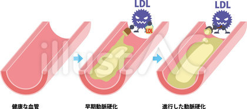
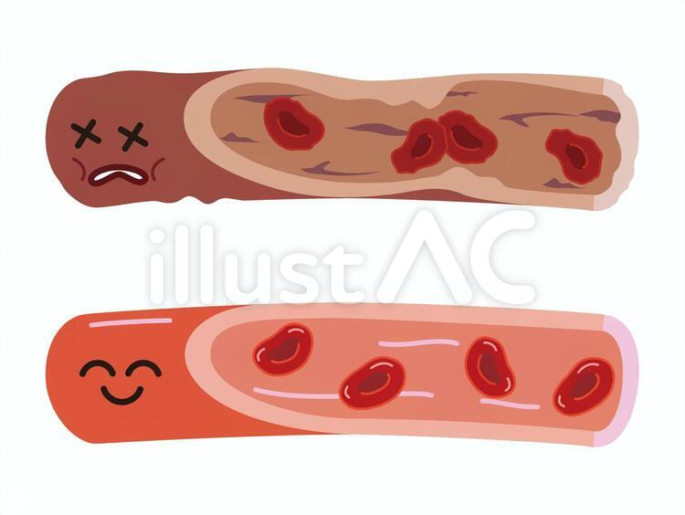
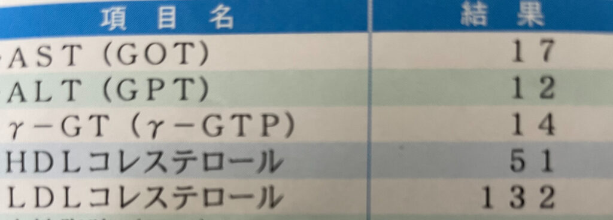
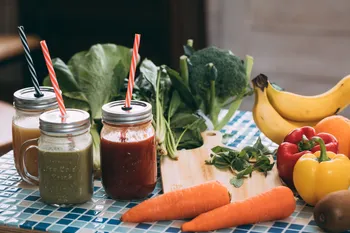

<figure>

| HDLコレステロール（善玉くん）　　　　　　 | **４０以上**　（mg/dl）　　　　　　 |
| --- | --- |
| LDLコレステロール（悪玉くん）　　　　 | **６０〜１１９**(mg/dl) |

<figcaption>

２０２１年度版日本人間ドック学会から出ている「異常なし」値

</figcaption>

</figure>

皆さんは年に１回は健康診断を受けているでしょうか。

私も年に１回は職場で健康診断を受けています。その時に結構な量の血液を抜かれませんか？

あの時の血液の色って意外と黒ずんで見えて「大丈夫かな、これ」と毎回心配になります😁

## 悪玉コレステロールと善玉コレステロール

この血液検査で私がいつも「これはいかん」と思っているのがコレステロール値です。

上の表は２０２１年度版コレステロール「異常なし」の値です。

HDLは「善玉コレステロール」、LDLは「悪玉コレステロール」と呼ばれています。善玉は多いほうが良いです。

悪玉は多すぎると良くないですね。

あっ、LDLが悪玉なんてニックネームをつけられていますが、コレステロールは人の体には必要不可欠なものです！

なので少なすぎるのは問題です。

何故か？コレステロールは全身の細胞の原材料になるからです。

かといって多すぎると血液がどろどろになったり、血管の壁にプラーク（グジュグジュとした脂肪のかたまり）というものが溜まってしまいます。

これが血液の流れを悪くしたり、石灰化から動脈硬化、また血栓ができて心筋梗塞や脳梗塞のリスクが高くなってしまいます(ToT)

HDLは血管にこびりついた余分なコレステロールを肝臓へ運んでくれるので動脈硬化を予防してくれます。

まさに「善玉さん」ですね！

## 私のコレステロールとLH比

下の写真は最近の私の健康診断の抜粋です。下記２行がコレステロールの値です。

ちなみに上３行は肝機能の値で今の所大丈夫みたいです！

コレステロールは最近少し改善してきましたが、それでもまだまだ改善しなければ！

数年前は善玉が４０mg/dl前後、悪玉が１４０mg/dl強とまずい値でした。

<figure>

<figcaption>

２０２１年５月の健康診断

</figcaption>

</figure>

正常値からそんなに離れてないから大丈夫じゃない？と思う方もいるかも知れませんが、実はそう楽観視できる数値ではないのです！

最近ではLH比と呼ばれ、HDLコレステロールとLDLコレステロールの割合が注目され、この割合によっては各値が異常なしであってもリスクの要因になるのです。あー、困った(ToT)

LDL（悪玉さん）➗　HDL（善玉さん）＝　LH比　　

<figure>

| **1.5未満** | 血管きれい |
| --- | --- |
| **1.5以上** | 血管にコレステロールたまり始める |
| **2.0以上** | 血管にコレステロール増えてきた！動脈硬化が心配 |
| **2.5以上** | 血管に血栓できてる可能性あり、心筋梗塞や脳梗塞のリスク |

<figcaption>

LH比の解釈

</figcaption>

</figure>

この解釈ほんまかいなっ！とツッコミを入れたくなります。

私にとってはとても厳しく感じます^^;　な、なんと私の最新LH比は１３２÷５１＝２．５８８と**血栓ができているかもしれないのです**(ToT)　　　　　　　　　　　　

数年前よりは少し改善してきたから安心していた部分もありましたが、この数字を見ると気を引き締めてもっと生活習慣を見直さねばと思う今日このごろです。

ただ、油って美味しいし、白いご飯は大好きだし、甘いものもなかなか辞められないんですよね。

これを我慢するというのは結構な覚悟です。

いやいやでも脳梗塞や心筋梗塞には絶対になりたくないから、覚悟して**脱**コレステロール習慣を身に着けていこうと思います。

ではどんな習慣にすれば良いのでしょうか？

結論から言うと、やはり運動と食事です！

数年前からある程度は意識して運動と食事に気をつけていたつもりでした。

ただ美味しいものを食べる、楽をする、という誘惑にはなかなか勝てず、いつの間にかコレステロールを貯める習慣に戻ってしまいます^^;

もちろんこれからもたまには美味しいもの、好きなものを食べるつもりです。

でも基本的な習慣はコレステロール正常習慣へと変えていきたいです！

## コレステロールを下げる食品

- 魚類　

- 油（えごま油、アマニ油などのオメガ３系）

- 野菜や海藻、きのこ

- 大豆製品

- 緑茶

魚の脂肪にはEPAやDHAが含まれこれは血液中のコレステロールや中性脂肪を減らし、血液をさらさらにしてくれる効果があります。

善玉コレステロールは血液中の余分なコレステロールを回収する働きがありますが、この回収する能力が高い人には、血液中のEPA（エイコサペンタエン酸）濃度が高いということがわかっています。

EPAはオメガ３という油の一種で特に青魚に多く含まれています。このオメガ３油を摂取することが私には必須です。

さしあたって魚を毎日の食事に取り入れること。

えごま油を小さじ１杯（この程度の量で効果があるそうです）毎朝摂取することを目標にします😁

このオメガ３油は熱や光に弱いので気をつけましょう！

冷蔵庫で保存、開封後は１ヶ月使い切りが目安です。

トランス脂肪酸というものを多く含む油は避けたほうが良いようです。

マーガリン、ファストブレッド、ショートニングなどは👎マヨネーズ、クッキー、パイ、半生ケーキなどビスケット類、スナック菓子、クリーム、牛や羊の油、酸化が進んだ油、ポテトチップやお惣菜コーナーの揚げ物は避けましょう🙅

oh!my!god!現代社会においてこんな美味しいものを食べられんのは拷問や～(ToT)

たまーに食べよ、うん😁

コレステロールは動物には多く存在しますが植物にはほとんど含まれていません。

なので野菜の摂取量を増やすことが効果的です。

野菜にはビタミン、ミネラル、食物繊維が多く含まれます。

特に食物繊維はコレステロールや中性脂肪を包み込み体外へ排出する働きがあります。

私も野菜をそれほど多く取る方ではないのでこれからは意識して摂取していこうと思います。

特にブロッコリーやキャベツ、トマト、きんぴらごぼうなどの野菜、のりやとろろ昆布などの海藻は好きなので味噌汁などに入れてまめに食べようと思います！

あとは、しめじを味噌汁に入れたり、エリンギを焼いたり、きのこ類も・・・うーむ、何か簡単で良いレシピがあれば教えてほしい（笑）

大豆製品にはLDLコレステロールが体内に吸収されるのを抑える働きがあります。

私は最近毎日納豆キムチを食べているのでこれを継続したいです😁

あと豆腐や豆乳なども取り入れていこうと思います。

緑茶のカテキンはLDL吸収抑制効果があるようです。

私は水出しで作り置きし、毎日飲んでいるのでこれも続けていこうと思います。

アルコール、缶コーヒー、ジュースは控えめに🙅

## 善玉コレステロールを上げる運動

ずばりウォーキングが善玉コレステロールを上げるのに効果的なようです。

いつか、ためしてガッテンでも放送してたような気がします😁

有酸素運動、１日３０分、週３日〜、軽く息が上がる程度の運動負荷が良いです。

１０分を３回に分けても効果があるようです。

無酸素運動、筋トレも加えると血管には良いようです！

あとウォーキングのやり方としてはインターバル速歩がお勧めです。

信州大学の能勢先生が科学的根拠に基づき提唱された運動です。

３分間のややきついと感じる速歩きと、３分間のゆっくり歩きを交互に繰り返します。

１日５セット以上、週４日以上を目標。速歩きの合計が１５分になればOK！

コレステロールにも効果ありそうですが、筋力・持久力他全般的な健康増進に効きます。

詳細は　　[https://www.tyojyu.or.jp/net/kenkou-tyoju/shintai-training/intabarusokuho.html](https://www.tyojyu.or.jp/net/kenkou-tyoju/shintai-training/intabarusokuho.html) をご参照ください。

注意点：持病のある方は、運動して良いかどうか主治医の先生とよく相談してくださいね。 　　　　　　　　　

私は職場では割と動く仕事ですが、ついついエレベーターを使ってしまい、運動不足です。また車通勤です。

エレベーター禁止！あと最近はガソリンも高いし、これからは電車通勤にし、歩く機会を増やそうと思います。

## まとめ

以上、コレステロールについて私の課題を交えてお話してきましたが、少しでも皆様の参考になれば嬉しいです。

私も少しずつ食と運動の習慣を見直し、来年の健康診断では良い結果を出したいと思います。

でも少しずつです、美味しいもの食べたいし。どっちやねん！😁
