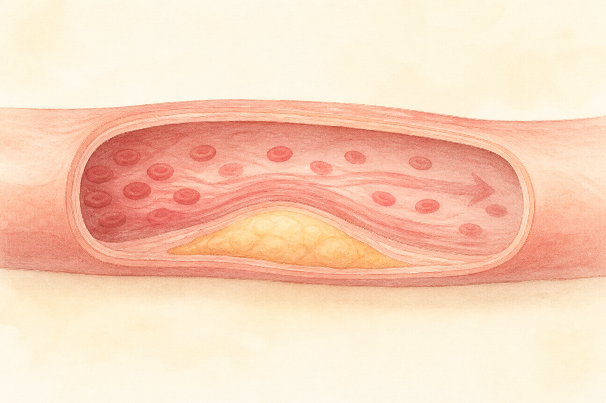
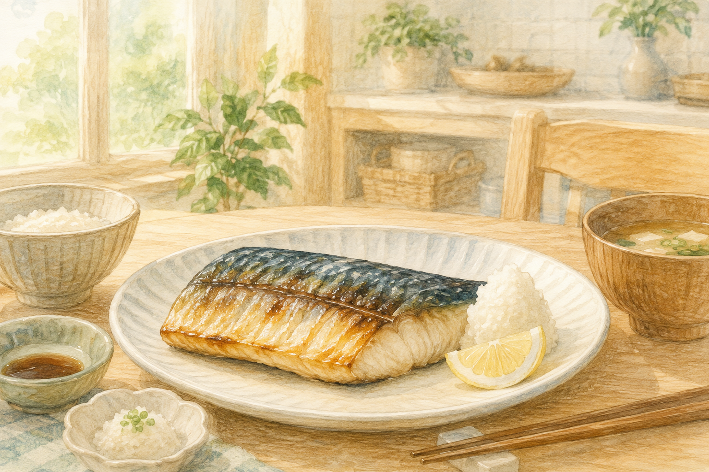
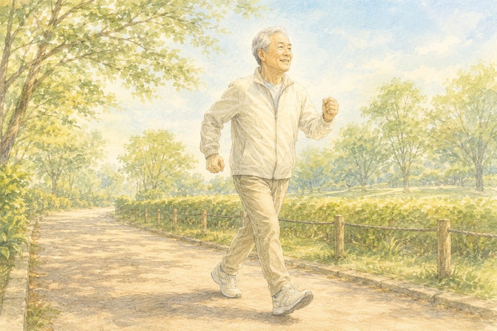

「健康診断でコレステロールが高いと言われた…」

「数値を下げたいけど、何から始めればいいの？」

そんな方のために、**今日からできる『3つの簡単な習慣』** をお伝えします。

理学療法士として30年、たくさんの方の健康と向き合ってきましたが、結論はとてもシンプルです。

> **結論：『青魚』『野菜』『ウォーキング』の3つだけでOKです！**
>
> 難しいことはありません。一つずつ、無理なく始めていきましょう。

---

## そもそもコレステロールって何？

コレステロールには **「善玉（HDL）」** と **「悪玉（LDL）」** の2種類があります。

| 種類 | 異常なしの値 |
| --- | --- |
| 善玉（HDL）| 40 以上（mg/dL） |
| 悪玉（LDL）| 60〜119（mg/dL） |

※ 2024年4月改定版・日本人間ドック・予防医療学会の基準値

### 善玉と悪玉、なにが違うの？

ざっくり言うとこんな違いです。

- **善玉**：血管にこびりついた余分なコレステロールを掃除してくれる
- **悪玉**：多すぎると血管にたまり、血液をどろどろにする

ただし、悪玉といっても **コレステロール自体は体に必要なもの**。細胞の大切な材料です。少なすぎても問題なんですね。

ちょうど良いバランスが大事、ということです。

### 「LH比」もチェックしてみてください

最近は **LH比（悪玉 ÷ 善玉）** という比率が注目されています。

| LH比 | 状態 |
| --- | --- |
| 1.5 未満 | 血管きれい |
| 1.5 以上 | コレステロール、たまり始め |
| 2.0 以上 | 動脈硬化が心配 |
| 2.5 以上 | 血栓のリスクあり |

各値が「異常なし」の範囲でも、LH比が高いと注意が必要です。

健康診断の結果を見ながら、ぜひご自分でも計算してみてください。

---

## 高いとどうなるの？気になる3つのリスク

悪玉コレステロールが多すぎると、血管の内側にプラーク（脂のかたまり）がたまっていきます。

そのまま放っておくと…

- **動脈硬化**（血管が硬くなる）
- **心筋梗塞**（心臓の血管が詰まる）
- **脳梗塞**（脳の血管が詰まる）

どれも避けたいことばかりですよね。だからこそ、早めの対策が大切なんです。

---

## 食事で気をつけたい3つのこと

### ① 青魚を週に2〜3回、食卓へ

サバ・イワシ・サンマなどの青魚には、**EPA・DHA** という成分がたっぷり含まれています。

これがコレステロールや中性脂肪を減らし、血液をサラサラにしてくれるんです。

毎日でなくても、**週に2〜3回** を目安にしてみてください。

> 💡 **ポイント**：サバ缶もおすすめです。手軽で、味噌煮や水煮など種類も豊富。買い置きしておくと便利ですよ。

### ② 野菜・海藻・きのこをプラス

野菜などに含まれる **食物繊維** が、余分なコレステロールを体の外に運び出してくれます。

おすすめの食材はこちら。

- ブロッコリー、キャベツ、トマト
- のり、わかめ、とろろ昆布
- しめじ、エリンギ、しいたけ

味噌汁にきのこと海藻を入れるだけでも、ぐっと栄養がアップします。

### ③ 控えたい食品もチェック

これらは少し控えめにしたいところです。

- マーガリン、ショートニング
- 揚げ物（特にお惣菜コーナーの揚げ物）
- 牛・羊の脂、バラ肉の脂身
- スナック菓子、クッキー、菓子パン

完全にやめる必要はありません。**「たまに楽しむ」** くらいに減らせれば十分です。

おいしいものを我慢ばかりだと、続きませんからね。

---

## 運動は「ウォーキング」がいちばん効果的

善玉コレステロールを増やしたいなら、ウォーキングが一番です。

**目安はこちら。**

- 1日 **30分** 程度
- 週 **3日以上**
- 軽く息が上がるくらいの速さ

「30分はちょっと長いな…」という方は、**10分を3回** に分けてもOKです。一駅前で降りる、買い物のついでに少し遠回りする、などの工夫で十分。

### おすすめ：「インターバル速歩」

ぜひ試していただきたいのが、信州大学の能勢先生が科学的に効果を証明された **インターバル速歩** という歩き方です。

- 3分間の **早歩き** と、3分間の **ゆっくり歩き** を交互に繰り返す
- 1日 5セット以上
- 週 4日以上
- 早歩きの合計が15分になればOK

詳しくは [こちらの解説ページ](https://www.tyojyu.or.jp/net/kenkou-tyoju/shintai-training/intabarusokuho.html) も参考になります。

> ⚠️ **大切なお知らせ**：持病のある方は、運動を始める前に必ずかかりつけのお医者さまにご相談ください。

---

## まとめ：今日から1つでも始めてみてください

長くなりましたが、要点はとてもシンプルです。

- ✅ 青魚を週に2〜3回
- ✅ 野菜・海藻・きのこをプラス
- ✅ 1日30分のウォーキング

全部いきなり始めなくて大丈夫です。**今日から1つだけ** でも、十分に意味があります。

私自身も、おいしいものとの誘惑に負けながら、コツコツ続けています。

無理なく、ご自身のペースで。一緒に健康な毎日を作っていきましょう。
