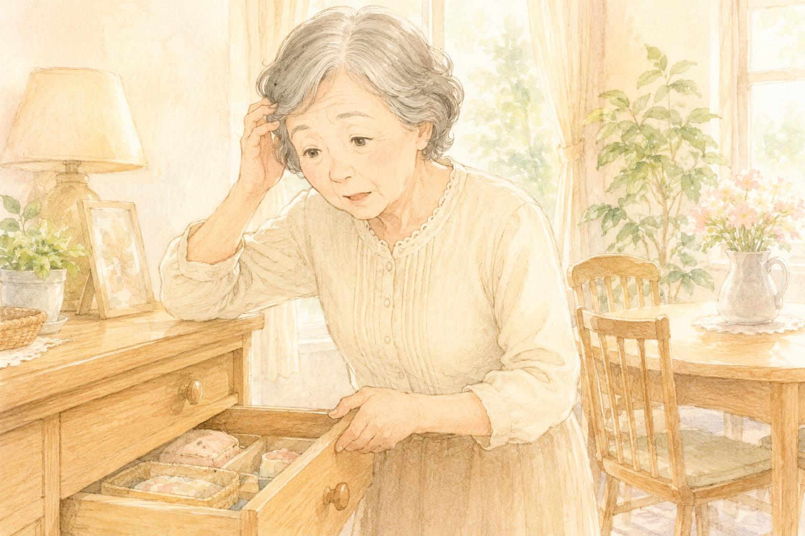
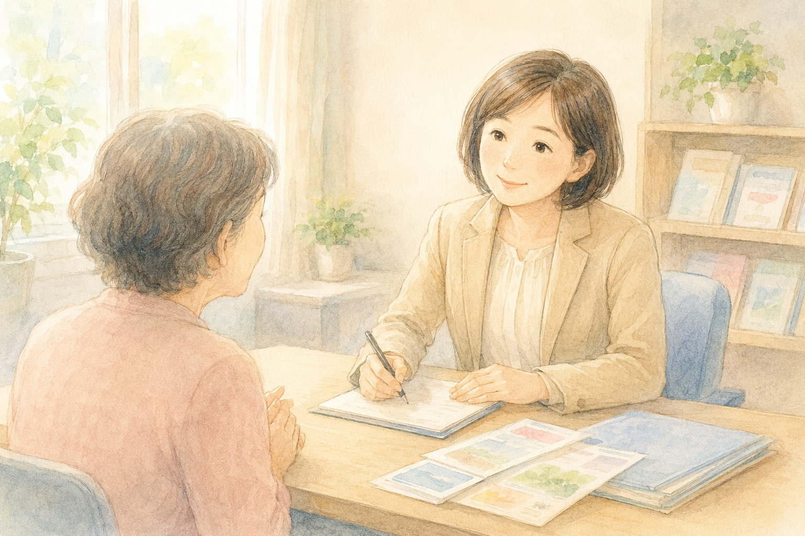
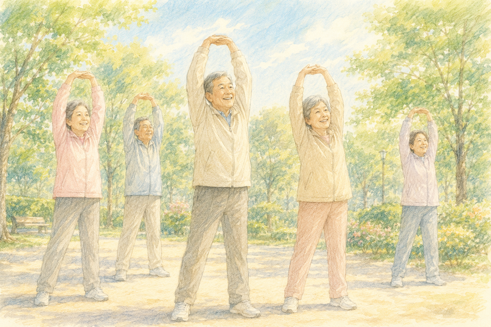

「最近、親の様子が前と違う気がする…」

「物忘れが増えてきたみたいで心配」

そんな違和感を感じていらっしゃる方へ。**介護予防でいちばん大事なのは『気づいたらすぐ相談すること』** です。

私自身、認知症の母を介護する家族のひとりでもあります。理学療法士として現場で多くのご家族を見てきましたが、「もっと早く相談していれば…」と後悔されるケースが本当に多いんです。

> **結論：違和感に気づいたら、この2つに連絡を**
>
> 1. **かかりつけ医**（または神経内科）に受診
> 2. **地域包括支援センター** に相談
>
> どちらも介護認定を受ける前から利用OKです。

---

## 私が後悔していること

うちの母は、まもなく75歳。認知症で、いまでは要介護3になりました。

最初は「ちょっと物忘れが多くなったかな」程度でした。でも、当時の私はもっと早く動けばよかったと、今になって思います。

最初に「あれ？」と思ったとき、すぐに病院や地域包括支援センターに連れて行っていれば、**もう少し違った形で過ごせていたかもしれない** のです。

認知症は **早い段階で脳にアプローチする** ことで、進行を緩やかにできる可能性があります。

---

## こんな変化に気づいたら、放っておかないで

ご家族の中で、こんなサインが出ていないかチェックしてみてください。

- 同じ話を何度も繰り返す
- 物の置き場所がわからなくなり、探し物が増えた
- 約束や予定を忘れることが増えた
- 言葉が出てこない、つじつまが合わない
- 出かける準備に時間がかかるようになった
- 服装や身だしなみに無頓着になった

さらに、**ひとりで出かけて帰り道がわからなくなる** ようなことがあれば、早急な対応が必要です。

> 💡 「歳のせいかな」で済ませず、**変化に気づいたらすぐに行動** を。これが介護予防の第一歩です。

---

## 相談先①：かかりつけ医（または神経内科）

まずは医療面から。普段から通っているお医者さまがいれば、その先生に相談してみてください。

「最近、母の物忘れが気になるんです」と伝えれば、適切な専門医を紹介してくれることが多いです。

かかりつけ医がいない場合は、ご近所の方に評判を聞いてみたり、お住まいの地域名と「**神経内科**」「**認知症外来**」などで検索してみましょう。

---

## 相談先②：地域包括支援センター

医療と並行して、ぜひ訪ねてほしいのが **地域包括支援センター** です。

各市町村に必ず設置されている、**高齢者の総合相談窓口** です。

### 何ができる場所？

- 介護に関する困りごとの相談
- 介護保険の使い方の説明
- 介護認定の申請サポート
- 介護保険を使う前の予防サービスの紹介
- 各種地域サービスの情報提供

> 🔍 お住まいの地域の地域包括支援センターは [こちら](https://www.kaigokensaku.mhlw.go.jp/) から検索できます。

### 「まだ介護認定を受けていないんですが…」でも大丈夫

これ、誤解されがちなのですが、**介護認定を受けていなくても相談できます**。

「最近、親の様子が気になって…」と話すだけでもOK。担当の方が今後の見通しや、利用できるサービスを一緒に考えてくれます。

---

## 介護認定の前から使えるサービスもあります

意外と知られていないのですが、**介護認定を受ける前の段階でも** 使えるサービスがいろいろあります。

たとえば：

- 専門家がご自宅に訪問して、認知機能や栄養面のアドバイス（短期集中型）
- 地域の住民が運営する **健康体操** や **サロン** への参加
- ひとり暮らしの方向けの、ゴミ出し・布団干し・買い物支援

地域によってサービスの内容や量に差はありますが、**「うちの地域ではどんな支援があるか」を聞いてみるだけでも価値あり** です。

---

## まとめ：早く動くことが、いちばんの介護予防

長くなりましたが、お伝えしたいことはシンプルです。

- ✅ 違和感を感じたら **すぐに行動**
- ✅ **かかりつけ医** と **地域包括支援センター** の両方に相談
- ✅ 介護認定を受ける前から使えるサービスもある

私のように後悔しないためにも、ぜひ **「気づいたらすぐ」** を合言葉にしてください。

ご家族のことを思って動くこと、それが何よりの介護予防です。
