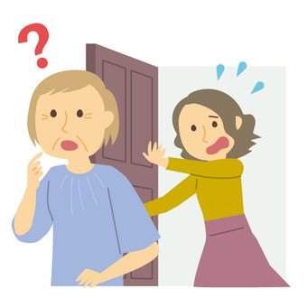
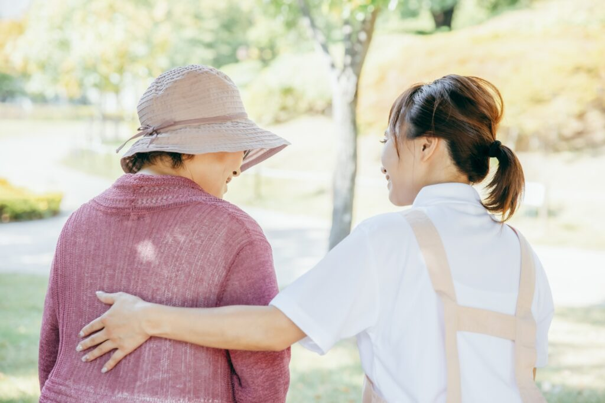
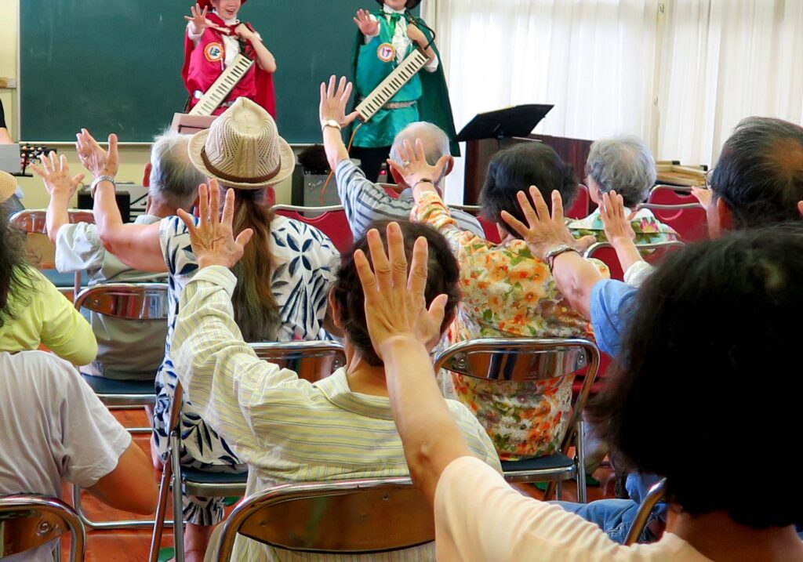

私には認知症の母がいます。もうすぐ７５歳です。

記憶ができず、物の名前などなかなか言えなくなってしまいました(ToT)

体は割と元気で歩けるから時々１人で散歩に出ていってしまいます。

今のところ家には戻って来れるのですが^^;でも２回ほど警察のお世話になりました。

実家で父と２人で暮らし、父が介護しています。父は８０歳を少し超えていますが、今のところお酒を毎晩飲むほど元気で頭も割とクリアです。

ただ最近は足が痛いようで少し引きずりながら歩いています。

心配なので最近私も実家近くに越してきました。

一緒に住むと仕事どころではなくなる気がしたので別々に住んでできる範囲でフォローしています。

母は物忘れはもちろんですが、排泄の感覚があまり無いみたいでおむつを着用するようになってしまいました(ToT)

父が声をかけて定期的にトイレへ連れて行ってはいるのですが。

またお風呂にもなかなか自分で入らなくなりました(ToT)

父には以前から介護サービスを使うように助言していたのですが、当初は結構抵抗していましたね。

特に父には母の病気を認めたくない気持ちがあったのかな。

短気な父は母が物を見つけられなかったり、お風呂に入らなかったり、出かける準備がうまくできなかったりするたびに怒鳴っていました。

まあ、ずーっと一緒にいれば怒鳴りたくなる気持ちもわからなくは無いです^^;

ただその道の仕事についている私にとってはこの怒鳴りが症状をよりひどくしてしまうと思っていたので、早く介護サービスを使ってほしかったのです！

最初は抵抗していましたが今年からようやく半日デイサービスを週２回利用するようになりました。

先月要介護３になり、今では１日デイサービスを週５回利用するようになりました。

これで父の介護負担も少し減り、母もデイサービスでの活動を楽しめているようなので少し安心です。

母は約２年前に介護認定（要支援２）されましたが、当初は物忘れも排泄もそれほどひどくなかったので介護度は要支援２でした。

それからだんだんと症状が悪化し、今では要介護３です。

私が後悔していることは、ちょっとした症状が出た段階で対処していればもっと違った状態で生活できていたのではないか、ということです。

特に認知症の場合はもっと早い段階で受診、脳トレや体操、栄養改善をしていく必要性を切に感じています。

## 相談窓口

ではどの段階で誰に相談すれば良かったのでしょうか。

結論から言うと気づいたら「すぐに」です。

お医者さんと地域包括支援センターへすぐに連れていけば良かったと反省しています。

家族や友人など周りの人達が「最近何か言ってることがおかしいな、つじつまが合わないな」「物をよくなくし、探しものが多いな」などの異変に気づいたら放置せず、すぐに（脳）**神経内科医**を受診しましょう！

かかりつけのお医者さんがいたら、その先生に相談すると近くの専門医を紹介してくれたり良いアドバイスをもらえるかもしれません。

かかりつけ医がいなければ、お医者さんに詳しいご近所さんに聞いてみたり、インターネットで「お住いの地域　神経内科　おすすめ」などのキーワードを入れて検索してみましょう。

受診と同時期にご自身がお住まいの地域包括支援センターへ行って現状を相談してみましょう。

市町村の介護保険課や高齢介護課（市町村によって呼称が微妙に違います）でも良いと思いますが、お住まいの地域の具体的な介護サービスの内容などは地域包括支援センターの方が把握されていると思います。

今はまだまだ介護が大変になってから相談する人が多いし、それが自然にも思えますが、認知症に関してはできるだけ早い段階で脳へアプローチするべきです！

いえ、認知症に限らず老化や整形外科疾患、循環器疾患などの後遺症で少しでも生活が大変になってきたら相談してみましょう。

ご自身の地域の地域包括支援センターはこちらで検索できます。[https://www.kaigokensaku.mhlw.go.jp/](https://www.kaigokensaku.mhlw.go.jp/)

日常生活はある程度自立されていて介護認定（要支援１、２　要介護１〜５）を受ける状態ではなくとも、地域包括支援センターに相談すれば、助言をもらえると思います。

介護保険以外のサービスを紹介してくれるかもしれません。

サービス利用の流れは一応こちらにリンクを貼っておきますが結構細かくて見るのが大変です。

まずはお近くの地域包括支援センターへ行ってお困りごとを相談してみましょう！[https://www.kaigokensaku.mhlw.go.jp/commentary/flow\_synthesis.html](https://www.kaigokensaku.mhlw.go.jp/commentary/flow_synthesis.html)

## 地域のサービス

うちの母は現在要介護３でデイサービスを週５回ほど利用しています。

最初は要支援２で利用していたのは半日型のデイサービスを週２回でした。

こちらはいずれも介護保険を利用（１割〜３割負担）したサービスです。

介護保険サービスには他にも訪問介護（ヘルパーさん）や訪問看護などがありますが、これらとは別に介護認定される前に利用できるサービスがあるのです。

たとえば、専門家が定期的（短期集中）に家に訪問してくれて、認知機能低下予防や栄養改善、体力向上について助言してくれたり、地域住民が主体となって運営している体操などに参加したりと。

今思えばもっと早い段階でこういうサービスを利用させれば良かったと思います。

ただし母や父は最初抵抗していたに違いありません。

「これから２人でできるだけ長く元気に過ごすため！」と説得を続けていたらどうなっていたかな、と思う今日このごろです。

これらのサービスを利用して１００％良い結果になっていたとは限りませんが、利用する価値はあったと思います。

この他にも１人暮らしで生活が大変になってきた人に対して、ゴミ出しや布団干し、調理や買い物、外出支援などのサービスもあるようです。

地域によってサービス内容に差があり、またサービスがまだまだ不足している地域が多いかもしれませんが、地域包括支援センターへ相談してみる価値はあると思います。

どのようなサービスがあるのか細かく調べたければ、以下を参考にしてみてくださいね。

こちらもじっと見てると吐き気がしてくるかもしれませんので参考程度という気持ちで😁

とにかくお困りごとをまずは相談し、地域にどんな助けがあるのか聞いてみましょう。

受けたいサービスが決まっていれば、そのように相談するのも良いと思います！

[https://www.mhlw.go.jp/file/06-Seisakujouhou-12300000-Roukenkyoku/0000192996.pdf](https://www.mhlw.go.jp/file/06-Seisakujouhou-12300000-Roukenkyoku/0000192996.pdf)

[https://www.tyojyu.or.jp/net/kaigo-seido/chiiki-shien/kaigo-yobou.html](https://www.tyojyu.or.jp/net/kaigo-seido/chiiki-shien/kaigo-yobou.html)

## まとめ

母のことを引き合いに出しながら、介護予防の窓口やサービスについて説明してきました。

ご自身やご家族が体力的、認知的な問題で少しでも日常生活に困りごとが出てきたら、まずはご担当の地域包括支援センターへ相談してみましょう！
