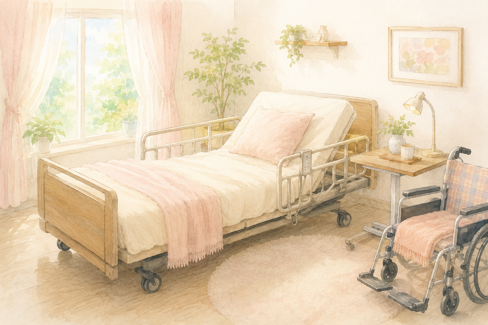

「介護保険って、どんなサービスが受けられるの？」

「自宅で介護したいけど、何が頼める？」

そんな疑問を持っている方に向けて、**介護保険で使えるサービスと、選ぶときのポイント** をわかりやすくまとめました。

理学療法士・介護支援専門員として、現場でたくさんのご家族のサービス選びをお手伝いしてきましたが、最初は「種類が多すぎてわからない」というお声が本当に多いんです。

> **結論：介護保険サービスは、大きく分けて2種類**
>
> 1. **居宅サービス**（自宅にいながら使える）
> 2. **施設サービス**（入所して暮らす）
>
> どちらも自己負担は **原則1割**（収入により2〜3割）。

---

## まずは介護保険の基本を3つだけ

### ①自己負担は原則1割

世帯の収入によって2割・3割になることもあります（3割は高所得者のみ）。残りは介護保険でまかなわれます。

### ②介護度ごとに「利用できる上限額」がある

介護度が重いほど、月々使える金額が大きくなります。要介護5なら **月およそ36万円分** までのサービスが利用可能。

### ③ケアマネさんがプランを立ててくれる

ご本人やご家族の希望を聞いて、最適なサービスの組み合わせを **ケアマネージャー** が提案してくれます。

---

## 居宅サービス：自宅にいながら使える

ご自宅で生活しながら利用できるサービスです。

### 通って使うサービス

| サービス | 内容 |
| --- | --- |
| **デイサービス** | 日帰りで施設に通い、入浴・食事・レクリエーションなど |
| **デイケア** | 上記に加えて、リハビリの専門職による機能訓練 |
| **ショートステイ** | 数日〜数週間、施設に短期間お泊り |

> 💡 デイサービスとデイケアは似ていますが、**リハビリ重視ならデイケア**。最近はデイサービスにもリハ専門職がいるところが増えています。

### 訪問してもらうサービス

| サービス | 内容 |
| --- | --- |
| **訪問介護** | ヘルパーさんが家に来て、食事・入浴・排泄などを手伝ってくれる |
| **訪問看護** | 看護師さんが医師と連携して、医療面のケアをしてくれる |
| **訪問リハビリ** | リハビリの専門職が、生活に必要な動作を一緒に練習 |
| **訪問入浴** | 介護スタッフ3〜4人と看護師が浴槽ごと持参してくれる |

訪問入浴は意外と知られていませんが、**ベッド脇でお風呂に入れる**ありがたいサービスです。寝たきりの方でも安心して入浴できます。

### 福祉用具のレンタル・購入

介護ベッド、車椅子、歩行器、手すりなどがレンタルできます。

- **住宅改修**：手すり設置、段差解消などの工事 → 上限 **20万円**
- **特定福祉用具購入**：シャワーチェア、ポータブルトイレなど（衛生上レンタル不可のもの） → 上限 **10万円**

退院前に、ケアマネさんと福祉用具屋さんに **自宅を見てもらう** のが安心です。

---

## 施設サービス：入所して暮らす

入所して生活する施設の代表が、**特養** と **老健** の2つです。

### 特養（特別養護老人ホーム）

- **位置づけ**：終の住まい
- **入所できる方**：原則 **要介護3以上**
- **特徴**：介護を受けながら長期で暮らす
- **料金**：比較的リーズナブル（月15〜20万円程度が目安、収入により減免あり）

人気が高いため、待機が出ることがあります。ただし優先度の高い方は早めに入れることもあるので、**ケアマネさんと施設に直接相談** してみてください。

### 老健（介護老人保健施設）

- **位置づけ**：自宅復帰を目指す中間施設
- **特徴**：リハビリ重視、医師も常駐
- **専門職**：理学療法士・作業療法士・言語聴覚士などが配置されている

> 💡 病気・骨折で入院した方は、まず **回復期リハビリテーション病棟** で集中的にリハビリを受けたほうが回復が早いです。老健はその後の選択肢として考えるのが基本。

### 特養と老健の違い、ひと目で

| | 特養 | 老健 |
| --- | --- | --- |
| 役割 | 終の住まい | 自宅復帰の中間 |
| 医師 | 非常勤が多い | 常勤 |
| リハビリ | 機能訓練指導員 | リハビリ専門職 |
| 料金 | 抑えめ | やや高め |

---

## サービスを選ぶときの3つのポイント

### ①ケアマネさんと希望をすり合わせる

「お風呂が大変」「日中ひとりで心配」など、**具体的なお困りごと** を伝えると、ピッタリのサービスを提案してもらえます。

### ②施設は必ず見学を

特に入所施設や通所施設は、**雰囲気・スタッフの数・1日の流れ** が施設ごとに大きく違います。

見学のとき、ぜひ確認してほしいこと：

- 医師・看護師は常駐しているか
- リハビリ専門職は何人いるか
- 1日の活動量（運動・レクリエーションの頻度）
- 食事や入浴の様子

### ③ご本人の意向を大切に

サービスは、ご家族の負担軽減 **だけ** が目的ではありません。**ご本人が活き活きと過ごせること** がいちばん大事です。

ご本人の好きなこと、苦手なこと、希望をぜひケアマネさんに伝えてください。

---

## まとめ：迷ったらまずケアマネさんに相談

長くなりましたが、ポイントはこちらです。

- ✅ サービスは大きく **「居宅」と「施設」** の2種類
- ✅ 自宅で使えるサービスは **通所・訪問・福祉用具** の3パターン
- ✅ 施設は **特養（終の住まい）** と **老健（リハビリ復帰）** が代表
- ✅ 施設選びは **必ず見学** を

介護保険料は毎月支払っているもの。**せっかくの制度ですから、必要なときには遠慮なく** 使ってください。

迷ったときは、担当のケアマネさん、または地域包括支援センターに相談してみましょう。
