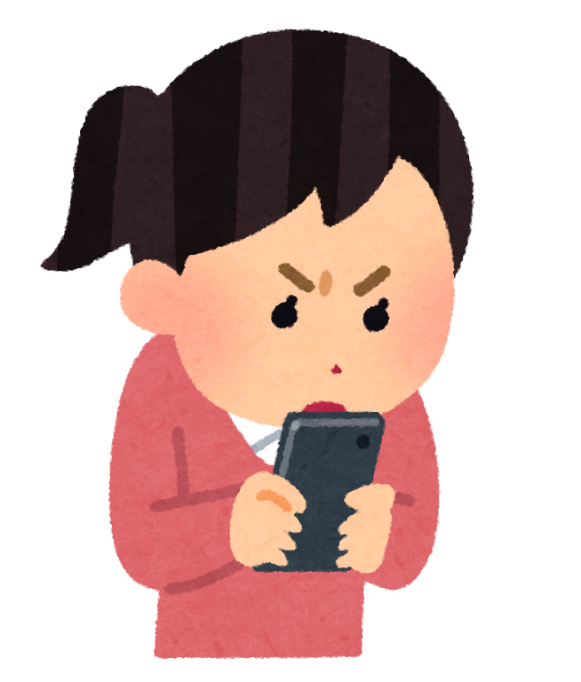
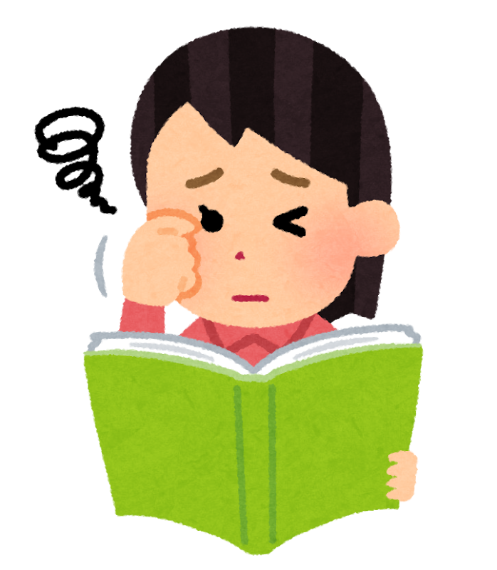
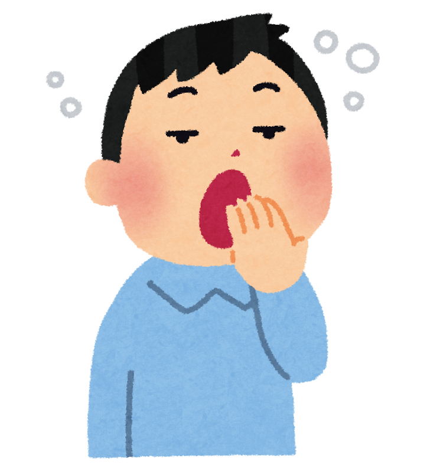
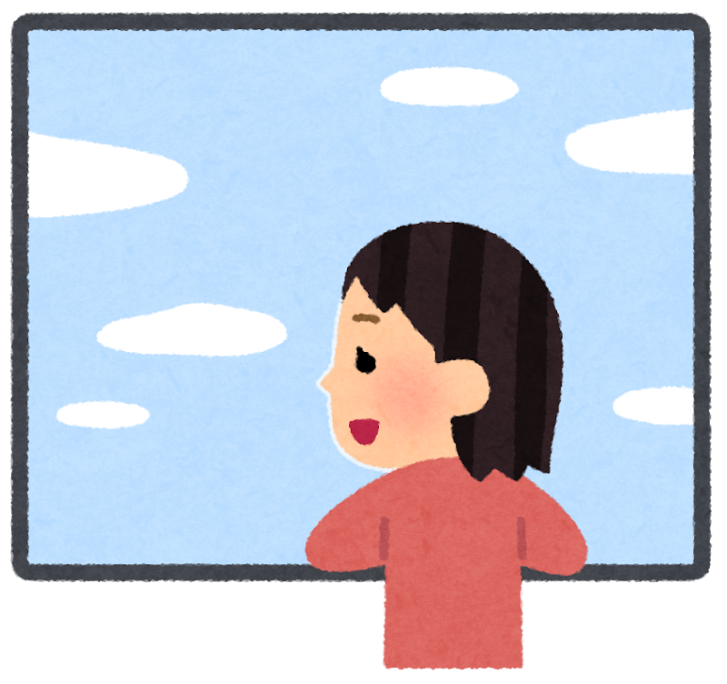

「夕方になると、目がしょぼしょぼする」「日中、なんだか眠くてだるい」——。
そんな日が増えていませんか？

じつはその不調、**スマホやパソコンを見ている時間** と、深く関わっているかもしれません。今年（2026年）、**14万人以上** の目のデータを解析した大きな調査から、目の疲れと「昼間の眠気」の意外なつながりが見えてきました。今回はその内容を、やさしく解説します。

> ✅ 1日 **8時間以上** 画面を見ている人は、全体の約3割（20〜30代は4割以上）
>
> ✅ **74.8%** の人が「日中、眠気がある」と回答
>
> ✅ 見えてきたのは **「目年齢」** という考え方。目をいたわると、昼間の調子も整いやすい

---

## 目次

1. [私たちは、こんなに画面を見ている](#私たちはこんなに画面を見ている)
2. ["目年齢"って、なんだろう？](#目年齢ってなんだろう)
3. [目の疲れと「昼間の眠気」は、つながっていた](#目の疲れと昼間の眠気はつながっていた)
4. [理学療法士として、現場で感じること](#理学療法士として現場で感じること)
5. [今日からできる、目の休め方](#今日からできる目の休め方)
6. [おわりに](#おわりに)

---

## 私たちは、こんなに画面を見ている


最近、スマホを見る時間が増えた気がします。目にも良くなさそうで……。



気になりますよね。調査でも、**1日8時間以上** 画面を見ている人が、全体の約3割もいたんですよ。


ロート製薬が、大阪・関西万博の「大阪ヘルスケアパビリオン」で **14万人以上（143,086件）** の目の健康データを集めて解析した調査（2025年4〜10月実施）によると——

- **1日8時間以上** デジタル機器を見ている人は、全体の約3割
- **20〜30代** では、4割以上にのぼる

スマホ、パソコン、テレビ……。気づけば一日の多くを画面とともに過ごしている——。そんな時代の姿が、数字にもはっきり表れています。シニア世代でも、スマホで連絡を取ったり動画を見たりする方が、年々増えていますね。

---

## "目年齢"って、なんだろう？

この調査でユニークなのが、**「目年齢（めねんれい）」** という考え方です。これは、目のコンディションから割り出した“目の若さ”のこと。実際の年齢とは別に、目がどれくらい元気かを表します。

調査では、参加した人の——

- **目年齢の平均は 43.8歳**
- **実年齢の平均は 45.5歳**

でした。そして興味深いことに、**40〜60代では、画面を見る時間が短い人ほど目年齢は実年齢より若く、長い人ほど目年齢が上がっていく** 傾向が見られたそうです。


見る時間が長いと、目が“年をとる”みたいな感じなんですね。



そうなんです。逆に言えば、**目を休ませる工夫しだいで、目年齢は若く保ちやすい** ということ。ここが希望の持てるところですね。


---

## 目の疲れと「昼間の眠気」は、つながっていた

今回いちばんお伝えしたいのが、**目の疲れと「昼間の眠気」の関係** です。

調査では、**74.8%** もの人が「日中、眠気がある」と答えました。そして、**目のコンディションが良くない層ほど、昼間の眠気を感じやすく、画面を見る時間も長い** という傾向が見えてきたのです。

さらにこんな結果もありました。

- モニターを見ていると症状が悪化すると感じる人：**6割以上**
- 目の乾きを自覚している人：約6割
- 疲れ目のスコアが高いのに、**自分では気づいていない人（かくれ疲れ目）**：疲れ目の人の約25%

つまり、**目の疲れは、気づかないうちにたまり、昼間のだるさや眠気にもつながっている** かもしれない、ということです。「なんだか日中ぼんやりする」の裏に、目の疲れがかくれているケースもあるのですね。

---

## 理学療法士として、現場で感じること

リハビリの現場でも、「夜はしっかり寝ているのに、昼間眠くてね」という声をよく聞きます。原因は人それぞれですが、お話をうかがうと **「一日中スマホを見ている」** という方も少なくありません。

体の疲れと同じで、**目も“使いっぱなし”では疲れがたまります**。こまめに休ませてあげるだけで、「なんとなくの不調」が軽くなる方を、現場でも見かけます。目を休めることは、体全体を休めることにもつながっているのだと感じます。

---

## 今日からできる、目の休め方

特別な道具はいりません。今日からできる、やさしい目の休め方をまとめます。

- ✅ **「20・20・20」を意識する**：20分見たら、20秒間、20フィート（約6メートル）先の遠くをぼんやり眺める
- ✅ **意識してまばたきをする**：画面に集中すると、まばたきが減って目が乾きます
- ✅ **寝る1〜2時間前は、スマホを控えめに**：目の休息にも、寝つきにも役立ちます
- ✅ **画面の明るさを、部屋に合わせて少し落とす**
- ✅ **温かいタオルで目もとを温める**：一日の終わりの、心地よいひと休みに
- ✅ 目の乾きや痛みが続くときは、**眼科に相談する**

小さな習慣ですが、続けるうちに「夕方の目のつらさ」や「昼間のぼんやり」が、少し軽くなるかもしれません。

---

## おわりに

スマホやパソコンは、今や暮らしに欠かせない相棒です。手放す必要はありません。大切なのは、**上手に休憩をはさみながら、長くつき合っていくこと**。

「目年齢」は、いたわり方しだいで若く保てます。そしてそれは、昼間の眠気やだるさをやわらげ、一日を気持ちよく過ごすことにもつながっていきます。

今日はまず、この記事を読み終えたら——スマホをそっと置いて、少しだけ窓の外の遠くを眺めてみませんか。それが、目への小さなプレゼントになります。

> 昼間の眠気については、睡眠の記事もあわせてどうぞ。
> 👉 [夜中に目が覚めるのは、私だけ？ 〜年代で変わる睡眠の悩みと、今夜からできる工夫〜](/posts/sleep-troubles-by-age-2026/)

---

### 参考にした情報

- ロート製薬 **「大阪・関西万博 大阪ヘルスケアパビリオンで得られた14万人の目の健康データ解析」**（2025年4月13日〜10月13日実施、143,086件のデータを解析）

※ 本記事は、上記の調査結果をもとに、一般読者向けにわかりやすくまとめ直したものです。目年齢や眠気の感じ方には個人差があります。目の不調や強い眠気が続く場合は、眼科・かかりつけ医にご相談ください。

