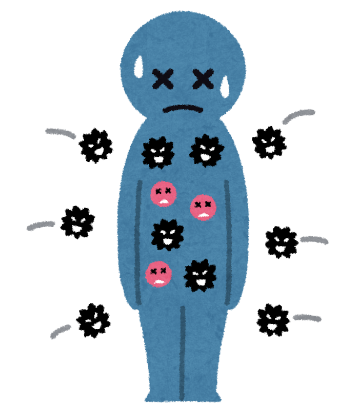
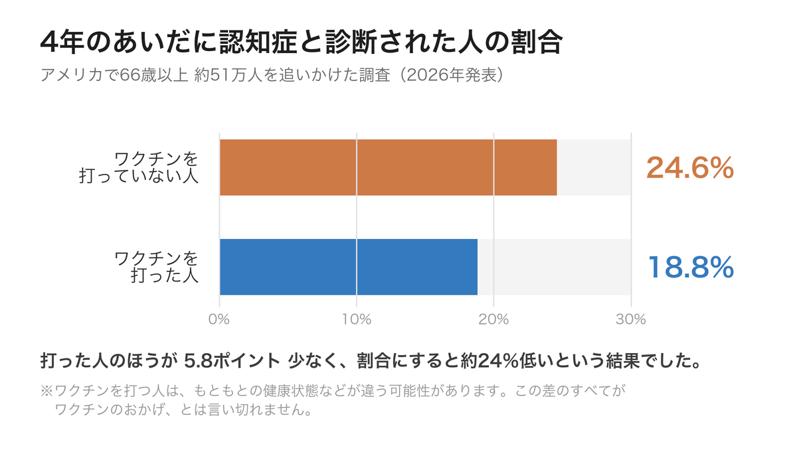

「帯状疱疹のワクチン、打ったほうがいいのかしら」  
「役所から案内が届いたけれど、どうしよう」

そんなふうに迷っておられる方が、まわりにいらっしゃるかもしれません。

いま、この帯状疱疹のワクチンについて、「**打った人は、認知症になる人が少なかった**」という研究が、世界のあちこちから報告されています。

ただ、はじめにお伝えしておきたいことがあります。この記事は、**ワクチンを勧めるためのものではありません**。どんな研究が出ているのかを正確にお伝えして、**かかりつけの先生と相談するときの材料にしていただく**ためのものです。

> ✅ アメリカで**66歳以上 約51万人**を4年間追いかけた調査で、ワクチンを打った人の認知症の割合は **18.8%**、打っていない人は **24.6%** でした
>
> ✅ イギリス・ウェールズの**28万人**の調査でも、同じ方向の結果（認知症の診断が約20%少ない）が報告されています
>
> ✅ ただし、いずれも「打ったから減った」と証明したものではありません。打つかどうかは、持病やお薬とあわせて、**かかりつけの医師とご相談ください**

---

## 目次

1. [帯状疱疹って、どんな病気？](#帯状疱疹ってどんな病気)
2. [51万人の調査でわかったこと](#51万人の調査でわかったこと)
3. [もうひとつの手がかり「自然の実験」](#もうひとつの手がかり自然の実験)
4. [なぜ、ウイルスと認知症がつながるの？](#なぜウイルスと認知症がつながるの)
5. [ここは、慎重に見てください](#ここは慎重に見てください)
6. [日本では、いまどうなっている？](#日本ではいまどうなっている)
7. [現場で感じていること](#現場で感じていること)
8. [いま私たちにできること](#いま私たちにできること)
9. [おわりに](#おわりに)

---

## 帯状疱疹って、どんな病気？

子どものころにかかった**水ぼうそう**。あのウイルスは、治ったあとも体からいなくなるわけではありません。**神経のそばに、じっと隠れて眠っています**。

そして、年齢を重ねたり、疲れや病気で体の守る力（免疫）が弱まったりすると、眠っていたウイルスが**目を覚まします**。神経に沿って皮膚に出てくるのが、**帯状疱疹**です。

体の左右どちらかに、帯のように痛みと発疹が出るのが特徴で、**ピリピリ、ズキズキとした強い痛み**をともないます。


発疹が治れば、それで終わりなのでしょうか。



それが、そうとも限らないんです。発疹が治ったあとも痛みだけが長く残ることがあって、これを**帯状疱疹後神経痛**と呼びます。数か月から、ときには年単位で続く方もいらっしゃいます。**帯状疱疹がやっかいなのは、この痛みの後遺症**なんですね。


---

## 51万人の調査でわかったこと

ここからが本題です。近年、この帯状疱疹のワクチンと、**認知症**との関係を調べた研究が、次々と発表されています。

2026年6月、アメリカのブラウン大学の研究チームが、医学誌『Annals of Internal Medicine』に大きな調査結果を発表しました。

- 対象は、アメリカの医療施設にいた **66歳以上の50万9926人**
- **4年間**、認知症になるかどうかを追いかけた
- 使われたのは、いま日本でも使える**組換えワクチン（シングリックス）**

その結果が、こちらです。

打っていない人の **24.6%** に対して、打った人は **18.8%**。差は5.8ポイント、割合にすると**約24%低い**という結果でした。研究チームは「およそ17人に1人の認知症を防げる可能性がある」と述べています。

---

## もうひとつの手がかり「自然の実験」

「たまたまそうなっただけでは？」と思われるかもしれません。実は、それを確かめるのにとてもよくできた研究が、2025年に科学誌『Nature』に発表されています。

舞台はイギリスの**ウェールズ**。ここでは以前、「**1933年9月2日以降に生まれた人はワクチンを打てるが、それより前に生まれた人は一生打てない**」という、誕生日で区切る制度がありました。


たった数日の差で、打てる人と打てない人に分かれてしまったのですね。



そうなんです。そして研究者たちは、そこに目をつけました。**生まれた日が1週間違うだけの人たちは、体質も暮らしぶりも、ほとんど同じはず**。それなのに、ワクチンを打てたかどうかだけが違う。これなら「くじ引きで分けた実験」に近い形で比べられる、というわけです。


**28万2541人**を7年間追いかけた結果、ワクチンを打てた側では、**認知症と診断された人が3.5ポイント少なく、割合にすると約20%低い**という結果でした。とくに**女性で、この傾向がはっきり**していました。

こちらは古いタイプの**生ワクチン**を使った研究です。種類の違うワクチンで、別々の国で、同じ方向の結果が出た——ここが、研究者たちが注目している理由です。

---

## なぜ、ウイルスと認知症がつながるの？

しくみは、まだはっきりとはわかっていません。ただ、いくつかの考え方があります。

- **ウイルスが神経を傷つける**……目を覚ましたウイルスは神経に炎症を起こします。それが脳にも影響するのではないか、という考え方です
- **血管が傷む**……帯状疱疹のあと、脳卒中や心筋梗塞が増えるという報告があります。血管の傷みは、認知症とも関わりの深いものです
- **ワクチンが免疫全体を整える**……ウイルスを抑えるだけでなく、体の守るしくみそのものによい影響があるのではないか、という見方もあります

> 血管の状態が脳を守るという話は、こちらの記事でもお話ししています。  
> 👉 [認知症を防ぐ「血管と代謝」の整え方](/posts/dementia-14-factors-body/)

---

## ここは、慎重に見てください

大事なところなので、はっきり書いておきます。**これらの研究は、「ワクチンを打てば認知症を防げる」と証明したものではありません。**

- **打つ人と打たない人は、もともと違う**……ワクチンを打つ方は、健康に気を配っている方が多い傾向があります。研究チームはその影響を計算で取り除こうとしていますが、**完全には取り除けません**
- **研究チーム自身が慎重**……ブラウン大学のチームも「ワクチンが理由だと確実には言えない」と明言し、今後さらに検証が必要だとしています
- **認知症を防ぐための薬ではありません**……帯状疱疹ワクチンは、あくまで**帯状疱疹を防ぐためのもの**です


では、この研究はあまり意味がないということでしょうか。



いいえ、そうではありません。**別々の国で、種類の違うワクチンで、同じ方向の結果が出ている**というのは、それだけで注目に値します。ただ、**「だから打つべきだ」と一足飛びに結論を出すのは早い**、ということなんです。もともと帯状疱疹そのものを防ぐ効果は、はっきりしているのですから、そこに「こんな研究もある」と一つ知識を足しておく——そのくらいの受け止め方が、ちょうどよいと思います。


---

## 日本では、いまどうなっている？

日本では、**2025年度（令和7年度）から、帯状疱疹ワクチンが定期接種になりました**。

対象になるのは、次の方です。

- その年度に **65歳**になる方
- **60〜64歳**で、HIVによる免疫の機能の障害があり、日常生活がほとんど不可能な方
- **【経過措置】2025年度から2029年度までの5年間**は、その年度に **70歳・75歳・80歳・85歳・90歳・95歳・100歳**になる方も対象

つまり「65歳の人だけ」ではなく、**5歳きざみで、5年かけて広く行き渡らせる**しくみになっています。

ワクチンは2種類あり、**生ワクチンは1回**、**組換えワクチンは2か月以上あけて2回**接種します。**費用は自治体によって違います**ので、お住まいの市区町村からの案内をご確認ください。

なお、**定期接種として受けられるのは、対象になる年度の1年間だけ**です。案内が届いたら、まずは目を通してみてください。

---

## 現場で感じていること

理学療法士として現場に立っていると、**帯状疱疹後神経痛**に悩んでおられる方に出会うことがあります。

発疹はとうに治っているのに、服がふれるだけで痛む、夜も眠れない——そうして、体を動かすことそのものが減っていってしまう。**痛みが、その方の生活を小さくしてしまう**のを見るのは、つらいものです。

認知症との関係が話題になっていますが、私はまず、**この痛みの後遺症を防げること自体が、大きな意味を持つ**と感じています。

---

## いま私たちにできること

- ✅ **案内が届いたら、目を通す**：対象の年度は1年だけです。まずは知ることから
- ✅ **かかりつけの医師に相談する**：持病やお薬、これまでの経過によって、判断は一人ひとり違います。**この記事ではなく、先生の判断が優先です**
- ✅ **費用と回数を確認する**：自治体で異なります。2回接種のワクチンは、間隔もあわせて確認を
- ✅ **早めに受診する**：もし帯状疱疹が出たら、**発疹が出てから早いほど、薬がよく効きます**。「たかが湿疹」と様子を見ないでください
- ✅ **体の守る力を落とさない**：睡眠、栄養、適度な運動。ウイルスが目を覚ますきっかけは、疲れや体調の崩れです

### 📚 あわせて読みたい一冊

{{< affiliate
    title="最高の体調"
    image="https://thumbnail.image.rakuten.co.jp/@0_mall/bookfan/cabinet/00814/bk4295402125.jpg?_ex=400x400"
    amazon="https://af.moshimo.com/af/c/click?a_id=5534074&p_id=170&pc_id=185&pl_id=4062&url=https%3A%2F%2Fwww.amazon.co.jp%2Fdp%2F4295402125"
    rakuten="https://af.moshimo.com/af/c/click?a_id=5533903&p_id=54&pc_id=54&pl_id=27059&url=https%3A%2F%2Fitem.rakuten.co.jp%2Fbookfan%2Fbk-4295402125%2F"
    description="睡眠・食事・運動・炎症といった観点から、体の守る力をどう整えるかをやさしく整理した一冊。ウイルスに負けない土台づくりの参考になります。" >}}



---

## おわりに

ワクチンの話は、どうしても「打つべきか、打たざるべきか」という話になりがちです。でも、そこを決めるのは、この記事ではありません。**あなたと、あなたのかかりつけの先生です。**

私にできるのは、**いまどんな研究が出ているのかを、できるだけ正確にお伝えすること**だと思っています。

51万人の調査と、28万人の「自然の実験」。どちらも、同じ方向を指していました。それでもなお、研究者たちは「まだ確実とは言えない」と慎重です。その慎重さも含めて、お伝えしたいと思いました。

案内の封筒が届いたら、そのまま引き出しにしまわず、ひとこと先生に聞いてみてください。  
「これ、私は打ったほうがいいでしょうか」——それだけで、じゅうぶんです。

---

### 参考にした情報

- Hayes, K. ら（ブラウン大学公衆衛生大学院ほか）『Annals of Internal Medicine』2026年6月発表。米国の66歳以上 509,926人を対象に、組換え帯状疱疹ワクチン（RZV）接種者と非接種者の4年間の認知症発症を比較（Target trial emulation という手法）。接種者18.8%、非接種者24.6%
- Eyting, M. ら『Nature』2025年（doi:10.1038/s41586-025-08800-x）。ウェールズの「1933年9月2日生まれ」という接種資格の境界を利用した自然実験（回帰不連続デザイン）。282,541人・7年で、認知症の新規診断が3.5パーセントポイント（相対約20%）少なかった。対象は生ワクチン（Zostavax）
- 厚生労働省「帯状疱疹ワクチン」（定期接種の対象者・経過措置・ワクチンの種類と接種回数・副反応について）
- ※上記の研究はいずれも観察研究であり、ワクチンと認知症の因果関係を証明したものではありません
- ※接種の可否は、持病・服薬・体調によって異なります。**必ずかかりつけの医師にご相談ください。** この記事は一般的な情報提供であり、個別の診断・治療に代わるものではありません
