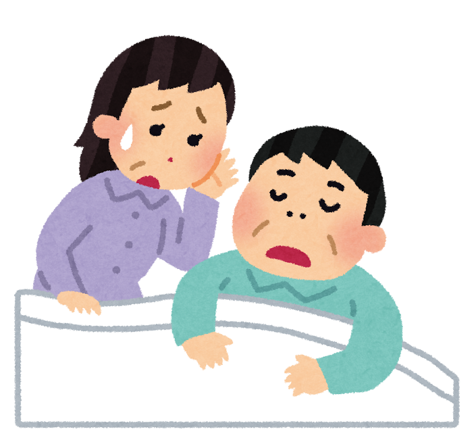
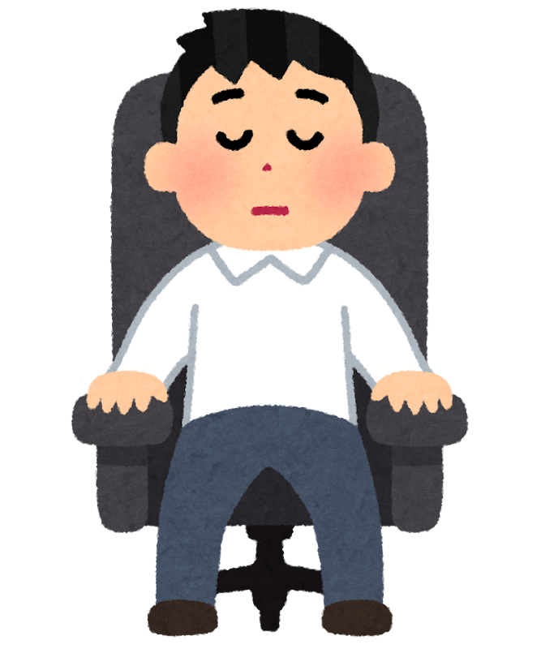
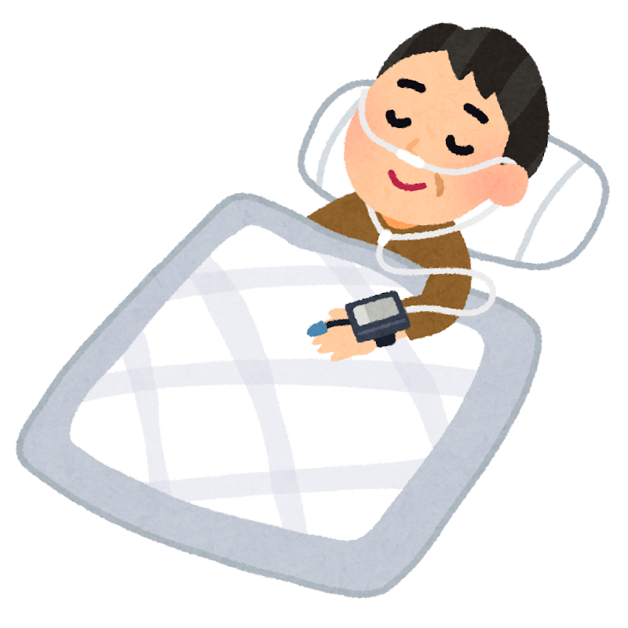
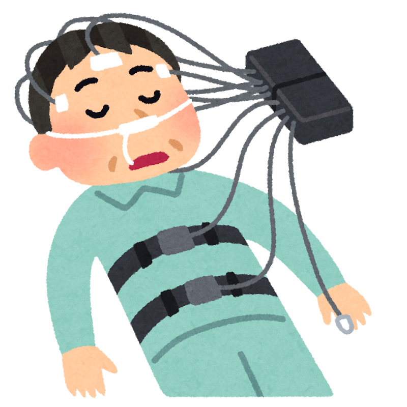
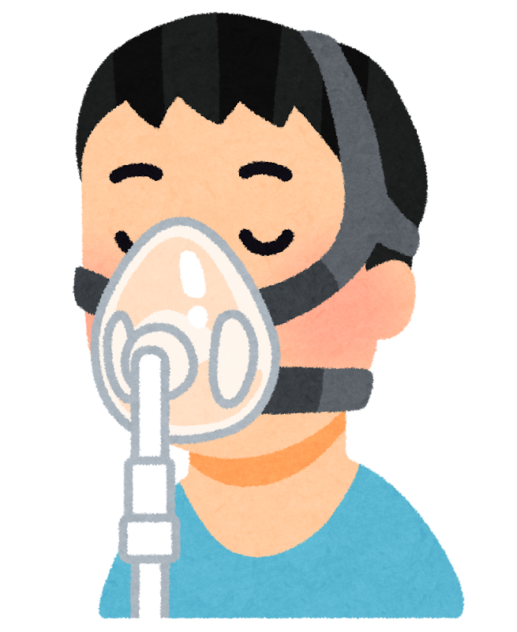
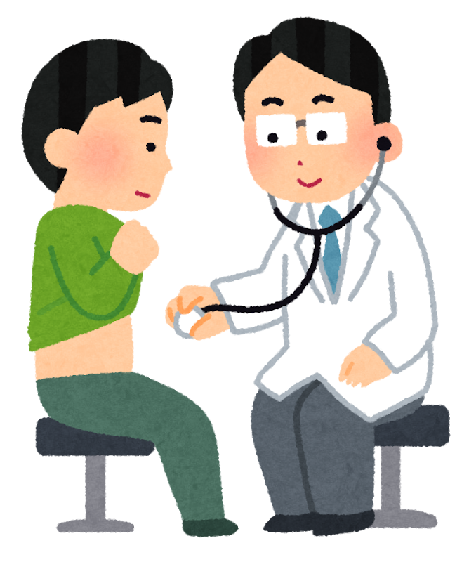

「お父さん、夜中に息が止まってるよ」

ご家族にそう言われたことはありませんか。あるいは、ご自分が言った側かもしれません。

多くの場合、この話は笑い話で終わります。「うるさくてかなわん」「疲れてるんだろう」。そう言って、それきりになる。

けれど2026年に発表された調査は、そこにひとつ、重い数字を置いていきました。**65歳以上の777人を10年間追いかけた**研究です。

> ✅ 眠っているあいだに呼吸が止まる「睡眠時無呼吸」の方を10年追ったところ、**治療を受けていなかった人たちのほうが、考える力の衰え方が速い**という結果でした
>
> ✅ ただしこれは**観察した研究**です。「治療すれば防げる」と証明したものではありません。もともとの条件にも差がありました
>
> ✅ それでも、**検査は一晩で受けられます**。日本では中等症以上の方が**成人男性の約4人に1人**。まず調べてみる価値のある数字だと思います

> 眠っているあいだに脳で何が起きているかは、こちらに書いています。
> 👉 [ぐっすり眠ると、脳が掃除される](/posts/brain-sleep-glymphatic/)

---

## 目次

1. [そもそも「睡眠時無呼吸」とは](#そもそも睡眠時無呼吸とは)
2. [777人を、10年追いかけた](#777人を10年追いかけた)
3. [「69%速い」とは、どういう意味か](#69速いとはどういう意味か)
4. [正直に書いておきたい、この研究の限界](#正直に書いておきたいこの研究の限界)
5. [もうひとつの研究は、少し違う景色を見せた](#もうひとつの研究は少し違う景色を見せた)
6. [日本では、どのくらいの方にあるのか](#日本ではどのくらいの方にあるのか)
7. [検査と治療は、どう進むのか](#検査と治療はどう進むのか)
8. [現場で見てきたこと](#現場で見てきたこと)
9. [いま、私たちにできること](#いま私たちにできること)
10. [おわりに](#おわりに)
11. [参考にした情報](#参考にした情報)

---

## そもそも「睡眠時無呼吸」とは

眠っているあいだに、**のどの奥がふさがって呼吸が止まってしまう**状態です。正しくは「閉塞性睡眠時無呼吸」といいます。

止まるといっても、そのまま息が止まりっぱなしになるわけではありません。**体が苦しくなって、いったん目を覚ましかけて、また息を吸う。** これを一晩に何十回、多い方では何百回もくり返します。

問題は2つあります。

- **血液の酸素が下がる**……息が止まっているあいだ、体じゅうの酸素が薄くなります。脳も例外ではありません
- **深く眠れない**……目を覚ましかけるたびに、眠りが浅いところへ引き戻されます。**本人はまったく覚えていません**

ご本人に自覚がないのが、この病気のいちばんやっかいなところです。**気づくのは、たいてい隣で寝ている方**です。


毎晩ぐっすり眠っているつもりなんですが……。




そこなんです。**眠っている本人には、まず分かりません。**

手がかりになるのは、**朝の状態**です。起きたときに頭が重い、口がからからに乾いている、しっかり寝たのに昼間に眠くなる。こういうことが続くようなら、一度調べてみる価値があります。


---

## 777人を、10年追いかけた

2026年7月、アルツハイマー病協会が出している学術誌に、フロリダ大学のグループの調査が載りました。

- 対象は、**睡眠時無呼吸のある65歳以上の777人**
- アメリカで高齢者の健康と老いの変化を追い続けている全国調査（NHATS）に、公的医療保険の記録を突き合わせたもの
- **2011年から2021年まで、毎年、考える力を測り続けた**

777人は、2つに分かれます。

| | 人数 |
|---|---|
| **CPAP治療を受けていた**方 | 354人（46%） |
| **受けていなかった**方 | 423人（54%） |

CPAPというのは、鼻や口にマスクを当てて、**空気を送り込み、のどがふさがらないようにする装置**です。いまのところ、この病気のいちばん確実な治療法とされています。

結果はこうでした。**どちらのグループも、10年のあいだに考える力は少しずつ落ちていきました。** これは年齢を重ねれば自然なことです。

**違ったのは、落ちる速さでした。**

---

## 「69%速い」とは、どういう意味か

ここは大事なところなので、ていねいに書きます。

研究チームが使ったのは、**いくつかの検査をまとめた**「考える力の総合点」です。**10個の単語を聞いて、すぐに思い出せるだけ言う**。しばらくしてから、**もう一度思い出す**。今日が何月何日か答える。大統領の名前を答える。こうしたものを合わせた点数です。

1年あたりの下がり方は、こうなりました。

| | 1年あたりの下がり方 |
|---|---|
| CPAP治療を受けていた方 | **0.03** |
| 受けていなかった方 | **0.05** |

この0.05と0.03を比べると、**約1.7倍**。報道で「**69%速い**」と紹介されたのは、この比のことです。


0.03と0.05……。正直、大きいのか小さいのかピンときません。




そう感じられて当然だと思います。これは**点数そのものではなく、ばらつきを目盛りにした数字**なので、直感的には分かりにくいんです。

ですから私は、**倍率のほうで受け取っています**。「10年たったとき、片方はもう片方の1.7倍ほど進んでいた」。それくらいの受け取り方が、ちょうどよいと思います。

そしてもうひとつ。**この差は、統計のうえではぎりぎりの差**でした。そこも隠さずお伝えしておきます。


---

## 正直に書いておきたい、この研究の限界

この研究の数字を、そのまま「治療すれば1.7倍守れる」と読んではいけません。理由を3つ書きます。

**ひとつめ。これは観察した研究です。**

くじ引きで「あなたはCPAP、あなたはなし」と割り振ったわけではありません。**CPAPを使うかどうかは、ご本人と主治医が決めています。**

**ふたつめ。もともと、2つのグループには差がありました。**

CPAPを使っていた方たちは、使っていなかった方たちに比べて、

- **年齢が若く**
- **学歴が高く**
- 結婚している方が多く
- **調査を始めた時点で、すでに考える力の点数が高かった**

のです。**治療のおかげで差がついたのか、もともと差があったのか。この研究だけでは分けられません。**

**みっつめ。CPAPを実際にどれだけ使っていたかは分かりません。**

記録に「CPAPの請求が1回でもあるか」で分けているだけなので、**毎晩きちんと使っていた方も、すぐにやめてしまった方も、同じ「治療あり」の群に入っています**。


では、あまりあてにならない研究なんでしょうか。




いいえ、そうは思いません。**10年間、毎年測り続けた記録**というのは、そう簡単に手に入るものではありません。値打ちのある研究です。

この研究から言えるのは、ここまでです。

**言えること**……CPAPを使っていた方たちのほうが、使っていなかった方たちより、考える力の落ち方がゆるやかだった。

**言えないこと**……CPAPを使えば、考える力の衰えを防げる。

ここを混ぜてしまうと、話が大きくなりすぎます。ですから私は、**「無呼吸を放っておかないほうがよさそうだ」という理由がひとつ増えた**、という受け取り方をしています。

治療で防げると約束はできません。それでも、**一度調べておく理由としては十分**だと思います。


---

## もうひとつの研究は、少し違う景色を見せた

同じ2026年、オーストラリアのモナッシュ大学から、別の報告も出ています。

- **40〜70歳の2,795人**（平均56歳）
- 全員、考える力に問題のない方たち
- そのうち、睡眠時無呼吸があると**自分で答えた方は195人（7%）**

こちらでも、無呼吸のある方の記憶の点数は低めでした。

ただ、無呼吸のある方には、**高血圧や糖尿病、肥満をあわせ持っている方が多い**という事情があります。そこで研究チームは、**その影響を差し引いて計算し直しました。**

たとえば、無呼吸のある人とない人を比べるとき、両方のグループに高血圧の人が同じ割合でいたとしたら点数はどうなるか。そういう調整をするわけです。

すると、**記憶の差は、はっきりそうとは言えない大きさになりました。**

つまり、点数を下げていたのは「無呼吸そのもの」なのか、それとも「無呼吸の方に多い高血圧や肥満」なのか。**この研究では切り分けきれなかった**ということです。

こちらは**ある一時点で測った研究**なので、時間の前後は追えません。「治療した人は元に戻った」といった読み方はできない研究です。

**2つの研究を並べると、こうなります。**

- 呼吸が止まることと、考える力の衰えには、**関係がありそうだ**
- ただし、**その関係の中身はまだはっきりしていない**

慎重に見ておくのが、いまのところ正しい姿勢だと思います。

---

## 日本では、どのくらいの方にあるのか

ここからは、日本の話です。

日本呼吸器学会などの診療ガイドラインでまとめられた大規模な調査によると、**治療を考えたほうがよい中等症以上**（1時間に15回以上、呼吸が止まったり浅くなったりする状態）の方は、

| | 割合 |
|---|---|
| **成人男性** | **23.6%** |
| 閉経前の女性 | 1.5% |
| **閉経後の女性** | **9.6%** |

**成人男性のおよそ4人に1人**です。これは、私が初めて見たときにいちばん驚いた数字でした。

そして女性の欄を見てください。**閉経の前後で、1.5%から9.6%へと大きく増えます。** 「いびきは男の人のもの」というのは、思い込みだということですね。


太っていなければ大丈夫、ではないんですか？




それも、よくある思い込みのひとつです。**日本人はもともとあごが小さめの方が多く、太っていなくても、のどの奥が狭くなりやすい**といわれています。

やせている方、女性、お酒を飲まない方。**「自分は違う」と思っている方ほど、見逃されやすい**というのが実際のところです。


---

## 検査と治療は、どう進むのか

「調べたほうがいい」と言われても、何をするのか分からないと足が向きません。順番を書いておきます。

### ① まずは、自宅でできる簡易検査

指と鼻に小さなセンサーをつけて、**いつものお布団で一晩眠るだけ**です。機械を借りて帰り、翌日返します。入院の必要はありません。

### ② 必要なら、一泊入院してくわしく調べる

簡易検査でははっきりしない場合、**終夜睡眠ポリグラフ検査**という、脳波まで測るくわしい検査をします。こちらは基本的に一泊入院です。

### ③ 診断がついたら、治療へ

中等症以上ならCPAP、軽い場合は**マウスピース**や**横向きで寝る工夫**などが選ばれます。

なお、**2026年6月から、CPAPを保険で使える条件が少し広がりました。**

| | これまで | 2026年6月から |
|---|---|---|
| CPAPの対象 | 1時間に**20回**以上 | 1時間に**15回**以上 |
| くわしい検査なしで始められる目安 | **40回**以上 | **30回**以上 |

**以前に「あなたは対象になりません」と言われた方でも、いまは対象になっている可能性があります。** 気になる方は、もう一度相談してみてください。

### 🛏 横向きで寝るための道具について

あお向けは、のどがふさがりやすい姿勢です。実際、体の向きを変えるだけでいびきが軽くなる方もいらっしゃいます。

ただ、**眠っているあいだの姿勢は、自分では選べません。** 寝入りばなに横を向いても、朝にはあお向けに戻っている。これがいちばんよくある話です。

背中側にふくらみのある枕やクッションは、その「戻ってしまう」をゆるやかに防ぐための道具です。

{{< affiliate
    title="横向き寝をたすける枕・クッション"
    amazon="https://af.moshimo.com/af/c/click?a_id=5534074&p_id=170&pc_id=185&pl_id=4062&url=https%3A%2F%2Fwww.amazon.co.jp%2Fs%3Fk%3D%25E6%25A8%25AA%25E5%2590%2591%25E3%2581%258D%25E5%25AF%259D%2520%25E6%259E%2595"
    rakuten="https://af.moshimo.com/af/c/click?a_id=5533903&p_id=54&pc_id=54&pl_id=27059&url=https%3A%2F%2Fsearch.rakuten.co.jp%2Fsearch%2Fmall%2F%25E6%25A8%25AA%25E5%2590%2591%25E3%2581%258D%25E5%25AF%259D%2520%25E6%259E%2595%2F"
    description="横向きの姿勢を保ちやすくするための枕です。高さが合わないと肩が痛くなるので、高さを調整できるタイプが無難です。※これは治療の道具ではありません。呼吸が止まっている方にとって、検査や治療の代わりにはなりませんので、そこは医療機関にご相談ください。" >}}

---

## 現場で見てきたこと

リハビリの現場にいると、**日中うとうとしてしまう方**によくお会いします。

車いすで座っていると、5分もしないうちに首が落ちる。声をかけると起きるけれど、また落ちる。

こういうとき、「年のせい」「薬のせい」で片づけられてしまうことが、少なくありません。私自身、そう思い込んでいた時期がありました。

でも、**夜にきちんと眠れているかを疑ってみると、話が変わることがあります。** 夜に何度も呼吸が止まっていれば、昼間に眠くなるのは当たり前です。

そしてもうひとつ。**CPAPを持っているのに、使っていない方**にも、何人もお会いしました。「顔にマスクをつけて寝るのは、どうも慣れない」と言われます。

その気持ちは、よく分かります。ただ、マスクの形は何種類もあって、**合わないときは変えられます**。合わないまま我慢して、そのうちやめてしまうのは、いちばんもったいない道だと思います。

---

## いま、私たちにできること

- ☑ **ご家族に聞いてみる**……「私、寝ているとき息が止まってる？」。いちばん確かな情報源は、隣で寝ている方です
- ☑ **朝の状態を思い返す**……起きたときの頭の重さ、口の乾き、日中の強い眠気。これが続くなら受診の目安です
- ☑ **まずはかかりつけ医に**……いきなり専門の病院でなくて大丈夫です。呼吸器内科・耳鼻咽喉科・睡眠外来につないでもらえます
- ☑ **検査は一晩で終わります**……自宅で眠るだけの検査から始められます
- ☑ **すでにCPAPをお持ちの方へ**……使えていますか。合わないときは、マスクの形も設定も変えられます。**やめてしまう前に、一度相談を**
- ☑ **横向きで寝てみる**……あお向けはのどがふさがりやすくなります。ただし、これは治療の代わりにはなりません

※睡眠時無呼吸の診断と治療は、必ず医療機関で受けてください。この記事は診断や治療の代わりになるものではありません。

### 📖 眠りのしくみを、もう少し知りたい方へ

「なぜ深い眠りが必要なのか」を知っておくと、検査に行く気持ちも変わってきます。睡眠の研究者が一般向けに書いた本を1冊だけ挙げておきます。



---

## おわりに

いびきの話は、どうしても笑い話になりがちです。「うるさい」「隣の部屋で寝る」で終わってしまう。

けれど今回の調査は、**その夜のくり返しが、10年という長さで見ると別の意味を持つかもしれない**ことを示しました。

もちろん、まだはっきりしないことのほうが多い研究です。「治療すれば認知症を防げる」とは、誰もまだ言えません。

それでも私がこの記事を書いたのは、**調べること自体は、そんなに大変ではない**からです。一晩、いつものお布団で眠るだけ。それで分かることがあります。

もし、ご家族から「息が止まってるよ」と言われたことがあるなら。あるいは、あなたが言った側なら。

**次の受診のときに、一言たずねてみてください。** そこから始まる話だと思います。

---

## 参考にした情報

- Kaufmann CN ほか（フロリダ大学）「Untreated obstructive sleep apnea and accelerated cognitive decline over 10 years」*Alzheimer's & Dementia* 2026年7月;22(7):e71533（DOI: 10.1002/alz.71533）／65歳以上777人・10年追跡
- Abdelmessih GT ほか（モナッシュ大学）*Alzheimer's & Dementia* 2026年7月;22(7):e71553（DOI: 10.1002/alz.71553）／40〜70歳2,795人
- 陳 和夫「睡眠時無呼吸症候群（SAS）の診療ガイドライン2020」*日本内科学会雑誌* 2021年;110(5):975-980／日本人の有病率・診断の流れ
- 厚生労働省「令和8年度診療報酬改定」在宅持続陽圧呼吸療法指導管理料（C107-2）の算定要件
- 前回までの睡眠の記事：[ぐっすり眠ると、脳が掃除される](/posts/brain-sleep-glymphatic/)／[夜中に目が覚めるのは、私だけ？](/posts/sleep-troubles-by-age-2026/)

※この記事は公表された研究をもとに、一般の方向けにやさしく言い換えたものです。眠りや呼吸に不安があるときは、医療機関にご相談ください。
