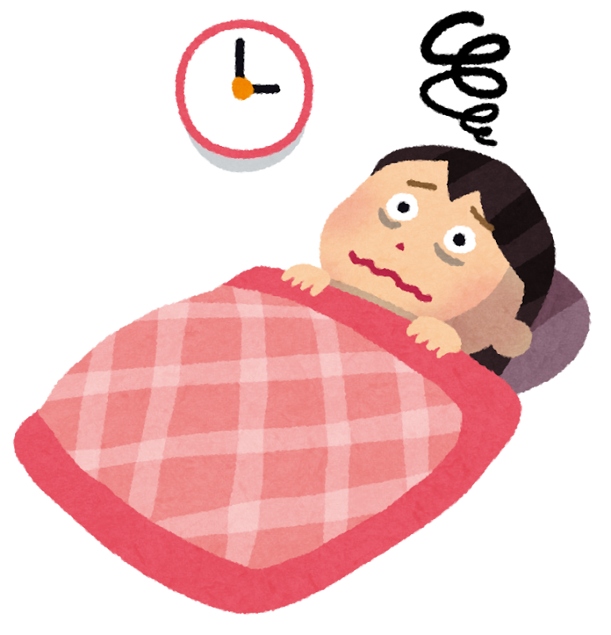
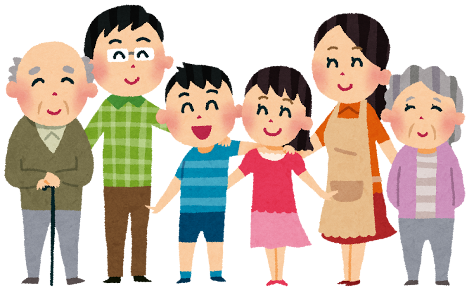
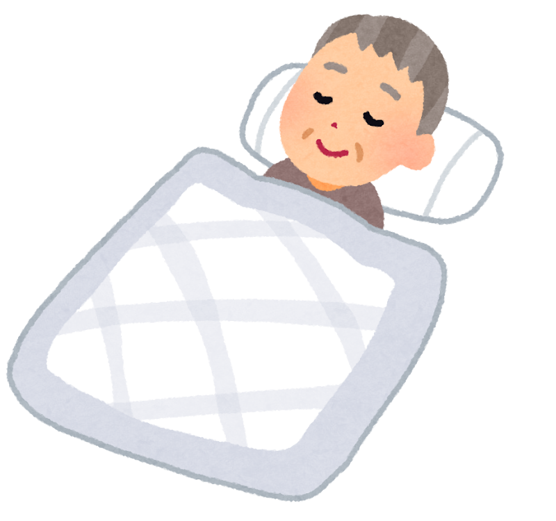
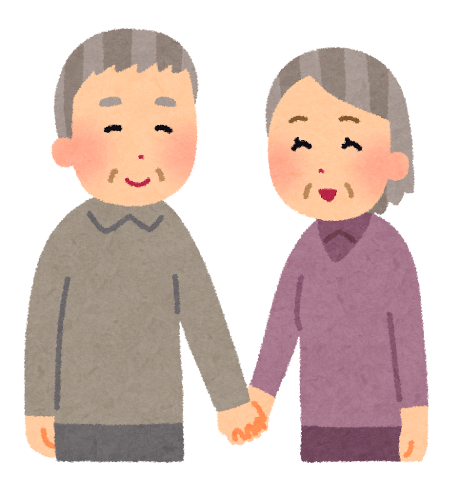

「夜中に何度も目が覚めてしまう」「若いころは、どこでも眠れたのに」——。
そんなふうに感じて、ため息をついたことはありませんか？

じつは今年（2026年）発表された大きな調査で、**日本人の眠りの「いま」** が詳しくわかってきました。そして面白いことに、**睡眠の悩みの中身は、年代によって大きく変わっていく** のです。

「眠れないのは自分だけ」と思っていた方にこそ、読んでいただきたい内容です。数字を見ながら、今夜からできる工夫まで、ご一緒に見ていきましょう。

> ✅ 日本人の睡眠時間は平均 **6.4時間**。理想は **7.4時間** で、**ちょうど1時間足りない** 状態が続いている
>
> ✅ 睡眠の悩みは年代で変わる。**若い世代は「時間が足りない」**、**40〜50代は「眠りが浅い」**、**70代は「寝つけない・夜中に目が覚める」** が中心
>
> ✅ 年齢とともに眠りが変わるのは **自然なこと**。日中の過ごし方を少し変えるだけで、眠りの質は整えやすくなる

---

## 目次

1. [日本人の眠り、いまはどうなっている？](#日本人の眠りいまはどうなっている)
2. [年代で、こんなに変わる睡眠の悩み](#年代でこんなに変わる睡眠の悩み)
3. [なぜ、年をとると眠りが変わるの?](#なぜ年をとると眠りが変わるの)
4. [理学療法士として、現場で感じること](#理学療法士として現場で感じること)
5. [いま、私たちにできること](#いま私たちにできること)
6. [おわりに](#おわりに)

---

## 日本人の眠り、いまはどうなっている？


「日本人は眠れていない」ってよく聞きますけど、実際のところ、どうなんですか？



今年の春に、全国3,000人に聞いた新しい調査があるんです。数字で見ると、**「1時間足りない」** という姿がはっきり見えてきますよ。


調査会社のクロス・マーケティングが2026年3月に、全国の20〜69歳・3,000人に行った「睡眠に関する調査」によると——

- いまの平均睡眠時間は **6.4時間**
- 理想の睡眠時間は **7.4時間**
- その差は **ちょうど1時間**。しかもこのギャップは、**2023年からずっと変わっていない** そうです

さらに、眠りの「質」についてはこんな結果でした。

| 睡眠の状態 | 割合 |
|---|---|
| 日中、眠くなる | **65%** |
| 寝ても疲れがとれない | **59%** |
| 眠りが浅い | **57%** |

半分以上の人が「昼間眠い」「疲れがとれない」と感じている——つまり、**眠りに悩んでいるのは、決してあなただけではない** のです。

---

## 年代で、こんなに変わる睡眠の悩み

ここからが、今回いちばんお伝えしたいところです。同じ「眠れない」でも、**年代によって中身がまったく違う** ことが、調査からわかっています。

### 若い世代（10〜30代）：「時間が足りない・朝がつらい」

若い世代の悩みの中心は、**睡眠時間そのものの不足** です。夜ふかしなどの生活リズムの乱れが影響しやすく、「朝なかなか起きられない」「日中だるい」という声が目立ちます。

### 40〜50代：「眠りが浅い・疲れがとれない」

働き盛りの世代では、**「眠りの浅さ」** が特に多くなります。2026年の調査では、眠りの浅さは **50代で最も多い** という結果でした。

また、2025年11月に全国の18〜79歳・3,000人に行われた別の調査（クロス・マーケティング「健康に関する実態・意識調査」）では、**疲れやストレスを最も強く感じているのは40〜50代** だとわかっています。全体でも、疲れを感じている人は約7割、ストレスを感じている人は約6割にのぼりました。


まさに私の世代です……。あと、夫のいびきも気になっていて。



じつは調査でも、**男性の50〜60代は「いびき」**、**女性の40〜60代は「手足の冷えやしびれ」** が睡眠時の悩みの上位なんです。年代と性別で、悩みの顔ぶれが変わるんですね。


### 70代：「寝つけない・夜中に目が覚める」

そして70代になると、悩みの主役は **「なかなか寝つけない」「夜中に目が覚める」** に変わります。2025年11月の調査で、70代の方に「なぜ疲れがとれないと思うか」を尋ねたところ、この2つが上位に入りました。

睡眠時間が足りないというより、**「ぐっすり眠れない」「朝までつづけて眠れない」という悩み** が中心になっていくのです。

---

## なぜ、年をとると眠りが変わるの?


やっぱり、年のせいなんでしょうか。ちょっとさみしい気もします……。



たしかに加齢の影響はあります。でもそれは **「衰え」ではなく「変化」** なんです。眠りの形が変わったと知るだけでも、気持ちはずっと楽になりますよ。


年齢を重ねると、眠りには自然な変化が起こります。

- **深い眠りが減り、浅い眠りが増える** ——そのため、ちょっとした物音や尿意で目が覚めやすくなります
- **体内時計が前にずれる** ——夕方から眠くなり、朝早く目が覚めやすくなります
- **必要な睡眠時間そのものが、少しずつ短くなる** ——若いころと同じ長さを眠れなくても、それ自体は異常ではありません

一方で、年齢だけがすべてではありません。少し前の調査（日本インフォメーション、2022年）では、不眠の原因として **「ストレス」を挙げた人が52.2%** と最も多く、「生活習慣の乱れ」38.4%、「運動不足」24.2%が続きました。2026年の調査でも、眠りを妨げる悩みごとの上位は「お金のこと」「仕事のこと」「人間関係」でした。

つまり、**加齢による自然な変化** に、**ストレスや生活習慣** が重なって、いまの眠りの悩みができあがっている——そう考えると、「変えられる部分」も見えてきます。

---

## 理学療法士として、現場で感じること

リハビリの現場でも、「夜中に何度も目が覚めてね」「夜トイレに起きると、そのあと眠れなくてね」という声は、本当によく聞きます。

そして長く現場にいて感じるのは、**日中の活動量が増えてくると、「最近よく眠れる」とおっしゃる方が多い** ということです。散歩やリハビリで体を動かす時間が増えると、夜の眠りが少しずつ変わっていく——そんな場面に、何度も出会ってきました。

じつは先ほどの2025年11月の調査でも、70代のストレス解消法の上位に **「散歩など軽い運動」（29%）** が入っています。人生の先輩たちは、体を動かすことの心地よさを、経験から知っているのかもしれません。

---

## いま、私たちにできること

年代ごとの変化をふまえて、今夜から・明日からできる工夫をまとめます。

**朝〜日中にできること**

- ✅ **朝、太陽の光を浴びる**（体内時計が整い、夜の眠気につながります）
- ✅ **日中に散歩など、軽く体を動かす**（動いた日ほど、眠りは深くなりやすい）
- ✅ **昼寝をするなら、午後の早い時間に20〜30分まで**（夕方の長い昼寝は夜の眠りを浅くします）

**夜にできること**

- ✅ **寝る1〜2時間前に、ぬるめのお湯にゆっくりつかる**
- ✅ **寝る前のスマホ・カフェイン・お酒は控えめに**
- ✅ **眠れないまま布団で粘らない**（いったん布団を出て、眠くなってから戻るほうが、結果的によく眠れます）

**考え方のヒント**

- ✅ **「8時間眠らなきゃ」と数字にしばられない**（年齢とともに必要な睡眠時間は変わります。日中元気に過ごせていれば、それで十分です）
- ✅ 休むことを「サボり」ではなく **「明日への投資」** と考える

夜間の困りごとが強い場合（激しいいびきで呼吸が止まると言われた、脚がむずむずして眠れない、日中の眠気で生活に支障が出ている等）は、**睡眠の病気がかくれていることもあります。※ 気になる症状が続くときは、かかりつけ医にご相談ください。**

> 眠りと脳の関係については、こちらの記事もどうぞ。
> 👉 [ぐっすり眠ると、脳が掃除される？〜眠りと脳のふしぎな関係〜](/posts/brain-sleep-glymphatic/)
> 👉 [今日から始める『脳が喜ぶ眠り方』〜睡眠の質を上げる実践のヒント〜](/posts/brain-sleep-practice/)

---

## おわりに

「夜中に目が覚めるのは、私だけ？」——その答えは、**「いいえ、同じ悩みの仲間がたくさんいます」** でした。

睡眠の悩みは、年代とともに形を変えます。若いころと同じように眠れなくても、それは衰えではなく、**眠りの形が変わっただけ**。そう受け止めたうえで、朝の光、日中の運動、夜の過ごし方を少しずつ整えていけば、眠りは何歳からでも育て直せます。

今夜は「眠らなきゃ」と力むのをやめて、まずは明日の朝、カーテンを開けて光を浴びるところから始めてみませんか。

---

### 参考にした情報

- クロス・マーケティング **「睡眠に関する調査（2026年）実態編」**（2026年3月実施、全国20〜69歳の男女3,000人）
- クロス・マーケティング **「健康に関する実態・意識調査（2025年11月定点ココロスタイルリサーチ）」**（2025年11月実施、全国18〜79歳の男女3,000人）
- 日本インフォメーション **「〜日本人の半数は睡眠不足？〜 睡眠に関する意識・行動調査」**（2022年5月実施、全国16〜59歳の男女975人）

※ 本記事は、上記の調査結果をもとに、一般読者向けにわかりやすくまとめ直したものです。調査はいずれもアンケートによる実態調査であり、個々の症状の原因を特定するものではありません。睡眠に関する不調が続く場合は、かかりつけ医にご相談ください。

